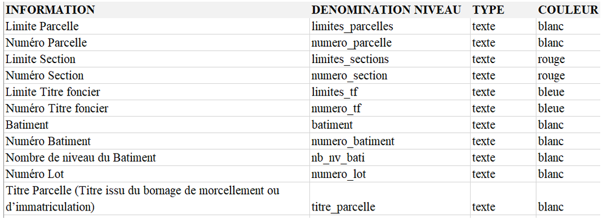

DIRECTION DU CADASTRE

> Bureau de la Modernisation et de la Documentation
> Projet du Système de Gestion Automatisée du NICAD

ETAPES DE TRAVAIL SUR LA MICROSTATION

1-Ouvrir le projet du dossier « DONNEES BRUTES »

2-Vérifier l’unité du dessin ainsi le système de coordonnées

Première unité : Mètres

Deuxième unité : Millimètres

3-Organiser les annotations par Niveau ou Calque

4-Vérifier et harmoniser les dénominations des niveaux en conservant la liste des niveaux ci -
dessous :
| INFORMATION | DENOMINATION NIVEAU | TYPE | COULEUR |
|---|---|---|---|
| Limite Parcelle | limites_parcelles | texte | blanc |
| Numéro Parcelle | numero_parcelle | texte | blanc |
| Limite Section | limites_sections | texte | rouge |
| Numéro Section | numero_section | texte | rouge |
| Limite Titre foncier | limites_tf | texte | bleue |
| Numéro Titre foncier | numero_tf | texte | bleue |
| Batiment | batiment | texte | blanc |
| Numéro Batiment | numero_batiment | texte | blanc |
| Nombre de niveau du Batiment | nb_nv_bati | texte | blanc |
| Numéro Lot | numero_lot | texte | blanc |
| Titre Parcelle (Titre issu du bornage de morcellement ou d'immatriculation) | titre_parcelle | texte | blanc |

5-Mettre les annotations de chaine de caractères en une seule entité

6-Centrer les annotations

7-Vérifier si les parcelles sont bien numérotées suivant le sens de l’aiguille d’une montre .

8-Vérifier si le nombre de caractères sur les numéros de parcelles et de sections est bien

respecté.

9-Polygoniser ou fermer les limites de parcelles , de bâtiments et de sections

10 -Dé tec ter le s erreurs de topologie (doublons, chevauchements, géométrie s invalide s, etc)

11 -Corriger l es erreurs de topologie (éviter d’utiliser une correction automatique sur

Microstation à défaut de supprimer certaines informations importantes)

12 -Vérifier si le travail est établi

13 -Sauvegarder le projet dans le dossier « DONNEES NETTOYEES » en ajoutant à la fin

de la dénomination du projet \_net (Exemple : « DAROU -SALAM 07 -2023 »  « DAROU -

SALAM 07 -2023_net »
