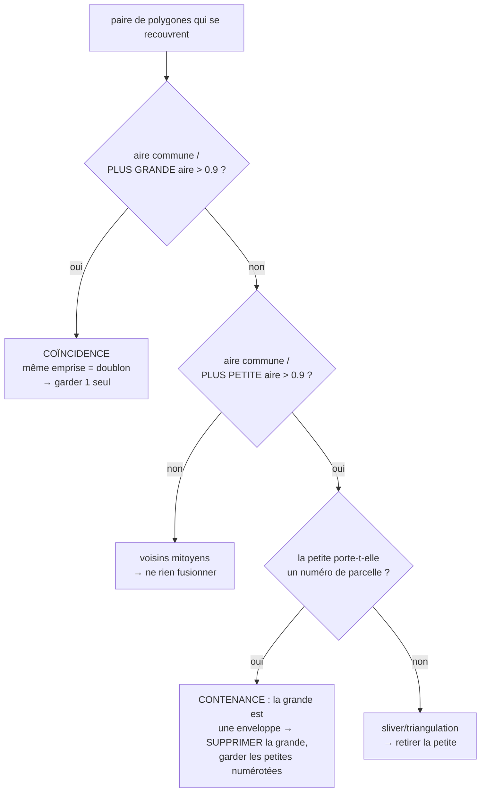

# Concepts de traitement — récupération & qualité des parcelles DXF

> Retours de terrain sur les **gros DXF cadastraux** issus d'une conversion
> DGN/Microstation (ex. `PLAN_CADASTRAL_THIES_FINAL…dxf`, 268 Mo, ~100 000
> parcelles). Ce document complète le
> [Support de cours](./SUPPORT-COURS-GEOMATIQUE.md) : il détaille les concepts
> concrets rencontrés en corrigeant la chaîne d'ingestion, avec pour chacun **le
> problème, la cause, la solution (fichier · fonction) et le pourquoi**.

Chaque fois qu'un nouveau concept de traitement géométrique/géospatial/topologique
est vu, il doit être ajouté ici (cf. règle dans `CLAUDE.md`).

---

## Table des matières

1. [Diagnostic : « je devrais avoir bien plus de parcelles »](#1-diagnostic--je-devrais-avoir-bien-plus-de-parcelles)
2. [Lire toutes les surfaces : le cas `3DFACE`](#2-lire-toutes-les-surfaces--le-cas-3dface)
3. [Réparer plutôt que rejeter : polygones invalides](#3-réparer-plutôt-que-rejeter--polygones-invalides)
4. [Noding robuste : des segments aux parcelles sans planter](#4-noding-robuste--des-segments-aux-parcelles-sans-planter)
5. [Dédoublonnage & enveloppes : coïncidence vs contenance](#5-dédoublonnage--enveloppes--coïncidence-vs-contenance)
6. [Nettoyage des libellés : codes de formatage MTEXT](#6-nettoyage-des-libellés--codes-de-formatage-mtext)
7. [Suppression manuelle de parcelles (table attributaire)](#7-suppression-manuelle-de-parcelles-table-attributaire)
8. [Annexe — compteurs du rapport & variables d'environnement](#8-annexe--compteurs-du-rapport--variables-denvironnement)

---

## 1. Diagnostic : « je devrais avoir bien plus de parcelles »

**Problème.** Un DXF connu pour contenir des dizaines de milliers de parcelles
n'en produit que quelques milliers. La perte est silencieuse : chaque étape jette
des entités sans planter.

**Méthode de diagnostic (dans l'ordre) :**

1. **Inventaire structurel** — compter les types d'entités et les calques *sans*
   dérouler les blocs, en streaming (un DXF de 268 Mo ne se charge pas d'un bloc).
   Ce qui révèle, p. ex., que `limites_parcelles` porte `282 868 LINE` (segments à
   polygoniser) **et** `16 425 3DFACE` (surfaces).
2. **Ingestion profilée** — `DXF_PROFILE=1 bun scripts/test-keur-massar.ts <fichier.dxf>`
   affiche le temps par phase (classify / extract / polygonize / validate / dedup /
   overlap / joins) et **le rapport `DxfIngestionReport`**.
3. **Lecture des compteurs** — chaque compteur du rapport localise une fuite
   (`nbPolygonesInvalidesRejetes`, `nbHorsEmprise`, `nbPolygonesEnveloppeIgnores`,
   `nbTextesHorsParcelle`…). Voir [§8](#8-annexe--compteurs-du-rapport--variables-denvironnement).

**Signal fort à surveiller — `nbTextesHorsParcelle`.** Si des dizaines de milliers
de numéros « ne tombent dans aucune parcelle », c'est que les parcelles censées les
contenir **n'existent pas** (elles ont été perdues en amont). Quand ce compteur
chute après un correctif, c'est la preuve que les parcelles reconstruites sont
réelles.

**Cas Thiès — effet cumulé des correctifs (§2 à §6) :**

| Indicateur | Départ | Après |
|---|---:|---:|
| Parcelles construites | 2 233 | **103 030** |
| Polygones invalides rejetés | 12 447 | 0 (réparés) |
| Polygonisées depuis segments | 1 | 80 726 |
| Textes/numéros orphelins | 285 447 | ~21 000 |

> 🛠️ **Côté data engineer.** Le rapport d'ingestion est l'équivalent d'un rapport
> de **data quality** (lignes lues / rejetées / dédupliquées). On ne fait pas
> confiance au total final tant qu'on n'a pas réconcilié les compteurs de rejet.

---

## 2. Lire toutes les surfaces : le cas `3DFACE`

**Problème.** Des parcelles dessinées comme **faces pleines** `3DFACE`
n'arrivaient jamais dans le GeoJSON.

**Cause.** Le lecteur natif (`src/lib/dxf-native.ts`) ne gérait que `LINE`,
`LWPOLYLINE`, `POLYLINE`, `TEXT`, `POINT`, `INSERT`. Une `3DFACE` est une face de
3 ou 4 coins portés par les **codes de groupe** `10/20`, `11/21`, `12/22`, `13/23`
(le 4ᵉ coin répète souvent le 3ᵉ pour un triangle).

**Solution.** Parsing des 4 coins puis émission d'un `Polygon` (anneau fermé,
sommets consécutifs dédupliqués) — `dxf-native.ts` (`parseEntities`,
`emitGeometryFeatures`).

**Pourquoi c'est piégeux.** Une `3DFACE` est limitée à 4 coins : une parcelle à
plus de 4 sommets dessinée « en surface » est parfois **triangulée** en plusieurs
`3DFACE`. Ces triangles partiels sont ensuite nettoyés par le dédoublonnage par
contenance (sliver sans numéro → retiré, cf. [§5](#5-dédoublonnage--enveloppes--coïncidence-vs-contenance)).

---

## 3. Réparer plutôt que rejeter : polygones invalides

**Problème.** ~87 % des polygones déjà fermés (polylignes closes) étaient jetés
comme « invalides ».

**Cause.** Les polylignes fermées exportées de Microstation/AutoCAD sont
massivement **auto-tangentes** ou à sommets dupliqués → `turf.booleanValid`
retourne `false`. Les rejeter d'emblée privait l'import de la majorité des
parcelles.

**Solution.** Avant de rejeter, tenter une **réparation** `buffer(0)` (JSTS) qui
réassemble un anneau auto-intersectant en polygone(s) valide(s) —
`parcelle-ingestion.ts · repairPolygonGeometry`, appelée par `validatePolygons`.
On ne rejette que si la réparation échoue ou produit une aire nulle.

> 💡 `buffer(0)` peut transformer un « nœud papillon » en `MultiPolygon` (deux
> lobes) : c'est géré partout en aval (reprojection, WKT, hash, aire).

**À ne pas confondre** avec la validité *topologique* (chevauchements entre
parcelles) : ici on parle de la **validité géométrique d'un objet isolé**
(cf. [support §7.1–7.2](./SUPPORT-COURS-GEOMATIQUE.md#7-topologie--géométrie-correcte-vs-cohérente)).

---

## 4. Noding robuste : des segments aux parcelles sans planter

**Problème.** La polygonisation de ~282 000 segments (`limites_parcelles`) ne
produisait qu'**un** polygone.

**Cause.** `UnaryUnionOp.union` (JSTS) lève une `TopologyException` *« found
non-noded intersection »* dès qu'un réseau bruité comporte des micro-croisements
(deux limites se coupant à ~0,01 mm près, présentes dans une ligne mais pas
l'autre). Une seule tuile en échec faisait **avorter toute** la polygonisation du
calque.

**Solution (deux volets)** — `src/lib/polygonize.ts` :

1. **Snap-rounding progressif** (`robustNodedUnion`) : accrocher les coordonnées à
   une grille de plus en plus grossière (1 mm → 1 cm → 5 cm) via
   `jsts.precision.GeometryPrecisionReducer` **avant** l'union, jusqu'à obtenir un
   noding cohérent.
2. **Isolation par tuile** (`polygonizeTiled`) : chaque tuile est enveloppée dans
   un `try/catch` — une tuile pathologique est ignorée, pas tout le calque.

> ⚠️ **Piège subtil.** Poser un `PrecisionModel` sur la `GeometryFactory` **ne
> suffit pas** : `createLineString` n'arrondit pas les coordonnées. Seul
> `GeometryPrecisionReducer.reduce(geom)` les accroche réellement à la grille.

Voir aussi le tuilage (pourquoi partitionner) : [support §6.3](./SUPPORT-COURS-GEOMATIQUE.md#6-polygonisation--de-segments-épars-à-des-parcelles).

---

## 5. Dédoublonnage & enveloppes : coïncidence vs contenance

**Problème.** La même parcelle est souvent présente **plusieurs fois** :
- dessinée en `3DFACE`/polyligne fermée **ET** reconstruite depuis les segments ;
- une **grande parcelle/îlot** englobe plusieurs petites parcelles numérotées.

Le dédoublonnage exact (`geomHash`) ne voit pas ces doublons (sommets différents).

**Concept clé — deux relations géométriques distinctes** (`parcelle-ingestion.ts ·
dedupParcellesByOverlap`) :

- **Coïncidence** (recouvrement > 90 % de la **plus grande** aire) = doublon de
  représentation → on garde un représentant (préférence : parcelle **numérotée**,
  puis source `polygonized`).
- **Contenance** (recouvrement > 90 % de la **plus petite** aire, sans coïncidence)
  = une petite parcelle ~entièrement dans une grande. **Ce n'est pas un doublon** :
  les petites sont réelles. Règle métier — **le numéro prime** : si la petite
  porte un numéro, la grande est une **enveloppe/îlot** → on **supprime la grande**
  et on garde les petites numérotées ; sinon la petite est un **sliver** → on la
  retire.

**Sous-concept indispensable — à quelle parcelle « appartient » un numéro ?**
Un numéro placé dans un îlot est géométriquement à l'intérieur de l'enveloppe
**et** de la petite parcelle. Il appartient à la **plus fine** qui le contient →
`findSmallestContainingPolygon`. Sans cette finesse, l'enveloppe serait marquée
« numérotée » et le nettoyage échouerait.

> ⚠️ **Anti-exemple corrigé.** Une première version gardait « la plus grande
> aire » : elle supprimait à tort les parcelles numérotées et conservait les
> enveloppes. Bien distinguer *coïncidence* (garder 1) de *contenance* (retirer la
> grande englobante).

Les recouvrements **partiels** (< 90 %) ne sont pas fusionnés : ils restent
signalés comme **erreurs de topologie** (chevauchements) par le contrôle qualité —
ne pas masquer une vraie superposition.

---

## 6. Nettoyage des libellés : codes de formatage MTEXT

**Problème.** Les libellés sortaient formatés : `\fArial Black|b0|i0|c00|p39;ZAR/948`
au lieu de `ZAR/948` ; `\fTahoma|b0|i0|c00|p39;00435` au lieu de `00435`.

**Cause.** Un `MTEXT` AutoCAD/ODA encode la mise en forme **dans le contenu même**.
`\f<Police>|b<gras>|i<italique>|c<codepage>|p<pitch>;` change la police ; le vrai
texte suit le `;`. Le lecteur ne retirait que `\P` (sauts de paragraphe).

**Solution.** Décodeur MTEXT complet `dxf-native.ts · decodeMText`, branché à
l'émission des textes **et** (par sécurité) à la lecture des libellés dans
`parcelle-ingestion.ts` (couvre le repli ogr2ogr).

**Codes gérés :**

| Code | Sens | Traitement |
|---|---|---|
| `\f…;` `\F…;` | police | supprimé |
| `\C…;` `\c…;` | couleur | supprimé |
| `\H…;` | hauteur | supprimé |
| `\A…;` | alignement | supprimé |
| `\W…;` `\Q…;` `\T…;` `\p…;` | largeur / oblique / interlettrage / interligne | supprimé |
| `\S num^den;` | fraction empilée | → `num/den` |
| `\L \l \O \o \K \k` | souligné/surligné/barré | supprimé |
| `{ }` | groupement | supprimé |
| `\P` / `\~` | paragraphe / espace insécable | → `\n` / espace |
| `\\` `\{` `\}` | échappements littéraux | → `\` `{` `}` |

---

## 7. Suppression manuelle de parcelles (table attributaire)

**Besoin.** Retirer des parcelles directement depuis la table attributaire de la
carte (ex. une enveloppe résiduelle, une parcelle erronée).

**Concept — localiser une parcelle sans identifiant stable.** Les tuiles
vectorielles (MVT) ne portent pas d'identifiant persistant et leur géométrie est
quantifiée. On identifie donc chaque parcelle par un **localisateur**, du plus au
moins précis :

1. **point intérieur** (coordonnée WGS84 du clic, garantie dans la parcelle) →
   *point-dans-polygone* ;
2. **emprise** (`bbox`, pour une occurrence précise d'un NICAD dupliqué) →
   appariement d'emprise ;
3. **NICAD** (repli).

**Mise en œuvre.** Endpoint `POST /api/analyses/[id]/features/delete` (résout les
localisateurs contre le GeoJSON persisté, écrit `correctedData` — la source lue
par les tuiles — et met à jour `totalFeatures`). UI : cases à cocher sur toutes les
lignes + bouton **Supprimer** dans `MapAnalysisClient` ; le clic carte mémorise le
point (`MapLibreMap`).

> Cohérence : toute édition (correction d'erreur, suppression) transite par
> `correctedData`, si bien que la carte (tuiles), la table et les recalculs
> reflètent le même état.

---

## 8. Annexe — compteurs du rapport & variables d'environnement

**Compteurs `DxfIngestionReport`** (localiser une fuite de parcelles) :

| Compteur | Signification |
|---|---|
| `nbParcelles` | parcelles finales construites |
| `nbParcellesPolygonisees` | reconstruites depuis des segments |
| `nbPolygonesInvalidesRejetes` | rejetées même après réparation `buffer(0)` |
| `nbPolygonesRepares`* | réparées au lieu d'être rejetées |
| `nbDoublonsRecouvrement` | doublons de représentation fusionnés (coïncidence) |
| `nbEnveloppesSupprimees` | grandes parcelles/îlots supprimés (contenance) |
| `nbPolygonesEnveloppeIgnores` | polygones > plafond d'aire (emprise de zone) |
| `nbHorsEmprise` | entités hors de la plage UTM28N plausible |
| `nbTextesHorsParcelle` | libellés ne tombant dans aucune parcelle |
| `nbChevauchements` | superpositions partielles (erreurs de topologie) |

\* exposé comme `warning` dans le rapport.

**Variables d'environnement de réglage :**

| Variable | Défaut | Rôle |
|---|---:|---|
| `DXF_POLYGONIZE_PRECISION_SCALES` | `1000,100,20` | grilles de snap-rounding (§4) |
| `DXF_POLYGONIZE_TILE_THRESHOLD` | `20000` | seuil de bascule vers le tuilage |
| `DXF_POLYGONIZE_TILE_TARGET` | `4000` | segments visés par tuile |
| `DXF_POLYGONIZE_TILE_MARGIN_M` | `400` | marge de collecte des segments par tuile |
| `DXF_POLYGONIZE_MIN_AREA_M2` | `5` | aire mini (élimine les slivers) |
| `DXF_POLYGONIZE_MAX_AREA_M2` | `50000` | aire maxi (élimine l'anneau enveloppe) |
| `DXF_OVERLAP_COINCIDE_RATIO` | `0.9` | seuil de coïncidence (doublon, §5) |
| `DXF_OVERLAP_CONTAIN_RATIO` | `0.9` | seuil de contenance (enveloppe, §5) |
| `DXF_CLOSE_SNAP_TOLERANCE_M` | `0.05` | fermeture des polylignes quasi fermées |

**Fichiers clés :** `src/lib/dxf-native.ts` (lecture + `decodeMText`),
`src/lib/cadastral-filter.ts` (classification par calque),
`src/lib/polygonize.ts` (noding robuste + tuilage),
`src/lib/parcelle-ingestion.ts` (validation, dédoublonnage, jointures),
`src/app/api/analyses/[id]/features/delete/route.ts` (suppression manuelle).

---

*En cas de divergence entre ce document et le code (`src/lib/**`), **le code fait
foi** — mettre la doc à jour en conséquence.*
