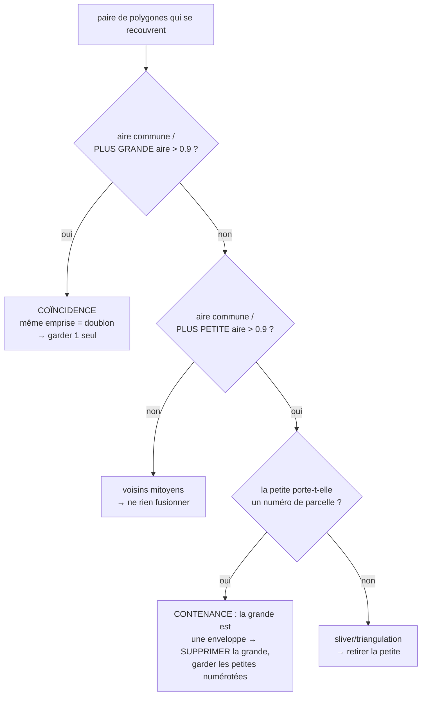

# Concepts de traitement — récupération & qualité des parcelles DXF

> Retours de terrain sur les **gros DXF cadastraux** issus d'une conversion
> DGN/Microstation (ex. `PLAN_CADASTRAL_THIES_FINAL…dxf`, 268 Mo, ~100 000
> parcelles). Ce document complète le
> [Support de cours](./SUPPORT-COURS-GEOMATIQUE.md) : il détaille les concepts
> concrets rencontrés en corrigeant la chaîne d'ingestion, avec pour chacun **le
> problème, la cause, la solution (fichier · fonction) et le pourquoi**.

Chaque fois qu'un nouveau concept de traitement géométrique/géospatial/topologique
est vu, il doit être ajouté ici (cf. règle dans `CLAUDE.md`).

---

## Table des matières

1. [Diagnostic : « je devrais avoir bien plus de parcelles »](#1-diagnostic--je-devrais-avoir-bien-plus-de-parcelles)
2. [Lire TOUTE géométrie porteuse (3DFACE, arcs, faces pleines) + réconciliation](#2-lire-toute-géométrie-porteuse-3dface-arcs-faces-pleines--réconciliation)
3. [Réparer plutôt que rejeter : polygones invalides](#3-réparer-plutôt-que-rejeter--polygones-invalides)
4. [Noding robuste : des segments aux parcelles sans planter](#4-noding-robuste--des-segments-aux-parcelles-sans-planter)
    - [4 bis. Raccord des micro-trous : parcelles voisines fusionnées (dangles)](#4-bis-raccord-des-micro-trous--parcelles-voisines-fusionnées-dangles)
5. [Tuilage adaptatif : récupérer les cœurs urbains denses](#5-tuilage-adaptatif--récupérer-les-cœurs-urbains-denses)
6. [Dédoublonnage & enveloppes : coïncidence vs contenance](#6-dédoublonnage--enveloppes--coïncidence-vs-contenance)
    - [6 bis. Correction des chevauchements partiels (retaille par priorité)](#6-bis-correction-des-chevauchements-partiels-retaille-par-priorité)
    - [6 ter. Chevauchements non signalés au-delà de 500 parcelles (plafond de détection à l'analyse)](#6-ter-chevauchements-non-signalés-au-delà-de-500-parcelles-plafond-de-détection-à-lanalyse)
7. [Nettoyage des libellés : codes de formatage MTEXT](#7-nettoyage-des-libellés--codes-de-formatage-mtext)
8. [Suppression manuelle de parcelles (table attributaire)](#8-suppression-manuelle-de-parcelles-table-attributaire)
9. [Doublures NICAD : zoom sur les occurrences, annotation & mode édition](#9-doublures-nicad--zoom-sur-les-occurrences-annotation--mode-édition)
10. [Colorer les NICAD manquants/courts sur toute l'analyse (hors plafond d'erreurs)](#10-colorer-les-nicad-manquantscourts-sur-toute-lanalyse-hors-plafond-derreurs)
11. [Table `limite_section` : extraction des sections + contrôle des chevauchements](#11-table-limite_section--extraction-des-sections--contrôle-des-chevauchements)
    - [11 bis. Sections fusionnées SANS trou de raccord : limite mitoyenne absente de la source](#11-bis-sections-fusionnées-sans-trou-de-raccord--limite-mitoyenne-absente-de-la-source)
    - [11 ter. Attribution manuelle du numéro pour les sections sans étiquette](#11-ter-attribution-manuelle-du-numéro-pour-les-sections-sans-étiquette)
    - [11 ter bis. Mise à jour automatique des NICAD lors de l'ajout/modification du numéro de section](#11-ter-bis-mise-à-jour-automatique-des-nicad-lors-de-lajoutmodification-du-numéro-de-section)
    - [11 quater. Import de sections depuis un shapefile : contourner le pipeline DXF](#11-quater-import-de-sections-depuis-un-shapefile--contourner-le-pipeline-dxf)
    - [11 quinquies. Attribution des NICAD manquants par incrémentation + plus proche voisin](#11-quinquies-attribution-des-nicad-manquants-par-incrémentation--plus-proche-voisin)
    - [11 sexies. « Aucune parcelle sans NICAD » trompeur : rattachement fileName/sourceFichier cassé par un simple renommage](#11-sexies-aucune-parcelle-sans-nicad-trompeur--rattachement-filenamesourcefichier-cassé-par-un-simple-renommage)
    - [11 septies. Section sans AUCUNE parcelle de référence : premier numéro `00001`, préfixe déduit de `cad_communes_2026`](#11-septies-section-sans-aucune-parcelle-de-référence--premier-numéro-00001-préfixe-déduit-de-cad_communes_2026)
    - [11 octies. Analyse jamais passée par l'extraction de sections : repli spatial dans TOUTE `limite_section`](#11-octies-analyse-jamais-passée-par-lextraction-de-sections--repli-spatial-dans-toute-limite_section)
    - [11 nonies. KPI conformes/erreurs figé après une attribution NICAD : deux couches de fraîcheur](#11-nonies-kpi-conformeserreurs-figé-après-une-attribution-nicad--deux-couches-de-fraîcheur)
    - [11 decies. Point de départ du repli sans référence : coin nord-ouest, pas le centre](#11-decies-point-de-départ-du-repli-sans-référence--coin-nord-ouest-pas-le-centre)
12. [Annexe — compteurs du rapport & variables d'environnement](#12-annexe--compteurs-du-rapport--variables-denvironnement)
13. [Correction groupée des chevauchements de sections : règle « auto » et ordre séquentiel](#13-correction-groupée-des-chevauchements-de-sections--règle--auto--et-ordre-séquentiel)
14. [Historique & restauration : upsert au lieu de `DO NOTHING`](#14-historique--restauration--upsert-au-lieu-de-do-nothing)
    - [14 bis. Historique par lot : une transaction par item, pas une transaction globale](#14-bis-historique-par-lot--une-transaction-par-item-pas-une-transaction-globale)
15. [Mappage des champs shapefile & import asynchrone avec progression](#15-mappage-des-champs-shapefile--import-asynchrone-avec-progression)
16. [Import shapefile depuis la page d'accueil : bascule vers le job asynchrone (sans mappage)](#16-import-shapefile-depuis-la-page-daccueil--bascule-vers-le-job-asynchrone-sans-mappage)
17. [NICAD du shapefile page d'accueil : jointure spatiale sur `limite_section`](#17-nicad-du-shapefile-page-daccueil--jointure-spatiale-sur-limite_section)

---

## 1. Diagnostic : « je devrais avoir bien plus de parcelles »

**Problème.** Un DXF connu pour contenir des dizaines de milliers de parcelles
n'en produit que quelques milliers. La perte est silencieuse : chaque étape jette
des entités sans planter.

**Méthode de diagnostic (dans l'ordre) :**

1. **Inventaire structurel** — compter les types d'entités et les calques *sans*
   dérouler les blocs, en streaming (un DXF de 268 Mo ne se charge pas d'un bloc).
   Ce qui révèle, p. ex., que `limites_parcelles` porte `282 868 LINE` (segments à
   polygoniser) **et** `16 425 3DFACE` (surfaces).
2. **Ingestion profilée** — `DXF_PROFILE=1 bun scripts/test-keur-massar.ts <fichier.dxf>`
   affiche le temps par phase (classify / extract / polygonize / validate / dedup /
   overlap / joins) et **le rapport `DxfIngestionReport`**.
3. **Lecture des compteurs** — chaque compteur du rapport localise une fuite
   (`nbPolygonesInvalidesRejetes`, `nbHorsEmprise`, `nbPolygonesEnveloppeIgnores`,
   `nbTextesHorsParcelle`…). Voir [§12](#12-annexe--compteurs-du-rapport--variables-denvironnement).

**Signal fort à surveiller — `nbTextesHorsParcelle`.** Si des dizaines de milliers
de numéros « ne tombent dans aucune parcelle », c'est que les parcelles censées les
contenir **n'existent pas** (elles ont été perdues en amont). Quand ce compteur
chute après un correctif, c'est la preuve que les parcelles reconstruites sont
réelles.

**Cas Thiès — effet cumulé des correctifs (§2 à §6) :**

| Indicateur | Départ | Après |
|---|---:|---:|
| Parcelles construites | 2 233 | **103 030** |
| Polygones invalides rejetés | 12 447 | 0 (réparés) |
| Polygonisées depuis segments | 1 | 80 726 |
| Textes/numéros orphelins | 285 447 | ~21 000 |

> 🛠️ **Côté data engineer.** Le rapport d'ingestion est l'équivalent d'un rapport
> de **data quality** (lignes lues / rejetées / dédupliquées). On ne fait pas
> confiance au total final tant qu'on n'a pas réconcilié les compteurs de rejet.

---

## 2. Lire TOUTE géométrie porteuse (3DFACE, arcs, faces pleines) + réconciliation

**Problème.** Le lecteur natif ne gérait que `LINE`, `LWPOLYLINE`, `POLYLINE`,
`TEXT`, `POINT`, `INSERT`. Toute parcelle dessinée autrement disparaissait
**silencieusement** : `3DFACE` (faces pleines), **arcs** (`ARC`, renflement/bulge
de polyligne), `CIRCLE`/`ELLIPSE`/`SPLINE`, `SOLID` (quadrilatères pleins), et les
valeurs d'attributs de bloc `ATTRIB`. Sur les 3 fichiers audités (Kaolack, Thiès,
Keur Massar), les calques `limites_parcelles`/`limite_tf` portaient à eux seuls
**> 1 100 arcs** : un bord de parcelle courbe laisse l'anneau **ouvert** → la
polygonisation ne referme pas → parcelle perdue.

**Solution** — `src/lib/dxf-native.ts` (`parseEntities`, `emitGeometryFeatures`) :

1. **Faces pleines** `3DFACE`/`SOLID` → `Polygon`. Coins aux codes `10/20`,
   `11/21`, `12/22`, `13/23` ; ⚠️ `SOLID` stocke ses coins dans l'ordre **1-2-4-3**
   (3ᵉ et 4ᵉ permutés) : réordonner avant de fermer l'anneau.
2. **Courbes densifiées en polylignes** (pas ≈ 3°, borné à 64 segments) pour se
   refermer avec les segments droits voisins : `ARC` (centre/rayon/angles),
   **bulge** de `LWPOLYLINE`/`POLYLINE` (`bulge = tan(θ/4)`, arc entre 2 sommets),
   `CIRCLE`/`ELLIPSE` (anneau fermé), `SPLINE` (approx. par points de contrôle).
3. **`ATTRIB`** (valeur d'attribut d'un bloc inséré = souvent un numéro/libellé
   réel) → émis comme point-texte. `ATTDEF` (gabarit dans la *définition* de bloc)
   reste écarté : c'est une invite, pas une donnée.

**Réconciliation anti-perte silencieuse (le principe généralisé).** Le lecteur
tient un **recensement** (`Census`) : par type d'entité, combien **lues / émises /
écartées** (avec motif). L'invariant `seen = emitted + skipped (+ INSERT,
conteneur)` est journalisé et remonté dans `report.reconciliation`. Toute entité
non émise est ainsi **visible** (ex. `HATCH` = surfaces déjà bordées par des
segments ⇒ redondantes ; `DIMENSION`, `LEADER`, `IMAGE`, `REGION` = habillage),
jamais perdue en silence. C'est le garde-fou : une future régression de lecture se
voit immédiatement dans les compteurs, au lieu de rogner discrètement le total.

> ⚠️ **Micro-anneaux.** Émettre `CIRCLE` crée des « parcelles » à ~0 m² là où le
> cercle est un **symbole** (puits, arbre). Parade : un **plancher d'aire** (=
> seuil de polygonisation, 5 m²) appliqué aussi aux polygones *authored*
> (`validatePolygons · minAreaM2`), rejet comptabilisé. Une vraie parcelle
> cadastrale dépasse toujours ce seuil.

**Pourquoi c'est piégeux.** Une `3DFACE` est limitée à 4 coins : une parcelle à
plus de 4 sommets dessinée « en surface » est parfois **triangulée** en plusieurs
`3DFACE`. Ces triangles partiels sont ensuite nettoyés par le dédoublonnage par
contenance (sliver sans numéro → retiré, cf. [§6](#6-dédoublonnage--enveloppes--coïncidence-vs-contenance)).

---

## 3. Réparer plutôt que rejeter : polygones invalides

**Problème.** ~87 % des polygones déjà fermés (polylignes closes) étaient jetés
comme « invalides ».

**Cause.** Les polylignes fermées exportées de Microstation/AutoCAD sont
massivement **auto-tangentes** ou à sommets dupliqués → `turf.booleanValid`
retourne `false`. Les rejeter d'emblée privait l'import de la majorité des
parcelles.

**Solution.** Avant de rejeter, tenter une **réparation** `buffer(0)` (JSTS) qui
réassemble un anneau auto-intersectant en polygone(s) valide(s) —
`parcelle-ingestion.ts · repairPolygonGeometry`, appelée par `validatePolygons`.
On ne rejette que si la réparation échoue ou produit une aire nulle.

> 💡 `buffer(0)` peut transformer un « nœud papillon » en `MultiPolygon` (deux
> lobes) : c'est géré partout en aval (reprojection, WKT, hash, aire).

**À ne pas confondre** avec la validité *topologique* (chevauchements entre
parcelles) : ici on parle de la **validité géométrique d'un objet isolé**
(cf. [support §7.1–7.2](./SUPPORT-COURS-GEOMATIQUE.md#7-topologie--géométrie-correcte-vs-cohérente)).

---

## 4. Noding robuste : des segments aux parcelles sans planter

**Problème.** La polygonisation de ~282 000 segments (`limites_parcelles`) ne
produisait qu'**un** polygone.

**Cause.** `UnaryUnionOp.union` (JSTS) lève une `TopologyException` *« found
non-noded intersection »* dès qu'un réseau bruité comporte des micro-croisements
(deux limites se coupant à ~0,01 mm près, présentes dans une ligne mais pas
l'autre). Une seule tuile en échec faisait **avorter toute** la polygonisation du
calque.

**Solution (deux volets)** — `src/lib/polygonize.ts` :

1. **Snap-rounding progressif** (`robustNodedUnion`) : accrocher les coordonnées à
   une grille de plus en plus grossière (1 mm → 1 cm → 5 cm) via
   `jsts.precision.GeometryPrecisionReducer` **avant** l'union, jusqu'à obtenir un
   noding cohérent.
2. **Isolation par tuile** (`polygonizeTiled`) : chaque tuile est enveloppée dans
   un `try/catch` — une tuile pathologique n'avorte pas tout le calque. Depuis le
   cas Kaolack, l'échec ne **jette** plus la tuile mais la **subdivise** d'abord
   (cf. [§5](#5-tuilage-adaptatif--récupérer-les-cœurs-urbains-denses)).

> ⚠️ **Piège subtil.** Poser un `PrecisionModel` sur la `GeometryFactory` **ne
> suffit pas** : `createLineString` n'arrondit pas les coordonnées. Seul
> `GeometryPrecisionReducer.reduce(geom)` les accroche réellement à la grille.

Voir aussi le tuilage (pourquoi partitionner) : [support §6.3](./SUPPORT-COURS-GEOMATIQUE.md#6-polygonisation--de-segments-épars-à-des-parcelles).

---

## 4 bis. Raccord des micro-trous : parcelles voisines fusionnées (dangles)

**Problème métier.** Après polygonisation, certaines parcelles **voisines sortent
FUSIONNÉES** en un seul polygone : deux (ou plusieurs) lots distincts, chacun avec
son numéro, ne forment qu'une seule face sur la carte.

**Cause technique.** Le snap-rounding du §4 traite les micro-**croisements**, mais
pas les micro-**trous**. Deux défauts de numérisation classiques :

- **undershoot** : la limite mitoyenne s'arrête à quelques cm du contour qu'elle
  devrait toucher. Pour JSTS, c'est une ligne **pendante** (*dangle*) : le
  `Polygonizer` l'ignore et reconstruit **une seule face** couvrant les deux
  parcelles ;
- **coin ouvert** : deux limites censées se rejoindre en un coin s'arrêtent à
  quelques cm l'une de l'autre → l'anneau ne se referme pas du tout (parcelle
  perdue, ou fusionnée avec la voisine par le même mécanisme).

**Solution** — `src/lib/polygonize.ts · healUndershoots` (appelée par
`polygonizeChunk` AVANT le noding, tolérance `DXF_POLYGONIZE_SNAP_TOLERANCE_M`,
25 cm par défaut) :

1. **Regroupement des extrémités** : toute paire d'extrémités à ≤ tol est
   accrochée sur une position canonique (la première vue — les représentants ne
   bougent jamais, donc pas d'effet de cascade). Referme les coins ouverts.
2. **Raccord au segment** : chaque extrémité encore pendante est projetée sur le
   segment le plus proche (≤ tol) ET ce point projeté est **inséré comme sommet
   du segment cible**. Referme les undershoots en T.

> ⚠️ **Piège d'exactitude flottante.** Déplacer l'extrémité « sur » le segment ne
> suffit pas : la projection calculée peut rester à ~1e-13 m de la ligne, et le
> test d'intersection robuste du noding peut ne PAS voir le contact → dangle
> conservé, parcelles toujours fusionnées. C'est l'**insertion du point comme
> sommet du segment cible** qui garantit le partage de coordonnée **exact**,
> donc le noding.

> ⚠️ **Piège de mutation partagée.** En mode tuilé, les tableaux de coordonnées
> sont **partagés entre tuiles** (fenêtres à marge) : le raccord travaille en
> copie-à-l'écriture, sinon une tuile « répare » les lignes vues par la suivante
> de façon incohérente.

**Choix de la tolérance.** 25 cm referme les trous de numérisation (typiquement
< 10 cm) sans fusionner de sommets légitimes : deux sommets cadastraux distincts
sont à plusieurs mètres l'un de l'autre. Un trou > tolérance n'est **pas**
raccordé (pas de sur-correction silencieuse) ; `0` désactive le raccord. Le
nombre de raccords effectués est journalisé (`[polygonize] micro-trous
raccordés…`).

**Test** : `npx tsx scripts/test-polygonize-heal.ts` (fusion par undershoot,
coin ouvert, trou > tolérance non corrigé, mitoyenneté saine inchangée).

> ⚠️ **Piège — fusion malgré le raccord : la limite est sur un AUTRE calque.**
> Cas terrain : parcelles 00017 et 00020 côte à côte, fusionnées sous 00017
> alors que la mitoyenne est bien dessinée… sur `limites_tf` (ou en limite de
> section). La polygonisation se faisait **classe par classe** : la mitoyenne
> manquait au réseau de `limites_parcelles` → face fusionnée. Les classes de
> limites de parcelle (`limites_parcelles`, `limites_tf`, repli) forment
> désormais **UN SEUL réseau**, auquel s'ajoutent les limites de sections comme
> **arêtes de découpe** (une limite de section est toujours aussi une limite de
> parcelle) — `parcelle-ingestion.ts · polygonizeBoundaries`. Les piscines
> restent un réseau séparé (une piscine est DANS une parcelle : ses contours ne
> doivent pas la découper).
>
> **Diagnostic embarqué** : une parcelle reconstruite contenant **plusieurs
> numéros distincts** est presque sûrement une fusion → compteur
> `nbParcellesMultiNumeros` + warning dans le rapport (« fusion probable …
> vérifier le calque ou augmenter `DXF_POLYGONIZE_SNAP_TOLERANCE_M` »).
> Test : `npx tsx scripts/test-fusion-parcelles.ts`.

> ⚠️ **Piège — le doublon masque le raccord.** Cas réel (sections 017/020,
> commune DYA, fichier Kaolack) : certaines limites sont dessinées **en double**
> (copies Microstation superposées). Le jumeau d'une ligne pendante se trouve à
> distance 0 de son extrémité → le raccord la croyait « déjà connectée » et ne
> refermait jamais le trou. Les lignes sont désormais **dédoublonnées**
> (orientation neutralisée, `polygonize.ts · canonicalLineKey`) avant raccord et
> noding.

> ⚠️ **Piège — index en grille et segments kilométriques.** L'index spatial du
> raccord insère chaque segment dans toutes les cellules du rectangle de sa
> bbox : un segment kilométrique (limites de sections Matam) sur des cellules
> de 8 m = des millions de cellules → `RangeError: Map maximum size exceeded`.
> La taille de cellule est bornée par l'étendue du plus grand segment
> (≤ ~65 cellules/axe/segment) — des cellules plus grandes ajoutent des
> candidats par requête, mais la distance exacte filtre : le résultat est
> identique, seul le coût varie.

> ⚠️ **Piège — un « contact » à 1 µm n'est PAS une intersection.** La même
> mitoyenne s'arrêtait à **0,7 µm** du segment de limite : sous l'ancien seuil
> de contact (1 µm), le raccord supposait que le noding s'en chargerait. Faux :
> le noding robuste ne node que les intersections **exactes** — un point à
> 0,7 µm d'un segment n'en est pas une. Seule une **coordonnée exactement
> partagée avec un sommet** court-circuite désormais le raccord ; toute distance
> > 0 à un segment est raccordée par **insertion de sommet** (partage exact
> garanti).

---

## 5. Tuilage adaptatif : récupérer les cœurs urbains denses

**Problème métier.** Sur `PLAN-CADASTRAL_KAOLACK_FINAL_-11-12-2025.dxf` (181 Mo,
département entier, 39 communes), l'import ne sortait que **33 870 parcelles** alors
que le calque `numero_parcelle` compte **140 542 libellés** : Kaolack-ville, le cœur
dense, disparaissait presque entièrement.

**Cause technique.** `polygonizeTiled` calcule une grille **uniforme** dimensionnée
sur la densité **moyenne** (`tilesPerAxis ≈ √(nSegments / 4000)`). Or les parcelles
d'un fichier départemental sont **très concentrées** : le centre-ville dense est
noyé dans des communes rurales éparses. L'emprise réelle (141 × 94 km) donne des
tuiles de ~17,7 × 11,8 km ; deux d'entre elles absorbaient l'essentiel des
segments :

| tuile | segments | libellés `numero_parcelle` |
|------:|---------:|---------------------------:|
| 3_5 (Kaolack-ville) | **120 594** | **67 355** |
| 2_5 (adjacente)     | **54 860**  | **23 806** |

Ces deux blocs dépassaient largement la capacité de noding : le snap-rounding
échouait, le `try/catch` par tuile (cf. §4) **abandonnait la tuile entière** →
~91 000 parcelles perdues d'un coup (le centre-ville). Le tuilage protégeait donc
contre le *crash*, mais **masquait** une perte massive.

> ⚠️ **Piège de diagnostic.** L'emprise BRUTE des segments montrait 2347 × 2969 km
> (à cause de **11 segments** aux coordonnées aberrantes, 25 sommets sur 516 441).
> Cela FAIT croire à un problème d'emprise, mais le pipeline filtre déjà ces
> parasites (`addOpenLine · ringInSenegalUtm`) : l'emprise **réelle** utilisée est
> 141 × 94 km. Le vrai coupable est la **densité**, pas l'emprise. Toujours mesurer
> l'emprise APRÈS le filtre d'emprise Sénégal.

**Solution** — `src/lib/polygonize.ts · polygonizeTiled` :

1. **Subdivision récursive (quadtree)** : toute région dépassant
   `TILE_MAX_SEGMENTS` (8 000) — **ou dont le noding échoue** — est redécoupée en
   2×2 et retraitée, jusqu'à `TILE_MAX_DEPTH` (8) ou la taille minimale
   `TILE_MIN_SIZE_M` (500 m). On ne **jette** une région qu'en tout dernier
   recours, en journalisant segments + profondeur.
2. **Attribution par centroïde dans le CŒUR** (bornes demi-ouvertes) à **chaque
   profondeur** : les cœurs des sous-tuiles partitionnent exactement le cœur
   parent → chaque parcelle reste comptée **une seule fois**, la marge (400 m)
   ne servant qu'à *collecter* les segments (invariant : marge > diamètre parcelle).
3. **Échelles de snap-rounding grossières en repli** (`10, 5` = 10/20 cm) ajoutées
   après `1000, 100, 20` : atteintes uniquement quand le snap fin échoue sur une
   erreur topologique franche (sommet manquant sur la ligne croisée).

**Résultat.** Polygonisation `limites_parcelles` : **28 298 → 93 399** polygones
reconstruits (×3,3). Résidu : **1 région** (~2 157 segments) au défaut CAO
irréductible (lignes qui se croisent sans sommet commun), journalisée.

> **Pourquoi ne pas juste augmenter le nombre de tuiles ?** Une grille uniforme
> plus fine multiplierait les tuiles **vides** (communes rurales) sans réduire la
> densité **locale** du centre-ville : c'est la concentration qu'il faut suivre,
> d'où le quadtree qui n'affine QUE là où c'est dense.

---

## 6. Dédoublonnage & enveloppes : coïncidence vs contenance

**Problème.** La même parcelle est souvent présente **plusieurs fois** :
- dessinée en `3DFACE`/polyligne fermée **ET** reconstruite depuis les segments ;
- une **grande parcelle/îlot** englobe plusieurs petites parcelles numérotées.

Le dédoublonnage exact (`geomHash`) ne voit pas ces doublons (sommets différents).

**Concept clé — deux relations géométriques distinctes** (`parcelle-ingestion.ts ·
dedupParcellesByOverlap`) :



- **Coïncidence** (recouvrement > 90 % de la **plus grande** aire) = doublon de
  représentation → on garde un représentant (préférence : parcelle **numérotée**,
  puis source `polygonized`).
- **Contenance** (recouvrement > 90 % de la **plus petite** aire, sans coïncidence)
  = une petite parcelle ~entièrement dans une grande. **Ce n'est pas un doublon** :
  les petites sont réelles. Règle métier — **le numéro prime** : si la petite
  porte un numéro, la grande est une **enveloppe/îlot** → on **supprime la grande**
  et on garde les petites numérotées ; sinon la petite est un **sliver** → on la
  retire.

**Sous-concept indispensable — à quelle parcelle « appartient » un numéro ?**
Un numéro placé dans un îlot est géométriquement à l'intérieur de l'enveloppe
**et** de la petite parcelle. Il appartient à la **plus fine** qui le contient →
`findSmallestContainingPolygon`. Sans cette finesse, l'enveloppe serait marquée
« numérotée » et le nettoyage échouerait.

> ⚠️ **Anti-exemple corrigé.** Une première version gardait « la plus grande
> aire » : elle supprimait à tort les parcelles numérotées et conservait les
> enveloppes. Bien distinguer *coïncidence* (garder 1) de *contenance* (retirer la
> grande englobante).

Les recouvrements **partiels** (< 90 %) ne sont ni des coïncidences ni des
contenances : ils sont traités séparément — voir §6 bis (retaille par priorité).

---

## 6 bis. Correction des chevauchements partiels (retaille par priorité)

**Problème métier.** Après dédoublonnage, des parcelles **se chevauchent encore
visiblement** sur la carte. Or le cadastre est une **partition planaire** : deux
parcelles qui se recouvrent de plusieurs m² ne peuvent pas être toutes deux
correctes. Ces chevauchements étaient **détectés et signalés** (warning « N
chevauchement(s) détecté(s) ») mais **jamais corrigés**.

**Cause technique.** Le dédoublonnage (§6) ne traite que deux relations :
*coïncidence* (> 90 % de la plus grande aire) et *contenance* (> 90 % de la plus
petite). Tout recouvrement **entre ~0 et 90 %** passait au travers : parcelle
redessinée avec un léger décalage, îlot recouvrant partiellement ses voisins,
bavure de numérisation le long d'une limite.

**Solution.** `parcelle-ingestion.ts · resolveParcelleOverlaps` (étape 10, juste
après le dédoublonnage) :

1. **Détection** sur les géométries **d'origine** (l'ensemble des conflits ne
   dépend pas de l'ordre de correction) : paires dont l'aire d'intersection
   dépasse `DXF_OVERLAP_FIX_MIN_M2` (0.5 m² par défaut). Pré-filtre bbox : l'aire
   d'intersection réelle est majorée par celle des bbox → les simples voisins
   mitoyens ne coûtent jamais un `intersect`.
2. **Priorité** (qui garde sa géométrie) — même philosophie que §6 :
   **numérotée** > **plus petite aire** (l'élémentaire l'emporte sur
   l'englobante) > source `polygonized` > index. Le marquage `hasNumero` est
   **recalculé après dédoublonnage** (les indices ont changé — piège classique).
3. **Retaille, pas suppression** : la perdante se voit **soustraire** la
   géométrie de la gagnante (`turf.difference`) — sa partie non contestée reste
   une parcelle réelle. Les perdantes sont traitées de la **meilleure à la moins
   bonne** et se soustraient la géométrie **courante** de leurs gagnantes (déjà
   finalisées grâce à cet ordre) : pas de trous fantômes là où une gagnante a
   elle-même été retaillée.
4. **Nettoyage** : les confettis résiduels (< `DXF_POLYGONIZE_MIN_AREA_M2`) sont
   jetés ; une parcelle réduite à néant est retirée et comptée
   (`nbParcellesVideesParChevauchement`).

**Pourquoi ces choix / pièges :**

- **Seuil d'aire absolu (0.5 m²), pas un ratio** : une bavure de 2 cm le long
  d'une limite de 100 m fait ~2 m² → corrigée ; un micro-recouvrement d'angle ne
  l'est pas (retailler du bruit numérique multiplie les micro-différences de
  géométrie sans effet visuel).
- **La plus petite gagne** entre deux non-numérotées : cohérent avec la règle
  « enveloppe/îlot » du §6 — l'englobante est presque toujours la fautive.
- **Soustraction impossible** (géométries dégénérées) : on **garde** la parcelle
  telle quelle plutôt que de la perdre — le chevauchement résiduel reste visible,
  jamais de perte silencieuse.
- Test de non-régression : `scripts/test-overlap-fix.ts` (chevauchement simple,
  priorité au numéro, mitoyenneté intacte, double retaille).

---

## 6 ter. Chevauchements non signalés au-delà de 500 parcelles (plafond de détection à l'analyse)

**Problème métier.** Sur un DXF de quelques milliers de parcelles ou plus, des
chevauchements bel et bien présents dans les données n'apparaissaient **jamais**
dans la liste d'erreurs ni sur la carte — alors que `resolveParcelleOverlaps`
(§6 bis) est censé les avoir déjà corrigés à l'ingestion.

**Cause technique.** `resolveParcelleOverlaps` corrige déjà l'essentiel, mais sa
correction échoue silencieusement sur les géométries dégénérées (`turf.difference`
qui lève une exception → §6 bis, « on garde la parcelle telle quelle… jamais de
perte silencieuse ») : le chevauchement résiduel reste alors délibérément visible
pour ne rien perdre. Le filet de sécurité censé le signaler est `analyzeGeoJSON`
(`geo-engine.ts`, section « 3. Overlaps ») — mais il ne comparait que les **500
premières features du tableau** (`MAX_OVERLAP_CHECK`) et s'arrêtait après **200
erreurs** (`MAX_OVERLAP_ERRORS`), avec une double boucle O(n²) sans index spatial.
Sur un lot de plusieurs milliers à 100k+ parcelles (l'échelle même pour laquelle
le pipeline est conçu, §1), la quasi-totalité des parcelles n'était jamais
comparée : les chevauchements résiduels au-delà de la 500ᵉ feature passaient
entièrement sous le radar.

**Solution.** `geo-engine.ts · analyzeGeoJSON` réutilise l'index spatial en
grille de l'ingestion (`BBoxGridIndex`/`bboxIntersects`, désormais **exportés**
depuis `parcelle-ingestion.ts`) : la totalité des features est indexée, seules
les paires dont les bbox tombent dans des cellules voisines sont testées
(`turf.intersect`), ce qui reste quasi linéaire au lieu de O(n²). Le plafond de
troncature aux 500 premières features est supprimé ; le plafond du nombre
d'erreurs (garde-fou anti-pathologique, pas une limite métier) est relevé de 200
à 5000.

**Pourquoi / pièges :**

- Comparer toutes les paires sans index (O(n²)) serait irréaliste à 100k
  parcelles (~5 milliards de paires) — c'est exactement le même problème, et la
  même solution (grille adaptative à cellules ~2 bbox/cellule), que le
  noding/dédoublonnage à l'ingestion (§4, §6).
- Le plafond d'erreurs (5000) reste une protection, pas une limite attendue en
  usage normal : après correction à l'ingestion (§6 bis), un chevauchement réel
  résiduel doit rester rare — en voir des milliers indique un problème de
  données ou une correction à l'ingestion désactivée (`DXF_OVERLAP_*` mis à
  0/1 pour débogage), pas un DXF normal.
- **Plafond distinct en aval, corrigé séparément.** La page carte
  (`src/app/map/[analysisId]/page.tsx · ERROR_RENDER_LIMIT = 2000`) ne chargeait
  que les 2000 premières `TopologicalError` **toutes catégories confondues**,
  triées par sévérité. Or `DUPLICATE`/`MISSING_NICAD`/`SHORT_NICAD` sont
  coloriés directement depuis les tuiles (§10) et n'ont pas besoin de leur
  géométrie pour l'overlay carte, mais peuvent être très nombreux (severity
  souvent `critical`) — avec un plafond **partagé**, ils évinçaient les erreurs
  qui, elles, ONT besoin de leur géométrie pour s'afficher (`OVERLAP`/`GAP`/
  `SLIVER`/`INVALID_GEOM`/`BOUNDARY_CROSS`/`SELF_INTERSECT`, overlay-only via
  `TILE_COLORED_ERROR_TYPES`, `MapLibreMap.tsx`) : un chevauchement bien détecté
  par `analyzeGeoJSON` pouvait rester invisible sur la carte si d'autres types
  d'erreur remplissaient le plafond en premier. **Solution :** deux requêtes
  Prisma indépendantes, chacune avec son propre plafond de 2000 — une pour les
  types overlay-only (ont besoin de leur géométrie), une pour les types
  coloriés par tuile (n'en ont pas besoin) — de sorte qu'aucune catégorie ne
  puisse évincer l'autre.

**Fichiers · fonctions.** `src/lib/geo-engine.ts` (`analyzeGeoJSON`, section
« 3. Overlaps »), `src/lib/parcelle-ingestion.ts` (`BBoxGridIndex`,
`bboxIntersects`, `type BBox` — désormais exportés pour réutilisation),
`src/app/map/[analysisId]/page.tsx` (`TILE_COLORED_ERROR_TYPES`, requêtes
`overlayErrors`/`tileColoredErrors` séparées).

---

## 7. Nettoyage des libellés : codes de formatage MTEXT

**Problème.** Les libellés sortaient formatés : `\fArial Black|b0|i0|c00|p39;ZAR/948`
au lieu de `ZAR/948` ; `\fTahoma|b0|i0|c00|p39;00435` au lieu de `00435`.

**Cause.** Un `MTEXT` AutoCAD/ODA encode la mise en forme **dans le contenu même**.
`\f<Police>|b<gras>|i<italique>|c<codepage>|p<pitch>;` change la police ; le vrai
texte suit le `;`. Le lecteur ne retirait que `\P` (sauts de paragraphe).

**Solution.** Décodeur MTEXT complet `dxf-native.ts · decodeMText`, branché à
l'émission des textes **et** (par sécurité) à la lecture des libellés dans
`parcelle-ingestion.ts` (couvre le repli ogr2ogr).

**Codes gérés :**

| Code | Sens | Traitement |
|---|---|---|
| `\f…;` `\F…;` | police | supprimé |
| `\C…;` `\c…;` | couleur | supprimé |
| `\H…;` | hauteur | supprimé |
| `\A…;` | alignement | supprimé |
| `\W…;` `\Q…;` `\T…;` `\p…;` | largeur / oblique / interlettrage / interligne | supprimé |
| `\S num^den;` | fraction empilée | → `num/den` |
| `\L \l \O \o \K \k` | souligné/surligné/barré | supprimé |
| `{ }` | groupement | supprimé |
| `\P` / `\~` | paragraphe / espace insécable | → `\n` / espace |
| `\\` `\{` `\}` | échappements littéraux | → `\` `{` `}` |

---

## 8. Suppression manuelle de parcelles (table attributaire)

**Besoin.** Retirer des parcelles directement depuis la table attributaire de la
carte (ex. une enveloppe résiduelle, une parcelle erronée).

**Concept — localiser une parcelle sans identifiant stable.** Les tuiles
vectorielles (MVT) ne portent pas d'identifiant persistant et leur géométrie est
quantifiée. On identifie donc chaque parcelle par un **localisateur**, du plus au
moins précis :

1. **point intérieur** (coordonnée WGS84 du clic, garantie dans la parcelle) →
   *point-dans-polygone* ;
2. **emprise** (`bbox`, pour une occurrence précise d'un NICAD dupliqué) →
   appariement d'emprise ;
3. **NICAD** (repli).

**Mise en œuvre.** Endpoint `POST /api/analyses/[id]/features/delete` (résout les
localisateurs contre le GeoJSON persisté, écrit `correctedData` — la source lue
par les tuiles — et met à jour `totalFeatures`). UI : cases à cocher sur toutes les
lignes + bouton **Supprimer** dans `MapAnalysisClient` ; le clic carte mémorise le
point (`MapLibreMap`).

> Cohérence : toute édition (correction d'erreur, suppression) transite par
> `correctedData`, si bien que la carte (tuiles), la table et les recalculs
> reflètent le même état.

---

## 9. Doublures NICAD : zoom sur les occurrences, annotation & mode édition

**Problème métier.** Un même NICAD porté par plusieurs parcelles (une « doublure »)
peut avoir ses occurrences dispersées géographiquement. Zoomer sur la seule
parcelle cliquée empêche de les comparer, et résoudre le doublon (garder la bonne,
supprimer les autres) demandait de cocher/supprimer à la main.

**Cause technique.** L'emprise servie par `map-meta?nicad=` (`tile-index.nicadBounds`)
ne retient que la **première** occurrence d'un NICAD — insuffisant pour cadrer un
groupe. Le zoom passait par `selectedError → fitToNicad(nicad1)`, donc une seule
occurrence.

**Solution.**

- **Emprise par occurrence.** Chaque membre d'un groupe porte son `_bbox` :
  côté serveur via `nicad-group` (`tile-index.nicadGroups`), et côté client (petits
  jeux) en dérivant l'emprise de la géométrie du GeoJSON chargé
  (`MapAnalysisClient · nicadToAllFeatures`, `geomBbox`).
- **Zoom groupé + annotation.** `occurrencesFromMembers` calcule les centroïdes
  numérotés et l'**emprise englobante** ; `MapLibreMap` cadre sur cette union et
  pose un `<Marker>` numéroté par occurrence (couleur doublon `#3b82f6`, alignée sur
  la page d'accueil). Le fit mono-occurrence de `selectedError` est **court-circuité
  pour les DUPLICATE** (le clignotement intense reste actif).
- **Mode édition.** Un bouton *Éditer* (onglet Doublons) rend les marqueurs
  cliquables et ajoute, par occurrence dans la table, **deux** actions :
  - **Conserver** (`handleKeepOnlyOccurrence`) supprime **les autres** occurrences
    via l'endpoint de suppression (§8) ;
  - **Renommer** (`handleRenameOccurrence`) **réassigne un NICAD distinct** à
    l'occurrence sélectionnée sans la supprimer — l'autre voie de résolution d'un
    doublon. Endpoint `POST /api/analyses/[id]/features/update-nicad`.

  Les deux voies partagent la **résolution de localisateur** (`src/lib/analyses/feature-locator.ts` :
  `resolveLocator`, `setFeatureNicad`, `Locator`) avec la suppression, pour éviter
  toute divergence. La désambiguïsation repose sur le localisateur **`bbox`**
  (appariement L1 < 1e-5) : le repli NICAD **ne** distinguerait pas des occurrences
  de même NICAD. La réécriture du NICAD touche **toutes** les clés porteuses
  (`NICAD_KEYS` + `nicad`) pour que l'index de tuiles (`extractNicad`) et la table
  restent cohérents.

**Pourquoi / pièges.**

- Les emprises côté client et serveur doivent être dans le **même repère (WGS84)**
  que le GeoJSON persité, sinon l'appariement `bbox` échoue et la suppression
  retombe sur le NICAD → mauvaise occurrence supprimée.
- Occurrence sans géométrie → `_bbox = [0,0,0,0]` : ignorée (pas de marqueur à
  l'origine, pas de zoom parasite).

**Fichiers · fonctions.** `src/components/MapAnalysisClient.tsx`
(`occurrencesFromMembers`, `applyOccurrenceMarkers`, `handleKeepOnlyOccurrence`,
`handleRenameOccurrence`, `deleteRows`, `withRowNicad`),
`src/components/MapLibreMap.tsx` (marqueurs + fit `occurrencesBounds`),
`src/lib/analyses/feature-locator.ts` (`resolveLocator`, `setFeatureNicad` — partagés),
`src/app/api/analyses/[id]/nicad-group/route.ts` (`_bbox` par occurrence),
`src/app/api/analyses/[id]/features/update-nicad/route.ts` (réassignation NICAD),
`src/app/api/analyses/[id]/features/delete/route.ts` (suppression, localisateur `bbox`, §8).

---

## 10. Colorer les NICAD manquants/courts sur toute l'analyse (hors plafond d'erreurs)

**Problème métier.** Sur la carte, **certaines** parcelles à NICAD manquant
n'apparaissaient pas en couleur (indigo), alors que d'autres oui — de façon
apparemment aléatoire.

**Cause technique.** Deux voies colorent une parcelle en erreur :

1. **Par `_nicad`** (filtre sur les tuiles) — fonctionne pour les erreurs qui
   portent un NICAD réel (doublons, NICAD trop courts…) ;
2. **Par géométrie propre de l'erreur** (overlay `error-geoms`) — seule voie pour
   un **NICAD manquant** (`nicad1: null`, aucune valeur à filtrer).

Or la page carte ne sérialise que les **`ERROR_RENDER_LIMIT = 2000`** premières
erreurs (`src/app/map/[analysisId]/page.tsx` — un gros DXF peut en porter 100k+, tout
embarquer fige le navigateur). Au-delà du plafond, les NICAD manquants n'avaient
donc **aucune** couleur : ni `_nicad` (vide), ni géométrie embarquée.

**Solution.** Colorer les parcelles sans/mauvais NICAD **directement depuis le
vecteur**, indépendamment de la liste d'erreurs :

- Côté serveur, chaque parcelle porte un statut NICAD `_nstat` ∈
  `missing | short | ok` sur les tuiles (`tile-index.ts · nicadStatus`, même règle
  que le moteur : `isMissingNicadValue` puis longueur < 8).
- Côté carte, deux couches vecteur colorent `_nstat = "missing"` (indigo
  `#6366f1`) et `_nstat = "short"` (turquoise `#14b8a6`) — couleurs de la page
  d'accueil (`MapLibreMap.tsx`).

**Pas de superposition de parcelle.** Une erreur peut porter sa **propre
géométrie** (overlay `error-geoms`). Quand cette géométrie **est** une parcelle
déjà rendue par les tuiles (doublon, NICAD manquant/court), la dessiner en overlay
superpose une **seconde copie** (légèrement décalée : géométrie exacte vs tuile
quantifiée) → doublons visuels. Règle : les tuiles sont la **source unique** de
coloration des parcelles ; l'overlay `error-geoms` ne garde que les géométries
**région/résidu** sans équivalent sur les tuiles (chevauchement, espace vide,
sliver, géométrie invalide). Cf. `MapLibreMap.tsx · TILE_COLORED_ERROR_TYPES`
(`DUPLICATE`, `MISSING_NICAD`, `SHORT_NICAD` exclus de l'overlay).

**Pourquoi / pièges.**

- On expose une **chaîne non vide** (`"missing"`/`"short"`/`"ok"`) plutôt que de
  filtrer sur `_nicad = ""` : un encodeur MVT peut **abandonner** une propriété
  chaîne vide, rendant le filtre inopérant.
- Ces couches sont **disjointes** du surlignage vert « conforme » (qui exige
  NICAD ≥ 8 & non manquant) : aucune parcelle n'est colorée deux fois.
- L'index de tuiles est **mis en cache** : la nouvelle propriété apparaît après
  invalidation (`updatedAt`/redémarrage), pas de migration.

**Fichiers · fonctions.** `src/lib/analyses/tile-index.ts` (`nicadStatus`, `_nstat`),
`src/components/MapLibreMap.tsx` (couches `missing-nicad-fill` / `short-nicad-fill`),
`src/lib/utils.ts` (`errorTypeColor`), `src/app/map/[analysisId]/page.tsx`
(`ERROR_RENDER_LIMIT`).

---

## 11. Table `limite_section` : extraction des sections + contrôle des chevauchements

**Besoin métier.** Construire une table de référence des **limites de section**
(`region, departement, commune, num_section, geometry`) à partir d'un DXF, avec
**contrôle des chevauchements** entre sections et **corrections** appliquées par
l'utilisateur.

**Concept — les sections sont déjà calculées, juste jetées.** Le pipeline
d'ingestion polygonise la couche `limites_sections` (`validSections`) et rattache
les libellés `numero_section` (`sectionNumeros`) — mais uniquement comme support
de la jointure parcelle ∈ section, puis les abandonne. On les **expose** désormais
(`DxfIngestionResult.sections`, option `sectionsOnly` pour court-circuiter la
composition des parcelles).

**Chaîne de construction** (`src/lib/cadastre/build-sections.ts`, calquée sur
`assign-nicad-2026.ts`) :

1. **Rattacher la commune de CHAQUE fragment** : jointure spatiale du point
   représentatif sur `cad_communes_2026` → `region/departement/commune/syscol`
   (`getCommuneInfo2026ForPoints`, `ST_Contains` + repli proximité 50 m).
2. **Dissoudre** les fragments d'une même section par clé **(commune, numéro)**
   (`turf.union`, repli concaténation d'anneaux si l'union échoue — aucun
   fragment perdu). Sans numéro OU sans commune résolue : pas de fusion.
3. **Persister** (`sections-data.insertLimiteSections`) : INSERT + `geom` PostGIS
   via `ST_Multi(ST_CollectionExtract(ST_MakeValid(ST_GeomFromGeoJSON(...)),3))`
   (répare les anneaux Microstation auto-intersectants).
4. **Contrôle des chevauchements** (`refreshOverlaps`) : self-join PostGIS
   `ST_Intersects` + aire d'intersection `ST_Area(ST_Transform(...,32628))` au-delà
   d'un seuil (`SECTION_OVERLAP_MIN_AREA_M2`, défaut 1 m²) → `limite_section_overlap`
   en `PENDING`. Une frontière mitoyenne partagée donne une aire ~0 → **exclue**
   (on ne veut que les chevauchements *surfaciques*).

**Corrections utilisateur** (`/api/cadastre/sections/correct`, mirroir des OVERLAP
parcelles) : `clip_a`/`clip_b` (`turf.difference`), `merge` (`turf.union`),
`delete_a`/`delete_b`, `ignore`. Après chaque modification géométrique, on
**re-contrôle** (`refreshOverlaps`), en **préservant** les paires `IGNORED`
(non ré-insérées).

**Réaffichage sans réimport.** Les données étant persistées, la page charge au
montage les **lots stockés** (`listSectionBatches` → `/api/cadastre/sections/batches`,
regroupés par `sourceFichier`) et réaffiche automatiquement le plus récent
(sections + chevauchements) — un sélecteur permet de basculer entre lots.

**Résidus non numérotés fusionnés à leur section hôte.** La polygonisation des
limites de sections produit aussi de **petits polygones sans numéro** (trous ou
lamelles découpés dans une vraie section par le noding) que le filtre
« enveloppes » ne capte pas (ils n'englobent personne) — ils étaient conservés
comme « numéro simplement manquant ». Règle : un polygone **sans numéro** ET
sous `SECTION_MIN_AREA_SANS_NUMERO_M2` (défaut **1 ha**) est un résidu — il est
**fusionné (union) dans sa section hôte**, jamais gardé comme section à part ;
sans hôte trouvé, il est écarté (`build-sections.ts · absorbResidus`, compteurs
`nbResidusFusionnes` / `nbResidusEcartes` dans le rapport du job). Le seuil ne
s'applique JAMAIS aux polygones numérotés ; une vraie section sans étiquette
(plusieurs hectares) reste conservée telle quelle.

Pièges de l'absorption :

- **Ne pas simplement les jeter** : un résidu logé dans un TROU de la section
  laisserait un vide dans la couverture — l'union avec l'hôte comble le trou.
- **Point-dans-polygone ne trouve pas l'hôte d'un trou** (l'intérieur d'un trou
  est *hors* du polygone au sens PIP). Le rattachement se fait par **buffer de
  1 m ∩ section** : l'hôte est la ligne d'intersection maximale, ce qui départage
  aussi les lamelles bordées par deux sections (frontière partagée la plus longue).
- L'absorption s'exécute **après dissolution** (commune, numéro) : chaque hôte
  est complet et l'union se fait en une passe.

**Suppression des zones récupérées à tort comme sections.** La polygonisation
de la couche `limites_sections` peut produire des polygones qui ne sont PAS des
sections (enveloppes de quartier, blocs, artefacts de tracé) : ils se repèrent
surtout **visuellement**. Deux entrées de suppression, même route
(`POST /api/cadastre/sections/delete`, `{ sectionId }`) : la corbeille de la
table latérale, et le **popup au clic sur le polygone** (identité + bouton
« Supprimer cette section »). Piège d'implémentation : la mise en évidence du
chevauchement sélectionné restyle les couches en place (`setStyle`) au lieu de
les reconstruire — sinon le changement de sélection déclenché par le même clic
refermait aussitôt le popup (`SectionsClient.tsx`).

**Fusion manuelle de sections (sans chevauchement détecté).** L'action `merge`
du contrôle de chevauchements ne couvre pas tous les cas : une section arrive
**fragmentée** (dissolution impossible faute de numéro ou de commune résolue,
cf. dissolution par (commune, numéro)) ou **scindée à tort** — fragments
disjoints ou seulement mitoyens, donc jamais présents dans
`limite_section_overlap`. La page permet de sélectionner 2+ sections librement
(bouton violet du popup carte, ou cases de la table) puis de les fusionner :
`POST /api/cadastre/sections/merge` `{ sectionIds }` — **l'ordre compte, la
première sélectionnée conserve numéro/commune/lot**, les autres sont
supprimées. Géométrie : `turf.union` de l'ensemble (MultiPolygon si
disjointes), **repli concaténation d'anneaux** si l'union échoue (même
stratégie anti-perte que la dissolution de `build-sections`), puis re-contrôle
des chevauchements de chaque lot touché. Côté UI, la surbrillance violette de
la sélection est appliquée par restylage en place (même piège popup que la
suppression, cf. ci-dessus).

**Export shapefile des sections corrigées.** Le bouton « Exporter SHP » de la
page produit un ZIP `.shp/.shx/.dbf/.prj` (WGS84) des sections **telles qu'en
base** — donc APRÈS corrections de chevauchements (clip/merge/suppressions),
pas la géométrie brute du DXF. La portée suit la vue courante : le lot
sélectionné (`?sourceFichier=...`) ou tous les lots. L'écriture réutilise le
générateur binaire des parcelles (`export-shapefile.ts`), avec le DBF
paramétré par jeu de champs (`SECTION, COMMUNE, SYSCOL, REGION, DEPT, SURF_M2`,
latin1 comme le reste du module) — `export-shapefile.ts ·
buildSectionsShapefileZip`, route `GET /api/cadastre/sections/export`.

**Pourquoi / pièges.**

- La géométrie est stockée en **4326** (comme `cad_communes_2026`) pour que la
  jointure commune et l'intersection PostGIS partagent le même repère ; les aires
  sont mesurées en `ST_Transform(...,32628)` (mètres).
- `ST_MakeValid` est indispensable : les tracés de section Microstation sont
  fréquemment auto-intersectants (cf. §3), sinon `ST_Intersection` échoue.
- Le job réutilise l'infra d'import asynchrone (`ImportJob { kind:"sections" }`,
  `run-job.ts`) : lecture DXF lourde hors requête HTTP, sondage de l'avancement.

> ⚠️ **Piège — sections fusionnées / disparues (corrigé).** Deux mécanismes
> distincts produisaient le même symptôme :
>
> 1. **Dissolution par numéro seul.** Un numéro de section n'est unique que
>    **dans sa commune** : sur un fichier multi-communes, toutes les sections
>    « 001 » étaient unies en une seule ligne (MultiPolygon enjambant les
>    communes) et les sections « absorbées » disparaissaient de la leur. La clé
>    de dissolution est désormais **(syscol commune, numéro)**, la commune étant
>    résolue AVANT la dissolution. De plus, un échec de `turf.union` jetait
>    silencieusement le fragment (« on garde l'accumulateur ») → repli en
>    concaténation d'anneaux, aucun fragment perdu.
> 2. **Tolérance de raccord trop fine.** Les tracés de sections portent des
>    trous d'accrochage **métriques** (numérisation à plus petite échelle que
>    les parcelles) : à 25 cm (`DXF_POLYGONIZE_SNAP_TOLERANCE_M`, cf. §4 bis),
>    l'anneau restait ouvert (section **perdue**) ou la limite mitoyenne restait
>    pendante (sections **fusionnées**). La polygonisation de `limites_sections`
>    utilise sa propre tolérance `DXF_SECTION_SNAP_TOLERANCE_M` (défaut **1 m**,
>    sans risque : deux sommets légitimes d'une section sont à des centaines de
>    mètres) — `parcelle-ingestion.ts · polygonizeBoundaries`.
> 3. **Repli ogr2ogr systématique en `sectionsOnly` (corrigé).** Le critère de
>    succès du lecteur natif testait `parcelles.length > 0` — or en
>    `sectionsOnly`, `parcelles` est TOUJOURS vide (court-circuit) : chaque
>    import de sections partait sur ogr2ogr même quand le natif fonctionnait
>    (conversion moins fidèle, déluge « Warning 1: Non closed ring » de GDAL —
>    cas Matam). Le critère est désormais `sections.length > 0` en
>    `sectionsOnly`. En prime, le repli ogr2ogr écrit son journal GDAL dans un
>    puits (`CPL_LOG=os.devNull`) et résume ses erreurs au lieu d'embarquer
>    100k+ caractères de warnings bénins.
> 4. **Jointures « premier contenant » (libellés ET NICAD).** Un point tombe à
>    la fois dans sa vraie section et dans tout anneau d'ensemble/face sans
>    numéro qui l'englobe : au « premier contenant » (ordre de grille
>    arbitraire), l'enveloppe raflait la jointure. Les libellés `numero_section`
>    sont rattachés au **plus petit polygone contenant** ; la composante section
>    du **NICAD** (jointure parcelle ∈ section) prend la **plus petite section
>    NUMÉROTÉE contenante** (`parcelle-ingestion.ts · findSectionNumero`) —
>    sinon `numero_section` absent (« 000 ») ou faux → collisions de NICAD
>    (faux doublons).

**Fichiers · fonctions.** `src/lib/parcelle-ingestion.ts`
(`SectionCandidate`, `sections`, option `sectionsOnly`),
`src/lib/cadastre/build-sections.ts`, `src/lib/cadastre/sections-data.ts`
(persistance + overlaps SQL brut + `listSectionBatches`), `src/lib/cadastre/data.ts`
(`getCommuneInfo2026ForPoints`), `src/lib/import/run-job.ts` (branche `sections`),
`src/lib/cadastre/export-shapefile.ts` (`buildSectionsShapefileZip`),
`src/app/api/cadastre/sections/{import,overlaps,correct,merge,batches,export}/route.ts`,
`src/app/cadastre/sections/page.tsx` + `src/components/cadastre/SectionsClient.tsx`.

---

## 11 bis. Sections fusionnées SANS trou de raccord : limite mitoyenne absente de la source

**Problème métier.** Kaolack (`PLAN-CADASTRAL_KAOLACK_FINAL_-11-12-2025.dxf`),
commune de THIARE : les sections **013 et 018** sortent fusionnées en une seule
section « 013 » de 3 124 ha (le double d'une section normale de la commune) ;
même pathologie pour **004/019**. Les sections 018 et 019 n'existent pas en base
alors que leurs libellés `numero_section` sont bien dans le DXF.

**Cause technique — à distinguer du cas « undershoot » (§ mémoire heal).** Deux
mécanismes très différents produisent le même symptôme :

1. **Trou de raccord** (undershoot métrique) : la mitoyenne existe mais s'arrête
   à quelques dm/m du contour → `healUndershoots` la raccorde si le trou est
   ≤ `DXF_SECTION_SNAP_TOLERANCE_M` (1 m par défaut). *Signature : des extrémités
   pendantes proches de la zone, et une tolérance plus large sépare les sections.*
2. **Limite absente** (cas THIARE) : la mitoyenne n'est dessinée **sur aucun
   calque** du DXF. *Signature : AUCUNE extrémité pendante avec trou 1–50 m dans
   la zone, et monter la tolérance ne sépare jamais — au contraire, à 2 m+ la
   face absorbait aussi la 015.* Vérifié en polygonisant le réseau sections
   enrichi tour à tour des lignes brutes de chaque calque du corridor
   (`limites_parcelles` 83, `limite_section` 8, `limites_communes` 2) : 013/018
   restent fusionnées dans tous les cas → la donnée n'existe pas.

**Comportement du pipeline (correct vu la donnée).** Une seule face fermée
contient deux libellés : la jointure « plus petit contenant » ajoute les deux
numéros à `sectionNumerosVus[idx]`, mais la face ne garde que le **premier
numéro vu** (`parcelle-ingestion.ts:1393`) — d'où « 013 ». Un avertissement est
émis (`N section(s) contenant PLUSIEURS numéros … fusion probable`) listant les
paires (ex. `013+018`).

**Diagnostic.** `scripts/diagnose-sections.ts` (balayage de tolérances sur tout
le fichier + liste des faces multi-numéros). Pour un cas localisé : restreindre
le réseau à l'emprise de la commune (bbox 32628 via `cad_communes_2026`),
mesurer les extrémités pendantes (distance extrémité → autre ligne, fenêtre
1–50 m) et balayer les tolérances. Indice rapide côté base : une section dont la
surface vaut ~2× ses voisines + des numéros manquants dans la séquence.

**Remédiations.** (a) corriger le DXF source (tracer la mitoyenne) — seule vraie
correction, la géométrie légale n'est pas inventable ; (b) à défaut, tracer la
limite dans un SIG et réimporter ; (c) côté application, les avertissements
multi-numéros de l'ingestion identifient les communes à contrôler — les paires
sont dans le rapport d'import.

**Pourquoi ne PAS augmenter la tolérance.** À 2 m, la face fusionnée absorbait
aussi la section 015 : sur des tracés sans trou réel, élargir la tolérance ne
sépare rien et **dégrade** les sections voisines saines. 1 m reste le bon réglage.

---

## 11 ter. Attribution manuelle du numéro pour les sections sans étiquette

**Problème métier.** Une section peut sortir de l'extraction sans
`numSection` (libellé `numero_section` absent du DXF, ou hors du polygone
lors de la jointure « plus petit contenant », cf. §11) : elle reste dans
`limite_section` mais aucune fusion par numéro n'a pu s'appliquer
(§11, dissolution par (syscol, numéro)) et aucun export NICAD ne peut la
rattacher. Avant cette fonctionnalité, la seule façon de la récupérer était
la fusion manuelle avec une section déjà numérotée voisine — inutilisable
si la section est isolée et légitimement une section à part.

**Solution.** `POST /api/cadastre/sections/numero` (`{ sectionId,
numSection }`) attribue **ou modifie** le numéro d'une section — attribut
seul, aucune géométrie touchée, aucun recalcul de chevauchement (la
reconstruction des NICAD rattachés est un mécanisme séparé, cf. §11 ter
bis). Deux points d'entrée dans `SectionsClient.tsx` : édition inline dans
la table (colonne « Sect. » — crayon visible que la section soit numérotée
ou non), et champ dans le popup carte au clic sur un polygone (libellé
« Attribuer » ou « Modifier » selon l'état) ; un filtre « Sans numéro (N) »
restreint table et carte aux sections non numérotées pour les repérer
rapidement.

**Évolution (2026-08-05) : modification d'un numéro déjà existant.** À
l'origine, l'API refusait (409) toute écriture sur une section déjà
numérotée — seul l'ajout d'un numéro manquant était permis, la correction
d'un numéro existant devait passer par la fusion manuelle. Ce garde-fou a
été levé : la seule vérification qui subsiste est l'unicité **(syscolCommune,
numSection)** ci-dessous. Un numéro modifié déclenche désormais la
synchronisation NICAD (§11 ter bis).

**Pourquoi la vérification d'unicité est PAR COMMUNE, pas globale.** Comme
pour la dissolution (§11), un numéro de section n'est unique que **dans sa
commune** : deux communes différentes ont chacune une section « 001 ».
`findSectionNumeroConflict` (`sections-data.ts`) cherche donc une collision
sur la clé **(syscolCommune, numSection)** — la même clé que la dissolution
d'import — et non sur `numSection` seul, sinon la moitié des attributions
échouerait à tort sur des sections de communes différentes qui partagent un
numéro. Sans commune résolue (`syscolCommune` null), aucun contrôle n'est
possible : l'attribution passe sans vérification.

**Piège évité.** En cas de collision détectée, l'API refuse (409) plutôt que
de fusionner automatiquement les deux sections : une même valeur de
`numSection` dans la même commune ne veut pas nécessairement dire « même
section physique » (numérotation dupliquée par erreur dans le DXF source).
La fusion reste un geste **délibéré** de l'utilisateur via la fonction de
fusion manuelle existante (§11, « Fusion manuelle de sections »).

**Fichiers · fonctions.** `src/lib/cadastre/sections-data.ts`
(`findSectionNumeroConflict`, `updateSectionNumero`, `getSection` étendu),
`src/app/api/cadastre/sections/numero/route.ts`,
`src/components/cadastre/SectionsClient.tsx` (`performSetNumero`,
filtre `showUnnumberedOnly`).

---

## 11 ter bis. Mise à jour automatique des NICAD lors de l'ajout/modification du numéro de section

**Problème métier.** Attribuer ou corriger le numéro d'une `limite_section`
(§11 ter) ne suffisait pas à « débloquer » le NICAD des parcelles comme le
laissait entendre le §11 ter d'origine : `updateSectionNumero` est un
`UPDATE` d'attribut isolé, sans aucun effet de bord sur les parcelles déjà
importées. Le NICAD d'une parcelle DXF (module Map, `Analysis.correctedData`)
est calculé **une seule fois, à l'ingestion**, à partir de la section résolue
*à ce moment-là* (`assign-nicad-2026.ts · buildNicad` — depuis `limite_section`
uniquement depuis § 21 ; à l'origine depuis les étiquettes du DXF). Numéroter une
section après coup dans l'outil QA (`SectionsClient.tsx`) laissait donc les
NICAD déjà générés inchangés — silencieusement faux tant qu'un utilisateur
ne relançait pas manuellement chaque parcelle une à une via
`update-nicad/route.ts`.

**Cause technique — deux pipelines sans clé commune.** `LimiteSection`
(sections QA, job d'import `kind: "sections"`) et `Analysis` (parcelles +
NICAD, job d'import complet) sont produits par **deux jobs d'import
distincts** (`run-job.ts`) et ne portent **aucune FK** l'une vers l'autre
(vérifié dans `prisma/schema.prisma` : ni `LimiteSection` ni `CadSection` ne
référencent `Parcelle`/`Analysis`). Le seul lien exploitable entre les deux
est l'égalité de chaîne `Analysis.fileName === LimiteSection.sourceFichier`
(même nom de fichier source, passé tel quel aux deux jobs).

**Solution.** `src/lib/cadastre/nicad-section-sync.ts ·
syncNicadForSectionChange(section, newNumSection)`, appelée depuis
`POST /api/cadastre/sections/numero` juste après `updateSectionNumero`,
automatiquement et sans étape de confirmation :
1. Retrouve les `Analysis` dont `fileName === section.sourceFichier`.
2. Pour chacune, rattache les parcelles à la section par **point-dans-
   polygone** (`turf.booleanPointInPolygon` sur le point représentatif de
   chaque feature vs. `section.geomGeoJson`) — même logique que
   `findSectionNumero` à l'ingestion, car il n'existe pas d'autre moyen fiable
   de savoir « quelle parcelle appartient à cette section » après coup.
3. Pour chaque parcelle rattachée avec un NICAD complet (16 caractères) :
   reconstruit `prefix8 + nouveauNumSection + parcelle5` en réutilisant le
   préfixe territorial et le numéro de parcelle **déjà présents** dans le
   NICAD existant (`nicad.ts · buildNicad`) — pas de nouvelle jointure
   commune, le préfixe ne change pas.
4. Avant écriture, vérifie que le NICAD reconstruit n'est pas déjà porté par
   une autre parcelle de la **même** `Analysis` ; en cas de collision, la
   parcelle est **ignorée et reportée** (`conflicts[]`), jamais écrasée
   silencieusement (même principe que les doublures NICAD, §9).
5. Écrit via `setFeatureNicad` **et** `setFeatureSection` (`feature-locator.ts`)
   sur toutes les clés NICAD ET section reconnues, persiste `correctedData` (+
   `geojsonKey` en best-effort, même repli que `update-nicad/route.ts`). Les
   deux réécritures sont nécessaires : `numero_section` est une propriété
   INDÉPENDANTE du NICAD sur la feature (cf. piège ci-dessous), pas seulement
   son segment médian décodé.
6. Compte les occurrences par NICAD (`nicadCounts`) **avant** et **après**
   application, dans la même passe que la détection de collision (étape 4) :
   un NICAD qui portait une erreur `DUPLICATE` (≥ 2 occurrences au départ) et
   qui retombe à ≤ 1 occurrence après reconstruction voit ses lignes
   `TopologicalError` (`errorType: DUPLICATE`, `nicad1` = l'ancien NICAD)
   marquées `corrected: true`, dans la même transaction que l'écriture de
   `correctedData`.

La route retourne `{ nicadSync: { analysesUpdated, parcelsUpdated,
conflicts, errorsResolved } }` ; `SectionsClient.tsx` affiche un toast
récapitulatif après `performSetNumero`. Un échec de synchronisation
(exception) est capturé et renvoyé en `nicadSyncError` **sans annuler**
l'attribution du numéro, déjà actée en base — la sync NICAD est un
enrichissement best-effort, pas une transaction atomique avec l'écriture du
numéro (la résolution des doublures, elle, est atomique **avec** l'écriture
de `correctedData` à l'intérieur de la sync — étape 6).

**Pourquoi les codes couleur de la carte se corrigent automatiquement.** Le
surlignage « NICAD manquant/court » (§10) est calculé **en direct** depuis le
vecteur (`_nstat`, `tile-index.ts`) à chaque (re)construction de l'index de
tuiles — invalidée par `Analysis.updatedAt` (`@updatedAt` Prisma), que notre
écriture de `correctedData` déclenche automatiquement. Aucune action
supplémentaire n'était donc nécessaire pour ce surlignage : il se recalcule
de lui-même dès la prochaine requête de tuile après la synchronisation. En
revanche, le surlignage « doublure » (§9) est **hybride** : la couleur est
posée sur le NICAD courant du vecteur (live), mais l'ENSEMBLE des NICAD
considérés en doublure (`nicadsByType["duplicate"]`, `MapLibreMap.tsx`) vient
d'un instantané figé — les lignes `TopologicalError` chargées par
`MapAnalysisClient.tsx`. Sans l'étape 6, une parcelle dont le NICAD venait
d'être corrigé cessait bien d'être coloriée (son `_nicad` ne matche plus
l'ancien), mais l'AUTRE occurrence restante — désormais unique, donc plus
réellement dupliquée — restait coloriée à tort jusqu'à régénération manuelle
du rapport. L'étape 6 comble précisément ce trou.

**Troisième classification, distincte du NICAD : « sans section » (`_ssec`).**
Le surlignage orange « sans section » (`tile-index.ts`, `SANS_SECTION_COLOR`
dans `MapLibreMap.tsx`) ne lit PAS le NICAD : il teste la propriété
`numero_section` de la feature (vide ou `"000"` → `_ssec = 1`). C'est une
propriété à part, écrite une fois à l'ingestion (`parcelle-ingestion.ts`,
`numero_section: p.numeroSection`), qui ne se met PAS à jour toute seule
quand le NICAD change — contrairement au surlignage « manquant/court » qui,
lui, est dérivé du NICAD. Une première version de cette synchronisation
n'écrivait que le NICAD (`setFeatureNicad`) : le cas d'usage le plus courant
du §11 ter (numéroter une section qui n'en avait pas) corrigeait donc bien le
segment section du NICAD (`buildNicad` retombe sur `"000"` en son absence,
donc ces parcelles ont un NICAD complet de 16 caractères, pas « manquant »)
**mais laissait `numero_section` à `"000"`/vide** — la classification « sans
section » restait fausse malgré un NICAD désormais correct. D'où l'étape 5 :
`setFeatureSection` réécrit `numero_section` (+ alias `num_section`/
`NUM_SECTION`) en parallèle de `setFeatureNicad`, sur le **même** critère
d'appartenance (point-dans-polygone), pas seulement sur les parcelles au
NICAD complet.

**Pièges.**
- *Deux propriétés indépendantes, un seul rattachement* : le NICAD encode le
  numéro de section dans son segment médian, mais `numero_section` est une
  propriété séparée sur la feature — les deux doivent être réécrites
  ensemble (`setFeatureNicad` + `setFeatureSection`), sinon `_ssec` reste
  périmé même quand le NICAD est déjà correct.
- *Parcelles sans NICAD complet* (absent ou « court », §10) : ignorées plutôt
  que reconstruites à moitié — un `slice()` sur un NICAD de longueur ≠ 16
  produirait un préfixe ou un numéro de parcelle tronqué/faux. Conséquence :
  les erreurs `MISSING_NICAD`/`SHORT_NICAD` ne sont **jamais** résolues par
  cette synchronisation (seul `DUPLICATE` peut l'être, étape 6) — un rapport
  régénéré (`regenerate-report`) reste nécessaire pour celles-ci.
- *Lien par nom de fichier fragile* : si deux imports différents partagent
  le même nom de fichier source, la synchronisation peut cibler la mauvaise
  (ou une trop large) `Analysis`. Limite assumée de l'architecture actuelle
  (déjà vraie avant cette fonctionnalité), non résolue ici — un identifiant
  d'import partagé entre les deux jobs serait le vrai correctif, hors
  périmètre.
- *Compter, pas seulement vérifier l'appartenance* : la détection de
  collision comme la résolution de doublure reposent sur un `Map<string,
  number>` (occurrences), pas un `Set` — un NICAD dupliqué a plusieurs
  occurrences, en déplacer une seule ne le « libère » pas pour une autre
  parcelle tant qu'il en reste ≥ 1. Une version antérieure utilisait un `Set`
  et aurait pu autoriser à tort la réutilisation d'un NICAD encore porté par
  une autre occurrence de la doublure.
- *Corrigé si ≤ 1 occurrence, pas si ce NICAD précis a bougé* : un groupe à 3
  occurrences ou plus dont on ne corrige qu'une parcelle reste `PENDING` (la
  doublure entre les 2 occurrences restantes est toujours réelle) — seul le
  passage à ≤ 1 occurrence marque l'erreur corrigée.

**Fichiers · fonctions.** `src/lib/cadastre/nicad-section-sync.ts`
(`syncNicadForSectionChange`), `src/app/api/cadastre/sections/numero/route.ts`,
`src/lib/analyses/feature-locator.ts` (`setFeatureNicad`, réutilisée),
`src/lib/nicad.ts` (`buildNicad`, `normalizeSection`, réutilisées).

---

## 11 quater. Import de sections depuis un shapefile : contourner le pipeline DXF

**Besoin métier.** Un shapefile de sections peut arriver sous deux formes bien
différentes : des **polygones déjà fermés** (export SIG propre), ou des
**lignes de limites non fermées** (numérisation par limite mitoyenne, comme la
couche `limites_sections` d'un DXF). Forcer systématiquement un passage par la
lecture native DXF + tuilage (§ 2 à 5) serait un détour inutile pour le premier
cas ; ignorer le second reviendrait à perdre silencieusement toute section
numérisée en lignes (c'était le comportement initial de ce module : une
géométrie non-Polygon était simplement écartée).

**Concept — découpler `SectionCandidate` de sa provenance.** `buildLimiteSections`
(§ 11) ne consommait historiquement qu'un `DxfIngestionResult` complet, alors
qu'il ne lit jamais que son champ `sections: SectionCandidate[]`. Élargir sa
signature à `{ sections: SectionCandidate[] }` (compatible structurellement avec
`DxfIngestionResult`, donc sans impact sur l'appelant DXF dans `run-job.ts`)
permet de lui fournir des candidates construites **par n'importe quelle source**
— DXF polygonisé ou shapefile lu tel quel — et de réutiliser sans duplication
100 % de la logique aval : jointure commune, dissolution par (commune, numéro),
absorption des résidus, contrôle des chevauchements, persistance.

**Construction des candidates** (`src/lib/cadastre/sections-from-shapefile.ts`) :
lecture via `shapefile.read(shp, dbf)` (API batch, cf. piège de typage
ci-dessous), extraction du numéro de section via les mêmes alias de propriétés
QGIS/ArcGIS que `importSections` (`Num_sect_N` 11 chiffres, sinon
`Num_sectio`/`NUM_SECT`/`SECTION`…), calcul du point représentatif
(`turf.pointOnFeature`, repli centroïde) et de la surface. Le traitement
diverge ensuite selon le type de géométrie de chaque feature :

- **Polygon/MultiPolygon** : déjà fermé, juste reprojeté UTM28N → WGS84
  (`convertGeometryToWgs84`, même heuristique que l'import shapefile du module
  Cadastre — coordonnées `|x| > 180` ou `|y| > 90` ⇒ conversion proj4).
- **LineString/MultiLineString** : polygonisé via le **même moteur que le DXF**
  (`polygonizeLines`, § 4/4 bis/5 — nodage JSTS + `Polygonizer`, snap-rounding
  progressif, tolérance de raccord `DXF_SECTION_SNAP_TOLERANCE_M` partagée avec
  le réseau de sections DXF). Différence clé avec le DXF : là où le DXF associe
  un numéro à un polygone reconstruit *après coup* par jointure point-dans-polygone
  sur une couche de labels séparée, le shapefile porte ici le numéro
  **directement sur chaque ligne** (attribut du .dbf) — les lignes sont donc
  **groupées par numéro AVANT nodage**, et chaque groupe est polygonisé
  indépendamment. Ce découpage évite toute jointure spatiale après coup, mais
  suppose que les lignes d'un même numéro suffisent à refermer un contour ;
  un groupe qui ne se referme pas (limite mitoyenne portée par le seul voisin,
  segment manquant) ne produit silencieusement aucun polygone (compté et
  loggé, `nbGroupesNonFermes`) — aucun repli automatique, contrairement à
  l'absorption de résidus du pipeline DXF (§ 11) qui ne s'applique qu'à des
  polygones déjà fermés.
- Le nodage/`Polygonizer` (JSTS) exigent des coordonnées **planes** (mètres,
  comme le pipeline DXF en EPSG:32628) : les lignes du shapefile sont donc
  reprojetées WGS84 → UTM28N **avant** polygonisation si nécessaire
  (heuristique symétrique de `convertGeometryToWgs84`), puis le résultat
  repasse par le même `convertGeometryToWgs84` en sortie, exactement comme un
  polygone déjà fermé.

**Traitement asynchrone via `ImportJob`, comme le DXF (mise à jour § 15).**
Initialement, un shapefile de sections (quelques centaines de polygones en
général) se lisait et se construisait en quelques secondes dans le cycle HTTP :
`POST /api/cadastre/sections/import-shapefile` traitait la requête directement
et renvoyait le `BuildSectionsResult`, sans créer de `ImportJob`. Cette route a
depuis été **retirée** : le mappage de champs + progression asynchrone (§ 15)
fait désormais transiter ce même traitement (`sectionCandidatesFromShapefile` +
`buildLimiteSections`, inchangés) par `runShapefileImportJob` (`kind: "sections"`,
`src/lib/import/run-shapefile-job.ts`), au même titre que les cibles
`cad-parcelles`/`cad-sections`. Le piège que ce paragraphe signalait à l'origine
(« repasser par un job si le volume grossit ») est donc résolu — mais la cause
première (mappage de colonnes .dbf non vérifiable par l'utilisateur) reste le
sujet principal du § 15, pas la taille du fichier.

**Piège de typage — `shapefile.read()` non déclaré.** Le fichier `src/types/shapefile.d.ts`
(déclaration ambiante, le paquet `shapefile` ne fournit aucun `.d.ts`) ne
couvrait que l'API streaming (`open()` + `Source.read()` itératif), pas l'API
batch `read(shp, dbf)` pourtant utilisée par `import-data.ts` — d'où un
`@ts-expect-error` **et** une erreur `Property 'read' does not exist`
simultanés (la déclaration ambiante existait, donc l'erreur « pas de types »
attendue par le `@ts-expect-error` ne se déclenchait plus, mais `read` restait
absent du type). Corrigé en ajoutant la signature de `read` à la déclaration
ambiante plutôt qu'en réempilant un nouveau contournement.

---

## 11 quinquies. Attribution des NICAD manquants par incrémentation + plus proche voisin

**Problème métier.** Dans une section numérotée, certaines parcelles n'ont
**aucun** NICAD (`_nstat = "missing"`, § 10) — contrairement au cas du § 11 ter
bis où le NICAD existe déjà et n'a besoin que d'être reconstruit avec le bon
segment section. Sans NICAD du tout, il n'y a ni préfixe territorial ni numéro
de parcelle à réutiliser : un identifiant doit être **créé à partir de rien**.
Le laisser à la correction manuelle un par un (`update-nicad/route.ts`) n'est
pas praticable dès que plusieurs dizaines de parcelles d'une section sont
concernées.

**Cause technique.** Même rattachement section → parcelles que
`nicad-section-sync.ts` (§ 11 ter bis) : `Analysis.fileName ===
LimiteSection.sourceFichier` puis point-dans-polygone, faute de FK entre les
deux tables. La différence tient à ce qu'il n'y a, par définition, aucun NICAD
à lire sur les parcelles cibles pour en dériver le préfixe — il faut le
récupérer sur une **autre** parcelle de la même section qui, elle, est déjà
correctement numérotée.

**Solution** (`src/lib/cadastre/nicad-fill-missing.ts ·
fillMissingNicadForSection`) :
1. Parmi les parcelles rattachées à la section (point-dans-polygone), sépare
   les **cibles** (NICAD totalement absent, `isMissingNicad`) des
   **références** (NICAD complet, 16 caractères) ; parmi ces dernières, retient
   celle qui porte le numéro de parcelle le plus élevé — son préfixe
   territorial (8 premiers caractères) et sa position servent de point de
   départ.
2. Sans aucune référence dans la section, rien n'est attribué
   (`unresolvedCount`) : impossible de connaître le préfixe territorial sans
   au moins une parcelle déjà correctement numérotée à proximité.
3. **Chaînage glouton par plus proche voisin** : à partir du point représentatif
   de la parcelle de référence, cherche à chaque itération la parcelle cible
   restante la plus proche, lui attribue `dernierNuméro + 1`, puis repart de
   sa position pour l'itération suivante — jusqu'à épuisement des cibles de la
   section.
4. Avant écriture, vérifie que le NICAD généré n'est pas déjà utilisé dans
   l'analyse (collision défensive : ne devrait pas arriver puisqu'on numérote
   au-delà du dernier numéro connu, mais on saute le numéro plutôt que
   d'écraser en cas de doute).
5. `dryRun: true` calcule le même plan (nombre de parcelles, plage
   `fromParcelle`→`toParcelle`) **sans** écrire en base — c'est l'aperçu
   chiffré affiché avant confirmation dans `SectionsClient.tsx`
   (`handleFillMissingNicad` pour l'aperçu, `performFillMissingNicad` pour
   l'écriture, après validation via `ConfirmDialog`).
6. À l'écriture, résout les erreurs `MISSING_NICAD` des parcelles concernées.
   Contrairement à `DUPLICATE` (§ 11 ter bis), ce type d'erreur n'a **pas** de
   NICAD à comparer (`nicad1`/`nicad2` valent `null`, puisqu'il n'y en avait
   aucun) : l'appariement erreur ↔ parcelle se fait donc par **égalité de
   géométrie** (`geometryApproxEqual`, même tolérance que
   `errors/[errorId]/correct/route.ts`), la géométrie étant la seule clé stable
   qui n'a pas changé entre le calcul du rapport et cette correction.

**Second point d'entrée : `/map/[analysisId]`, scopé à une analyse plutôt
qu'à une section.** `/cadastre/sections` traite UNE section à la fois (donc
potentiellement plusieurs `Analysis` si le lot est tuilé) ; sur la carte d'une
analyse, le besoin est inverse — traiter en un clic TOUTES les sections
numérotées qui couvrent CETTE analyse (une tuile peut chevaucher plusieurs
sections). Plutôt que dupliquer l'algorithme, `fillMissingNicadInFeatures`
(recherche référence + chaînage) a été extrait en fonction pure, réutilisée
par deux orchestrateurs :
- `fillMissingNicadForSection` (inchangée) : une section → boucle sur les
  `Analysis` qui la couvrent, un `correctedData` réécrit par analyse.
- `fillMissingNicadForAnalysis` (nouvelle, `POST
  /api/analyses/[id]/nicad-fill`) : une analyse → boucle sur ses sections
  numérotées (`limite_section` où `sourceFichier` correspond), le chaînage de
  chaque section s'appliquant sur le **même** GeoJSON déjà parsé, avec une
  **seule** écriture finale (pas un write par section) et un plan agrégé
  `{ numSection, count, fromParcelle, toParcelle }` par section touchée. Le
  bouton « Attribuer les NICAD manquants » de `MapAnalysisClient.tsx` suit le
  même flux aperçu (`dryRun`) → `ConfirmDialog` → application que
  `SectionsClient.tsx`, avec une différence : l'aperçu liste une section par
  ligne avec case à cocher (tout coché par défaut), et seules les sections
  cochées sont renvoyées dans `sections: string[]` à l'appel d'application —
  `fillMissingNicadForAnalysis` filtre alors sa requête sur `limite_section`
  avec `"numSection" = ANY(sections)` au lieu de tout traiter. Une analyse
  couvrant plusieurs sections peut ainsi en exclure certaines (déjà traitées,
  ou dont on ne veut pas encore fixer la numérotation), sans passer par
  `/cadastre/sections` section par section. Cette route n'a par ailleurs pas
  de restriction ADMIN : elle vit sous `/api/analyses/[id]/*`, où
  `requireSession()` (session simple, espace de
  travail partagé) est déjà la garde de toutes les actions de correction —
  contrairement à `/api/cadastre/sections/*`, plus destructif (suppression,
  fusion de sections), qui exige `ADMIN`.

**Pourquoi un plus proche voisin glouton, pas un optimum global.** L'objectif
n'est pas de minimiser une distance totale (problème du voyageur de commerce,
hors de portée en temps interactif) mais de produire une numérotation qui
« ressemble » à un cheminement humain sur le terrain — chaque numéro voisin du
précédent. Le glouton donne ce résultat pour l'immense majorité des
configurations réelles (parcelles disposées le long d'une voie ou en trame
régulière) ; il peut occasionnellement zigzaguer sur une géométrie très
irrégulière, ce qui reste acceptable puisque le but est un identifiant unique
et localement cohérent, pas un ordre topographique garanti optimal.

**Pièges.**
- *Aucune référence locale ⇒ repli sur `cad_communes_2026`, jamais de préfixe
  inventé au hasard* : sans parcelle déjà numérotée dans la section, la
  fonction ne devine pas un Syscol arbitraire — elle le résout par la même
  jointure spatiale que l'import initial (§ 11 septies). Seule l'absence de
  commune 2026 correspondante (hors référentiel, > 50 m de toute commune)
  ramène au comportement d'origine : rien n'est tenté (`unresolvedCount`).
- *NICAD « court » (§ 10, longueur ≠ 16 mais pas vide) : ni référence fiable,
  ni cible* — ignoré silencieusement, car ni utilisable pour en dériver un
  préfixe fiable, ni considéré comme « manquant » au sens strict
  (`isMissingNicad`).
- *Le point de départ se déplace à chaque itération* : ce n'est pas toujours
  la parcelle de référence d'origine qui sert de point de comparaison, mais la
  **dernière parcelle numérotée** — sinon le chaînage produirait des allers-
  retours au lieu de suivre un cheminement local.
- *Résolution d'erreur par géométrie, pas par NICAD* : `MISSING_NICAD` n'a pas
  de valeur NICAD à comparer avant/après (elle était vide) ; toute opération
  qui modifierait la géométrie de la parcelle entre le calcul du rapport et
  cette correction romprait l'appariement — c'est le même risque, et la même
  tolérance d'arrondi, que la correction manuelle d'erreur (`correct/route.ts`).

**Fichiers · fonctions.** `src/lib/cadastre/nicad-fill-missing.ts`
(`fillMissingNicadInFeatures` — cœur partagé ; `fillMissingNicadForSection` ;
`fillMissingNicadForAnalysis`), `src/app/api/cadastre/sections/nicad-fill/route.ts`,
`src/app/api/analyses/[id]/nicad-fill/route.ts`,
`src/components/cadastre/SectionsClient.tsx` (`handleFillMissingNicad`,
`performFillMissingNicad`), `src/components/MapAnalysisClient.tsx`
(mêmes noms de handlers, scopés à l'analyse), `src/lib/analyses/feature-locator.ts`
(`setFeatureNicad`/`setFeatureSection`, réutilisées), `src/lib/nicad.ts`
(`buildNicad`, `normalizeSection`, `normalizeNumeroParcelle`, réutilisées).

---

## 11 sexies. « Aucune parcelle sans NICAD » trompeur : rattachement fileName/sourceFichier cassé par un simple renommage

**Problème métier.** Le bouton « Attribuer les NICAD manquants » de
`/map/[analysisId]` répond parfois *« Aucune parcelle sans NICAD dans les
sections numérotées de cette analyse »* (`MapAnalysisClient.tsx ·
handleFillMissingNicad`) alors que l'analyse contient bel et bien des
parcelles sans NICAD — l'utilisateur les voit à l'écran, coloriées comme
manquantes (§ 10). Le message laisse croire que le calcul a été fait et n'a
rien trouvé, alors qu'en réalité **aucune section n'a même été examinée**.

**Cause technique.** `fillMissingNicadForAnalysis` (§ 11 quinquies) rattache
les sections d'une analyse par égalité de chaîne stricte :
`LimiteSection.sourceFichier = Analysis.fileName` (aucune FK, aucune
normalisation — ni `trim`, ni casse, ni séparateurs). Si `sections.length ===
0`, la fonction retourne immédiatement `{ parcelsAssigned: 0, unresolvedCount:
0, plans: [] }` (`nicad-fill-missing.ts:413`) — exactement les valeurs qui
déclenchent, côté UI, le message « Aucune parcelle sans NICAD » plutôt que le
message distinct réservé aux parcelles réellement détectées mais sans
référence disponible (`unresolvedCount > 0`, cf. § 11 quinquies pièges). Deux
imports peuvent produire des noms de fichier « presque » identiques pour la
même zone : l'import DXF cadastral complet (`fileName` de l'`Analysis`) et
l'import de sections en autonome (§ 11 quater, `sourceFichier` de
`LimiteSection`) proviennent de deux uploads distincts, avec le nom de
fichier retapé/renommé entre les deux — un espace remplacé par un
underscore suffit à casser le rattachement.

**Cas réel constaté** (base de production, 2026-08-07) :

| Table | Colonne | Valeur |
|---|---|---|
| `Analysis` (id 24) | `fileName` | `Limite Parcelle Saly Ngap Section 042.dxf` (espaces) |
| `LimiteSection` | `sourceFichier` | `Limite_Parcelle_Saly_Ngap_Section_042.dxf` (underscores) |

L'analyse 24 contient réellement 17 parcelles sans NICAD sur 409, mais
`fillMissingNicadForAnalysis` ne trouve `0` ligne `limite_section` pour son
`fileName` exact → retour immédiat, message trompeur. Deux autres
`sourceFichier` (`section_rufisque.shp`, `section_thies.shp`) n'ont, eux,
**aucune** `Analysis` correspondante dans la base : sections orphelines,
invisibles à toute analyse quel que soit son nom.

**Par où commencer un diagnostic similaire.** `scripts/diag-nicad-check.ts`
(nouveau, réutilise volontairement le même rattachement et la même
classification NICAD que `nicad-fill-missing.ts` pour rester fidèle au
comportement réel) :
- `npx tsx scripts/diag-nicad-check.ts` : vue d'ensemble — nombre de
  `sourceFichier` distincts sans `Analysis` correspondante, échantillon de
  sections avec leur répartition NICAD manquant/référence/longueur atypique.
- `npx tsx scripts/diag-nicad-check.ts <numSection>` : détail d'un numéro de
  section précis, toutes occurrences confondues (une section peut avoir
  plusieurs lignes `limite_section`, une par face/fichier source) — signale
  explicitement le mismatch fileName/sourceFichier et les parcelles
  « invisibles » (NICAD ni vide ni 16 caractères).
En pratique : d'abord comparer `Analysis.fileName` et
`LimiteSection.sourceFichier` **en octets** (`encode(col::bytea,'hex')`) avant
de suspecter la géométrie ou l'algorithme — un espace, un underscore ou une
casse différente est indétectable à l'œil dans les logs/toasts.

**Pourquoi ce n'est pas signalé plus tôt.** Le même rattachement par égalité
de chaîne est réutilisé tel quel par `nicad-section-sync.ts` (§ 11 ter bis) et
`fillMissingNicadForSection` (§ 11 quinquies) : un import de sections dont le
nom diverge, même légèrement, rend cette analyse invisible à **toutes** ces
fonctionnalités simultanément, sans erreur explicite nulle part — chacune
retombe sur son cas « rien à faire » plutôt que sur une erreur de
rattachement, puisqu'aucune des deux tables ne référence l'autre par clé
étrangère (choix assumé, cf. § 11 quinquies) et qu'aucune validation
n'existe à l'import pour avertir qu'un `sourceFichier`/`fileName` fraîchement
enregistré ne correspond à rien côté import inverse.

**Fichiers · fonctions.** `src/lib/cadastre/nicad-fill-missing.ts`
(`fillMissingNicadForAnalysis`, la requête `sections` sur `limite_section`),
`src/components/MapAnalysisClient.tsx` (`handleFillMissingNicad`, message
« Aucune parcelle sans NICAD »), `scripts/diag-nicad-check.ts` (nouvel outil
de diagnostic, lecture seule).

---

## 11 septies. Section sans AUCUNE parcelle de référence : premier numéro `00001`, préfixe déduit de `cad_communes_2026`

**Problème métier.** § 11 quinquies pose la règle « sans parcelle déjà
numérotée dans la section, aucune attribution » (`unresolvedCount`) : le cas
d'une section **entièrement** sans NICAD (ex. constaté en base : section 016
de `PLAN-CADASTRAL_KAOLACK_FINAL_-11-12-2025.dxf`, 4 parcelles, 0 référence)
restait donc bloqué en attente de correction manuelle, alors même que le
numéro de parcelle à donner en premier ne fait aucun doute : `1` → `"00001"`
(`normalizeNumeroParcelle` le formate déjà). Ce qui manquait réellement
n'était pas le numéro, mais le **Syscol** (préfixe territorial, 8 premiers
caractères) — rien dans une section 100 % sans NICAD ne permet de le lire.

**Cause technique.** Le Syscol n'a jamais eu besoin d'être lu dans le dessin :
à l'import initial d'un DXF, `assignNicad2026FromCommunes`
(`src/lib/cadastre/assign-nicad-2026.ts`) le résout déjà par **jointure
spatiale** contre le référentiel `cad_communes_2026` (`ST_Contains` puis
repli `ST_DWithin` 50 m via `getSyscols2026ForPoints`,
`src/lib/cadastre/data.ts`). `fillMissingNicadInFeatures` ne réutilisait pas
ce mécanisme — il ne savait dériver un Syscol que d'une parcelle **déjà**
numérotée dans la section.

**Solution** (`src/lib/cadastre/nicad-fill-missing.ts ·
fillMissingNicadInFeatures`) : quand aucune parcelle de référence n'est
trouvée dans la section (`maxParcelleFeatureIdx === -1`), avant d'abandonner :
1. Calcule un point représentatif de **la section elle-même**
   (`turf.pointOnFeature` sur `sectionPoly`, pas sur une parcelle).
2. Appelle `getSyscols2026ForPoints` sur ce point, exactement comme à l'import.
3. Si une commune 2026 est trouvée, son `syscolPadded` devient `prefix8`, le
   chaînage glouton (inchangé, § 11 quinquies) démarre à `nextNum = 1` depuis
   ce point représentatif au lieu de la position d'une parcelle de référence.
4. Sans commune 2026 correspondante (hors référentiel), comportement
   d'origine inchangé : `unresolvedCount`, aucune attribution.

**Traçabilité du repli.** `SectionAssignOutcome`/`NicadFillPlan`/
`NicadFillSectionPlan` portent désormais `viaCommune2026` (Syscol déduit de la
commune plutôt que d'une parcelle voisine) et `communeApprox` (résolu par
proximité ≤ 50 m, pas par contenance stricte — donc moins fiable). Les deux
routes (`/api/cadastre/sections/nicad-fill`, `/api/analyses/[id]/nicad-fill`)
les renvoient telles quelles ; `SectionsClient.tsx` et `MapAnalysisClient.tsx`
les affichent (toast d'avertissement après application, note dans l'aperçu
`dryRun`/`ConfirmDialog`, badge « ⚠ commune 2026 » par section dans le
sélecteur de `MapAnalysisClient.tsx`) — jamais d'attribution silencieuse d'un
Syscol qui ne vient pas du dessin lui-même.

**Pourquoi ce n'est pas le même niveau de confiance qu'un Syscol lu sur une
parcelle voisine.** Une parcelle de référence dans la section est une preuve
directe (quelqu'un a déjà validé ce Syscol pour cette zone) ; une commune 2026
par jointure spatiale est une **déduction géométrique**, sujette aux mêmes
limites que l'import (limites de commune imprécises, chevauchement de
référentiel, repli 50 m en bordure de commune). D'où le double marquage
`viaCommune2026`/`communeApprox` plutôt qu'un silence complet — l'utilisateur
reste seul juge de la vraisemblance du Syscol proposé avant de confirmer.

**Pièges.**
- *Le point représentatif change de nature selon le cas* : `representativePoint`
  (une parcelle) vs. le point calculé directement sur `sectionPoly` — les deux
  utilisent `turf.pointOnFeature`/`centroid`, mais pas sur le même objet ; un
  cast (`sectionPoly as unknown as GeoFeature`) est nécessaire uniquement pour
  satisfaire le typage large de `GeoFeature` (`geometry: any`), sans changer
  le calcul.
- *Un seul point par jointure spatiale* : contrairement à l'import (un point
  par parcelle, jointure par lots), ce repli ne résout qu'**un** point — celui
  de la section — donc un seul appel réseau/PostGIS par section concernée, pas
  de risque de lenteur à ce niveau (à la différence de `getSyscols2026ForPoints`
  sur un DXF de 100k+ parcelles, cf. commentaire perf dans `data.ts`).
- *N'élimine pas le cas réellement irrécupérable* : une section hors emprise de
  `cad_communes_2026` (référentiel incomplet, zone non couverte) retombe
  exactement sur le comportement pré-existant — `unresolvedCount`, jamais de
  Syscol inventé arbitrairement.

**Fichiers · fonctions.** `src/lib/cadastre/nicad-fill-missing.ts`
(`fillMissingNicadInFeatures`, repli commune 2026), `src/lib/cadastre/data.ts`
(`getSyscols2026ForPoints`, réutilisée telle quelle), `src/lib/cadastre/assign-nicad-2026.ts`
(mécanisme d'origine, à l'import), `src/components/cadastre/SectionsClient.tsx`
et `src/components/MapAnalysisClient.tsx` (affichage `viaCommune2026`/
`communeApprox`).

---

## 11 octies. Analyse jamais passée par l'extraction de sections : repli spatial dans TOUTE `limite_section`

**Problème métier.** § 11 sexies traite le cas d'un **nom de fichier mal
orthographié** entre `Analysis.fileName` et `LimiteSection.sourceFichier`
(les deux existent, mais ne se joignent pas). Un cas plus radical existe :
une analyse dont le fichier source n'a **jamais** produit de ligne
`limite_section` du tout, parce que ce n'est pas un plan cadastral DXF avec
calques `limites_sections`/`numero_section` (§ 11) — cas réel constaté :
`keurmoussa_indiv_LOT16_RAS.shp`, un shapefile d'**enquête foncière
individuelle** (une ligne par déclarant : `Nom`, `Prenom`, `Region`,
`Departe`, `Commune`, `Village`, `Nicad: null`…), sans aucun champ de section
dans sa table attributaire. `fillMissingNicadForAnalysis` (§ 11 quinquies)
trouvait `0` ligne `limite_section` pour ce `fileName` et abandonnait
immédiatement — message « Aucune parcelle sans NICAD » malgré 400 parcelles
réellement sans NICAD.

**Cause technique.** Le rattachement `sourceFichier = Analysis.fileName`
suppose que **cette** analyse a elle-même généré ses sections. Rien n'empêche
pourtant que la zone couverte par cette analyse soit **déjà** découpée en
sections numérotées par un **autre** import — le plan cadastral régional dont
elle n'est qu'un sous-ensemble socio-économique. Vérifié en base : les 400
parcelles de `keurmoussa_indiv_LOT16_RAS.shp` tombent, point par point, dans
des sections déjà numérotées de `PLAN_CADASTRAL_THIES_FINAL01-10-2025.dxf`
(le plan cadastral régional de Thiès, qui couvre aussi Keur Moussa) et de
`section_rufisque.shp`.

**Solution** (`src/lib/cadastre/nicad-fill-missing.ts ·
fillMissingNicadForAnalysis`) : quand la requête exacte par `sourceFichier`
ne renvoie aucune section, calcule l'emprise (bbox) du GeoJSON de l'analyse
(`turf.bbox`) et relance la recherche sur **toute** la table `limite_section`
(sans filtre `sourceFichier`), restreinte par cette emprise
(`geom && ST_MakeEnvelope(...)`, filtre grossier — le point-dans-polygone
précis reste fait par `fillMissingNicadInFeatures` comme avant, section par
section). Combiné avec § 11 septies : une section trouvée par ce repli peut
elle-même n'avoir aucune parcelle de référence dans le GeoJSON de *cette*
analyse (normal, ses parcelles à elle n'ont jamais été numérotées) — le
Syscol vient alors de `cad_communes_2026`, pas de la section externe.

**Traçabilité.** `NicadFillSectionPlan` porte `crossFileSection` (section
trouvée hors de `Analysis.fileName`) et `sectionSourceFichier` (le fichier
d'où elle vient réellement) — affichés par `MapAnalysisClient.tsx` (badge
« ⚠ autre fichier », toast d'avertissement après application). Comme pour
§ 11 septies, jamais silencieux : réutiliser une section « empruntée » à un
autre import reste une inférence géométrique, pas une déclaration explicite
de l'utilisateur, donc marquée comme telle.

**Pourquoi seulement en repli, jamais en premier essai.** La correspondance
exacte par `sourceFichier` reste prioritaire et inchangée : elle est précise
et déjà éprouvée (tuilage d'un même lot, § 11 quinquies). Le repli spatial
n'intervient que si elle échoue totalement, pour deux raisons :
1. Une bbox peut chevaucher plusieurs sections numérotées venant de **sources
   concurrentes** qui se recouvrent (constaté : la même zone couverte à la
   fois par `PLAN_CADASTRAL_THIES...dxf` et `section_rufisque.shp`, cf.
   § 6 ter/§ 13 sur les chevauchements de sections) — appliquer ce repli
   même quand la correspondance exacte fonctionne risquerait d'introduire une
   ambiguïté que le rattachement direct n'a pas.
2. Le calcul de bbox + la requête spatiale ont un coût qu'il est inutile de
   payer pour les analyses déjà correctement rattachées (la grande majorité).

**Pièges.**
- *Un `numSection` peut apparaître plusieurs fois dans les plans* : une
  section numérotée peut être découpée en plusieurs polygones/faces dans
  `limite_section` (§ 11 quinquies), et le repli spatial peut en trouver
  plusieurs pour le **même** numéro (parfois depuis des `sourceFichier`
  différents, comme `039` trouvé à la fois dans le plan Thiès et
  `section_rufisque.shp`). La clé React du sélecteur de sections
  (`MapAnalysisClient.tsx`) doit donc être composite (`numSection` +
  `sourceFichier` + index), pas `numSection` seul — et le compte « tout
  sélectionné » doit comparer des ensembles de `numSection` **dédupliqués**,
  pas la longueur brute de la liste des plans.
- *`numSection` n'est pas une clé globale* : la même valeur (`"013"`, `"039"`)
  désigne des sections différentes selon la commune — le filtre
  `numSection = ANY(sections)` à l'application reste donc scopé à la bbox de
  CETTE analyse, jamais à la table entière.
- *Aucune commune 2026 trouvée dans l'emprise ⇒ retour au comportement
  d'origine* : `unresolvedCount`, rien d'inventé — le repli spatial élargit
  les sections candidates, mais ne contourne pas le garde-fou de § 11
  quinquies/septies.

**Fichiers · fonctions.** `src/lib/cadastre/nicad-fill-missing.ts`
(`fillMissingNicadForAnalysis`, repli bbox spatial),
`src/components/MapAnalysisClient.tsx` (badge « ⚠ autre fichier », clé
composite du sélecteur, comparaison dédupliquée « tout sélectionner »).

---

## 11 nonies. KPI conformes/erreurs figé après une attribution NICAD : deux couches de fraîcheur

**Problème métier.** Après avoir attribué des NICAD manquants sur une section
(§ 11 quinquies-octies), le panneau gauche de `/map/[analysisId]` continuait
d'afficher les compteurs d'AVANT la correction (constaté : 400 parcelles ·
0 conformes · 400 erreurs, alors que 3 parcelles de la section 006 venaient de
recevoir un NICAD et que leur erreur `MISSING_NICAD` était bien marquée
`corrected = true` en base). Le symptôme survit même à un rechargement de
page — pas un simple problème d'affichage React.

**Cause technique — deux staleness indépendantes, pas une seule.**
1. **Côté client (même session, sans recharger).** `conformeCount`/
   `analysis.errorCount`, affichés dans `MapAnalysisClient.tsx`, sont calculés
   une fois côté serveur à l'ouverture de la page et jamais recalculés après
   une correction faite DANS cet onglet — ni par l'attribution NICAD, ni par
   la correction manuelle d'une erreur (`handleCorrectError`), qui partagent
   le même point faible.
2. **Côté serveur (persistant, survit à un rechargement).** `Analysis.errorCount`
   et `summaryStats` (dont `conformeCount`) sont des **instantanés** calculés
   par `analyzeGeoJSON` à l'import puis au clic sur « Régénérer le rapport »
   (`/api/analyses/[id]/regenerate-report`) — jamais mis à jour par
   `fillMissingNicadForAnalysis`/`fillMissingNicadForSection`, qui ne
   touchaient jusqu'ici que `correctedData` et `TopologicalError.corrected`.
   Résultat : même après un rechargement complet, les compteurs restent faux
   tant que personne ne clique explicitement sur « Régénérer le rapport » (qui,
   de plus, relance l'analyse topologique complète — coûteux sur un gros DXF).

**Solution.**
- *Couche 1 (session)* — `MapAnalysisClient.tsx` : `displayConformeCount`/
  `displayErrorCount` décalent les compteurs figés du nombre d'erreurs
  corrigées depuis le chargement de la page (`correctedErrorIds.size`, déjà
  utilisé ailleurs dans le composant pour l'opacité/barré de la liste
  d'erreurs — même référence, pas un nouveau mécanisme parallèle).
- *Couche 2 (persistance)* — `src/lib/cadastre/nicad-fill-missing.ts ·
  patchAnalysisStatsAfterNicadFill` : appelée juste après qu'une transaction
  de `fillMissingNicadFor{Section,Analysis}` a marqué des erreurs
  `MISSING_NICAD` comme corrigées, elle **incrémente** directement
  `Analysis.errorCount` et les compteurs `summaryStats`/`qgisControl`
  concernés (`conformeCount`, `missingNicadCount`, `withNicadCount`, etc.),
  sans relancer `analyzeGeoJSON` — un patch ciblé de quelques compteurs,
  pas une réanalyse complète, pour rester bon marché même sur un DXF de
  100k+ parcelles où `analyzeGeoJSON` prendrait un temps non négligeable.

**`conformityScore` sans connaître la répartition par sévérité.** Le score
dépend d'un `totalPenalty = critical×10 + high×5 + medium×2` (`geo-engine.ts ·
analyzeGeoJSON`) ; `missing_nicad` est de sévérité `critical`. Reconstituer la
répartition exacte demanderait de stocker le détail par sévérité (pas fait
aujourd'hui). Solution : **inverser la formule** à partir du score déjà
persisté plutôt que de la recalculer de zéro — en écartant le cas où le score
est saturé par la double borne `max(0, min(100, ...))` :
```
ancienScore ≈ 100 − pénalité/totalFeatures×10   (si non saturé)
⇒ nouveauScore = ancienScore + (nbErreursResolues / totalFeatures) × 100
```
Cette identité élimine le besoin de connaître `criticalErrors`/`highErrors`/
`mediumErrors` séparément — seuls le score précédent et le nombre de features
suffisent.

**Pièges.**
- *Approximation seulement si l'ancien score n'était pas saturé* : si le score
  stocké était déjà à 0 (ou 100) à cause de la double borne alors que la
  pénalité réelle allait au-delà, la formule inverse sous-estime légèrement le
  score reconstruit — l'écart se résorbe de lui-même au fil des attributions
  suivantes (le score remonte, cesse d'être saturé, redevient exact).
- *Ne remplace pas « Régénérer le rapport »* : ce patch ne recalcule que les
  compteurs affectés par une résolution `MISSING_NICAD` — un autre type
  d'erreur (chevauchement, doublon, sliver) laissé en l'état ailleurs dans
  l'analyse reste à la charge de la régénération complète si son propre
  compteur dérive.
- *Non transactionnel avec la correction elle-même* : comme l'écriture du
  GeoJSON par clé (`writeGeoJsonByKey`), ce patch s'exécute **après** la
  transaction Prisma qui marque les erreurs corrigées — fenêtre de
  non-atomicité acceptée (même compromis que le reste du module), pas un
  souci pratique pour une correction utilisateur ponctuelle.
- *Rattrapage nécessaire pour les corrections faites AVANT ce patch* : les
  attributions déjà appliquées quand ce mécanisme n'existait pas encore (cas
  réel : section 006 de Keur Moussa, 3 parcelles) laissent `TopologicalError`
  et `Analysis.errorCount`/`summaryStats` incohérents entre eux — un script
  ponctuel a réappliqué la même logique après coup pour ces cas déjà traités.

**Fichiers · fonctions.** `src/lib/cadastre/nicad-fill-missing.ts`
(`patchAnalysisStatsAfterNicadFill`, appelée par `fillMissingNicadForSection`
et `fillMissingNicadForAnalysis`), `src/components/MapAnalysisClient.tsx`
(`displayConformeCount`/`displayErrorCount`), `src/app/api/analyses/[id]/regenerate-report/route.ts`
(mécanisme de réanalyse complète existant, non modifié, toujours nécessaire
pour les autres types d'erreurs).

---

## 11 decies. Point de départ du repli sans référence : coin nord-ouest, pas le centre

**Problème métier.** Le repli § 11 septies (section sans aucune parcelle de
référence) démarre le chaînage glouton au **centre géométrique** de la
section (`turf.pointOnFeature`). Rien ne garantissait que ce choix corresponde
à la façon dont un géomètre numérote réellement une section sur le terrain —
question posée directement : « la parcelle 00001 est-elle plutôt au sud ? ».

**Vérification empirique.** Échantillon de 15 sections **déjà numérotées par
des humains** (donc jamais passées par cet algorithme), plusieurs communes/
DXF distincts, ≥ 15 parcelles chacune — position de la parcelle portant le
numéro `00001` par rapport à l'emprise (bbox) de sa section :

| Coin le plus proche de `00001` | Sections |
|---|---|
| Nord-Ouest | 10 / 15 |
| Nord-Est | 4 / 15 |
| Sud-Est | 1 / 15 |
| Sud-Ouest | **0 / 15** |

Position moyenne dans l'emprise (0 = Sud-Ouest, 1 = Nord-Est) : **x ≈ 0.34,
y ≈ 0.78** — nettement au nord, plutôt côté ouest. Aucune section
échantillonnée n'avait sa première parcelle au sud-ouest : l'hypothèse
« sud » est directement infirmée par la donnée réelle.

**Solution** (`src/lib/cadastre/nicad-fill-missing.ts ·
fillMissingNicadInFeatures`, branche repli) : le point utilisé pour la
**jointure spatiale** (résoudre le Syscol via `cad_communes_2026`) reste un
point garanti à l'intérieur du polygone (`representativePoint`, nécessaire
pour `ST_Contains`) — mais le point de **départ du chaînage** devient le coin
nord-ouest de la bbox de la section (`turf.bbox` → `[minX, maxY]`), pas ce
même point intérieur. Le reste de l'algorithme (plus proche voisin glouton,
§ 11 quinquies) est inchangé : c'est simplement la parcelle sans NICAD la plus
proche de ce nouveau point de référence qui reçoit `00001`.

**Pourquoi deux points différents plutôt qu'un seul.** Le point de départ du
chaînage n'a pas besoin d'être à l'intérieur du polygone — il ne sert qu'à
calculer des distances (`turf.distance`) vers les parcelles candidates. Le
coin nord-ouest de la bbox peut très bien tomber hors d'une section à forme
concave ou en L, sans que ça pose de problème : contrairement au point utilisé
pour `getSyscols2026ForPoints` (qui DOIT être dans le polygone pour matcher la
bonne commune), le point de chaînage ne fait qu'orienter le glouton vers le
bon côté de la section.

**Pièges.**
- *`turf.bbox` renvoie `[minX, minY, maxX, maxY]`* : le coin nord-ouest est
  `[minX, maxY]` (longitude minimale = ouest, latitude maximale = nord) — pas
  `[minX, minY]` (ça, c'est le coin sud-ouest, exactement ce que la donnée
  réelle exclut).
- *Coin de bbox, pas point du terrain* : sur une section très irrégulière, ce
  coin peut être loin de toute parcelle réelle — sans conséquence pratique
  puisqu'il ne sert qu'à orienter la première comparaison de distances, la
  parcelle choisie reste toujours une parcelle réelle de la section.
- *N'affecte que le repli § 11 septies* : le cas courant (une parcelle de
  référence existe déjà dans la section) garde son point de départ inchangé —
  la position de la parcelle au numéro le plus élevé, pas un coin de bbox.

**Fichiers · fonctions.** `src/lib/cadastre/nicad-fill-missing.ts`
(`fillMissingNicadInFeatures`, branche repli commune 2026).

---

## 12. Annexe — compteurs du rapport & variables d'environnement

**Compteurs `DxfIngestionReport`** (localiser une fuite de parcelles) :

| Compteur | Signification |
|---|---|
| `nbParcelles` | parcelles finales construites |
| `nbParcellesPolygonisees` | reconstruites depuis des segments |
| `nbPolygonesInvalidesRejetes` | rejetées même après réparation `buffer(0)` |
| `nbPolygonesRepares`* | réparées au lieu d'être rejetées |
| `nbDoublonsRecouvrement` | doublons de représentation fusionnés (coïncidence) |
| `nbEnveloppesSupprimees` | grandes parcelles/îlots supprimés (contenance) |
| `nbPolygonesEnveloppeIgnores` | polygones > plafond d'aire (emprise de zone) |
| `nbHorsEmprise` | entités hors de la plage UTM28N plausible |
| `nbTextesHorsParcelle` | libellés ne tombant dans aucune parcelle |
| `nbParcellesMultiNumeros` | parcelles portant plusieurs numéros distincts — fusion probable (§4 bis) |
| `nbChevauchements` | chevauchements erronés détectés (intersection > seuil, §6 bis) |
| `nbChevauchementsCorriges` | parcelles retaillées pour résorber ces chevauchements (§6 bis) |
| `nbParcellesVideesParChevauchement` | parcelles retirées car entièrement absorbées à la retaille (§6 bis) |
| `reconciliation` | recensement lecteur DXF : `seen`/`emitted`/`skipped` par type (anti-perte silencieuse, §2) |

\* exposé comme `warning` dans le rapport.

**Variables d'environnement de réglage :**

| Variable | Défaut | Rôle |
|---|---:|---|
| `DXF_POLYGONIZE_PRECISION_SCALES` | `1000,100,20,10,5` | grilles de snap-rounding, fin → grossier (§4-5) |
| `DXF_POLYGONIZE_SNAP_TOLERANCE_M` | `0.25` | raccord des extrémités pendantes avant noding, 0 = désactivé (§4 bis) |
| `DXF_SECTION_SNAP_TOLERANCE_M` | `1` | idem, spécifique à la couche `limites_sections` (trous métriques, §11) |
| `SECTION_MIN_AREA_SANS_NUMERO_M2` | `10000` | aire mini d'une section SANS numéro — en dessous : résidu fusionné à sa section hôte (§11) |
| `SECTION_OVERLAP_MIN_AREA_M2` | `1` | aire mini d'une intersection pour compter comme chevauchement (§11) |
| `DXF_POLYGONIZE_TILE_THRESHOLD` | `20000` | seuil de bascule vers le tuilage |
| `DXF_POLYGONIZE_TILE_TARGET` | `4000` | segments visés par tuile (grille initiale) |
| `DXF_POLYGONIZE_TILE_MARGIN_M` | `400` | marge de collecte des segments par tuile |
| `DXF_POLYGONIZE_TILE_MAX_SEGMENTS` | `8000` | au-delà, la tuile est subdivisée (§5) |
| `DXF_POLYGONIZE_TILE_MAX_DEPTH` | `8` | profondeur max de subdivision quadtree (§5) |
| `DXF_POLYGONIZE_TILE_MIN_SIZE_M` | `500` | taille mini d'une région subdivisable (§5) |
| `DXF_POLYGONIZE_MIN_AREA_M2` | `5` | aire mini (élimine les slivers) |
| `DXF_POLYGONIZE_MAX_AREA_M2` | `50000` | aire maxi (élimine l'anneau enveloppe) |
| `DXF_OVERLAP_COINCIDE_RATIO` | `0.9` | seuil de coïncidence (doublon, §6) |
| `DXF_OVERLAP_CONTAIN_RATIO` | `0.9` | seuil de contenance (enveloppe, §6) |
| `DXF_OVERLAP_FIX_MIN_M2` | `0.5` | aire d'intersection (m²) à partir de laquelle un chevauchement est corrigé (§6 bis) |
| `DXF_CLOSE_SNAP_TOLERANCE_M` | `0.05` | fermeture des polylignes quasi fermées |

**Fichiers clés :** `src/lib/dxf-native.ts` (lecture + `decodeMText`),
`src/lib/cadastral-filter.ts` (classification par calque),
`src/lib/polygonize.ts` (noding robuste + tuilage),
`src/lib/parcelle-ingestion.ts` (validation, dédoublonnage, jointures),
`src/app/api/analyses/[id]/features/delete/route.ts` (suppression manuelle).

---

## 13. Correction groupée des chevauchements de sections : règle « auto » et ordre séquentiel

**Problème métier** : résoudre les chevauchements de `limite_section` un par
un (découper/fusionner/supprimer) est lent quand un lot en contient des
dizaines. Il faut pouvoir appliquer la même règle à plusieurs chevauchements
en une fois, sans dupliquer la logique de résolution ni casser un
chevauchement au profit d'un autre traité juste avant dans le même lot.

**Cause technique** : deux pièges distincts pour un traitement en masse
d'objets géométriques qui peuvent se chevaucher les uns les autres :
1. Une règle « découper la plus grande section » ne peut pas être décidée une
   fois pour toutes à l'avance : elle dépend de l'aire de CHAQUE paire
   (`turf.area`), recalculée au moment de traiter CE chevauchement précis —
   pas un tri global des sections par taille en amont.
2. Un traitement **parallèle** (`Promise.all`) de plusieurs corrections est
   dangereux dès que deux chevauchements du même lot partagent une section :
   corriger le premier modifie la géométrie de cette section en base : si le
   second lit sa version AVANT cette modification (ce qu'un traitement
   parallèle ferait), il calcule une découpe sur une géométrie déjà périmée.

**Solution** (`src/lib/cadastre/overlap-correction.ts` ·
`applyOverlapCorrection`, `src/app/api/cadastre/sections/correct-batch/route.ts`) :
- La règle `"auto"` compare `turf.area(a.geomGeoJson)` et
  `turf.area(b.geomGeoJson)` **au moment de traiter ce chevauchement précis**
  (les deux sections sont rechargées depuis la base via `getSection`, pas
  passées en paramètre depuis un calcul antérieur) — découpe systématiquement
  la plus grande, garde la plus petite intacte (à aire égale, découpe B).
- Le traitement par lot boucle **séquentiellement** (`for...of`, pas
  `Promise.all`) sur la liste de chevauchements : chaque itération relit les
  sections depuis la base, donc voit forcément l'état laissé par l'itération
  précédente du même lot.
- `refreshOverlaps` (recalcul des chevauchements du lot) n'est appelé
  **qu'une seule fois à la fin**, pour chaque `sourceFichier` distinct
  effectivement modifié — pas une fois par chevauchement traité. Ce n'est PAS
  une simple optimisation de performance : `refreshOverlaps` fait un `DELETE`
  puis une nouvelle `INSERT ... SELECT` de toutes les lignes PENDING de
  `limite_section_overlap` pour ce `sourceFichier`, ce qui leur donne de
  **nouveaux id** en base (les anciens ids ne sont pas préservés). Si on
  l'appelait après chaque item à l'intérieur de la boucle, tout `overlapId`
  encore en file dans ce même lot pointerait vers une ligne qui n'existe
  plus : le reste du lot échouerait à tort avec `"Chevauchement introuvable"`.
  C'est une exigence de correction, pas seulement de performance.

**Pourquoi (pièges inclus)** : un chevauchement déjà résolu par un item
précédent du même lot (section supprimée car entièrement couverte) fait
échouer proprement l'item suivant qui la référencerait encore
(`"Section introuvable"`) — accepté par design (pas de rollback global, cf.
`docs/superpowers/specs/2026-07-30-decoupage-groupe-chevauchements-design.md`) :
le rapport `results[]` distingue réussites/échecs plutôt que de bloquer tout
le lot pour un seul cas déjà résolu par ailleurs.

---

## 14. Historique & restauration : upsert au lieu de `DO NOTHING`

**Problème métier** : chaque action destructrice/mutante sur `limite_section`
(suppression, correction de chevauchement, fusion, numérotation, attribution
NICAD) capture un snapshot « avant » et l'enregistre dans `CadHistoryEntry`
pour permettre une restauration (cf.
`docs/superpowers/specs/2026-08-06-cadastre-history-restore-design.md`). Le
revert réinsère les lignes capturées — mais la ligne ciblée n'a pas toujours
disparu : une correction (`correct`, `ignore`) ou une fusion ne supprime
qu'UNE des deux sections/chevauchements impliqués, l'autre reste en base avec
des colonnes modifiées. Réinsérer avec `ON CONFLICT (id) DO NOTHING` (le
comportement d'origine, pensé pour `delete` où la ligne a vraiment disparu)
ignore silencieusement la restauration dans ce second cas : la ligne « existe
déjà » du point de vue de Postgres, donc rien ne se passe, et l'utilisateur
voit un restore qui répond succès sans avoir rien changé.

**Cause technique** : `ON CONFLICT DO NOTHING` traite « la ligne existe » et
« la ligne est déjà dans l'état voulu » comme équivalents. Ce n'est vrai que
pour `delete` (id jamais réutilisé par la séquence Postgres → un conflit ne
peut survenir qu'en rejouant deux fois la même restauration, cas où ne rien
faire est effectivement le bon comportement). Pour `correct`/`correct-batch`/
`merge`, un conflit signifie au contraire « la ligne existe mais avec de
mauvaises valeurs » : c'est exactement le cas qu'il faut corriger, pas
ignorer.

**Solution** (`src/lib/cadastre/sections-data.ts` ·
`reinsertLimiteSections`, `reinsertLimiteSectionOverlaps`) : les deux
fonctions de réinsertion utilisées par tous les revert (`revertDelete`,
`revertSectionsSnapshot`) sont passées de `ON CONFLICT (id) DO NOTHING` à
`ON CONFLICT (id) DO UPDATE SET <toutes les colonnes> = EXCLUDED.<colonne>`.
C'est une généralisation stricte, pas un changement de comportement pour
`delete` : quand la ligne n'existe pas, `INSERT ... ON CONFLICT DO UPDATE` se
comporte comme un `INSERT` normal (rien à mettre à jour, pas de conflit).
Rejouer une restauration déjà appliquée reste idempotent : la deuxième fois,
`DO UPDATE` réécrit les mêmes valeurs, résultat identique.

**Pourquoi (pièges inclus)** : ce piège ne se voit qu'en testant le revert
d'une action qui ne supprime PAS sa cible (ex. `correct` avec l'action
`ignore` sur un chevauchement : seul son `status` passe à `IGNORED`, la ligne
`limite_section_overlap` reste). Un test qui ne couvre que `delete` (où la
ligne disparaît vraiment) ne détecte jamais cette régression — c'est
pourquoi le plan d'implémentation de cette fonctionnalité exige un scénario
de vérification manuel dédié à `ignore` (restaurer et confirmer que le
`status` revient bien à `PENDING`), en plus du scénario `delete`.

### 14 bis. Historique par lot : une transaction par item, pas une transaction globale

**Problème métier** : `correct-batch` applique la même règle de résolution à
plusieurs chevauchements en une requête, et son comportement documenté est de
**continuer même si un item échoue** (ex. une section déjà supprimée par un
item précédent du même lot) — pas de rollback global sur un lot de 50 dont un
seul item est en échec. Mais chaque item qui *réussit* doit quand même
laisser une trace restaurable individuelle, comme n'importe quelle autre
action mutante du même système d'historique.

**Cause technique** : ces deux exigences sont contradictoires si on les
implémente naïvement avec UNE transaction pour tout le lot. Une transaction
unique (`prisma.$transaction(async (tx) => { for (...) {...} })`) garantit
soit que tout le lot est validé, soit que tout le lot est annulé dès la
première erreur (all-or-nothing) — ce qui casserait silencieusement la
tolérance aux échecs partiels déjà documentée et voulue pour ce endpoint.

**Solution** (`src/lib/cadastre/overlap-correction.ts` ·
`applyOverlapCorrectionWithHistory`, `src/app/api/cadastre/sections/correct-batch/route.ts`) :
chaque item du lot obtient sa **propre** transaction (capture snapshot →
mutation → `recordHistory`), via la même fonction partagée
`applyOverlapCorrectionWithHistory` qu'utilise la route à chevauchement
unique `correct/route.ts`. La route `correct-batch` boucle
**séquentiellement** (`for...of`, cf. §13) sur la liste des `overlapId`,
appelle cette fonction pour chacun, et catch l'erreur par item sans
interrompre la boucle : `results[]` distingue réussites/échecs, exactement
comme avant. Résultat : un lot de 50 corrections peut produire jusqu'à 50
entrées d'historique indépendamment restaurables, taguées
`action: "correct-batch"` (plutôt que `"correct"`) pour distinguer leur
origine dans l'audit, mais partageant le même handler de revert
(`revertSectionsSnapshot`) que l'action `correct` unitaire.

**Pourquoi (pièges inclus)** : la tentation naturelle est d'ouvrir UNE
transaction par appel HTTP (« c'est plus simple, une seule connexion »).
C'est le bon réflexe pour une action qui *doit* être all-or-nothing (ex.
`numero`, `merge` — une seule paire modifiée, aucune raison d'accepter un
état à moitié appliqué), mais c'est un piège pour un endpoint qui a
explicitement documenté un contrat de tolérance aux pannes partielles : la
transaction globale semble plus « sûre » mais viole en réalité le contrat
déjà en place. La règle générale : la granularité de la transaction doit
suivre la granularité du contrat métier déjà documenté pour l'endpoint, pas
une préférence de simplicité d'implémentation.

---

## 15. Mappage des champs shapefile & import asynchrone avec progression

**Problème métier** : les imports shapefile en masse (parcelles/sections,
`/cadastre/import` et l'onglet Sections) devinaient silencieusement les
colonnes .dbf source — des chaînes d'alias figées en dur (`props.nicad ??
props.NICAD ?? ...`) — sans que l'utilisateur ne puisse vérifier ni corriger
cette correspondance avant que l'import ne s'exécute. Un fichier .dbf dont
les colonnes portent des noms non couverts par ces alias (export QGIS/ArcGIS
avec une variante de nommage imprévue) fait échouer le mappage sans le
signaler : le champ correspondant reste simplement vide. De plus, tout le
traitement s'exécutait en une seule requête HTTP bloquante, sans retour de
progression : sur un gros fichier, l'usager n'avait aucune indication
d'avancement avant la réponse finale (succès ou échec).

**Cause technique** : `src/lib/cadastre/import-data.ts` codait les alias de
colonnes en dur, un par propriété cible (`nicad`, `codeSection`,
`numParcelle`, …), avec un ordre de priorité figé et aucun point d'entrée
pour un choix utilisateur. Le server action `uploadShapefile()`
(`src/app/cadastre/_actions/import-export.ts`) lisait et traitait le fichier
entier de façon synchrone **dans le cycle de vie de la requête** : la seule
manière d'exposer une progression aurait été de streamer la réponse, ce que
les server actions Next.js ne permettent pas nativement — d'où l'absence
totale de retour intermédiaire, contrairement au pipeline DXF (§ 5) qui
tourne déjà en job asynchrone suivi par polling.

**Solution** (`src/lib/import/field-mapping.ts` ·
`proposeFieldMapping`/`targetFieldsFor`, `src/app/api/cadastre/import/inventory/route.ts`,
`src/components/FieldMappingModal.tsx`,
`src/lib/import/run-shapefile-job.ts` · `runShapefileImportJob`) :
- `field-mapping.ts` définit, par cible d'import (`cad-parcelles`,
  `cad-sections`, `sections-limite`), la liste des champs attendus
  (`TargetFieldDef[]`, avec les mêmes alias qu'`import-data.ts` — aucune
  perte de couverture) et propose un mappage automatique par correspondance
  de nom normalisé (`proposeFieldMapping`).
- `POST /api/cadastre/import/inventory` lit le `.dbf` envoyé, en extrait la
  liste des colonnes disponibles avec un échantillon de valeurs, et persiste
  `.shp`+`.dbf` **ensemble** dans une archive ZIP (un seul `fileKey`) —
  réutilisée telle quelle par le job au démarrage, sans second aller-retour
  fichier.
- `FieldMappingModal` affiche la proposition automatique, éditable : chaque
  champ cible (fixe) est associé par menu déroulant à une colonne source
  (variable), avec blocage tant qu'un champ marqué `required` n'est pas
  mappé. L'utilisateur confirme avant que le traitement ne démarre.
- `runShapefileImportJob` exécute l'import **de façon asynchrone**, en
  réutilisant intégralement l'infrastructure de job déjà en place pour le DXF
  (`ImportJob`, `setJobPhase`, `setJobProgress`, `assertNotCancelled`/
  `JobCancelledError`, cf. § 5 et § 11 quater) plutôt que de bâtir un second
  système de suivi de progression : le mappage validé (`FieldMapping`) est
  stocké sur `job.layerMapping` et relu au lancement du job, puis transmis à
  `importParcellesFromFeatures`/`importSectionsFromFeatures`
  (`import-data.ts`) qui l'utilise en priorité, avant de retomber sur les
  mêmes alias historiques si un champ n'a pas été mappé (compatibilité
  ascendante).

**Pourquoi (pièges inclus)** : le sens du mappage est **l'inverse** de celui
du DXF. Pour un DXF, on associe un calque source (variable, propre à chaque
fichier) à une classe DGID cible (fixe) — § 1/§ 2 — parce qu'un DXF porte
plusieurs couches géométriques distinctes qu'il faut classer. Pour un
shapefile, la géométrie est unique (une seule couche) mais porte de
nombreuses colonnes d'attributs : c'est donc le champ **cible** qui est fixe
(défini par le schéma `CadParcelle`/`CadSection`) et la colonne **source**
qui varie d'un fichier à l'autre — d'où `FieldMappingModal` qui associe
« champ cible → colonne .dbf », en miroir de `LayerMappingModal` qui associe
« calque source → classe cible ». Confondre les deux sens lors d'une
évolution future casserait silencieusement la proposition automatique (elle
chercherait des noms de calques là où il faut chercher des noms de colonnes,
ou l'inverse). Second piège déjà noté en § 11 quater : l'import shapefile de
sections y était décrit comme traité en synchrone « le temps que le volume
grossisse » — c'est précisément ce palier qui est franchi ici ; les imports
Communes 2013/2026 et CSV NICAD, eux, restent volontairement sur l'ancien
chemin synchrone (schémas plus simples, volumes bien plus faibles), ce n'est
pas un oubli mais un choix de périmètre (cf.
`docs/superpowers/specs/2026-08-11-shapefile-mapping-progression-design.md`).

---

## 16. Import shapefile depuis la page d'accueil : bascule vers le job asynchrone (sans mappage)

**Problème métier** : un shapefile déposé depuis la page d'accueil (menant à
`/map`, à ne pas confondre avec les shapefiles de `/cadastre/import`/
`SectionsClient` du § 15, qui visent `CadParcelle`/`CadSection`/
`limite_section`) traitait jusqu'ici tout le pipeline — lecture, analyse
topologique, rapport IA — de façon synchrone dans le cycle de vie de la
requête HTTP : aucun retour de progression pendant le traitement, et un
risque de timeout sur un gros fichier, exactement le symptôme déjà corrigé
pour le DXF (§ 5) mais jamais étendu à ce chemin shapefile.

**Cause technique** : `handleFiles()` (`src/components/HomeClient.tsx`) ne
routait vers le job asynchrone (`ImportJob`, suivi par polling, barre de
progression et bouton d'annulation) que les fichiers `.dxf`/`.dgn` ; tout le
reste — dont `.shp` — partait par `POST /api/upload-geo` puis
`POST /api/analyses`, un chemin plus ancien, entièrement synchrone, qui ne
partage aucune infrastructure de suivi avec le pipeline DXF.

**Solution** (`src/lib/import/geo-parse.ts` ; `finishParcellesJob`,
`src/lib/import/run-job.ts` ; branche `job.kind === "parcelles"`,
`src/lib/import/run-shapefile-job.ts` ; détection `.shp` dans la voie
multipart de `POST /api/import-jobs`) :
- `geo-parse.ts` extrait (sans changement de logique) le parsing shapefile
  auparavant enfoui dans `src/app/api/upload-geo/route.ts` — dont
  `reprojectFeaturesToWgs84` — pour le rendre réutilisable par le job.
- La voie multipart de `POST /api/import-jobs` détecte un `.shp` parmi les
  fichiers envoyés, exige son `.dbf` (erreur explicite sinon), zippe
  `.shp`+`.dbf` (+`.prj` si présent) ensemble sous un seul `fileKey`
  (`saveImportUpload`), puis démarre un `ImportJob` de type
  `kind: "parcelles"`, `sourceType: "SHP"`.
- `run-shapefile-job.ts` gagne une branche `job.kind === "parcelles"` : elle
  lit le `.shp`/`.dbf` (`shapefile.read`), reprojette si le `.prj` indique de
  l'UTM 28N, puis délègue la suite à `finishParcellesJob` — la même queue
  partagée (filtrage Sénégal → sauvegarde disque → `Analysis.create` →
  `analyzeGeoJSON` → rapport IA → `Analysis.update` → complétion du job) que
  la branche DXF de `run-job.ts` utilise déjà pour produire une `Analysis`.
- `finishParcellesJob`, extraite de `run-job.ts` par ce plan, devient ainsi
  le point de convergence commun DXF/shapefile pour la cible `Analysis` :
  aucune duplication de la queue de post-traitement.

**Pourquoi (pièges inclus)** : contrairement au § 15, ce chemin ne nécessite
AUCUNE étape de confirmation utilisateur (pas de `FieldMappingModal`, pas
d'endpoint d'inventaire) — les propriétés `.dbf` sont conservées telles
quelles dans le GeoJSON résultant, exactement comme un DXF ingéré conserve
ses propres attributs. Le NICAD est d'abord extrait génériquement des
propriétés déjà présentes sur chaque feature, via `extractNicad()`
(`src/lib/geo-engine.ts`) — qu'elle vienne d'un DXF ingéré ou d'un shapefile
dont le `.dbf` porte déjà un champ NICAD exploitable. *Mise à jour (§ 17) :*
quand cette extraction échoue ou renvoie un NICAD invalide, une jointure
spatiale sur `limite_section` vient désormais combler le manque avant
`finishParcellesJob`, spécifiquement sur ce chemin — un filet de sécurité
qui ne change pas le constat de fond : job asynchrone + progression +
annulation restent suffisants, sans modale de mappage — le bon niveau de
traitement dépend de la cible (`Analysis`, qui accepte des attributs
arbitraires, contre `CadParcelle`/`CadSection`, qui exigent des colonnes
précises), pas du seul fait qu'il s'agisse d'un shapefile.

---

## 17. NICAD du shapefile page d'accueil : jointure spatiale sur `limite_section`

**Problème métier** : une parcelle importée par le chemin shapefile →
`Analysis` de la page d'accueil (§ 16) dont le `.dbf` ne portait aucun NICAD
exploitable restait purement et simplement sans identifiant cadastral —
alors que sa section, et donc son Syscol, est très souvent déjà connue dans
`limite_section` (§ 11), le référentiel construit à partir des imports
Sections. Le job se terminait « completed » avec des parcelles orphelines de
NICAD, sans qu'aucune tentative de résolution n'ait été faite.

**Cause technique** : contrairement au DXF, qui résout systématiquement le
Syscol par jointure spatiale — sur `limite_section` en priorité, puis sur les
communes (`assign-nicad-2026.ts`, § 21) —, ce chemin shapefile ne bénéficiait
d'AUCUNE résolution : ni commune, ni section. `finishParcellesJob`
enchaînait directement sur l'analyse, qui se contente d'extraire
génériquement ce qui existe déjà dans les propriétés (`extractNicad()`, § 16)
sans jamais chercher à combler un NICAD absent ou invalide.

**Solution** (`getSectionsForPoints`, `src/lib/cadastre/sections-data.ts` ·
`assignSectionNicad`, `src/lib/cadastre/assign-section-nicad.ts`) :
- `getSectionsForPoints` effectue une jointure spatiale batch contre
  `limite_section`, selon le même pattern à deux passes que
  `getSyscols2026ForPoints` (qui résout les communes 2026) : passe 1 en
  contenance stricte (`ST_Contains`) sur tous les points, puis, pour les
  points non résolus, passe 2 en repli de proximité (`ST_DWithin` 50 m,
  tri par distance). Contrairement à la jointure commune, elle renvoie
  Syscol ET numéro de section en un seul aller-retour, `limite_section`
  portant les deux colonnes.
- `assignSectionNicad` ne traite que les features SANS NICAD déjà valide
  (`extractNicad` + `validateNicadFormat`) : pour chacune, un point
  représentatif (`turf.pointOnFeature`) est résolu via
  `getSectionsForPoints`, puis le NICAD est construit par
  `buildNicad(syscolCommune, numSection, numParcelle)` — le numéro de
  parcelle étant lu tel quel dans les propriétés `.dbf` (alias
  `numparcell`/`num_parce`/…), jamais généré. La fonction est branchée dans
  `run-shapefile-job.ts` juste avant `finishParcellesJob`, et ses
  avertissements (parcelles hors emprise, rattachement approximatif, numéro
  de parcelle manquant) sont reportés dans le rapport du job.

**Pourquoi (pièges inclus)** : `limite_section` porte à la fois Syscol ET
numéro de section — contrairement à `cad_communes_2026`, qui ne porte que la
commune — une seule jointure suffit donc à construire un NICAD complet, et le
résultat est plus précis qu'une simple jointure commune (les sections sont
plus fines que les communes). Deux pièges à retenir, tous deux des décisions
humaines explicites et non des oublis : (1) un NICAD déjà valide n'est
JAMAIS écrasé — il peut provenir d'un traitement antérieur plus fiable que
cette jointure géométrique (levé terrain, import CSV NICAD, etc.) ; (2)
aucun numéro de parcelle n'est attribué par incrémentation à cette étape —
cette responsabilité reste exclusivement celle de l'outil dédié
`fillMissingNicadForSection` (§ 11 quinquies), qui opère après coup, sur des
sections déjà validées, avec une décision utilisateur explicite à chaque
attribution, jamais silencieusement au moment de l'import. (3) la garde de
« section non résolue » (`nbSansSection`) vérifie aussi bien `syscolCommune`
QUE `numSection` : une ligne `limite_section` avec un Syscol renseigné mais un
`numSection` `NULL`/vide (section dont le numéro n'a jamais été saisi) doit
être traitée comme non résolue, sans quoi `buildNicad` produirait un NICAD à
la section « 000 » silencieusement bidon plutôt que de remonter l'absence via
l'avertissement.

---

## 18. Mappage NICAD/numéro de parcelle sur le shapefile page d'accueil

**Problème métier** : la jointure spatiale du § 17 ne construit un NICAD que
si `assignSectionNicad` parvient à lire un numéro de parcelle exploitable
dans les propriétés `.dbf` de la feature — or cette lecture se faisait par
devinage sur une liste d'alias figée en dur (`numparcell`, `num_parce`,
`numparce`, `numparcelle`), exactement comme le NICAD lui-même (`extractNicad`,
§ 16). Un `.dbf` dont la colonne de numéro de parcelle porte un nom hors de
cette liste (ex. `PARC_NUM`, variante d'export ArcGIS) faisait silencieusement
échouer toute la construction du NICAD pour la section concernée : le job se
terminait « completed », `nbSansNumeroParcelle` comptait les parcelles
concernées, mais rien ne permettait à l'utilisateur de corriger la
correspondance de colonne avant que le traitement ne s'exécute.

**Cause technique** : contrairement aux shapefiles de `/cadastre/import`
(cibles `cad-parcelles`/`cad-sections`/`sections-limite`), qui bénéficient
déjà de `FieldMappingModal` et d'une étape d'inventaire/confirmation depuis le
§ 15, le chemin shapefile de la page d'accueil (`HomeClient.tsx`) n'avait
jamais eu ce point de confirmation : avant ce correctif, sa branche `.shp`
dans `handleFiles` appelait directement `runCaoImport` (voie multipart
historique, sans inventaire), et le `.shp`/`.dbf` déposé partait tel quel vers
le job asynchrone, sans qu'aucune colonne ne soit présentée à l'utilisateur.
Le § 17 a ajouté la construction du NICAD par jointure de section, mais a
hérité de ce même devinage par alias pour le numéro de parcelle plutôt que
d'introduire une confirmation.

**Solution** (`PARCELLES_HOME_TARGET_FIELDS`, `src/lib/import/field-mapping.ts` ·
`assignSectionNicad`, `src/lib/cadastre/assign-section-nicad.ts` ·
`src/components/HomeClient.tsx`) :
- `PARCELLES_HOME_TARGET_FIELDS` (`field-mapping.ts`) définit une cible de
  mappage dédiée, `parcelles-home`, restreinte à **2 champs** : `nicad` et
  `numParcelle` — les 2 seuls dont dépend `assignSectionNicad` (§ 17).
  `numParcelle` reprend exactement les alias de `NUM_PARCELLE_ALIASES`
  (`assign-section-nicad.ts`, aucune perte de couverture). `nicad` reprend les
  10 variantes reconnues par `extractNicad` (`geo-engine.ts`, § 16) —
  `proposeFieldMapping` comparant par nom normalisé insensible à la casse
  (`normalizeText`), seules les variantes lexicalement distinctes une fois en
  minuscules (`nicad`, `nic`, `num_nicad`, `code_nicad`, `codif`) sont listées
  dans les alias.
  `POST /api/cadastre/import/inventory` accepte désormais `target:
  "parcelles-home"` en plus de ses 3 cibles existantes, et persiste le `.prj`
  dans l'archive ZIP aux côtés du `.shp`/`.dbf` quand il est fourni — un
  correctif au passage : ce fichier est nécessaire à la détection UTM28N par
  `runShapefileImportJob` (`prjBuf`, cf. § 16), et son absence de l'archive
  aurait fait retomber silencieusement sur le repli par magnitude de
  coordonnées même quand un `.prj` exploitable avait été déposé.
- `assignSectionNicad` accepte désormais un second paramètre optionnel,
  `fieldMapping?: FieldMapping` : `extractNumParcelle` (nouveau, dans
  `assign-section-nicad.ts`) lit en priorité la colonne mappée explicitement
  par l'utilisateur, avant de retomber sur la liste d'alias historique si
  aucun mappage n'a été fourni (repli de compatibilité, ex. import direct
  sans passer par la modale). De même, un NICAD déjà présent sous la colonne
  mappée (`fieldMapping.nicad`) est prioritaire sur `extractNicad` générique.
  Ce NICAD trouvé via une colonne mappée non standard est en plus recopié
  dans la propriété canonique `nicad` de la feature (si elle diffère) avant
  d'être considéré traité : les consommateurs en aval (analyse de topologie,
  détection de doublons, affichage carte) ne lisent jamais que cette clé
  canonique via `extractNicad`, et un NICAD validé mais laissé sous son nom
  de colonne d'origine serait sinon silencieusement invisible pour eux.
  `run-shapefile-job.ts` relit ce mappage depuis `job.layerMapping` (même
  mécanique de stockage que pour `cad-parcelles`/`cad-sections`, § 15) et le
  transmet à `assignSectionNicad`.
- `HomeClient.tsx` gagne une nouvelle paire de fonctions symétrique de celles
  du DXF (`requestLayerInventory`/`startMappedImport`) mais pour les attributs
  shapefile : `requestShapefileFieldInventory` (appelle l'inventaire avec
  `target: "parcelles-home"`, ouvre `FieldMappingModal` sur succès, retombe
  sur `runCaoImport` — import direct sans mappage — en cas d'échec réseau ou
  fichier illisible) et `startFieldMappedShapefileImport` (démarre le job
  `POST /api/import-jobs` en JSON avec `kind: "parcelles"`, `sourceType:
  "SHP"` et le `layerMapping` validé). La branche `.shp` de `handleFiles`
  route désormais vers `requestShapefileFieldInventory` au lieu d'appeler
  `runCaoImport` directement.

**Pourquoi (pièges inclus)** : ce correctif réutilise intégralement
l'infrastructure `FieldMappingModal`/`buildShapefileFieldInventory` déjà
posée par le § 15 pour `/cadastre/import`, plutôt que d'inventer un second
mécanisme de mappage — même modale, même contrat `{targetFields,
availableFields, proposedMapping} → mapping validé`, seule la cible change
(`parcelles-home` au lieu de `cad-parcelles`/`cad-sections`). Le périmètre est
délibérément réduit à 2 champs, pas les 15 de `PARCELLE_TARGET_FIELDS` : ce
chemin ne persiste jamais dans `CadParcelle` (colonnes typées) mais dans
`Analysis.geoJsonData`, qui conserve TOUTES les propriétés `.dbf` telles
quelles (§ 16) — mapper la commune, la superficie, etc. ici n'aurait aucun
effet, puisque rien ne les lit jamais par nom de champ mappé sur ce chemin.
Piège à ne pas répéter si une évolution future élargit ce mappage : toute
nouvelle clé ajoutée à `PARCELLES_HOME_TARGET_FIELDS` doit avoir un
consommateur réel (une fonction qui lit `fieldMapping.<clé>`), sous peine de
présenter à l'utilisateur un champ à mapper qui ne sert jamais à rien.
`runCaoImport` reste le repli commun aux DEUX chemins (`requestLayerInventory`
pour le DXF, `requestShapefileFieldInventory` pour le shapefile) — un import
qui échoue à s'inventorier n'est jamais bloquant, il retombe toujours sur la
voie multipart historique sans mappage.

---

## 19. Vérification de cohérence de section (shapefile page d'accueil) : section déclarée vs section géolocalisée

**Problème métier.** Le `.dbf` d'un shapefile déclare parfois une section
(`CodeSectio`/`codeSection`) qui ne correspond pas à la section réelle de la
parcelle telle que déterminée par sa position géographique — erreur de
saisie, redécoupage administratif non répercuté dans le fichier source, etc.
Sans contrôle, cette incohérence passait inaperçue : le NICAD était construit
(ou la parcelle laissée telle quelle si déjà NICADée) sans jamais comparer
la section déclarée à la réalité spatiale.

**Cause technique.** `assignSectionNicad` (avant ce correctif) ne résolvait
la section par jointure spatiale QUE pour les parcelles sans NICAD valide,
et n'avait aucune connaissance de la section « déclarée » dans le fichier
source (le champ `codeSection` n'était pas mappé sur ce chemin).

**Solution.** `field-mapping.ts · PARCELLES_HOME_TARGET_FIELDS` passe de 2 à
9 champs mappables (region, departement, commune, quartier, numLot,
superficie, codeSection, en plus de nicad/numParcelle). `assign-section-nicad.ts
· assignSectionNicad` enrichit désormais CHAQUE feature — indépendamment de
son statut NICAD — avec ces 7 champs sous forme de propriétés canoniques, et
élargit la résolution spatiale (`getSectionsForPoints`) à TOUTES les
features avec un point représentatif (pas seulement celles sans NICAD),
afin d'écrire une clé canonique `sectionGeolocalisee` (11 chiffres,
syscol+section) même sur les parcelles déjà NICADées. La même passe écrit
aussi `numero_section` (numéro de section seul, 3 chiffres) — la clé
canonique déjà lue par la classification « sans section » du module Map
(`_ssec`, `tile-index.ts` ; `SECTION_KEYS`/`setFeatureSection`,
`feature-locator.ts`) : sans cette écriture, une parcelle résolue par ce
chemin restait classée à tort « sans section » sur `/map` malgré une
section géolocalisée. `nicad.ts ·
codeSectionsMatch` compare `codeSection` (déclaré) à `sectionGeolocalisee`
(trouvé), en tolérant un déclaré à 3 chiffres seul (numéro de section sans
préfixe syscol). `geo-engine.ts · analyzeGeoJSON` lit ces deux clés
canoniques dans sa boucle par-feature existante (même motif que la
détection `missing_nicad`) et pousse une erreur `section_mismatch`
(sévérité `high`), persistée comme toute autre erreur topologique (nouvelle
valeur `SECTION_MISMATCH` de l'énumération Prisma `ErrorType`) — la
description nomme les deux valeurs. `correct/route.ts` expose une action de
correction manuelle `assign_section` (mirroir de `assign_nicad` pour
`MISSING_NICAD`/`SHORT_NICAD`) : l'utilisateur saisit la section correcte
(ou accepte par défaut la section géolocalisée proposée comme référence),
ce qui réécrit `numero_section`/`codeSection` et, si la parcelle a déjà un
NICAD complet, reconstruit son segment section (3 chiffres) pour rester
cohérent — même logique que `nicad-section-sync.ts` pour un cas symétrique
(numéro de section corrigé depuis la gestion des sections). Une parcelle
sans NICAD valide dont la section est incohérente n'a PAS son NICAD
construit automatiquement (ni avec la section déclarée, ni avec la
géolocalisée) tant que l'incohérence n'est pas résolue — manuellement via
cette action, ou par une nouvelle passe d'import.

**Pourquoi.** La comparaison ne fait AUCUNE section autorité automatiquement
— une divergence peut aussi bien signaler une erreur du fichier source
qu'une lacune du référentiel `limite_section` (zone pas encore couverte,
limite mal tracée) ; forcer l'une ou l'autre risquerait de propager une
mauvaise attribution. Élargir la résolution spatiale aux parcelles déjà
NICADées (plutôt que de se limiter aux candidates NICAD, moins coûteux)
est un choix produit délibéré : détecter aussi les incohérences sur des
parcelles déjà attribuées, considéré plus complet que le gain de
performance du périmètre réduit — l'index spatial GiST sur
`limite_section.geom` (migration `20260812130000_add_limite_section_geom_index`,
absent jusque-là depuis la création de la table) maintient ce coût
raisonnable.

---

## 20. Chevauchements croisés ENTRE lots (pas seulement à l'intérieur d'un même lot)

**Problème métier.** Le contrôle de chevauchements de `limite_section` (§11)
ne comparait les sections QU'À L'INTÉRIEUR d'un même lot d'import
(`sourceFichier`) : deux lots chargés séparément — redécoupage administratif
non répercuté, fichiers de communes voisines, doublon d'un même fichier
réimporté sous un autre nom — pouvaient se chevaucher géographiquement sans
JAMAIS être détectés, puisque le contrôle ne portait que sur le lot qu'on
venait de charger, comparé à lui-même.

**Cause technique.** `refreshOverlaps(sourceFichier)` (`sections-data.ts`)
ancrait les DEUX côtés du self-join sur le même lot
(`a."sourceFichier" = b."sourceFichier"`), et `limite_section_overlap`
n'avait qu'une seule colonne `sourceFichier` — aucune ligne ne pouvait
représenter une paire à cheval sur deux lots.

**Solution.** Migration `20260813150000_add_limite_section_overlap_source_b`
ajoute `sourceFichierB` (lot de `sectionBId` ; = `sourceFichier` — lot de
`sectionAId` — pour une paire du même lot). `refreshOverlaps` n'ancre plus
QUE le côté `a` sur le lot rafraîchi ; `b` parcourt désormais TOUTE la table
`limite_section`, filtré par l'index spatial GiST sur `geom`
(`a.geom && b.geom`, même stratégie que §19). Une paire du même lot est
retrouvée deux fois (a/b interchangeables) : `LEAST`/`GREATEST` sur les ids
normalise l'identité de la paire et `DISTINCT ON` élimine le doublon ; une
paire croisée avec un AUTRE lot n'est trouvée qu'une fois (un seul côté peut
matcher `a."sourceFichier" = sourceFichier`), donc jamais dupliquée même
après plusieurs rafraîchissements successifs (lot A puis lot B). Appelée
automatiquement après CHAQUE import (`build-sections.ts`), donc dès le
chargement d'un nouveau lot.

`listOverlaps` (page `/cadastre/sections`) filtre désormais par
`sourceFichier = cible OU sourceFichierB = cible` : une paire croisée
apparaît dans la vue des DEUX lots concernés, corrigeable depuis l'un ou
l'autre. `overlap-correction.ts · applyOverlapCorrection` renvoie les LOTS
réellement touchés (ceux des deux sections, potentiellement différents) —
`correct/route.ts`/`correct-batch/route.ts` rafraîchissent les DEUX, même
principe déjà en place dans `merge/route.ts` pour une fusion inter-lots.
`SectionsClient.tsx · performCorrection` recharge systématiquement la vue
courante après une correction (au lieu de faire confiance à une réponse
scopée à un seul lot, devenue insuffisante) ; l'UI affiche un repère
« Chevauchement entre lots » quand `aSourceFichier ≠ bSourceFichier`.

Nettoyage à la suppression d'un lot (`deleteSectionsBySource`) et snapshot
avant suppression (`getOverlapsFullBySource`) : désormais par APPARTENANCE
réelle des sections (sous-requête sur `limite_section`), pas par
`sourceFichier`/`sourceFichierB` seul — sinon une paire croisée où le lot
supprimé est côté B laisserait une ligne orpheline (référençant un id de
section qui n'existe plus) et échapperait à l'historique restaurable.

**Pourquoi.** Ancrer UN SEUL côté du join sur le lot rafraîchi (plutôt que
les deux) est ce qui permet d'utiliser l'index `sourceFichier` pour
restreindre `a` sans perdre la possibilité de trouver `b` n'importe où dans
la table — la contrepartie (une paire du même lot trouvée deux fois) est
résolue par normalisation + `DISTINCT ON`, moins coûteuse qu'un balayage
complet en OR sur les deux colonnes (que l'optimiseur PostgreSQL pousse mal
à travers un self-join spatial). Recalculer par PAIRE (pas par lot seul) au
DELETE et à la préservation des IGNORED est nécessaire pour l'idempotence :
sans cela, rafraîchir le lot B après le lot A dupliquerait la ligne
croisée (A, B) déjà insérée par le rafraîchissement de A.

---

<<<<<<< HEAD
## 21. Suppression groupée des sections en chevauchement entre deux lots

**Problème métier.** Après détection des chevauchements croisés (§20), corriger
un doublon massif entre deux lots (ex. réimport accidentel d'un même fichier,
ou deux communes voisines redécoupées) chevauchement par chevauchement est
trop lent : il faut pouvoir dire une fois pour toutes « entre ces deux lots,
c'est celui-ci qui perd ses sections en doublon » et l'appliquer à toutes les
paires croisées d'un coup.

**Cause technique.** Le traitement en masse existant (`correct-batch/route.ts`)
excluait `delete_a`/`delete_b` du batch : ces actions ciblent la section A ou B
d'UNE paire, mais A/B n'est qu'un ordre arbitraire par `id`
(`LEAST`/`GREATEST` — cf. §20) qui ne correspond à AUCUN lot fixe d'une paire à
l'autre. Appliquer `delete_a` en masse aurait supprimé tantôt une section du
lot X, tantôt une du lot Y, selon l'ordre des ids — l'inverse d'une
suppression « toujours ce lot-ci ».

**Solution.** Nouvelle action `delete_lot` (`overlap-correction.ts ·
applyOverlapCorrection`), paramétrée par un `targetLot` explicite (nom de
lot, pas A/B) : pour chaque paire, résout LAQUELLE des deux sections
appartient à `targetLot` (via son propre `sourceFichier`, pas l'ordre A/B) et
supprime celle-là — refuse (erreur) si les deux appartiennent à `targetLot`
(chevauchement interne, ambigu) ou si aucune n'y appartient. Autorisée en
batch (`correct-batch/route.ts · BATCH_ACTIONS`) car son ciblage est sans
ambiguïté, contrairement à `delete_a`/`delete_b`. Historique inchangé :
chaque suppression reste une entrée `correct-batch` individuellement
restaurable (§20/history.ts), le mécanisme ne distingue pas `delete_lot` des
autres actions.

Une section peut participer à PLUSIEURS chevauchements croisés à la fois
(ex. une grande section du lot X recouvre deux petites sections Y1 et Y2 du
lot Y) : `deleteSection` (`sections-data.ts`) supprime AUSSI toutes les
lignes `limite_section_overlap` référençant l'id supprimé, donc traiter la
paire (X, Y1) fait disparaître en effet de bord la ligne de la paire (X, Y2)
encore dans la file du même appel batch. `getOverlap` renvoie alors `null`
pour cet id → `applyOverlapCorrection` lève « Chevauchement introuvable ».
`correct-batch/route.ts` reclasse spécifiquement ce message comme un succès
déjà résolu (pas un échec) : sans ce traitement, une suppression groupée
efficace remontait un nombre d'« échecs » trompeur pour des paires qui
n'avaient en réalité plus besoin d'aucune correction. Le découpage client en
appels de ≤ 500 ids (cf. `SectionsClient.tsx · performBatchCorrection`) ne
change rien à ce comportement : chaque appel traite sa tranche
séquentiellement, donc l'effet de bord ne peut se produire qu'entre deux ids
du MÊME appel, jamais entre deux appels.

Côté UI (`SectionsClient.tsx`), un encart dédié apparaît dans le panneau
Chevauchements uniquement quand exactement 2 lots sont cochés dans « Lot
stocké » ET qu'il existe des chevauchements PENDING dont les DEUX côtés sont
précisément ces deux lots (`crossLotPending` — exclut les chevauchements
internes à l'un des deux lots et ceux avec un 3ème lot non sélectionné, que le
filtre `OR sourceFichier = ANY(...)` de `listOverlaps` laisserait autrement
passer). Deux boutons — un par lot — déclenchent la suppression groupée avec
confirmation ; l'autre lot est conservé intact.

**Pourquoi.** Nommer le lot cible explicitement (plutôt que réutiliser
A/B) rend l'opération prévisible et sûre à grande échelle : l'utilisateur
choisit UNE FOIS quel lot est « le doublon à effacer », et cette décision
s'applique identiquement à chaque paire, quel que soit l'ordre interne des
ids. Restreindre la portée UI aux paires STRICTEMENT entre les 2 lots cochés
(et non tout chevauchement touchant l'un des deux) évite qu'un clic sur
« Supprimer lot X » n'efface aussi, par effet de bord, des sections de X en
chevauchement avec un lot Z non voulu dans cette opération.
=======
## 21. NICAD du pipeline DXF : la section vient EXCLUSIVEMENT de `limite_section` (/cadastre/sections), plus de la couche DXF `limites_sections`

**Problème métier** : le pipeline DXF (`parcelle-ingestion.ts` → `assign-nicad-2026.ts`)
résolvait le numéro de section d'une parcelle depuis la couche `limites_sections`
embarquée dans le MÊME fichier DXF que les parcelles (jointure point-dans-polygone
en mémoire, sans DB). Un DXF de parcelles sans cette couche (fréquent — sections
et parcelles sont souvent livrées dans des fichiers séparés) ou avec une couche
de sections incomplète/erronée (anneaux invalides rejetés, débordements de
numéro non recouvrés — § 9, § 11 decies) ne produisait tout simplement aucun
NICAD pour les parcelles concernées, alors même que la commune contenant ces
parcelles avait déjà sa table `limite_section` correctement construite et
corrigée via /cadastre/sections (chevauchements résolus, fusions manuelles,
numéros complétés — § 13, § 20, et le picker de fusion « quel côté conserver »).
Décision produit explicite : la couche DXF `limites_sections`/`numero_section`
ne doit PLUS jamais servir à déterminer la section d'une parcelle — seule la
table de gestion des sections fait autorité.

**Cause technique** : deux mécanismes concurrents coexistaient pour la même
donnée. `buildParcellesFromFc32628` (`parcelle-ingestion.ts`) résolvait
`numeroSection` en mémoire via `findSectionNumero`, une jointure point-dans-
polygone contre les `SectionCandidate` extraits de LA COUCHE DXF DU FICHIER
COURANT (pas la table `limite_section`) ; `assignNicad2026FromCommunes`
(`assign-nicad-2026.ts`) ne résolvait ensuite que le Syscol, par jointure sur
`cad_communes_2026`, sans jamais consulter `limite_section` — alors que ce
référentiel, au moment où le job DXF de parcelles s'exécute, peut déjà couvrir
la même commune (import Sections antérieur) avec une qualité largement
supérieure à une extraction DXF brute.

**Solution** :
- `parcelle-ingestion.ts` : `findSectionNumero` est SUPPRIMÉE — la jointure
  parcelle ∈ section de la couche DXF n'est plus jamais faite pour les
  parcelles. `numeroSection` est laissé `null` à l'ingestion, quelle que soit
  la présence d'une couche `limites_sections` dans le fichier (`validSections`/
  `sectionIndex`/`sectionNumeros` restent calculés — toujours nécessaires pour
  construire `sections: SectionCandidate[]`, le résultat consommé par le
  parcours `sectionsOnly` qui alimente `limite_section` DEPUIS /cadastre/sections ;
  seule la RÉUTILISATION de ces sections pour numéroter des PARCELLES est
  retirée).
- `assign-nicad-2026.ts` (`assignNicad2026FromCommunes`) : résout Syscol +
  section EN PARALLÈLE contre `limite_section` (`getSectionsForPoints`, même
  fonction que le chemin shapefile page d'accueil — § 17) et `cad_communes_2026`
  (`getSyscols2026ForPoints`, Syscol seul). Si `limite_section` couvre le
  point, Syscol ET section viennent de la MÊME ligne — SEULE source retenue
  pour la section. Sinon, repli sur `cad_communes_2026` pour le Syscol/nom de
  commune seuls (métadonnée utile même sans NICAD) : `p.nicad` reste `null`,
  jamais construit avec une section absente (`buildNicad` traiterait `null`
  comme une section « 000 » silencieuse — § 17 — un NICAD strictement interdit
  ici).
- L'avertissement « parcelle(s) sans section » est déplacé de l'ingestion (où
  le compte aurait été celui, provisoire, d'AVANT résolution DB — donc
  trompeur) vers `assign-nicad-2026.ts`, sur `report.nbSansSection` APRÈS
  résolution. Deux nouveaux compteurs (`nbSectionDepuisTableSections`,
  `nbSectionApprox`) et avertissements associés, même style que
  `nbCommune2026Approx`/`nbSansCommune2026` déjà en place.

**Pourquoi (pièges inclus)** : les deux jointures (`limite_section` et
`cad_communes_2026`) sont lancées EN PARALLÈLE (`Promise.all`) pour tous les
points plutôt que la seconde seulement pour les échecs de la première — plus
simple à lire, et le coût d'une jointure batch supplémentaire sur une table
indexée (GiST) reste marginal face au volume de travail géométrique déjà
effectué en ingestion. Piège à retenir : `buildNicad(prefix, section, parcelle)`
traite un `section` `null` comme `"000".repeat(...)`, PAS comme un échec — sans
la garde explicite (jamais appeler `buildNicad` hors couverture `limite_section`),
une parcelle sans section aurait silencieusement reçu un NICAD à la section
« 000 » bidon dès que `cad_communes_2026` seul la couvrait, un défaut latent
déjà présent avant ce changement (tout DXF sans couche `limites_sections`
propre y était exposé) mais devenu systématique une fois la couche DXF
définitivement écartée. Contrairement à `assignSectionNicad` (§ 17), qui ne
touche JAMAIS un NICAD déjà valide, il n'y a pas ici d'équivalent « déjà
valide » à préserver : le numéro de section brut n'est qu'une donnée
intermédiaire vers le NICAD, jamais un NICAD lui-même déjà construit.
>>>>>>> worktree-shapefile-parcelles-section-coherence

---

## 22. Une parcelle corrigée reste rouge sur la carte : `nonConformeNicads`/`errors` de la carte ignoraient `corrected`

**Problème métier** : après avoir corrigé une erreur topologique sur une parcelle
(module `/map`, `handleCorrectError`), la parcelle restait affichée comme
« non conforme » sur la carte — pas de bascule au vert, et son marqueur
d'erreur restait visible — alors que la liste latérale des erreurs, elle,
grisait bien l'entrée corrigée. La correction était réellement appliquée
(géométrie/`TopologicalError.corrected` en base), seul l'AFFICHAGE ne suivait
pas : la parcelle n'était jamais reclassée « correct ».

**Cause technique** : deux jeux de données alimentant la carte (`MapAnalysisClient.tsx`)
ignoraient le statut `corrected`, alors que d'autres endroits du même fichier
(`handleFeatureClick`, la liste latérale) l'appliquaient déjà correctement :
- `nonConformeNicads` (NICAD à exclure de la classification « conforme »,
  `conformeFilter` dans `MapLibreMap.tsx`) était construit depuis TOUS les
  `analysis.errors`, sans filtrer `e.corrected` ni `correctedErrorIds` (le Set
  local des corrections faites DANS cette session, `analysis.errors` étant une
  prop figée au chargement de la page) — une parcelle dont l'unique erreur
  venait d'être corrigée restait donc dans `nonConformeNicads` indéfiniment.
- `errors={filteredErrors}`, la prop passée à `MapLibreMap` pour dessiner les
  marqueurs/surbrillances d'erreur, n'excluait pas non plus les erreurs
  corrigées — leur marqueur restait affiché sur la carte après correction.
- Aggravant : `map/[analysisId]/page.tsx` charge TOUTES les erreurs
  (`topologicalError.findMany` sans `where: { corrected: false }`), y compris
  celles corrigées lors d'une session PRÉCÉDENTE — nécessaire pour que la
  liste latérale puisse les afficher grisées, mais ce même jeu de données,
  non filtré, alimentait aussi `nonConformeNicads`/la carte. Une parcelle
  corrigée un autre jour restait donc rouge indéfiniment, pas seulement le
  temps d'une session.

**Solution** (`src/components/MapAnalysisClient.tsx`) :
- `nonConformeNicads` exclut désormais toute erreur avec
  `e.corrected || correctedErrorIds.has(e.id)` avant d'y ajouter ses NICAD —
  une parcelle sort de la classification « non conforme » dès que sa DERNIÈRE
  erreur active est corrigée (elle peut porter plusieurs lignes d'erreur ; il
  faut qu'AUCUNE ne reste active).
- Nouvelle liste dérivée `mapErrors = filteredErrors.filter(e => !e.corrected && !correctedErrorIds.has(e.id))`,
  passée à `MapLibreMap` (`errors={mapErrors}`) à la place de `filteredErrors` —
  la liste latérale continue d'utiliser `filteredErrors` (non filtrée) pour
  garder les entrées corrigées visibles, grisées.
- Effet de bord corrigé au passage : le repli `conformeCount` (analyses sans
  `analysis.conformeCount` persisté) est recalculé depuis `nonConformeNicads`,
  donc reflète maintenant déjà les corrections de session — `displayConformeCount`
  ne doit alors PLUS lui rajouter `correctedSinceLoad` (sinon double comptage),
  contrairement à la valeur AUTORITATIVE (`analysis.conformeCount` figé au
  chargement), qui en a toujours besoin.

**Pourquoi (pièges inclus)** : `handleFeatureClick` appliquait déjà exactement
ce filtre (`!e.corrected && !correctedErrorIds.has(e.id)`) pour décider si un
clic sur une parcelle doit ouvrir le panneau de correction — la carte
elle-même (marqueurs + classification conforme) avait simplement été oubliée
lors de l'introduction de `correctedErrorIds` (§ 11 quinquies-octies), qui n'a
patché que les COMPTEURS (`displayConformeCount`/`displayErrorCount`), pas le
RENDU carte. Piège à ne pas réintroduire : `analysis.errors` reste
volontairement NON filtré par `corrected` à la source (`page.tsx`) — la liste
latérale a besoin des erreurs déjà corrigées pour les afficher grisées comme
historique — donc tout nouveau consommateur de `analysis.errors` orienté
« état actif » (marqueurs, classification, filtres) doit appliquer le même
filtre `corrected`/`correctedErrorIds` explicitement, jamais supposer que la
liste ne contient que des erreurs actives.

---

*En cas de divergence entre ce document et le code (`src/lib/**`), **le code fait
foi** — mettre la doc à jour en conséquence.*
