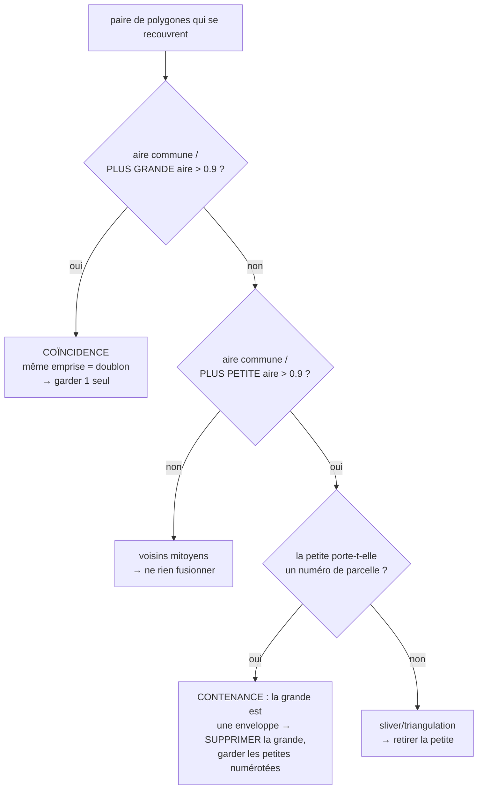

# Concepts de traitement — récupération & qualité des parcelles DXF

> Retours de terrain sur les **gros DXF cadastraux** issus d'une conversion
> DGN/Microstation (ex. `PLAN_CADASTRAL_THIES_FINAL…dxf`, 268 Mo, ~100 000
> parcelles). Ce document complète le
> [Support de cours](./SUPPORT-COURS-GEOMATIQUE.md) : il détaille les concepts
> concrets rencontrés en corrigeant la chaîne d'ingestion, avec pour chacun **le
> problème, la cause, la solution (fichier · fonction) et le pourquoi**.

Chaque fois qu'un nouveau concept de traitement géométrique/géospatial/topologique
est vu, il doit être ajouté ici (cf. règle dans `CLAUDE.md`).

---

## Table des matières

1. [Diagnostic : « je devrais avoir bien plus de parcelles »](#1-diagnostic--je-devrais-avoir-bien-plus-de-parcelles)
2. [Lire TOUTE géométrie porteuse (3DFACE, arcs, faces pleines) + réconciliation](#2-lire-toute-géométrie-porteuse-3dface-arcs-faces-pleines--réconciliation)
3. [Réparer plutôt que rejeter : polygones invalides](#3-réparer-plutôt-que-rejeter--polygones-invalides)
4. [Noding robuste : des segments aux parcelles sans planter](#4-noding-robuste--des-segments-aux-parcelles-sans-planter)
    - [4 bis. Raccord des micro-trous : parcelles voisines fusionnées (dangles)](#4-bis-raccord-des-micro-trous--parcelles-voisines-fusionnées-dangles)
5. [Tuilage adaptatif : récupérer les cœurs urbains denses](#5-tuilage-adaptatif--récupérer-les-cœurs-urbains-denses)
6. [Dédoublonnage & enveloppes : coïncidence vs contenance](#6-dédoublonnage--enveloppes--coïncidence-vs-contenance)
    - [6 bis. Correction des chevauchements partiels (retaille par priorité)](#6-bis-correction-des-chevauchements-partiels-retaille-par-priorité)
7. [Nettoyage des libellés : codes de formatage MTEXT](#7-nettoyage-des-libellés--codes-de-formatage-mtext)
8. [Suppression manuelle de parcelles (table attributaire)](#8-suppression-manuelle-de-parcelles-table-attributaire)
9. [Doublures NICAD : zoom sur les occurrences, annotation & mode édition](#9-doublures-nicad--zoom-sur-les-occurrences-annotation--mode-édition)
10. [Colorer les NICAD manquants/courts sur toute l'analyse (hors plafond d'erreurs)](#10-colorer-les-nicad-manquantscourts-sur-toute-lanalyse-hors-plafond-derreurs)
11. [Table `limite_section` : extraction des sections + contrôle des chevauchements](#11-table-limite_section--extraction-des-sections--contrôle-des-chevauchements)
12. [Annexe — compteurs du rapport & variables d'environnement](#12-annexe--compteurs-du-rapport--variables-denvironnement)
13. [Correction groupée des chevauchements de sections : règle « auto » et ordre séquentiel](#13-correction-groupée-des-chevauchements-de-sections--règle--auto--et-ordre-séquentiel)

---

## 1. Diagnostic : « je devrais avoir bien plus de parcelles »

**Problème.** Un DXF connu pour contenir des dizaines de milliers de parcelles
n'en produit que quelques milliers. La perte est silencieuse : chaque étape jette
des entités sans planter.

**Méthode de diagnostic (dans l'ordre) :**

1. **Inventaire structurel** — compter les types d'entités et les calques *sans*
   dérouler les blocs, en streaming (un DXF de 268 Mo ne se charge pas d'un bloc).
   Ce qui révèle, p. ex., que `limites_parcelles` porte `282 868 LINE` (segments à
   polygoniser) **et** `16 425 3DFACE` (surfaces).
2. **Ingestion profilée** — `DXF_PROFILE=1 bun scripts/test-keur-massar.ts <fichier.dxf>`
   affiche le temps par phase (classify / extract / polygonize / validate / dedup /
   overlap / joins) et **le rapport `DxfIngestionReport`**.
3. **Lecture des compteurs** — chaque compteur du rapport localise une fuite
   (`nbPolygonesInvalidesRejetes`, `nbHorsEmprise`, `nbPolygonesEnveloppeIgnores`,
   `nbTextesHorsParcelle`…). Voir [§12](#12-annexe--compteurs-du-rapport--variables-denvironnement).

**Signal fort à surveiller — `nbTextesHorsParcelle`.** Si des dizaines de milliers
de numéros « ne tombent dans aucune parcelle », c'est que les parcelles censées les
contenir **n'existent pas** (elles ont été perdues en amont). Quand ce compteur
chute après un correctif, c'est la preuve que les parcelles reconstruites sont
réelles.

**Cas Thiès — effet cumulé des correctifs (§2 à §6) :**

| Indicateur | Départ | Après |
|---|---:|---:|
| Parcelles construites | 2 233 | **103 030** |
| Polygones invalides rejetés | 12 447 | 0 (réparés) |
| Polygonisées depuis segments | 1 | 80 726 |
| Textes/numéros orphelins | 285 447 | ~21 000 |

> 🛠️ **Côté data engineer.** Le rapport d'ingestion est l'équivalent d'un rapport
> de **data quality** (lignes lues / rejetées / dédupliquées). On ne fait pas
> confiance au total final tant qu'on n'a pas réconcilié les compteurs de rejet.

---

## 2. Lire TOUTE géométrie porteuse (3DFACE, arcs, faces pleines) + réconciliation

**Problème.** Le lecteur natif ne gérait que `LINE`, `LWPOLYLINE`, `POLYLINE`,
`TEXT`, `POINT`, `INSERT`. Toute parcelle dessinée autrement disparaissait
**silencieusement** : `3DFACE` (faces pleines), **arcs** (`ARC`, renflement/bulge
de polyligne), `CIRCLE`/`ELLIPSE`/`SPLINE`, `SOLID` (quadrilatères pleins), et les
valeurs d'attributs de bloc `ATTRIB`. Sur les 3 fichiers audités (Kaolack, Thiès,
Keur Massar), les calques `limites_parcelles`/`limite_tf` portaient à eux seuls
**> 1 100 arcs** : un bord de parcelle courbe laisse l'anneau **ouvert** → la
polygonisation ne referme pas → parcelle perdue.

**Solution** — `src/lib/dxf-native.ts` (`parseEntities`, `emitGeometryFeatures`) :

1. **Faces pleines** `3DFACE`/`SOLID` → `Polygon`. Coins aux codes `10/20`,
   `11/21`, `12/22`, `13/23` ; ⚠️ `SOLID` stocke ses coins dans l'ordre **1-2-4-3**
   (3ᵉ et 4ᵉ permutés) : réordonner avant de fermer l'anneau.
2. **Courbes densifiées en polylignes** (pas ≈ 3°, borné à 64 segments) pour se
   refermer avec les segments droits voisins : `ARC` (centre/rayon/angles),
   **bulge** de `LWPOLYLINE`/`POLYLINE` (`bulge = tan(θ/4)`, arc entre 2 sommets),
   `CIRCLE`/`ELLIPSE` (anneau fermé), `SPLINE` (approx. par points de contrôle).
3. **`ATTRIB`** (valeur d'attribut d'un bloc inséré = souvent un numéro/libellé
   réel) → émis comme point-texte. `ATTDEF` (gabarit dans la *définition* de bloc)
   reste écarté : c'est une invite, pas une donnée.

**Réconciliation anti-perte silencieuse (le principe généralisé).** Le lecteur
tient un **recensement** (`Census`) : par type d'entité, combien **lues / émises /
écartées** (avec motif). L'invariant `seen = emitted + skipped (+ INSERT,
conteneur)` est journalisé et remonté dans `report.reconciliation`. Toute entité
non émise est ainsi **visible** (ex. `HATCH` = surfaces déjà bordées par des
segments ⇒ redondantes ; `DIMENSION`, `LEADER`, `IMAGE`, `REGION` = habillage),
jamais perdue en silence. C'est le garde-fou : une future régression de lecture se
voit immédiatement dans les compteurs, au lieu de rogner discrètement le total.

> ⚠️ **Micro-anneaux.** Émettre `CIRCLE` crée des « parcelles » à ~0 m² là où le
> cercle est un **symbole** (puits, arbre). Parade : un **plancher d'aire** (=
> seuil de polygonisation, 5 m²) appliqué aussi aux polygones *authored*
> (`validatePolygons · minAreaM2`), rejet comptabilisé. Une vraie parcelle
> cadastrale dépasse toujours ce seuil.

**Pourquoi c'est piégeux.** Une `3DFACE` est limitée à 4 coins : une parcelle à
plus de 4 sommets dessinée « en surface » est parfois **triangulée** en plusieurs
`3DFACE`. Ces triangles partiels sont ensuite nettoyés par le dédoublonnage par
contenance (sliver sans numéro → retiré, cf. [§6](#6-dédoublonnage--enveloppes--coïncidence-vs-contenance)).

---

## 3. Réparer plutôt que rejeter : polygones invalides

**Problème.** ~87 % des polygones déjà fermés (polylignes closes) étaient jetés
comme « invalides ».

**Cause.** Les polylignes fermées exportées de Microstation/AutoCAD sont
massivement **auto-tangentes** ou à sommets dupliqués → `turf.booleanValid`
retourne `false`. Les rejeter d'emblée privait l'import de la majorité des
parcelles.

**Solution.** Avant de rejeter, tenter une **réparation** `buffer(0)` (JSTS) qui
réassemble un anneau auto-intersectant en polygone(s) valide(s) —
`parcelle-ingestion.ts · repairPolygonGeometry`, appelée par `validatePolygons`.
On ne rejette que si la réparation échoue ou produit une aire nulle.

> 💡 `buffer(0)` peut transformer un « nœud papillon » en `MultiPolygon` (deux
> lobes) : c'est géré partout en aval (reprojection, WKT, hash, aire).

**À ne pas confondre** avec la validité *topologique* (chevauchements entre
parcelles) : ici on parle de la **validité géométrique d'un objet isolé**
(cf. [support §7.1–7.2](./SUPPORT-COURS-GEOMATIQUE.md#7-topologie--géométrie-correcte-vs-cohérente)).

---

## 4. Noding robuste : des segments aux parcelles sans planter

**Problème.** La polygonisation de ~282 000 segments (`limites_parcelles`) ne
produisait qu'**un** polygone.

**Cause.** `UnaryUnionOp.union` (JSTS) lève une `TopologyException` *« found
non-noded intersection »* dès qu'un réseau bruité comporte des micro-croisements
(deux limites se coupant à ~0,01 mm près, présentes dans une ligne mais pas
l'autre). Une seule tuile en échec faisait **avorter toute** la polygonisation du
calque.

**Solution (deux volets)** — `src/lib/polygonize.ts` :

1. **Snap-rounding progressif** (`robustNodedUnion`) : accrocher les coordonnées à
   une grille de plus en plus grossière (1 mm → 1 cm → 5 cm) via
   `jsts.precision.GeometryPrecisionReducer` **avant** l'union, jusqu'à obtenir un
   noding cohérent.
2. **Isolation par tuile** (`polygonizeTiled`) : chaque tuile est enveloppée dans
   un `try/catch` — une tuile pathologique n'avorte pas tout le calque. Depuis le
   cas Kaolack, l'échec ne **jette** plus la tuile mais la **subdivise** d'abord
   (cf. [§5](#5-tuilage-adaptatif--récupérer-les-cœurs-urbains-denses)).

> ⚠️ **Piège subtil.** Poser un `PrecisionModel` sur la `GeometryFactory` **ne
> suffit pas** : `createLineString` n'arrondit pas les coordonnées. Seul
> `GeometryPrecisionReducer.reduce(geom)` les accroche réellement à la grille.

Voir aussi le tuilage (pourquoi partitionner) : [support §6.3](./SUPPORT-COURS-GEOMATIQUE.md#6-polygonisation--de-segments-épars-à-des-parcelles).

---

## 4 bis. Raccord des micro-trous : parcelles voisines fusionnées (dangles)

**Problème métier.** Après polygonisation, certaines parcelles **voisines sortent
FUSIONNÉES** en un seul polygone : deux (ou plusieurs) lots distincts, chacun avec
son numéro, ne forment qu'une seule face sur la carte.

**Cause technique.** Le snap-rounding du §4 traite les micro-**croisements**, mais
pas les micro-**trous**. Deux défauts de numérisation classiques :

- **undershoot** : la limite mitoyenne s'arrête à quelques cm du contour qu'elle
  devrait toucher. Pour JSTS, c'est une ligne **pendante** (*dangle*) : le
  `Polygonizer` l'ignore et reconstruit **une seule face** couvrant les deux
  parcelles ;
- **coin ouvert** : deux limites censées se rejoindre en un coin s'arrêtent à
  quelques cm l'une de l'autre → l'anneau ne se referme pas du tout (parcelle
  perdue, ou fusionnée avec la voisine par le même mécanisme).

**Solution** — `src/lib/polygonize.ts · healUndershoots` (appelée par
`polygonizeChunk` AVANT le noding, tolérance `DXF_POLYGONIZE_SNAP_TOLERANCE_M`,
25 cm par défaut) :

1. **Regroupement des extrémités** : toute paire d'extrémités à ≤ tol est
   accrochée sur une position canonique (la première vue — les représentants ne
   bougent jamais, donc pas d'effet de cascade). Referme les coins ouverts.
2. **Raccord au segment** : chaque extrémité encore pendante est projetée sur le
   segment le plus proche (≤ tol) ET ce point projeté est **inséré comme sommet
   du segment cible**. Referme les undershoots en T.

> ⚠️ **Piège d'exactitude flottante.** Déplacer l'extrémité « sur » le segment ne
> suffit pas : la projection calculée peut rester à ~1e-13 m de la ligne, et le
> test d'intersection robuste du noding peut ne PAS voir le contact → dangle
> conservé, parcelles toujours fusionnées. C'est l'**insertion du point comme
> sommet du segment cible** qui garantit le partage de coordonnée **exact**,
> donc le noding.

> ⚠️ **Piège de mutation partagée.** En mode tuilé, les tableaux de coordonnées
> sont **partagés entre tuiles** (fenêtres à marge) : le raccord travaille en
> copie-à-l'écriture, sinon une tuile « répare » les lignes vues par la suivante
> de façon incohérente.

**Choix de la tolérance.** 25 cm referme les trous de numérisation (typiquement
< 10 cm) sans fusionner de sommets légitimes : deux sommets cadastraux distincts
sont à plusieurs mètres l'un de l'autre. Un trou > tolérance n'est **pas**
raccordé (pas de sur-correction silencieuse) ; `0` désactive le raccord. Le
nombre de raccords effectués est journalisé (`[polygonize] micro-trous
raccordés…`).

**Test** : `npx tsx scripts/test-polygonize-heal.ts` (fusion par undershoot,
coin ouvert, trou > tolérance non corrigé, mitoyenneté saine inchangée).

> ⚠️ **Piège — fusion malgré le raccord : la limite est sur un AUTRE calque.**
> Cas terrain : parcelles 00017 et 00020 côte à côte, fusionnées sous 00017
> alors que la mitoyenne est bien dessinée… sur `limites_tf` (ou en limite de
> section). La polygonisation se faisait **classe par classe** : la mitoyenne
> manquait au réseau de `limites_parcelles` → face fusionnée. Les classes de
> limites de parcelle (`limites_parcelles`, `limites_tf`, repli) forment
> désormais **UN SEUL réseau**, auquel s'ajoutent les limites de sections comme
> **arêtes de découpe** (une limite de section est toujours aussi une limite de
> parcelle) — `parcelle-ingestion.ts · polygonizeBoundaries`. Les piscines
> restent un réseau séparé (une piscine est DANS une parcelle : ses contours ne
> doivent pas la découper).
>
> **Diagnostic embarqué** : une parcelle reconstruite contenant **plusieurs
> numéros distincts** est presque sûrement une fusion → compteur
> `nbParcellesMultiNumeros` + warning dans le rapport (« fusion probable …
> vérifier le calque ou augmenter `DXF_POLYGONIZE_SNAP_TOLERANCE_M` »).
> Test : `npx tsx scripts/test-fusion-parcelles.ts`.

> ⚠️ **Piège — le doublon masque le raccord.** Cas réel (sections 017/020,
> commune DYA, fichier Kaolack) : certaines limites sont dessinées **en double**
> (copies Microstation superposées). Le jumeau d'une ligne pendante se trouve à
> distance 0 de son extrémité → le raccord la croyait « déjà connectée » et ne
> refermait jamais le trou. Les lignes sont désormais **dédoublonnées**
> (orientation neutralisée, `polygonize.ts · canonicalLineKey`) avant raccord et
> noding.

> ⚠️ **Piège — index en grille et segments kilométriques.** L'index spatial du
> raccord insère chaque segment dans toutes les cellules du rectangle de sa
> bbox : un segment kilométrique (limites de sections Matam) sur des cellules
> de 8 m = des millions de cellules → `RangeError: Map maximum size exceeded`.
> La taille de cellule est bornée par l'étendue du plus grand segment
> (≤ ~65 cellules/axe/segment) — des cellules plus grandes ajoutent des
> candidats par requête, mais la distance exacte filtre : le résultat est
> identique, seul le coût varie.

> ⚠️ **Piège — un « contact » à 1 µm n'est PAS une intersection.** La même
> mitoyenne s'arrêtait à **0,7 µm** du segment de limite : sous l'ancien seuil
> de contact (1 µm), le raccord supposait que le noding s'en chargerait. Faux :
> le noding robuste ne node que les intersections **exactes** — un point à
> 0,7 µm d'un segment n'en est pas une. Seule une **coordonnée exactement
> partagée avec un sommet** court-circuite désormais le raccord ; toute distance
> > 0 à un segment est raccordée par **insertion de sommet** (partage exact
> garanti).

---

## 5. Tuilage adaptatif : récupérer les cœurs urbains denses

**Problème métier.** Sur `PLAN-CADASTRAL_KAOLACK_FINAL_-11-12-2025.dxf` (181 Mo,
département entier, 39 communes), l'import ne sortait que **33 870 parcelles** alors
que le calque `numero_parcelle` compte **140 542 libellés** : Kaolack-ville, le cœur
dense, disparaissait presque entièrement.

**Cause technique.** `polygonizeTiled` calcule une grille **uniforme** dimensionnée
sur la densité **moyenne** (`tilesPerAxis ≈ √(nSegments / 4000)`). Or les parcelles
d'un fichier départemental sont **très concentrées** : le centre-ville dense est
noyé dans des communes rurales éparses. L'emprise réelle (141 × 94 km) donne des
tuiles de ~17,7 × 11,8 km ; deux d'entre elles absorbaient l'essentiel des
segments :

| tuile | segments | libellés `numero_parcelle` |
|------:|---------:|---------------------------:|
| 3_5 (Kaolack-ville) | **120 594** | **67 355** |
| 2_5 (adjacente)     | **54 860**  | **23 806** |

Ces deux blocs dépassaient largement la capacité de noding : le snap-rounding
échouait, le `try/catch` par tuile (cf. §4) **abandonnait la tuile entière** →
~91 000 parcelles perdues d'un coup (le centre-ville). Le tuilage protégeait donc
contre le *crash*, mais **masquait** une perte massive.

> ⚠️ **Piège de diagnostic.** L'emprise BRUTE des segments montrait 2347 × 2969 km
> (à cause de **11 segments** aux coordonnées aberrantes, 25 sommets sur 516 441).
> Cela FAIT croire à un problème d'emprise, mais le pipeline filtre déjà ces
> parasites (`addOpenLine · ringInSenegalUtm`) : l'emprise **réelle** utilisée est
> 141 × 94 km. Le vrai coupable est la **densité**, pas l'emprise. Toujours mesurer
> l'emprise APRÈS le filtre d'emprise Sénégal.

**Solution** — `src/lib/polygonize.ts · polygonizeTiled` :

1. **Subdivision récursive (quadtree)** : toute région dépassant
   `TILE_MAX_SEGMENTS` (8 000) — **ou dont le noding échoue** — est redécoupée en
   2×2 et retraitée, jusqu'à `TILE_MAX_DEPTH` (8) ou la taille minimale
   `TILE_MIN_SIZE_M` (500 m). On ne **jette** une région qu'en tout dernier
   recours, en journalisant segments + profondeur.
2. **Attribution par centroïde dans le CŒUR** (bornes demi-ouvertes) à **chaque
   profondeur** : les cœurs des sous-tuiles partitionnent exactement le cœur
   parent → chaque parcelle reste comptée **une seule fois**, la marge (400 m)
   ne servant qu'à *collecter* les segments (invariant : marge > diamètre parcelle).
3. **Échelles de snap-rounding grossières en repli** (`10, 5` = 10/20 cm) ajoutées
   après `1000, 100, 20` : atteintes uniquement quand le snap fin échoue sur une
   erreur topologique franche (sommet manquant sur la ligne croisée).

**Résultat.** Polygonisation `limites_parcelles` : **28 298 → 93 399** polygones
reconstruits (×3,3). Résidu : **1 région** (~2 157 segments) au défaut CAO
irréductible (lignes qui se croisent sans sommet commun), journalisée.

> **Pourquoi ne pas juste augmenter le nombre de tuiles ?** Une grille uniforme
> plus fine multiplierait les tuiles **vides** (communes rurales) sans réduire la
> densité **locale** du centre-ville : c'est la concentration qu'il faut suivre,
> d'où le quadtree qui n'affine QUE là où c'est dense.

---

## 6. Dédoublonnage & enveloppes : coïncidence vs contenance

**Problème.** La même parcelle est souvent présente **plusieurs fois** :
- dessinée en `3DFACE`/polyligne fermée **ET** reconstruite depuis les segments ;
- une **grande parcelle/îlot** englobe plusieurs petites parcelles numérotées.

Le dédoublonnage exact (`geomHash`) ne voit pas ces doublons (sommets différents).

**Concept clé — deux relations géométriques distinctes** (`parcelle-ingestion.ts ·
dedupParcellesByOverlap`) :

- **Coïncidence** (recouvrement > 90 % de la **plus grande** aire) = doublon de
  représentation → on garde un représentant (préférence : parcelle **numérotée**,
  puis source `polygonized`).
- **Contenance** (recouvrement > 90 % de la **plus petite** aire, sans coïncidence)
  = une petite parcelle ~entièrement dans une grande. **Ce n'est pas un doublon** :
  les petites sont réelles. Règle métier — **le numéro prime** : si la petite
  porte un numéro, la grande est une **enveloppe/îlot** → on **supprime la grande**
  et on garde les petites numérotées ; sinon la petite est un **sliver** → on la
  retire.

**Sous-concept indispensable — à quelle parcelle « appartient » un numéro ?**
Un numéro placé dans un îlot est géométriquement à l'intérieur de l'enveloppe
**et** de la petite parcelle. Il appartient à la **plus fine** qui le contient →
`findSmallestContainingPolygon`. Sans cette finesse, l'enveloppe serait marquée
« numérotée » et le nettoyage échouerait.

> ⚠️ **Anti-exemple corrigé.** Une première version gardait « la plus grande
> aire » : elle supprimait à tort les parcelles numérotées et conservait les
> enveloppes. Bien distinguer *coïncidence* (garder 1) de *contenance* (retirer la
> grande englobante).

Les recouvrements **partiels** (< 90 %) ne sont ni des coïncidences ni des
contenances : ils sont traités séparément — voir §6 bis (retaille par priorité).

---

## 6 bis. Correction des chevauchements partiels (retaille par priorité)

**Problème métier.** Après dédoublonnage, des parcelles **se chevauchent encore
visiblement** sur la carte. Or le cadastre est une **partition planaire** : deux
parcelles qui se recouvrent de plusieurs m² ne peuvent pas être toutes deux
correctes. Ces chevauchements étaient **détectés et signalés** (warning « N
chevauchement(s) détecté(s) ») mais **jamais corrigés**.

**Cause technique.** Le dédoublonnage (§6) ne traite que deux relations :
*coïncidence* (> 90 % de la plus grande aire) et *contenance* (> 90 % de la plus
petite). Tout recouvrement **entre ~0 et 90 %** passait au travers : parcelle
redessinée avec un léger décalage, îlot recouvrant partiellement ses voisins,
bavure de numérisation le long d'une limite.

**Solution.** `parcelle-ingestion.ts · resolveParcelleOverlaps` (étape 10, juste
après le dédoublonnage) :

1. **Détection** sur les géométries **d'origine** (l'ensemble des conflits ne
   dépend pas de l'ordre de correction) : paires dont l'aire d'intersection
   dépasse `DXF_OVERLAP_FIX_MIN_M2` (0.5 m² par défaut). Pré-filtre bbox : l'aire
   d'intersection réelle est majorée par celle des bbox → les simples voisins
   mitoyens ne coûtent jamais un `intersect`.
2. **Priorité** (qui garde sa géométrie) — même philosophie que §6 :
   **numérotée** > **plus petite aire** (l'élémentaire l'emporte sur
   l'englobante) > source `polygonized` > index. Le marquage `hasNumero` est
   **recalculé après dédoublonnage** (les indices ont changé — piège classique).
3. **Retaille, pas suppression** : la perdante se voit **soustraire** la
   géométrie de la gagnante (`turf.difference`) — sa partie non contestée reste
   une parcelle réelle. Les perdantes sont traitées de la **meilleure à la moins
   bonne** et se soustraient la géométrie **courante** de leurs gagnantes (déjà
   finalisées grâce à cet ordre) : pas de trous fantômes là où une gagnante a
   elle-même été retaillée.
4. **Nettoyage** : les confettis résiduels (< `DXF_POLYGONIZE_MIN_AREA_M2`) sont
   jetés ; une parcelle réduite à néant est retirée et comptée
   (`nbParcellesVideesParChevauchement`).

**Pourquoi ces choix / pièges :**

- **Seuil d'aire absolu (0.5 m²), pas un ratio** : une bavure de 2 cm le long
  d'une limite de 100 m fait ~2 m² → corrigée ; un micro-recouvrement d'angle ne
  l'est pas (retailler du bruit numérique multiplie les micro-différences de
  géométrie sans effet visuel).
- **La plus petite gagne** entre deux non-numérotées : cohérent avec la règle
  « enveloppe/îlot » du §6 — l'englobante est presque toujours la fautive.
- **Soustraction impossible** (géométries dégénérées) : on **garde** la parcelle
  telle quelle plutôt que de la perdre — le chevauchement résiduel reste visible,
  jamais de perte silencieuse.
- Test de non-régression : `scripts/test-overlap-fix.ts` (chevauchement simple,
  priorité au numéro, mitoyenneté intacte, double retaille).

---

## 7. Nettoyage des libellés : codes de formatage MTEXT

**Problème.** Les libellés sortaient formatés : `\fArial Black|b0|i0|c00|p39;ZAR/948`
au lieu de `ZAR/948` ; `\fTahoma|b0|i0|c00|p39;00435` au lieu de `00435`.

**Cause.** Un `MTEXT` AutoCAD/ODA encode la mise en forme **dans le contenu même**.
`\f<Police>|b<gras>|i<italique>|c<codepage>|p<pitch>;` change la police ; le vrai
texte suit le `;`. Le lecteur ne retirait que `\P` (sauts de paragraphe).

**Solution.** Décodeur MTEXT complet `dxf-native.ts · decodeMText`, branché à
l'émission des textes **et** (par sécurité) à la lecture des libellés dans
`parcelle-ingestion.ts` (couvre le repli ogr2ogr).

**Codes gérés :**

| Code | Sens | Traitement |
|---|---|---|
| `\f…;` `\F…;` | police | supprimé |
| `\C…;` `\c…;` | couleur | supprimé |
| `\H…;` | hauteur | supprimé |
| `\A…;` | alignement | supprimé |
| `\W…;` `\Q…;` `\T…;` `\p…;` | largeur / oblique / interlettrage / interligne | supprimé |
| `\S num^den;` | fraction empilée | → `num/den` |
| `\L \l \O \o \K \k` | souligné/surligné/barré | supprimé |
| `{ }` | groupement | supprimé |
| `\P` / `\~` | paragraphe / espace insécable | → `\n` / espace |
| `\\` `\{` `\}` | échappements littéraux | → `\` `{` `}` |

---

## 8. Suppression manuelle de parcelles (table attributaire)

**Besoin.** Retirer des parcelles directement depuis la table attributaire de la
carte (ex. une enveloppe résiduelle, une parcelle erronée).

**Concept — localiser une parcelle sans identifiant stable.** Les tuiles
vectorielles (MVT) ne portent pas d'identifiant persistant et leur géométrie est
quantifiée. On identifie donc chaque parcelle par un **localisateur**, du plus au
moins précis :

1. **point intérieur** (coordonnée WGS84 du clic, garantie dans la parcelle) →
   *point-dans-polygone* ;
2. **emprise** (`bbox`, pour une occurrence précise d'un NICAD dupliqué) →
   appariement d'emprise ;
3. **NICAD** (repli).

**Mise en œuvre.** Endpoint `POST /api/analyses/[id]/features/delete` (résout les
localisateurs contre le GeoJSON persisté, écrit `correctedData` — la source lue
par les tuiles — et met à jour `totalFeatures`). UI : cases à cocher sur toutes les
lignes + bouton **Supprimer** dans `MapAnalysisClient` ; le clic carte mémorise le
point (`MapLibreMap`).

> Cohérence : toute édition (correction d'erreur, suppression) transite par
> `correctedData`, si bien que la carte (tuiles), la table et les recalculs
> reflètent le même état.

---

## 9. Doublures NICAD : zoom sur les occurrences, annotation & mode édition

**Problème métier.** Un même NICAD porté par plusieurs parcelles (une « doublure »)
peut avoir ses occurrences dispersées géographiquement. Zoomer sur la seule
parcelle cliquée empêche de les comparer, et résoudre le doublon (garder la bonne,
supprimer les autres) demandait de cocher/supprimer à la main.

**Cause technique.** L'emprise servie par `map-meta?nicad=` (`tile-index.nicadBounds`)
ne retient que la **première** occurrence d'un NICAD — insuffisant pour cadrer un
groupe. Le zoom passait par `selectedError → fitToNicad(nicad1)`, donc une seule
occurrence.

**Solution.**

- **Emprise par occurrence.** Chaque membre d'un groupe porte son `_bbox` :
  côté serveur via `nicad-group` (`tile-index.nicadGroups`), et côté client (petits
  jeux) en dérivant l'emprise de la géométrie du GeoJSON chargé
  (`MapAnalysisClient · nicadToAllFeatures`, `geomBbox`).
- **Zoom groupé + annotation.** `occurrencesFromMembers` calcule les centroïdes
  numérotés et l'**emprise englobante** ; `MapLibreMap` cadre sur cette union et
  pose un `<Marker>` numéroté par occurrence (couleur doublon `#3b82f6`, alignée sur
  la page d'accueil). Le fit mono-occurrence de `selectedError` est **court-circuité
  pour les DUPLICATE** (le clignotement intense reste actif).
- **Mode édition.** Un bouton *Éditer* (onglet Doublons) rend les marqueurs
  cliquables et ajoute, par occurrence dans la table, **deux** actions :
  - **Conserver** (`handleKeepOnlyOccurrence`) supprime **les autres** occurrences
    via l'endpoint de suppression (§8) ;
  - **Renommer** (`handleRenameOccurrence`) **réassigne un NICAD distinct** à
    l'occurrence sélectionnée sans la supprimer — l'autre voie de résolution d'un
    doublon. Endpoint `POST /api/analyses/[id]/features/update-nicad`.

  Les deux voies partagent la **résolution de localisateur** (`src/lib/analyses/feature-locator.ts` :
  `resolveLocator`, `setFeatureNicad`, `Locator`) avec la suppression, pour éviter
  toute divergence. La désambiguïsation repose sur le localisateur **`bbox`**
  (appariement L1 < 1e-5) : le repli NICAD **ne** distinguerait pas des occurrences
  de même NICAD. La réécriture du NICAD touche **toutes** les clés porteuses
  (`NICAD_KEYS` + `nicad`) pour que l'index de tuiles (`extractNicad`) et la table
  restent cohérents.

**Pourquoi / pièges.**

- Les emprises côté client et serveur doivent être dans le **même repère (WGS84)**
  que le GeoJSON persité, sinon l'appariement `bbox` échoue et la suppression
  retombe sur le NICAD → mauvaise occurrence supprimée.
- Occurrence sans géométrie → `_bbox = [0,0,0,0]` : ignorée (pas de marqueur à
  l'origine, pas de zoom parasite).

**Fichiers · fonctions.** `src/components/MapAnalysisClient.tsx`
(`occurrencesFromMembers`, `applyOccurrenceMarkers`, `handleKeepOnlyOccurrence`,
`handleRenameOccurrence`, `deleteRows`, `withRowNicad`),
`src/components/MapLibreMap.tsx` (marqueurs + fit `occurrencesBounds`),
`src/lib/analyses/feature-locator.ts` (`resolveLocator`, `setFeatureNicad` — partagés),
`src/app/api/analyses/[id]/nicad-group/route.ts` (`_bbox` par occurrence),
`src/app/api/analyses/[id]/features/update-nicad/route.ts` (réassignation NICAD),
`src/app/api/analyses/[id]/features/delete/route.ts` (suppression, localisateur `bbox`, §8).

---

## 10. Colorer les NICAD manquants/courts sur toute l'analyse (hors plafond d'erreurs)

**Problème métier.** Sur la carte, **certaines** parcelles à NICAD manquant
n'apparaissaient pas en couleur (indigo), alors que d'autres oui — de façon
apparemment aléatoire.

**Cause technique.** Deux voies colorent une parcelle en erreur :

1. **Par `_nicad`** (filtre sur les tuiles) — fonctionne pour les erreurs qui
   portent un NICAD réel (doublons, NICAD trop courts…) ;
2. **Par géométrie propre de l'erreur** (overlay `error-geoms`) — seule voie pour
   un **NICAD manquant** (`nicad1: null`, aucune valeur à filtrer).

Or la page carte ne sérialise que les **`ERROR_RENDER_LIMIT = 2000`** premières
erreurs (`src/app/map/[analysisId]/page.tsx` — un gros DXF peut en porter 100k+, tout
embarquer fige le navigateur). Au-delà du plafond, les NICAD manquants n'avaient
donc **aucune** couleur : ni `_nicad` (vide), ni géométrie embarquée.

**Solution.** Colorer les parcelles sans/mauvais NICAD **directement depuis le
vecteur**, indépendamment de la liste d'erreurs :

- Côté serveur, chaque parcelle porte un statut NICAD `_nstat` ∈
  `missing | short | ok` sur les tuiles (`tile-index.ts · nicadStatus`, même règle
  que le moteur : `isMissingNicadValue` puis longueur < 8).
- Côté carte, deux couches vecteur colorent `_nstat = "missing"` (indigo
  `#6366f1`) et `_nstat = "short"` (turquoise `#14b8a6`) — couleurs de la page
  d'accueil (`MapLibreMap.tsx`).

**Pas de superposition de parcelle.** Une erreur peut porter sa **propre
géométrie** (overlay `error-geoms`). Quand cette géométrie **est** une parcelle
déjà rendue par les tuiles (doublon, NICAD manquant/court), la dessiner en overlay
superpose une **seconde copie** (légèrement décalée : géométrie exacte vs tuile
quantifiée) → doublons visuels. Règle : les tuiles sont la **source unique** de
coloration des parcelles ; l'overlay `error-geoms` ne garde que les géométries
**région/résidu** sans équivalent sur les tuiles (chevauchement, espace vide,
sliver, géométrie invalide). Cf. `MapLibreMap.tsx · TILE_COLORED_ERROR_TYPES`
(`DUPLICATE`, `MISSING_NICAD`, `SHORT_NICAD` exclus de l'overlay).

**Pourquoi / pièges.**

- On expose une **chaîne non vide** (`"missing"`/`"short"`/`"ok"`) plutôt que de
  filtrer sur `_nicad = ""` : un encodeur MVT peut **abandonner** une propriété
  chaîne vide, rendant le filtre inopérant.
- Ces couches sont **disjointes** du surlignage vert « conforme » (qui exige
  NICAD ≥ 8 & non manquant) : aucune parcelle n'est colorée deux fois.
- L'index de tuiles est **mis en cache** : la nouvelle propriété apparaît après
  invalidation (`updatedAt`/redémarrage), pas de migration.

**Fichiers · fonctions.** `src/lib/analyses/tile-index.ts` (`nicadStatus`, `_nstat`),
`src/components/MapLibreMap.tsx` (couches `missing-nicad-fill` / `short-nicad-fill`),
`src/lib/utils.ts` (`errorTypeColor`), `src/app/map/[analysisId]/page.tsx`
(`ERROR_RENDER_LIMIT`).

---

## 11. Table `limite_section` : extraction des sections + contrôle des chevauchements

**Besoin métier.** Construire une table de référence des **limites de section**
(`region, departement, commune, num_section, geometry`) à partir d'un DXF, avec
**contrôle des chevauchements** entre sections et **corrections** appliquées par
l'utilisateur.

**Concept — les sections sont déjà calculées, juste jetées.** Le pipeline
d'ingestion polygonise la couche `limites_sections` (`validSections`) et rattache
les libellés `numero_section` (`sectionNumeros`) — mais uniquement comme support
de la jointure parcelle ∈ section, puis les abandonne. On les **expose** désormais
(`DxfIngestionResult.sections`, option `sectionsOnly` pour court-circuiter la
composition des parcelles).

**Chaîne de construction** (`src/lib/cadastre/build-sections.ts`, calquée sur
`assign-nicad-2026.ts`) :

1. **Rattacher la commune de CHAQUE fragment** : jointure spatiale du point
   représentatif sur `cad_communes_2026` → `region/departement/commune/syscol`
   (`getCommuneInfo2026ForPoints`, `ST_Contains` + repli proximité 50 m).
2. **Dissoudre** les fragments d'une même section par clé **(commune, numéro)**
   (`turf.union`, repli concaténation d'anneaux si l'union échoue — aucun
   fragment perdu). Sans numéro OU sans commune résolue : pas de fusion.
3. **Persister** (`sections-data.insertLimiteSections`) : INSERT + `geom` PostGIS
   via `ST_Multi(ST_CollectionExtract(ST_MakeValid(ST_GeomFromGeoJSON(...)),3))`
   (répare les anneaux Microstation auto-intersectants).
4. **Contrôle des chevauchements** (`refreshOverlaps`) : self-join PostGIS
   `ST_Intersects` + aire d'intersection `ST_Area(ST_Transform(...,32628))` au-delà
   d'un seuil (`SECTION_OVERLAP_MIN_AREA_M2`, défaut 1 m²) → `limite_section_overlap`
   en `PENDING`. Une frontière mitoyenne partagée donne une aire ~0 → **exclue**
   (on ne veut que les chevauchements *surfaciques*).

**Corrections utilisateur** (`/api/cadastre/sections/correct`, mirroir des OVERLAP
parcelles) : `clip_a`/`clip_b` (`turf.difference`), `merge` (`turf.union`),
`delete_a`/`delete_b`, `ignore`. Après chaque modification géométrique, on
**re-contrôle** (`refreshOverlaps`), en **préservant** les paires `IGNORED`
(non ré-insérées).

**Réaffichage sans réimport.** Les données étant persistées, la page charge au
montage les **lots stockés** (`listSectionBatches` → `/api/cadastre/sections/batches`,
regroupés par `sourceFichier`) et réaffiche automatiquement le plus récent
(sections + chevauchements) — un sélecteur permet de basculer entre lots.

**Résidus non numérotés fusionnés à leur section hôte.** La polygonisation des
limites de sections produit aussi de **petits polygones sans numéro** (trous ou
lamelles découpés dans une vraie section par le noding) que le filtre
« enveloppes » ne capte pas (ils n'englobent personne) — ils étaient conservés
comme « numéro simplement manquant ». Règle : un polygone **sans numéro** ET
sous `SECTION_MIN_AREA_SANS_NUMERO_M2` (défaut **1 ha**) est un résidu — il est
**fusionné (union) dans sa section hôte**, jamais gardé comme section à part ;
sans hôte trouvé, il est écarté (`build-sections.ts · absorbResidus`, compteurs
`nbResidusFusionnes` / `nbResidusEcartes` dans le rapport du job). Le seuil ne
s'applique JAMAIS aux polygones numérotés ; une vraie section sans étiquette
(plusieurs hectares) reste conservée telle quelle.

Pièges de l'absorption :

- **Ne pas simplement les jeter** : un résidu logé dans un TROU de la section
  laisserait un vide dans la couverture — l'union avec l'hôte comble le trou.
- **Point-dans-polygone ne trouve pas l'hôte d'un trou** (l'intérieur d'un trou
  est *hors* du polygone au sens PIP). Le rattachement se fait par **buffer de
  1 m ∩ section** : l'hôte est la ligne d'intersection maximale, ce qui départage
  aussi les lamelles bordées par deux sections (frontière partagée la plus longue).
- L'absorption s'exécute **après dissolution** (commune, numéro) : chaque hôte
  est complet et l'union se fait en une passe.

**Suppression des zones récupérées à tort comme sections.** La polygonisation
de la couche `limites_sections` peut produire des polygones qui ne sont PAS des
sections (enveloppes de quartier, blocs, artefacts de tracé) : ils se repèrent
surtout **visuellement**. Deux entrées de suppression, même route
(`POST /api/cadastre/sections/delete`, `{ sectionId }`) : la corbeille de la
table latérale, et le **popup au clic sur le polygone** (identité + bouton
« Supprimer cette section »). Piège d'implémentation : la mise en évidence du
chevauchement sélectionné restyle les couches en place (`setStyle`) au lieu de
les reconstruire — sinon le changement de sélection déclenché par le même clic
refermait aussitôt le popup (`SectionsClient.tsx`).

**Fusion manuelle de sections (sans chevauchement détecté).** L'action `merge`
du contrôle de chevauchements ne couvre pas tous les cas : une section arrive
**fragmentée** (dissolution impossible faute de numéro ou de commune résolue,
cf. dissolution par (commune, numéro)) ou **scindée à tort** — fragments
disjoints ou seulement mitoyens, donc jamais présents dans
`limite_section_overlap`. La page permet de sélectionner 2+ sections librement
(bouton violet du popup carte, ou cases de la table) puis de les fusionner :
`POST /api/cadastre/sections/merge` `{ sectionIds }` — **l'ordre compte, la
première sélectionnée conserve numéro/commune/lot**, les autres sont
supprimées. Géométrie : `turf.union` de l'ensemble (MultiPolygon si
disjointes), **repli concaténation d'anneaux** si l'union échoue (même
stratégie anti-perte que la dissolution de `build-sections`), puis re-contrôle
des chevauchements de chaque lot touché. Côté UI, la surbrillance violette de
la sélection est appliquée par restylage en place (même piège popup que la
suppression, cf. ci-dessus).

**Export shapefile des sections corrigées.** Le bouton « Exporter SHP » de la
page produit un ZIP `.shp/.shx/.dbf/.prj` (WGS84) des sections **telles qu'en
base** — donc APRÈS corrections de chevauchements (clip/merge/suppressions),
pas la géométrie brute du DXF. La portée suit la vue courante : le lot
sélectionné (`?sourceFichier=...`) ou tous les lots. L'écriture réutilise le
générateur binaire des parcelles (`export-shapefile.ts`), avec le DBF
paramétré par jeu de champs (`SECTION, COMMUNE, SYSCOL, REGION, DEPT, SURF_M2`,
latin1 comme le reste du module) — `export-shapefile.ts ·
buildSectionsShapefileZip`, route `GET /api/cadastre/sections/export`.

**Pourquoi / pièges.**

- La géométrie est stockée en **4326** (comme `cad_communes_2026`) pour que la
  jointure commune et l'intersection PostGIS partagent le même repère ; les aires
  sont mesurées en `ST_Transform(...,32628)` (mètres).
- `ST_MakeValid` est indispensable : les tracés de section Microstation sont
  fréquemment auto-intersectants (cf. §3), sinon `ST_Intersection` échoue.
- Le job réutilise l'infra d'import asynchrone (`ImportJob { kind:"sections" }`,
  `run-job.ts`) : lecture DXF lourde hors requête HTTP, sondage de l'avancement.

> ⚠️ **Piège — sections fusionnées / disparues (corrigé).** Deux mécanismes
> distincts produisaient le même symptôme :
>
> 1. **Dissolution par numéro seul.** Un numéro de section n'est unique que
>    **dans sa commune** : sur un fichier multi-communes, toutes les sections
>    « 001 » étaient unies en une seule ligne (MultiPolygon enjambant les
>    communes) et les sections « absorbées » disparaissaient de la leur. La clé
>    de dissolution est désormais **(syscol commune, numéro)**, la commune étant
>    résolue AVANT la dissolution. De plus, un échec de `turf.union` jetait
>    silencieusement le fragment (« on garde l'accumulateur ») → repli en
>    concaténation d'anneaux, aucun fragment perdu.
> 2. **Tolérance de raccord trop fine.** Les tracés de sections portent des
>    trous d'accrochage **métriques** (numérisation à plus petite échelle que
>    les parcelles) : à 25 cm (`DXF_POLYGONIZE_SNAP_TOLERANCE_M`, cf. §4 bis),
>    l'anneau restait ouvert (section **perdue**) ou la limite mitoyenne restait
>    pendante (sections **fusionnées**). La polygonisation de `limites_sections`
>    utilise sa propre tolérance `DXF_SECTION_SNAP_TOLERANCE_M` (défaut **1 m**,
>    sans risque : deux sommets légitimes d'une section sont à des centaines de
>    mètres) — `parcelle-ingestion.ts · polygonizeBoundaries`.
> 3. **Repli ogr2ogr systématique en `sectionsOnly` (corrigé).** Le critère de
>    succès du lecteur natif testait `parcelles.length > 0` — or en
>    `sectionsOnly`, `parcelles` est TOUJOURS vide (court-circuit) : chaque
>    import de sections partait sur ogr2ogr même quand le natif fonctionnait
>    (conversion moins fidèle, déluge « Warning 1: Non closed ring » de GDAL —
>    cas Matam). Le critère est désormais `sections.length > 0` en
>    `sectionsOnly`. En prime, le repli ogr2ogr écrit son journal GDAL dans un
>    puits (`CPL_LOG=os.devNull`) et résume ses erreurs au lieu d'embarquer
>    100k+ caractères de warnings bénins.
> 4. **Jointures « premier contenant » (libellés ET NICAD).** Un point tombe à
>    la fois dans sa vraie section et dans tout anneau d'ensemble/face sans
>    numéro qui l'englobe : au « premier contenant » (ordre de grille
>    arbitraire), l'enveloppe raflait la jointure. Les libellés `numero_section`
>    sont rattachés au **plus petit polygone contenant** ; la composante section
>    du **NICAD** (jointure parcelle ∈ section) prend la **plus petite section
>    NUMÉROTÉE contenante** (`parcelle-ingestion.ts · findSectionNumero`) —
>    sinon `numero_section` absent (« 000 ») ou faux → collisions de NICAD
>    (faux doublons).

**Fichiers · fonctions.** `src/lib/parcelle-ingestion.ts`
(`SectionCandidate`, `sections`, option `sectionsOnly`),
`src/lib/cadastre/build-sections.ts`, `src/lib/cadastre/sections-data.ts`
(persistance + overlaps SQL brut + `listSectionBatches`), `src/lib/cadastre/data.ts`
(`getCommuneInfo2026ForPoints`), `src/lib/import/run-job.ts` (branche `sections`),
`src/lib/cadastre/export-shapefile.ts` (`buildSectionsShapefileZip`),
`src/app/api/cadastre/sections/{import,overlaps,correct,merge,batches,export}/route.ts`,
`src/app/cadastre/sections/page.tsx` + `src/components/cadastre/SectionsClient.tsx`.

---

## 11 bis. Sections fusionnées SANS trou de raccord : limite mitoyenne absente de la source

**Problème métier.** Kaolack (`PLAN-CADASTRAL_KAOLACK_FINAL_-11-12-2025.dxf`),
commune de THIARE : les sections **013 et 018** sortent fusionnées en une seule
section « 013 » de 3 124 ha (le double d'une section normale de la commune) ;
même pathologie pour **004/019**. Les sections 018 et 019 n'existent pas en base
alors que leurs libellés `numero_section` sont bien dans le DXF.

**Cause technique — à distinguer du cas « undershoot » (§ mémoire heal).** Deux
mécanismes très différents produisent le même symptôme :

1. **Trou de raccord** (undershoot métrique) : la mitoyenne existe mais s'arrête
   à quelques dm/m du contour → `healUndershoots` la raccorde si le trou est
   ≤ `DXF_SECTION_SNAP_TOLERANCE_M` (1 m par défaut). *Signature : des extrémités
   pendantes proches de la zone, et une tolérance plus large sépare les sections.*
2. **Limite absente** (cas THIARE) : la mitoyenne n'est dessinée **sur aucun
   calque** du DXF. *Signature : AUCUNE extrémité pendante avec trou 1–50 m dans
   la zone, et monter la tolérance ne sépare jamais — au contraire, à 2 m+ la
   face absorbait aussi la 015.* Vérifié en polygonisant le réseau sections
   enrichi tour à tour des lignes brutes de chaque calque du corridor
   (`limites_parcelles` 83, `limite_section` 8, `limites_communes` 2) : 013/018
   restent fusionnées dans tous les cas → la donnée n'existe pas.

**Comportement du pipeline (correct vu la donnée).** Une seule face fermée
contient deux libellés : la jointure « plus petit contenant » ajoute les deux
numéros à `sectionNumerosVus[idx]`, mais la face ne garde que le **premier
numéro vu** (`parcelle-ingestion.ts:1393`) — d'où « 013 ». Un avertissement est
émis (`N section(s) contenant PLUSIEURS numéros … fusion probable`) listant les
paires (ex. `013+018`).

**Diagnostic.** `scripts/diagnose-sections.ts` (balayage de tolérances sur tout
le fichier + liste des faces multi-numéros). Pour un cas localisé : restreindre
le réseau à l'emprise de la commune (bbox 32628 via `cad_communes_2026`),
mesurer les extrémités pendantes (distance extrémité → autre ligne, fenêtre
1–50 m) et balayer les tolérances. Indice rapide côté base : une section dont la
surface vaut ~2× ses voisines + des numéros manquants dans la séquence.

**Remédiations.** (a) corriger le DXF source (tracer la mitoyenne) — seule vraie
correction, la géométrie légale n'est pas inventable ; (b) à défaut, tracer la
limite dans un SIG et réimporter ; (c) côté application, les avertissements
multi-numéros de l'ingestion identifient les communes à contrôler — les paires
sont dans le rapport d'import.

**Pourquoi ne PAS augmenter la tolérance.** À 2 m, la face fusionnée absorbait
aussi la section 015 : sur des tracés sans trou réel, élargir la tolérance ne
sépare rien et **dégrade** les sections voisines saines. 1 m reste le bon réglage.

---

## 12. Annexe — compteurs du rapport & variables d'environnement

**Compteurs `DxfIngestionReport`** (localiser une fuite de parcelles) :

| Compteur | Signification |
|---|---|
| `nbParcelles` | parcelles finales construites |
| `nbParcellesPolygonisees` | reconstruites depuis des segments |
| `nbPolygonesInvalidesRejetes` | rejetées même après réparation `buffer(0)` |
| `nbPolygonesRepares`* | réparées au lieu d'être rejetées |
| `nbDoublonsRecouvrement` | doublons de représentation fusionnés (coïncidence) |
| `nbEnveloppesSupprimees` | grandes parcelles/îlots supprimés (contenance) |
| `nbPolygonesEnveloppeIgnores` | polygones > plafond d'aire (emprise de zone) |
| `nbHorsEmprise` | entités hors de la plage UTM28N plausible |
| `nbTextesHorsParcelle` | libellés ne tombant dans aucune parcelle |
| `nbParcellesMultiNumeros` | parcelles portant plusieurs numéros distincts — fusion probable (§4 bis) |
| `nbChevauchements` | chevauchements erronés détectés (intersection > seuil, §6 bis) |
| `nbChevauchementsCorriges` | parcelles retaillées pour résorber ces chevauchements (§6 bis) |
| `nbParcellesVideesParChevauchement` | parcelles retirées car entièrement absorbées à la retaille (§6 bis) |
| `reconciliation` | recensement lecteur DXF : `seen`/`emitted`/`skipped` par type (anti-perte silencieuse, §2) |

\* exposé comme `warning` dans le rapport.

**Variables d'environnement de réglage :**

| Variable | Défaut | Rôle |
|---|---:|---|
| `DXF_POLYGONIZE_PRECISION_SCALES` | `1000,100,20,10,5` | grilles de snap-rounding, fin → grossier (§4-5) |
| `DXF_POLYGONIZE_SNAP_TOLERANCE_M` | `0.25` | raccord des extrémités pendantes avant noding, 0 = désactivé (§4 bis) |
| `DXF_SECTION_SNAP_TOLERANCE_M` | `1` | idem, spécifique à la couche `limites_sections` (trous métriques, §11) |
| `SECTION_MIN_AREA_SANS_NUMERO_M2` | `10000` | aire mini d'une section SANS numéro — en dessous : résidu fusionné à sa section hôte (§11) |
| `SECTION_OVERLAP_MIN_AREA_M2` | `1` | aire mini d'une intersection pour compter comme chevauchement (§11) |
| `DXF_POLYGONIZE_TILE_THRESHOLD` | `20000` | seuil de bascule vers le tuilage |
| `DXF_POLYGONIZE_TILE_TARGET` | `4000` | segments visés par tuile (grille initiale) |
| `DXF_POLYGONIZE_TILE_MARGIN_M` | `400` | marge de collecte des segments par tuile |
| `DXF_POLYGONIZE_TILE_MAX_SEGMENTS` | `8000` | au-delà, la tuile est subdivisée (§5) |
| `DXF_POLYGONIZE_TILE_MAX_DEPTH` | `8` | profondeur max de subdivision quadtree (§5) |
| `DXF_POLYGONIZE_TILE_MIN_SIZE_M` | `500` | taille mini d'une région subdivisable (§5) |
| `DXF_POLYGONIZE_MIN_AREA_M2` | `5` | aire mini (élimine les slivers) |
| `DXF_POLYGONIZE_MAX_AREA_M2` | `50000` | aire maxi (élimine l'anneau enveloppe) |
| `DXF_OVERLAP_COINCIDE_RATIO` | `0.9` | seuil de coïncidence (doublon, §6) |
| `DXF_OVERLAP_CONTAIN_RATIO` | `0.9` | seuil de contenance (enveloppe, §6) |
| `DXF_OVERLAP_FIX_MIN_M2` | `0.5` | aire d'intersection (m²) à partir de laquelle un chevauchement est corrigé (§6 bis) |
| `DXF_CLOSE_SNAP_TOLERANCE_M` | `0.05` | fermeture des polylignes quasi fermées |

**Fichiers clés :** `src/lib/dxf-native.ts` (lecture + `decodeMText`),
`src/lib/cadastral-filter.ts` (classification par calque),
`src/lib/polygonize.ts` (noding robuste + tuilage),
`src/lib/parcelle-ingestion.ts` (validation, dédoublonnage, jointures),
`src/app/api/analyses/[id]/features/delete/route.ts` (suppression manuelle).

---

## 13. Correction groupée des chevauchements de sections : règle « auto » et ordre séquentiel

**Problème métier** : résoudre les chevauchements de `limite_section` un par
un (découper/fusionner/supprimer) est lent quand un lot en contient des
dizaines. Il faut pouvoir appliquer la même règle à plusieurs chevauchements
en une fois, sans dupliquer la logique de résolution ni casser un
chevauchement au profit d'un autre traité juste avant dans le même lot.

**Cause technique** : deux pièges distincts pour un traitement en masse
d'objets géométriques qui peuvent se chevaucher les uns les autres :
1. Une règle « découper la plus grande section » ne peut pas être décidée une
   fois pour toutes à l'avance : elle dépend de l'aire de CHAQUE paire
   (`turf.area`), recalculée au moment de traiter CE chevauchement précis —
   pas un tri global des sections par taille en amont.
2. Un traitement **parallèle** (`Promise.all`) de plusieurs corrections est
   dangereux dès que deux chevauchements du même lot partagent une section :
   corriger le premier modifie la géométrie de cette section en base : si le
   second lit sa version AVANT cette modification (ce qu'un traitement
   parallèle ferait), il calcule une découpe sur une géométrie déjà périmée.

**Solution** (`src/lib/cadastre/overlap-correction.ts` ·
`applyOverlapCorrection`, `src/app/api/cadastre/sections/correct-batch/route.ts`) :
- La règle `"auto"` compare `turf.area(a.geomGeoJson)` et
  `turf.area(b.geomGeoJson)` **au moment de traiter ce chevauchement précis**
  (les deux sections sont rechargées depuis la base via `getSection`, pas
  passées en paramètre depuis un calcul antérieur) — découpe systématiquement
  la plus grande, garde la plus petite intacte (à aire égale, découpe B).
- Le traitement par lot boucle **séquentiellement** (`for...of`, pas
  `Promise.all`) sur la liste de chevauchements : chaque itération relit les
  sections depuis la base, donc voit forcément l'état laissé par l'itération
  précédente du même lot.
- `refreshOverlaps` (recalcul des chevauchements du lot) n'est appelé
  **qu'une seule fois à la fin**, pour chaque `sourceFichier` distinct
  effectivement modifié — pas une fois par chevauchement traité. Ce n'est PAS
  une simple optimisation de performance : `refreshOverlaps` fait un `DELETE`
  puis une nouvelle `INSERT ... SELECT` de toutes les lignes PENDING de
  `limite_section_overlap` pour ce `sourceFichier`, ce qui leur donne de
  **nouveaux id** en base (les anciens ids ne sont pas préservés). Si on
  l'appelait après chaque item à l'intérieur de la boucle, tout `overlapId`
  encore en file dans ce même lot pointerait vers une ligne qui n'existe
  plus : le reste du lot échouerait à tort avec `"Chevauchement introuvable"`.
  C'est une exigence de correction, pas seulement de performance.

**Pourquoi (pièges inclus)** : un chevauchement déjà résolu par un item
précédent du même lot (section supprimée car entièrement couverte) fait
échouer proprement l'item suivant qui la référencerait encore
(`"Section introuvable"`) — accepté par design (pas de rollback global, cf.
`docs/superpowers/specs/2026-07-30-decoupage-groupe-chevauchements-design.md`) :
le rapport `results[]` distingue réussites/échecs plutôt que de bloquer tout
le lot pour un seul cas déjà résolu par ailleurs.

---

*En cas de divergence entre ce document et le code (`src/lib/**`), **le code fait
foi** — mettre la doc à jour en conséquence.*
