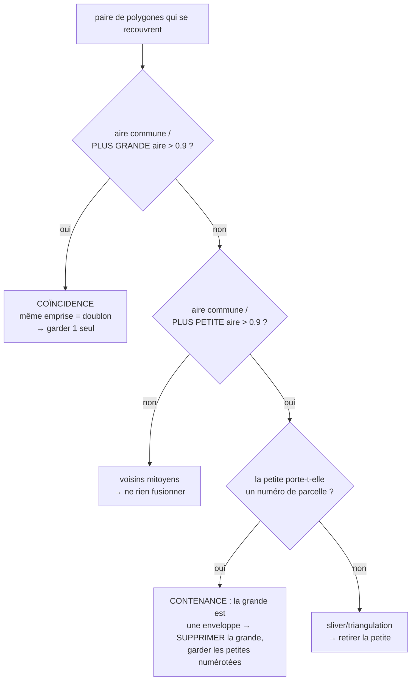

# Concepts de traitement — récupération & qualité des parcelles DXF

> Retours de terrain sur les **gros DXF cadastraux** issus d'une conversion
> DGN/Microstation (ex. `PLAN_CADASTRAL_THIES_FINAL…dxf`, 268 Mo, ~100 000
> parcelles). Ce document complète le
> [Support de cours](./SUPPORT-COURS-GEOMATIQUE.md) : il détaille les concepts
> concrets rencontrés en corrigeant la chaîne d'ingestion, avec pour chacun **le
> problème, la cause, la solution (fichier · fonction) et le pourquoi**.

Chaque fois qu'un nouveau concept de traitement géométrique/géospatial/topologique
est vu, il doit être ajouté ici (cf. règle dans `CLAUDE.md`).

---

## Table des matières

1. [Diagnostic : « je devrais avoir bien plus de parcelles »](#1-diagnostic--je-devrais-avoir-bien-plus-de-parcelles)
2. [Lire TOUTE géométrie porteuse (3DFACE, arcs, faces pleines) + réconciliation](#2-lire-toute-géométrie-porteuse-3dface-arcs-faces-pleines--réconciliation)
3. [Réparer plutôt que rejeter : polygones invalides](#3-réparer-plutôt-que-rejeter--polygones-invalides)
4. [Noding robuste : des segments aux parcelles sans planter](#4-noding-robuste--des-segments-aux-parcelles-sans-planter)
    - [4 bis. Raccord des micro-trous : parcelles voisines fusionnées (dangles)](#4-bis-raccord-des-micro-trous--parcelles-voisines-fusionnées-dangles)
5. [Tuilage adaptatif : récupérer les cœurs urbains denses](#5-tuilage-adaptatif--récupérer-les-cœurs-urbains-denses)
6. [Dédoublonnage & enveloppes : coïncidence vs contenance](#6-dédoublonnage--enveloppes--coïncidence-vs-contenance)
    - [6 bis. Correction des chevauchements partiels (retaille par priorité)](#6-bis-correction-des-chevauchements-partiels-retaille-par-priorité)
    - [6 ter. Chevauchements non signalés au-delà de 500 parcelles (plafond de détection à l'analyse)](#6-ter-chevauchements-non-signalés-au-delà-de-500-parcelles-plafond-de-détection-à-lanalyse)
7. [Nettoyage des libellés : codes de formatage MTEXT](#7-nettoyage-des-libellés--codes-de-formatage-mtext)
8. [Suppression manuelle de parcelles (table attributaire)](#8-suppression-manuelle-de-parcelles-table-attributaire)
9. [Doublures NICAD : zoom sur les occurrences, annotation & mode édition](#9-doublures-nicad--zoom-sur-les-occurrences-annotation--mode-édition)
10. [Colorer les NICAD manquants/courts sur toute l'analyse (hors plafond d'erreurs)](#10-colorer-les-nicad-manquantscourts-sur-toute-lanalyse-hors-plafond-derreurs)
11. [Table `limite_section` : extraction des sections + contrôle des chevauchements](#11-table-limite_section--extraction-des-sections--contrôle-des-chevauchements)
    - [11 bis. Sections fusionnées SANS trou de raccord : limite mitoyenne absente de la source](#11-bis-sections-fusionnées-sans-trou-de-raccord--limite-mitoyenne-absente-de-la-source)
    - [11 ter. Attribution manuelle du numéro pour les sections sans étiquette](#11-ter-attribution-manuelle-du-numéro-pour-les-sections-sans-étiquette)
    - [11 ter bis. Mise à jour automatique des NICAD lors de l'ajout/modification du numéro de section](#11-ter-bis-mise-à-jour-automatique-des-nicad-lors-de-lajoutmodification-du-numéro-de-section)
    - [11 quater. Import de sections depuis un shapefile : contourner le pipeline DXF](#11-quater-import-de-sections-depuis-un-shapefile--contourner-le-pipeline-dxf)
    - [11 quinquies. Attribution des NICAD manquants par incrémentation + plus proche voisin](#11-quinquies-attribution-des-nicad-manquants-par-incrémentation--plus-proche-voisin)
    - [11 sexies. « Aucune parcelle sans NICAD » trompeur : rattachement fileName/sourceFichier cassé par un simple renommage](#11-sexies-aucune-parcelle-sans-nicad-trompeur--rattachement-filenamesourcefichier-cassé-par-un-simple-renommage)
    - [11 septies. Section sans AUCUNE parcelle de référence : premier numéro `00001`, préfixe déduit de `cad_communes_2026`](#11-septies-section-sans-aucune-parcelle-de-référence--premier-numéro-00001-préfixe-déduit-de-cad_communes_2026)
    - [11 octies. Analyse jamais passée par l'extraction de sections : repli spatial dans TOUTE `limite_section`](#11-octies-analyse-jamais-passée-par-lextraction-de-sections--repli-spatial-dans-toute-limite_section)
    - [11 nonies. KPI conformes/erreurs figé après une attribution NICAD : deux couches de fraîcheur](#11-nonies-kpi-conformeserreurs-figé-après-une-attribution-nicad--deux-couches-de-fraîcheur)
    - [11 decies. Point de départ du repli sans référence : coin nord-ouest, pas le centre](#11-decies-point-de-départ-du-repli-sans-référence--coin-nord-ouest-pas-le-centre)
12. [Annexe — compteurs du rapport & variables d'environnement](#12-annexe--compteurs-du-rapport--variables-denvironnement)
13. [Correction groupée des chevauchements de sections : règle « auto » et ordre séquentiel](#13-correction-groupée-des-chevauchements-de-sections--règle--auto--et-ordre-séquentiel)
14. [Historique & restauration : upsert au lieu de `DO NOTHING`](#14-historique--restauration--upsert-au-lieu-de-do-nothing)
    - [14 bis. Historique par lot : une transaction par item, pas une transaction globale](#14-bis-historique-par-lot--une-transaction-par-item-pas-une-transaction-globale)
15. [Mappage des champs shapefile & import asynchrone avec progression](#15-mappage-des-champs-shapefile--import-asynchrone-avec-progression)
16. [Import shapefile depuis la page d'accueil : bascule vers le job asynchrone (sans mappage)](#16-import-shapefile-depuis-la-page-daccueil--bascule-vers-le-job-asynchrone-sans-mappage)
17. [NICAD du shapefile page d'accueil : jointure spatiale sur `limite_section`](#17-nicad-du-shapefile-page-daccueil--jointure-spatiale-sur-limite_section)

---

## 1. Diagnostic : « je devrais avoir bien plus de parcelles »

**Problème.** Un DXF connu pour contenir des dizaines de milliers de parcelles
n'en produit que quelques milliers. La perte est silencieuse : chaque étape jette
des entités sans planter.

**Méthode de diagnostic (dans l'ordre) :**

1. **Inventaire structurel** — compter les types d'entités et les calques *sans*
   dérouler les blocs, en streaming (un DXF de 268 Mo ne se charge pas d'un bloc).
   Ce qui révèle, p. ex., que `limites_parcelles` porte `282 868 LINE` (segments à
   polygoniser) **et** `16 425 3DFACE` (surfaces).
2. **Ingestion profilée** — `DXF_PROFILE=1 bun scripts/test-keur-massar.ts <fichier.dxf>`
   affiche le temps par phase (classify / extract / polygonize / validate / dedup /
   overlap / joins) et **le rapport `DxfIngestionReport`**.
3. **Lecture des compteurs** — chaque compteur du rapport localise une fuite
   (`nbPolygonesInvalidesRejetes`, `nbHorsEmprise`, `nbPolygonesEnveloppeIgnores`,
   `nbTextesHorsParcelle`…). Voir [§12](#12-annexe--compteurs-du-rapport--variables-denvironnement).

**Signal fort à surveiller — `nbTextesHorsParcelle`.** Si des dizaines de milliers
de numéros « ne tombent dans aucune parcelle », c'est que les parcelles censées les
contenir **n'existent pas** (elles ont été perdues en amont). Quand ce compteur
chute après un correctif, c'est la preuve que les parcelles reconstruites sont
réelles.

**Cas Thiès — effet cumulé des correctifs (§2 à §6) :**

| Indicateur | Départ | Après |
|---|---:|---:|
| Parcelles construites | 2 233 | **103 030** |
| Polygones invalides rejetés | 12 447 | 0 (réparés) |
| Polygonisées depuis segments | 1 | 80 726 |
| Textes/numéros orphelins | 285 447 | ~21 000 |

> 🛠️ **Côté data engineer.** Le rapport d'ingestion est l'équivalent d'un rapport
> de **data quality** (lignes lues / rejetées / dédupliquées). On ne fait pas
> confiance au total final tant qu'on n'a pas réconcilié les compteurs de rejet.

---

## 2. Lire TOUTE géométrie porteuse (3DFACE, arcs, faces pleines) + réconciliation

**Problème.** Le lecteur natif ne gérait que `LINE`, `LWPOLYLINE`, `POLYLINE`,
`TEXT`, `POINT`, `INSERT`. Toute parcelle dessinée autrement disparaissait
**silencieusement** : `3DFACE` (faces pleines), **arcs** (`ARC`, renflement/bulge
de polyligne), `CIRCLE`/`ELLIPSE`/`SPLINE`, `SOLID` (quadrilatères pleins), et les
valeurs d'attributs de bloc `ATTRIB`. Sur les 3 fichiers audités (Kaolack, Thiès,
Keur Massar), les calques `limites_parcelles`/`limite_tf` portaient à eux seuls
**> 1 100 arcs** : un bord de parcelle courbe laisse l'anneau **ouvert** → la
polygonisation ne referme pas → parcelle perdue.

**Solution** — `src/lib/dxf-native.ts` (`parseEntities`, `emitGeometryFeatures`) :

1. **Faces pleines** `3DFACE`/`SOLID` → `Polygon`. Coins aux codes `10/20`,
   `11/21`, `12/22`, `13/23` ; ⚠️ `SOLID` stocke ses coins dans l'ordre **1-2-4-3**
   (3ᵉ et 4ᵉ permutés) : réordonner avant de fermer l'anneau.
2. **Courbes densifiées en polylignes** (pas ≈ 3°, borné à 64 segments) pour se
   refermer avec les segments droits voisins : `ARC` (centre/rayon/angles),
   **bulge** de `LWPOLYLINE`/`POLYLINE` (`bulge = tan(θ/4)`, arc entre 2 sommets),
   `CIRCLE`/`ELLIPSE` (anneau fermé), `SPLINE` (approx. par points de contrôle).
3. **`ATTRIB`** (valeur d'attribut d'un bloc inséré = souvent un numéro/libellé
   réel) → émis comme point-texte. `ATTDEF` (gabarit dans la *définition* de bloc)
   reste écarté : c'est une invite, pas une donnée.

**Réconciliation anti-perte silencieuse (le principe généralisé).** Le lecteur
tient un **recensement** (`Census`) : par type d'entité, combien **lues / émises /
écartées** (avec motif). L'invariant `seen = emitted + skipped (+ INSERT,
conteneur)` est journalisé et remonté dans `report.reconciliation`. Toute entité
non émise est ainsi **visible** (ex. `HATCH` = surfaces déjà bordées par des
segments ⇒ redondantes ; `DIMENSION`, `LEADER`, `IMAGE`, `REGION` = habillage),
jamais perdue en silence. C'est le garde-fou : une future régression de lecture se
voit immédiatement dans les compteurs, au lieu de rogner discrètement le total.

> ⚠️ **Micro-anneaux.** Émettre `CIRCLE` crée des « parcelles » à ~0 m² là où le
> cercle est un **symbole** (puits, arbre). Parade : un **plancher d'aire** (=
> seuil de polygonisation, 5 m²) appliqué aussi aux polygones *authored*
> (`validatePolygons · minAreaM2`), rejet comptabilisé. Une vraie parcelle
> cadastrale dépasse toujours ce seuil.

**Pourquoi c'est piégeux.** Une `3DFACE` est limitée à 4 coins : une parcelle à
plus de 4 sommets dessinée « en surface » est parfois **triangulée** en plusieurs
`3DFACE`. Ces triangles partiels sont ensuite nettoyés par le dédoublonnage par
contenance (sliver sans numéro → retiré, cf. [§6](#6-dédoublonnage--enveloppes--coïncidence-vs-contenance)).

---

## 3. Réparer plutôt que rejeter : polygones invalides

**Problème.** ~87 % des polygones déjà fermés (polylignes closes) étaient jetés
comme « invalides ».

**Cause.** Les polylignes fermées exportées de Microstation/AutoCAD sont
massivement **auto-tangentes** ou à sommets dupliqués → `turf.booleanValid`
retourne `false`. Les rejeter d'emblée privait l'import de la majorité des
parcelles.

**Solution.** Avant de rejeter, tenter une **réparation** `buffer(0)` (JSTS) qui
réassemble un anneau auto-intersectant en polygone(s) valide(s) —
`parcelle-ingestion.ts · repairPolygonGeometry`, appelée par `validatePolygons`.
On ne rejette que si la réparation échoue ou produit une aire nulle.

> 💡 `buffer(0)` peut transformer un « nœud papillon » en `MultiPolygon` (deux
> lobes) : c'est géré partout en aval (reprojection, WKT, hash, aire).

**À ne pas confondre** avec la validité *topologique* (chevauchements entre
parcelles) : ici on parle de la **validité géométrique d'un objet isolé**
(cf. [support §7.1–7.2](./SUPPORT-COURS-GEOMATIQUE.md#7-topologie--géométrie-correcte-vs-cohérente)).

---

## 4. Noding robuste : des segments aux parcelles sans planter

**Problème.** La polygonisation de ~282 000 segments (`limites_parcelles`) ne
produisait qu'**un** polygone.

**Cause.** `UnaryUnionOp.union` (JSTS) lève une `TopologyException` *« found
non-noded intersection »* dès qu'un réseau bruité comporte des micro-croisements
(deux limites se coupant à ~0,01 mm près, présentes dans une ligne mais pas
l'autre). Une seule tuile en échec faisait **avorter toute** la polygonisation du
calque.

**Solution (deux volets)** — `src/lib/polygonize.ts` :

1. **Snap-rounding progressif** (`robustNodedUnion`) : accrocher les coordonnées à
   une grille de plus en plus grossière (1 mm → 1 cm → 5 cm) via
   `jsts.precision.GeometryPrecisionReducer` **avant** l'union, jusqu'à obtenir un
   noding cohérent.
2. **Isolation par tuile** (`polygonizeTiled`) : chaque tuile est enveloppée dans
   un `try/catch` — une tuile pathologique n'avorte pas tout le calque. Depuis le
   cas Kaolack, l'échec ne **jette** plus la tuile mais la **subdivise** d'abord
   (cf. [§5](#5-tuilage-adaptatif--récupérer-les-cœurs-urbains-denses)).

> ⚠️ **Piège subtil.** Poser un `PrecisionModel` sur la `GeometryFactory` **ne
> suffit pas** : `createLineString` n'arrondit pas les coordonnées. Seul
> `GeometryPrecisionReducer.reduce(geom)` les accroche réellement à la grille.

Voir aussi le tuilage (pourquoi partitionner) : [support §6.3](./SUPPORT-COURS-GEOMATIQUE.md#6-polygonisation--de-segments-épars-à-des-parcelles).

> **Question récurrente (image-14.png : trois parcelles 00239/00237/00235 en
> rangée) : une ligne de façade qui court sur PLUSIEURS parcelles à la fois,
> ou un côté de parcelle dessiné en PLUSIEURS segments bout à bout — est-ce
> pris en compte ?** Oui, nativement, et ce n'est même pas un cas particulier
> à gérer : le noding (ci-dessus) traite tout le calque comme un tas de
> segments indifférencié, sans notion de « ceci est le côté de telle
> parcelle ». Une ligne unique servant de façade à 3 parcelles est
> **découpée automatiquement** à chaque point où une séparative la touche
> (le noder insère un nœud à chaque intersection/contact, y compris un
> contact en T) ; plusieurs segments collinéaires mis bout à bout pour UN
> seul côté produisent juste un sommet intermédiaire de plus sur l'anneau
> final, sans incidence sur l'aire ni la forme. Vérifié par un test
> synthétique (`scripts/test-shared-line-tmp.ts`, supprimé après usage) :
> une façade haute et une façade basse UNIQUES couvrant 3 parcelles de
> 10×10 m, plus une séparative volontairement coupée en deux segments
> bout à bout — les 3 polygones ressortent correctement, aire exacte
> 100,0 m² chacun. **Le seul cas qui casse réellement la fermeture reste
> celui déjà documenté ci-dessous (§ 4 bis, § 53) : un VRAI écart entre
> deux extrémités qui devraient se toucher** (undershoot), pas la façon
> dont le dessin répartit les segments entre parcelles/côtés.

---

## 4 bis. Raccord des micro-trous : parcelles voisines fusionnées (dangles)

**Problème métier.** Après polygonisation, certaines parcelles **voisines sortent
FUSIONNÉES** en un seul polygone : deux (ou plusieurs) lots distincts, chacun avec
son numéro, ne forment qu'une seule face sur la carte.

**Cause technique.** Le snap-rounding du §4 traite les micro-**croisements**, mais
pas les micro-**trous**. Deux défauts de numérisation classiques :

- **undershoot** : la limite mitoyenne s'arrête à quelques cm du contour qu'elle
  devrait toucher. Pour JSTS, c'est une ligne **pendante** (*dangle*) : le
  `Polygonizer` l'ignore et reconstruit **une seule face** couvrant les deux
  parcelles ;
- **coin ouvert** : deux limites censées se rejoindre en un coin s'arrêtent à
  quelques cm l'une de l'autre → l'anneau ne se referme pas du tout (parcelle
  perdue, ou fusionnée avec la voisine par le même mécanisme).

**Solution** — `src/lib/polygonize.ts · healUndershoots` (appelée par
`polygonizeChunk` AVANT le noding, tolérance `DXF_POLYGONIZE_SNAP_TOLERANCE_M`,
25 cm par défaut) :

1. **Regroupement des extrémités** : toute paire d'extrémités à ≤ tol est
   accrochée sur une position canonique (la première vue — les représentants ne
   bougent jamais, donc pas d'effet de cascade). Referme les coins ouverts.
2. **Raccord au segment** : chaque extrémité encore pendante est projetée sur le
   segment le plus proche (≤ tol) ET ce point projeté est **inséré comme sommet
   du segment cible**. Referme les undershoots en T.

> ⚠️ **Piège d'exactitude flottante.** Déplacer l'extrémité « sur » le segment ne
> suffit pas : la projection calculée peut rester à ~1e-13 m de la ligne, et le
> test d'intersection robuste du noding peut ne PAS voir le contact → dangle
> conservé, parcelles toujours fusionnées. C'est l'**insertion du point comme
> sommet du segment cible** qui garantit le partage de coordonnée **exact**,
> donc le noding.

> ⚠️ **Piège de mutation partagée.** En mode tuilé, les tableaux de coordonnées
> sont **partagés entre tuiles** (fenêtres à marge) : le raccord travaille en
> copie-à-l'écriture, sinon une tuile « répare » les lignes vues par la suivante
> de façon incohérente.

**Choix de la tolérance.** 25 cm referme les trous de numérisation (typiquement
< 10 cm) sans fusionner de sommets légitimes : deux sommets cadastraux distincts
sont à plusieurs mètres l'un de l'autre. Un trou > tolérance n'est **pas**
raccordé (pas de sur-correction silencieuse) ; `0` désactive le raccord. Le
nombre de raccords effectués est journalisé (`[polygonize] micro-trous
raccordés…`).

**Test** : `npx tsx scripts/test-polygonize-heal.ts` (fusion par undershoot,
coin ouvert, trou > tolérance non corrigé, mitoyenneté saine inchangée).

> ⚠️ **Piège — fusion malgré le raccord : la limite est sur un AUTRE calque.**
> Cas terrain : parcelles 00017 et 00020 côte à côte, fusionnées sous 00017
> alors que la mitoyenne est bien dessinée… sur `limites_tf` (ou en limite de
> section). La polygonisation se faisait **classe par classe** : la mitoyenne
> manquait au réseau de `limites_parcelles` → face fusionnée. Les classes de
> limites de parcelle (`limites_parcelles`, `limites_tf`, repli) forment
> désormais **UN SEUL réseau**, auquel s'ajoutent les limites de sections comme
> **arêtes de découpe** (une limite de section est toujours aussi une limite de
> parcelle) — `parcelle-ingestion.ts · polygonizeBoundaries`. Les piscines
> restent un réseau séparé (une piscine est DANS une parcelle : ses contours ne
> doivent pas la découper).
>
> **Diagnostic embarqué** : une parcelle reconstruite contenant **plusieurs
> numéros distincts** est presque sûrement une fusion → compteur
> `nbParcellesMultiNumeros` + warning dans le rapport (« fusion probable …
> vérifier le calque ou augmenter `DXF_POLYGONIZE_SNAP_TOLERANCE_M` »).
> Test : `npx tsx scripts/test-fusion-parcelles.ts`.

> ⚠️ **Piège — le doublon masque le raccord.** Cas réel (sections 017/020,
> commune DYA, fichier Kaolack) : certaines limites sont dessinées **en double**
> (copies Microstation superposées). Le jumeau d'une ligne pendante se trouve à
> distance 0 de son extrémité → le raccord la croyait « déjà connectée » et ne
> refermait jamais le trou. Les lignes sont désormais **dédoublonnées**
> (orientation neutralisée, `polygonize.ts · canonicalLineKey`) avant raccord et
> noding.

> ⚠️ **Piège — index en grille et segments kilométriques.** L'index spatial du
> raccord insère chaque segment dans toutes les cellules du rectangle de sa
> bbox : un segment kilométrique (limites de sections Matam) sur des cellules
> de 8 m = des millions de cellules → `RangeError: Map maximum size exceeded`.
> La taille de cellule est bornée par l'étendue du plus grand segment
> (≤ ~65 cellules/axe/segment) — des cellules plus grandes ajoutent des
> candidats par requête, mais la distance exacte filtre : le résultat est
> identique, seul le coût varie.

> ⚠️ **Piège — un « contact » à 1 µm n'est PAS une intersection.** La même
> mitoyenne s'arrêtait à **0,7 µm** du segment de limite : sous l'ancien seuil
> de contact (1 µm), le raccord supposait que le noding s'en chargerait. Faux :
> le noding robuste ne node que les intersections **exactes** — un point à
> 0,7 µm d'un segment n'en est pas une. Seule une **coordonnée exactement
> partagée avec un sommet** court-circuite désormais le raccord ; toute distance
> > 0 à un segment est raccordée par **insertion de sommet** (partage exact
> garanti).

---

## 5. Tuilage adaptatif : récupérer les cœurs urbains denses

**Problème métier.** Sur `PLAN-CADASTRAL_KAOLACK_FINAL_-11-12-2025.dxf` (181 Mo,
département entier, 39 communes), l'import ne sortait que **33 870 parcelles** alors
que le calque `numero_parcelle` compte **140 542 libellés** : Kaolack-ville, le cœur
dense, disparaissait presque entièrement.

**Cause technique.** `polygonizeTiled` calcule une grille **uniforme** dimensionnée
sur la densité **moyenne** (`tilesPerAxis ≈ √(nSegments / 4000)`). Or les parcelles
d'un fichier départemental sont **très concentrées** : le centre-ville dense est
noyé dans des communes rurales éparses. L'emprise réelle (141 × 94 km) donne des
tuiles de ~17,7 × 11,8 km ; deux d'entre elles absorbaient l'essentiel des
segments :

| tuile | segments | libellés `numero_parcelle` |
|------:|---------:|---------------------------:|
| 3_5 (Kaolack-ville) | **120 594** | **67 355** |
| 2_5 (adjacente)     | **54 860**  | **23 806** |

Ces deux blocs dépassaient largement la capacité de noding : le snap-rounding
échouait, le `try/catch` par tuile (cf. §4) **abandonnait la tuile entière** →
~91 000 parcelles perdues d'un coup (le centre-ville). Le tuilage protégeait donc
contre le *crash*, mais **masquait** une perte massive.

> ⚠️ **Piège de diagnostic.** L'emprise BRUTE des segments montrait 2347 × 2969 km
> (à cause de **11 segments** aux coordonnées aberrantes, 25 sommets sur 516 441).
> Cela FAIT croire à un problème d'emprise, mais le pipeline filtre déjà ces
> parasites (`addOpenLine · ringInSenegalUtm`) : l'emprise **réelle** utilisée est
> 141 × 94 km. Le vrai coupable est la **densité**, pas l'emprise. Toujours mesurer
> l'emprise APRÈS le filtre d'emprise Sénégal.

**Solution** — `src/lib/polygonize.ts · polygonizeTiled` :

1. **Subdivision récursive (quadtree)** : toute région dépassant
   `TILE_MAX_SEGMENTS` (8 000) — **ou dont le noding échoue** — est redécoupée en
   2×2 et retraitée, jusqu'à `TILE_MAX_DEPTH` (8) ou la taille minimale
   `TILE_MIN_SIZE_M` (500 m). On ne **jette** une région qu'en tout dernier
   recours, en journalisant segments + profondeur.
2. **Attribution par centroïde dans le CŒUR** (bornes demi-ouvertes) à **chaque
   profondeur** : les cœurs des sous-tuiles partitionnent exactement le cœur
   parent → chaque parcelle reste comptée **une seule fois**, la marge (400 m)
   ne servant qu'à *collecter* les segments (invariant : marge > diamètre parcelle).
3. **Échelles de snap-rounding grossières en repli** (`10, 5` = 10/20 cm) ajoutées
   après `1000, 100, 20` : atteintes uniquement quand le snap fin échoue sur une
   erreur topologique franche (sommet manquant sur la ligne croisée).

**Résultat.** Polygonisation `limites_parcelles` : **28 298 → 93 399** polygones
reconstruits (×3,3). Résidu : **1 région** (~2 157 segments) au défaut CAO
irréductible (lignes qui se croisent sans sommet commun), journalisée.

> **Pourquoi ne pas juste augmenter le nombre de tuiles ?** Une grille uniforme
> plus fine multiplierait les tuiles **vides** (communes rurales) sans réduire la
> densité **locale** du centre-ville : c'est la concentration qu'il faut suivre,
> d'où le quadtree qui n'affine QUE là où c'est dense.

---

## 6. Dédoublonnage & enveloppes : coïncidence vs contenance

**Problème.** La même parcelle est souvent présente **plusieurs fois** :
- dessinée en `3DFACE`/polyligne fermée **ET** reconstruite depuis les segments ;
- une **grande parcelle/îlot** englobe plusieurs petites parcelles numérotées.

Le dédoublonnage exact (`geomHash`) ne voit pas ces doublons (sommets différents).

**Concept clé — deux relations géométriques distinctes** (`parcelle-ingestion.ts ·
dedupParcellesByOverlap`) :



- **Coïncidence** (recouvrement > 90 % de la **plus grande** aire) = doublon de
  représentation → on garde un représentant (préférence : parcelle **numérotée**,
  puis source `polygonized`).
- **Contenance** (recouvrement > 90 % de la **plus petite** aire, sans coïncidence)
  = une petite parcelle ~entièrement dans une grande. **Ce n'est pas un doublon** :
  les petites sont réelles. Règle métier — **le numéro prime** : si la petite
  porte un numéro, la grande est une **enveloppe/îlot** → on **supprime la grande**
  et on garde les petites numérotées ; sinon la petite est un **sliver** → on la
  retire.

**Sous-concept indispensable — à quelle parcelle « appartient » un numéro ?**
Un numéro placé dans un îlot est géométriquement à l'intérieur de l'enveloppe
**et** de la petite parcelle. Il appartient à la **plus fine** qui le contient →
`findSmallestContainingPolygon`. Sans cette finesse, l'enveloppe serait marquée
« numérotée » et le nettoyage échouerait.

> ⚠️ **Anti-exemple corrigé.** Une première version gardait « la plus grande
> aire » : elle supprimait à tort les parcelles numérotées et conservait les
> enveloppes. Bien distinguer *coïncidence* (garder 1) de *contenance* (retirer la
> grande englobante).

Les recouvrements **partiels** (< 90 %) ne sont ni des coïncidences ni des
contenances : ils sont traités séparément — voir §6 bis (retaille par priorité).

---

## 6 bis. Correction des chevauchements partiels (retaille par priorité)

**Problème métier.** Après dédoublonnage, des parcelles **se chevauchent encore
visiblement** sur la carte. Or le cadastre est une **partition planaire** : deux
parcelles qui se recouvrent de plusieurs m² ne peuvent pas être toutes deux
correctes. Ces chevauchements étaient **détectés et signalés** (warning « N
chevauchement(s) détecté(s) ») mais **jamais corrigés**.

**Cause technique.** Le dédoublonnage (§6) ne traite que deux relations :
*coïncidence* (> 90 % de la plus grande aire) et *contenance* (> 90 % de la plus
petite). Tout recouvrement **entre ~0 et 90 %** passait au travers : parcelle
redessinée avec un léger décalage, îlot recouvrant partiellement ses voisins,
bavure de numérisation le long d'une limite.

**Solution.** `parcelle-ingestion.ts · resolveParcelleOverlaps` (étape 10, juste
après le dédoublonnage) :

1. **Détection** sur les géométries **d'origine** (l'ensemble des conflits ne
   dépend pas de l'ordre de correction) : paires dont l'aire d'intersection
   dépasse `DXF_OVERLAP_FIX_MIN_M2` (0.5 m² par défaut). Pré-filtre bbox : l'aire
   d'intersection réelle est majorée par celle des bbox → les simples voisins
   mitoyens ne coûtent jamais un `intersect`.
2. **Priorité** (qui garde sa géométrie) — même philosophie que §6 :
   **numérotée** > **plus petite aire** (l'élémentaire l'emporte sur
   l'englobante) > source `polygonized` > index. Le marquage `hasNumero` est
   **recalculé après dédoublonnage** (les indices ont changé — piège classique).
3. **Retaille, pas suppression** : la perdante se voit **soustraire** la
   géométrie de la gagnante (`turf.difference`) — sa partie non contestée reste
   une parcelle réelle. Les perdantes sont traitées de la **meilleure à la moins
   bonne** et se soustraient la géométrie **courante** de leurs gagnantes (déjà
   finalisées grâce à cet ordre) : pas de trous fantômes là où une gagnante a
   elle-même été retaillée.
4. **Nettoyage** : les confettis résiduels (< `DXF_POLYGONIZE_MIN_AREA_M2`) sont
   jetés ; une parcelle réduite à néant est retirée et comptée
   (`nbParcellesVideesParChevauchement`).

**Pourquoi ces choix / pièges :**

- **Seuil d'aire absolu (0.5 m²), pas un ratio** : une bavure de 2 cm le long
  d'une limite de 100 m fait ~2 m² → corrigée ; un micro-recouvrement d'angle ne
  l'est pas (retailler du bruit numérique multiplie les micro-différences de
  géométrie sans effet visuel).
- **La plus petite gagne** entre deux non-numérotées : cohérent avec la règle
  « enveloppe/îlot » du §6 — l'englobante est presque toujours la fautive.
- **Soustraction impossible** (géométries dégénérées) : on **garde** la parcelle
  telle quelle plutôt que de la perdre — le chevauchement résiduel reste visible,
  jamais de perte silencieuse.
- Test de non-régression : `scripts/test-overlap-fix.ts` (chevauchement simple,
  priorité au numéro, mitoyenneté intacte, double retaille).

---

## 6 ter. Chevauchements non signalés au-delà de 500 parcelles (plafond de détection à l'analyse)

**Problème métier.** Sur un DXF de quelques milliers de parcelles ou plus, des
chevauchements bel et bien présents dans les données n'apparaissaient **jamais**
dans la liste d'erreurs ni sur la carte — alors que `resolveParcelleOverlaps`
(§6 bis) est censé les avoir déjà corrigés à l'ingestion.

**Cause technique.** `resolveParcelleOverlaps` corrige déjà l'essentiel, mais sa
correction échoue silencieusement sur les géométries dégénérées (`turf.difference`
qui lève une exception → §6 bis, « on garde la parcelle telle quelle… jamais de
perte silencieuse ») : le chevauchement résiduel reste alors délibérément visible
pour ne rien perdre. Le filet de sécurité censé le signaler est `analyzeGeoJSON`
(`geo-engine.ts`, section « 3. Overlaps ») — mais il ne comparait que les **500
premières features du tableau** (`MAX_OVERLAP_CHECK`) et s'arrêtait après **200
erreurs** (`MAX_OVERLAP_ERRORS`), avec une double boucle O(n²) sans index spatial.
Sur un lot de plusieurs milliers à 100k+ parcelles (l'échelle même pour laquelle
le pipeline est conçu, §1), la quasi-totalité des parcelles n'était jamais
comparée : les chevauchements résiduels au-delà de la 500ᵉ feature passaient
entièrement sous le radar.

**Solution.** `geo-engine.ts · analyzeGeoJSON` réutilise l'index spatial en
grille de l'ingestion (`BBoxGridIndex`/`bboxIntersects`, désormais **exportés**
depuis `parcelle-ingestion.ts`) : la totalité des features est indexée, seules
les paires dont les bbox tombent dans des cellules voisines sont testées
(`turf.intersect`), ce qui reste quasi linéaire au lieu de O(n²). Le plafond de
troncature aux 500 premières features est supprimé ; le plafond du nombre
d'erreurs (garde-fou anti-pathologique, pas une limite métier) est relevé de 200
à 5000.

**Pourquoi / pièges :**

- Comparer toutes les paires sans index (O(n²)) serait irréaliste à 100k
  parcelles (~5 milliards de paires) — c'est exactement le même problème, et la
  même solution (grille adaptative à cellules ~2 bbox/cellule), que le
  noding/dédoublonnage à l'ingestion (§4, §6).
- Le plafond d'erreurs (5000) reste une protection, pas une limite attendue en
  usage normal : après correction à l'ingestion (§6 bis), un chevauchement réel
  résiduel doit rester rare — en voir des milliers indique un problème de
  données ou une correction à l'ingestion désactivée (`DXF_OVERLAP_*` mis à
  0/1 pour débogage), pas un DXF normal.
- **Plafond distinct en aval, corrigé séparément.** La page carte
  (`src/app/map/[analysisId]/page.tsx · ERROR_RENDER_LIMIT = 2000`) ne chargeait
  que les 2000 premières `TopologicalError` **toutes catégories confondues**,
  triées par sévérité. Or `DUPLICATE`/`MISSING_NICAD`/`SHORT_NICAD` sont
  coloriés directement depuis les tuiles (§10) et n'ont pas besoin de leur
  géométrie pour l'overlay carte, mais peuvent être très nombreux (severity
  souvent `critical`) — avec un plafond **partagé**, ils évinçaient les erreurs
  qui, elles, ONT besoin de leur géométrie pour s'afficher (`OVERLAP`/`GAP`/
  `SLIVER`/`INVALID_GEOM`/`BOUNDARY_CROSS`/`SELF_INTERSECT`, overlay-only via
  `TILE_COLORED_ERROR_TYPES`, `MapLibreMap.tsx`) : un chevauchement bien détecté
  par `analyzeGeoJSON` pouvait rester invisible sur la carte si d'autres types
  d'erreur remplissaient le plafond en premier. **Solution :** deux requêtes
  Prisma indépendantes, chacune avec son propre plafond de 2000 — une pour les
  types overlay-only (ont besoin de leur géométrie), une pour les types
  coloriés par tuile (n'en ont pas besoin) — de sorte qu'aucune catégorie ne
  puisse évincer l'autre.

**Fichiers · fonctions.** `src/lib/geo-engine.ts` (`analyzeGeoJSON`, section
« 3. Overlaps »), `src/lib/parcelle-ingestion.ts` (`BBoxGridIndex`,
`bboxIntersects`, `type BBox` — désormais exportés pour réutilisation),
`src/app/map/[analysisId]/page.tsx` (`TILE_COLORED_ERROR_TYPES`, requêtes
`overlayErrors`/`tileColoredErrors` séparées).

---

## 7. Nettoyage des libellés : codes de formatage MTEXT

**Problème.** Les libellés sortaient formatés : `\fArial Black|b0|i0|c00|p39;ZAR/948`
au lieu de `ZAR/948` ; `\fTahoma|b0|i0|c00|p39;00435` au lieu de `00435`.

**Cause.** Un `MTEXT` AutoCAD/ODA encode la mise en forme **dans le contenu même**.
`\f<Police>|b<gras>|i<italique>|c<codepage>|p<pitch>;` change la police ; le vrai
texte suit le `;`. Le lecteur ne retirait que `\P` (sauts de paragraphe).

**Solution.** Décodeur MTEXT complet `dxf-native.ts · decodeMText`, branché à
l'émission des textes **et** (par sécurité) à la lecture des libellés dans
`parcelle-ingestion.ts` (couvre le repli ogr2ogr).

**Codes gérés :**

| Code | Sens | Traitement |
|---|---|---|
| `\f…;` `\F…;` | police | supprimé |
| `\C…;` `\c…;` | couleur | supprimé |
| `\H…;` | hauteur | supprimé |
| `\A…;` | alignement | supprimé |
| `\W…;` `\Q…;` `\T…;` `\p…;` | largeur / oblique / interlettrage / interligne | supprimé |
| `\S num^den;` | fraction empilée | → `num/den` |
| `\L \l \O \o \K \k` | souligné/surligné/barré | supprimé |
| `{ }` | groupement | supprimé |
| `\P` / `\~` | paragraphe / espace insécable | → `\n` / espace |
| `\\` `\{` `\}` | échappements littéraux | → `\` `{` `}` |

---

## 8. Suppression manuelle de parcelles (table attributaire)

**Besoin.** Retirer des parcelles directement depuis la table attributaire de la
carte (ex. une enveloppe résiduelle, une parcelle erronée).

**Concept — localiser une parcelle sans identifiant stable.** Les tuiles
vectorielles (MVT) ne portent pas d'identifiant persistant et leur géométrie est
quantifiée. On identifie donc chaque parcelle par un **localisateur**, du plus au
moins précis :

1. **point intérieur** (coordonnée WGS84 du clic, garantie dans la parcelle) →
   *point-dans-polygone* ;
2. **emprise** (`bbox`, pour une occurrence précise d'un NICAD dupliqué) →
   appariement d'emprise ;
3. **NICAD** (repli).

**Mise en œuvre.** Endpoint `POST /api/analyses/[id]/features/delete` (résout les
localisateurs contre le GeoJSON persisté, écrit `correctedData` — la source lue
par les tuiles — et met à jour `totalFeatures`). UI : cases à cocher sur toutes les
lignes + bouton **Supprimer** dans `MapAnalysisClient` ; le clic carte mémorise le
point (`MapLibreMap`).

> Cohérence : toute édition (correction d'erreur, suppression) transite par
> `correctedData`, si bien que la carte (tuiles), la table et les recalculs
> reflètent le même état.

---

## 9. Doublures NICAD : zoom sur les occurrences, annotation & mode édition

**Problème métier.** Un même NICAD porté par plusieurs parcelles (une « doublure »)
peut avoir ses occurrences dispersées géographiquement. Zoomer sur la seule
parcelle cliquée empêche de les comparer, et résoudre le doublon (garder la bonne,
supprimer les autres) demandait de cocher/supprimer à la main.

**Cause technique.** L'emprise servie par `map-meta?nicad=` (`tile-index.nicadBounds`)
ne retient que la **première** occurrence d'un NICAD — insuffisant pour cadrer un
groupe. Le zoom passait par `selectedError → fitToNicad(nicad1)`, donc une seule
occurrence.

**Solution.**

- **Emprise par occurrence.** Chaque membre d'un groupe porte son `_bbox` :
  côté serveur via `nicad-group` (`tile-index.nicadGroups`), et côté client (petits
  jeux) en dérivant l'emprise de la géométrie du GeoJSON chargé
  (`MapAnalysisClient · nicadToAllFeatures`, `geomBbox`).
- **Zoom groupé + annotation.** `occurrencesFromMembers` calcule les centroïdes
  numérotés et l'**emprise englobante** ; `MapLibreMap` cadre sur cette union et
  pose un `<Marker>` numéroté par occurrence (couleur doublon `#3b82f6`, alignée sur
  la page d'accueil). Le fit mono-occurrence de `selectedError` est **court-circuité
  pour les DUPLICATE** (le clignotement intense reste actif).
- **Mode édition.** Un bouton *Éditer* (onglet Doublons) rend les marqueurs
  cliquables et ajoute, par occurrence dans la table, **deux** actions :
  - **Conserver** (`handleKeepOnlyOccurrence`) supprime **les autres** occurrences
    via l'endpoint de suppression (§8) ;
  - **Renommer** (`handleRenameOccurrence`) **réassigne un NICAD distinct** à
    l'occurrence sélectionnée sans la supprimer — l'autre voie de résolution d'un
    doublon. Endpoint `POST /api/analyses/[id]/features/update-nicad`.

  Les deux voies partagent la **résolution de localisateur** (`src/lib/analyses/feature-locator.ts` :
  `resolveLocator`, `setFeatureNicad`, `Locator`) avec la suppression, pour éviter
  toute divergence. La désambiguïsation repose sur le localisateur **`bbox`**
  (appariement L1 < 1e-5) : le repli NICAD **ne** distinguerait pas des occurrences
  de même NICAD. La réécriture du NICAD touche **toutes** les clés porteuses
  (`NICAD_KEYS` + `nicad`) pour que l'index de tuiles (`extractNicad`) et la table
  restent cohérents.

**Pourquoi / pièges.**

- Les emprises côté client et serveur doivent être dans le **même repère (WGS84)**
  que le GeoJSON persité, sinon l'appariement `bbox` échoue et la suppression
  retombe sur le NICAD → mauvaise occurrence supprimée.
- Occurrence sans géométrie → `_bbox = [0,0,0,0]` : ignorée (pas de marqueur à
  l'origine, pas de zoom parasite).

**Fichiers · fonctions.** `src/components/MapAnalysisClient.tsx`
(`occurrencesFromMembers`, `applyOccurrenceMarkers`, `handleKeepOnlyOccurrence`,
`handleRenameOccurrence`, `deleteRows`, `withRowNicad`),
`src/components/MapLibreMap.tsx` (marqueurs + fit `occurrencesBounds`),
`src/lib/analyses/feature-locator.ts` (`resolveLocator`, `setFeatureNicad` — partagés),
`src/app/api/analyses/[id]/nicad-group/route.ts` (`_bbox` par occurrence),
`src/app/api/analyses/[id]/features/update-nicad/route.ts` (réassignation NICAD),
`src/app/api/analyses/[id]/features/delete/route.ts` (suppression, localisateur `bbox`, §8).

---

## 10. Colorer les NICAD manquants/courts sur toute l'analyse (hors plafond d'erreurs)

**Problème métier.** Sur la carte, **certaines** parcelles à NICAD manquant
n'apparaissaient pas en couleur (indigo), alors que d'autres oui — de façon
apparemment aléatoire.

**Cause technique.** Deux voies colorent une parcelle en erreur :

1. **Par `_nicad`** (filtre sur les tuiles) — fonctionne pour les erreurs qui
   portent un NICAD réel (doublons, NICAD trop courts…) ;
2. **Par géométrie propre de l'erreur** (overlay `error-geoms`) — seule voie pour
   un **NICAD manquant** (`nicad1: null`, aucune valeur à filtrer).

Or la page carte ne sérialise que les **`ERROR_RENDER_LIMIT = 2000`** premières
erreurs (`src/app/map/[analysisId]/page.tsx` — un gros DXF peut en porter 100k+, tout
embarquer fige le navigateur). Au-delà du plafond, les NICAD manquants n'avaient
donc **aucune** couleur : ni `_nicad` (vide), ni géométrie embarquée.

**Solution.** Colorer les parcelles sans/mauvais NICAD **directement depuis le
vecteur**, indépendamment de la liste d'erreurs :

- Côté serveur, chaque parcelle porte un statut NICAD `_nstat` ∈
  `missing | short | ok` sur les tuiles (`tile-index.ts · nicadStatus`, même règle
  que le moteur : `isMissingNicadValue` puis longueur < 8).
- Côté carte, deux couches vecteur colorent `_nstat = "missing"` (indigo
  `#6366f1`) et `_nstat = "short"` (turquoise `#14b8a6`) — couleurs de la page
  d'accueil (`MapLibreMap.tsx`).

**Pas de superposition de parcelle.** Une erreur peut porter sa **propre
géométrie** (overlay `error-geoms`). Quand cette géométrie **est** une parcelle
déjà rendue par les tuiles (doublon, NICAD manquant/court), la dessiner en overlay
superpose une **seconde copie** (légèrement décalée : géométrie exacte vs tuile
quantifiée) → doublons visuels. Règle : les tuiles sont la **source unique** de
coloration des parcelles ; l'overlay `error-geoms` ne garde que les géométries
**région/résidu** sans équivalent sur les tuiles (chevauchement, espace vide,
sliver, géométrie invalide). Cf. `MapLibreMap.tsx · TILE_COLORED_ERROR_TYPES`
(`DUPLICATE`, `MISSING_NICAD`, `SHORT_NICAD` exclus de l'overlay).

**Pourquoi / pièges.**

- On expose une **chaîne non vide** (`"missing"`/`"short"`/`"ok"`) plutôt que de
  filtrer sur `_nicad = ""` : un encodeur MVT peut **abandonner** une propriété
  chaîne vide, rendant le filtre inopérant.
- Ces couches sont **disjointes** du surlignage vert « conforme » (qui exige
  NICAD ≥ 8 & non manquant) : aucune parcelle n'est colorée deux fois.
- L'index de tuiles est **mis en cache** : la nouvelle propriété apparaît après
  invalidation (`updatedAt`/redémarrage), pas de migration.

**Fichiers · fonctions.** `src/lib/analyses/tile-index.ts` (`nicadStatus`, `_nstat`),
`src/components/MapLibreMap.tsx` (couches `missing-nicad-fill` / `short-nicad-fill`),
`src/lib/utils.ts` (`errorTypeColor`), `src/app/map/[analysisId]/page.tsx`
(`ERROR_RENDER_LIMIT`).

---

## 11. Table `limite_section` : extraction des sections + contrôle des chevauchements

**Besoin métier.** Construire une table de référence des **limites de section**
(`region, departement, commune, num_section, geometry`) à partir d'un DXF, avec
**contrôle des chevauchements** entre sections et **corrections** appliquées par
l'utilisateur.

**Concept — les sections sont déjà calculées, juste jetées.** Le pipeline
d'ingestion polygonise la couche `limites_sections` (`validSections`) et rattache
les libellés `numero_section` (`sectionNumeros`) — mais uniquement comme support
de la jointure parcelle ∈ section, puis les abandonne. On les **expose** désormais
(`DxfIngestionResult.sections`, option `sectionsOnly` pour court-circuiter la
composition des parcelles).

**Chaîne de construction** (`src/lib/cadastre/build-sections.ts`, calquée sur
`assign-nicad-2026.ts`) :

1. **Rattacher la commune de CHAQUE fragment** : jointure spatiale du point
   représentatif sur `cad_communes_2026` → `region/departement/commune/syscol`
   (`getCommuneInfo2026ForPoints`, `ST_Contains` + repli proximité 50 m).
2. **Dissoudre** les fragments d'une même section par clé **(commune, numéro)**
   (`turf.union`, repli concaténation d'anneaux si l'union échoue — aucun
   fragment perdu). Sans numéro OU sans commune résolue : pas de fusion.
3. **Persister** (`sections-data.insertLimiteSections`) : INSERT + `geom` PostGIS
   via `ST_Multi(ST_CollectionExtract(ST_MakeValid(ST_GeomFromGeoJSON(...)),3))`
   (répare les anneaux Microstation auto-intersectants).
4. **Contrôle des chevauchements** (`refreshOverlaps`) : self-join PostGIS
   `ST_Intersects` + aire d'intersection `ST_Area(ST_Transform(...,32628))` au-delà
   d'un seuil (`SECTION_OVERLAP_MIN_AREA_M2`, défaut 1 m²) → `limite_section_overlap`
   en `PENDING`. Une frontière mitoyenne partagée donne une aire ~0 → **exclue**
   (on ne veut que les chevauchements *surfaciques*).

**Corrections utilisateur** (`/api/cadastre/sections/correct`, mirroir des OVERLAP
parcelles) : `clip_a`/`clip_b` (`turf.difference`), `merge` (`turf.union`),
`delete_a`/`delete_b`, `ignore`. Après chaque modification géométrique, on
**re-contrôle** (`refreshOverlaps`), en **préservant** les paires `IGNORED`
(non ré-insérées).

**Réaffichage sans réimport.** Les données étant persistées, la page charge au
montage les **lots stockés** (`listSectionBatches` → `/api/cadastre/sections/batches`,
regroupés par `sourceFichier`) et réaffiche automatiquement le plus récent
(sections + chevauchements) — un sélecteur permet de basculer entre lots.

**Résidus non numérotés fusionnés à leur section hôte.** La polygonisation des
limites de sections produit aussi de **petits polygones sans numéro** (trous ou
lamelles découpés dans une vraie section par le noding) que le filtre
« enveloppes » ne capte pas (ils n'englobent personne) — ils étaient conservés
comme « numéro simplement manquant ». Règle : un polygone **sans numéro** ET
sous `SECTION_MIN_AREA_SANS_NUMERO_M2` (défaut **1 ha**) est un résidu — il est
**fusionné (union) dans sa section hôte**, jamais gardé comme section à part ;
sans hôte trouvé, il est écarté (`build-sections.ts · absorbResidus`, compteurs
`nbResidusFusionnes` / `nbResidusEcartes` dans le rapport du job). Le seuil ne
s'applique JAMAIS aux polygones numérotés ; une vraie section sans étiquette
(plusieurs hectares) reste conservée telle quelle.

Pièges de l'absorption :

- **Ne pas simplement les jeter** : un résidu logé dans un TROU de la section
  laisserait un vide dans la couverture — l'union avec l'hôte comble le trou.
- **Point-dans-polygone ne trouve pas l'hôte d'un trou** (l'intérieur d'un trou
  est *hors* du polygone au sens PIP). Le rattachement se fait par **buffer de
  1 m ∩ section** : l'hôte est la ligne d'intersection maximale, ce qui départage
  aussi les lamelles bordées par deux sections (frontière partagée la plus longue).
- L'absorption s'exécute **après dissolution** (commune, numéro) : chaque hôte
  est complet et l'union se fait en une passe.

**Suppression des zones récupérées à tort comme sections.** La polygonisation
de la couche `limites_sections` peut produire des polygones qui ne sont PAS des
sections (enveloppes de quartier, blocs, artefacts de tracé) : ils se repèrent
surtout **visuellement**. Deux entrées de suppression, même route
(`POST /api/cadastre/sections/delete`, `{ sectionId }`) : la corbeille de la
table latérale, et le **popup au clic sur le polygone** (identité + bouton
« Supprimer cette section »). Piège d'implémentation : la mise en évidence du
chevauchement sélectionné restyle les couches en place (`setStyle`) au lieu de
les reconstruire — sinon le changement de sélection déclenché par le même clic
refermait aussitôt le popup (`SectionsClient.tsx`).

**Fusion manuelle de sections (sans chevauchement détecté).** L'action `merge`
du contrôle de chevauchements ne couvre pas tous les cas : une section arrive
**fragmentée** (dissolution impossible faute de numéro ou de commune résolue,
cf. dissolution par (commune, numéro)) ou **scindée à tort** — fragments
disjoints ou seulement mitoyens, donc jamais présents dans
`limite_section_overlap`. La page permet de sélectionner 2+ sections librement
(bouton violet du popup carte, ou cases de la table) puis de les fusionner :
`POST /api/cadastre/sections/merge` `{ sectionIds }` — **l'ordre compte, la
première sélectionnée conserve numéro/commune/lot**, les autres sont
supprimées. Géométrie : `turf.union` de l'ensemble (MultiPolygon si
disjointes), **repli concaténation d'anneaux** si l'union échoue (même
stratégie anti-perte que la dissolution de `build-sections`), puis re-contrôle
des chevauchements de chaque lot touché. Côté UI, la surbrillance violette de
la sélection est appliquée par restylage en place (même piège popup que la
suppression, cf. ci-dessus).

**Export shapefile des sections corrigées.** Le bouton « Exporter SHP » de la
page produit un ZIP `.shp/.shx/.dbf/.prj` (WGS84) des sections **telles qu'en
base** — donc APRÈS corrections de chevauchements (clip/merge/suppressions),
pas la géométrie brute du DXF. La portée suit la vue courante : le lot
sélectionné (`?sourceFichier=...`) ou tous les lots. L'écriture réutilise le
générateur binaire des parcelles (`export-shapefile.ts`), avec le DBF
paramétré par jeu de champs (`SECTION, COMMUNE, SYSCOL, REGION, DEPT, SURF_M2`,
latin1 comme le reste du module) — `export-shapefile.ts ·
buildSectionsShapefileZip`, route `GET /api/cadastre/sections/export`.

**Pourquoi / pièges.**

- La géométrie est stockée en **4326** (comme `cad_communes_2026`) pour que la
  jointure commune et l'intersection PostGIS partagent le même repère ; les aires
  sont mesurées en `ST_Transform(...,32628)` (mètres).
- `ST_MakeValid` est indispensable : les tracés de section Microstation sont
  fréquemment auto-intersectants (cf. §3), sinon `ST_Intersection` échoue.
- Le job réutilise l'infra d'import asynchrone (`ImportJob { kind:"sections" }`,
  `run-job.ts`) : lecture DXF lourde hors requête HTTP, sondage de l'avancement.

> ⚠️ **Piège — sections fusionnées / disparues (corrigé).** Deux mécanismes
> distincts produisaient le même symptôme :
>
> 1. **Dissolution par numéro seul.** Un numéro de section n'est unique que
>    **dans sa commune** : sur un fichier multi-communes, toutes les sections
>    « 001 » étaient unies en une seule ligne (MultiPolygon enjambant les
>    communes) et les sections « absorbées » disparaissaient de la leur. La clé
>    de dissolution est désormais **(syscol commune, numéro)**, la commune étant
>    résolue AVANT la dissolution. De plus, un échec de `turf.union` jetait
>    silencieusement le fragment (« on garde l'accumulateur ») → repli en
>    concaténation d'anneaux, aucun fragment perdu.
> 2. **Tolérance de raccord trop fine.** Les tracés de sections portent des
>    trous d'accrochage **métriques** (numérisation à plus petite échelle que
>    les parcelles) : à 25 cm (`DXF_POLYGONIZE_SNAP_TOLERANCE_M`, cf. §4 bis),
>    l'anneau restait ouvert (section **perdue**) ou la limite mitoyenne restait
>    pendante (sections **fusionnées**). La polygonisation de `limites_sections`
>    utilise sa propre tolérance `DXF_SECTION_SNAP_TOLERANCE_M` (défaut **1 m**,
>    sans risque : deux sommets légitimes d'une section sont à des centaines de
>    mètres) — `parcelle-ingestion.ts · polygonizeBoundaries`.
> 3. **Repli ogr2ogr systématique en `sectionsOnly` (corrigé).** Le critère de
>    succès du lecteur natif testait `parcelles.length > 0` — or en
>    `sectionsOnly`, `parcelles` est TOUJOURS vide (court-circuit) : chaque
>    import de sections partait sur ogr2ogr même quand le natif fonctionnait
>    (conversion moins fidèle, déluge « Warning 1: Non closed ring » de GDAL —
>    cas Matam). Le critère est désormais `sections.length > 0` en
>    `sectionsOnly`. En prime, le repli ogr2ogr écrit son journal GDAL dans un
>    puits (`CPL_LOG=os.devNull`) et résume ses erreurs au lieu d'embarquer
>    100k+ caractères de warnings bénins.
> 4. **Jointures « premier contenant » (libellés ET NICAD).** Un point tombe à
>    la fois dans sa vraie section et dans tout anneau d'ensemble/face sans
>    numéro qui l'englobe : au « premier contenant » (ordre de grille
>    arbitraire), l'enveloppe raflait la jointure. Les libellés `numero_section`
>    sont rattachés au **plus petit polygone contenant** ; la composante section
>    du **NICAD** (jointure parcelle ∈ section) prend la **plus petite section
>    NUMÉROTÉE contenante** (`parcelle-ingestion.ts · findSectionNumero`) —
>    sinon `numero_section` absent (« 000 ») ou faux → collisions de NICAD
>    (faux doublons).

**Fichiers · fonctions.** `src/lib/parcelle-ingestion.ts`
(`SectionCandidate`, `sections`, option `sectionsOnly`),
`src/lib/cadastre/build-sections.ts`, `src/lib/cadastre/sections-data.ts`
(persistance + overlaps SQL brut + `listSectionBatches`), `src/lib/cadastre/data.ts`
(`getCommuneInfo2026ForPoints`), `src/lib/import/run-job.ts` (branche `sections`),
`src/lib/cadastre/export-shapefile.ts` (`buildSectionsShapefileZip`),
`src/app/api/cadastre/sections/{import,overlaps,correct,merge,batches,export}/route.ts`,
`src/app/cadastre/sections/page.tsx` + `src/components/cadastre/SectionsClient.tsx`.

---

## 11 bis. Sections fusionnées SANS trou de raccord : limite mitoyenne absente de la source

**Problème métier.** Kaolack (`PLAN-CADASTRAL_KAOLACK_FINAL_-11-12-2025.dxf`),
commune de THIARE : les sections **013 et 018** sortent fusionnées en une seule
section « 013 » de 3 124 ha (le double d'une section normale de la commune) ;
même pathologie pour **004/019**. Les sections 018 et 019 n'existent pas en base
alors que leurs libellés `numero_section` sont bien dans le DXF.

**Cause technique — à distinguer du cas « undershoot » (§ mémoire heal).** Deux
mécanismes très différents produisent le même symptôme :

1. **Trou de raccord** (undershoot métrique) : la mitoyenne existe mais s'arrête
   à quelques dm/m du contour → `healUndershoots` la raccorde si le trou est
   ≤ `DXF_SECTION_SNAP_TOLERANCE_M` (1 m par défaut). *Signature : des extrémités
   pendantes proches de la zone, et une tolérance plus large sépare les sections.*
2. **Limite absente** (cas THIARE) : la mitoyenne n'est dessinée **sur aucun
   calque** du DXF. *Signature : AUCUNE extrémité pendante avec trou 1–50 m dans
   la zone, et monter la tolérance ne sépare jamais — au contraire, à 2 m+ la
   face absorbait aussi la 015.* Vérifié en polygonisant le réseau sections
   enrichi tour à tour des lignes brutes de chaque calque du corridor
   (`limites_parcelles` 83, `limite_section` 8, `limites_communes` 2) : 013/018
   restent fusionnées dans tous les cas → la donnée n'existe pas.

**Comportement du pipeline (correct vu la donnée).** Une seule face fermée
contient deux libellés : la jointure « plus petit contenant » ajoute les deux
numéros à `sectionNumerosVus[idx]`, mais la face ne garde que le **premier
numéro vu** (`parcelle-ingestion.ts:1393`) — d'où « 013 ». Un avertissement est
émis (`N section(s) contenant PLUSIEURS numéros … fusion probable`) listant les
paires (ex. `013+018`).

**Diagnostic.** `scripts/diagnose-sections.ts` (balayage de tolérances sur tout
le fichier + liste des faces multi-numéros). Pour un cas localisé : restreindre
le réseau à l'emprise de la commune (bbox 32628 via `cad_communes_2026`),
mesurer les extrémités pendantes (distance extrémité → autre ligne, fenêtre
1–50 m) et balayer les tolérances. Indice rapide côté base : une section dont la
surface vaut ~2× ses voisines + des numéros manquants dans la séquence.

**Remédiations.** (a) corriger le DXF source (tracer la mitoyenne) — seule vraie
correction, la géométrie légale n'est pas inventable ; (b) à défaut, tracer la
limite dans un SIG et réimporter ; (c) côté application, les avertissements
multi-numéros de l'ingestion identifient les communes à contrôler — les paires
sont dans le rapport d'import.

**Pourquoi ne PAS augmenter la tolérance.** À 2 m, la face fusionnée absorbait
aussi la section 015 : sur des tracés sans trou réel, élargir la tolérance ne
sépare rien et **dégrade** les sections voisines saines. 1 m reste le bon réglage.

---

## 11 ter. Attribution manuelle du numéro pour les sections sans étiquette

**Problème métier.** Une section peut sortir de l'extraction sans
`numSection` (libellé `numero_section` absent du DXF, ou hors du polygone
lors de la jointure « plus petit contenant », cf. §11) : elle reste dans
`limite_section` mais aucune fusion par numéro n'a pu s'appliquer
(§11, dissolution par (syscol, numéro)) et aucun export NICAD ne peut la
rattacher. Avant cette fonctionnalité, la seule façon de la récupérer était
la fusion manuelle avec une section déjà numérotée voisine — inutilisable
si la section est isolée et légitimement une section à part.

**Solution.** `POST /api/cadastre/sections/numero` (`{ sectionId,
numSection }`) attribue **ou modifie** le numéro d'une section — attribut
seul, aucune géométrie touchée, aucun recalcul de chevauchement (la
reconstruction des NICAD rattachés est un mécanisme séparé, cf. §11 ter
bis). Deux points d'entrée dans `SectionsClient.tsx` : édition inline dans
la table (colonne « Sect. » — crayon visible que la section soit numérotée
ou non), et champ dans le popup carte au clic sur un polygone (libellé
« Attribuer » ou « Modifier » selon l'état) ; un filtre « Sans numéro (N) »
restreint table et carte aux sections non numérotées pour les repérer
rapidement.

**Évolution (2026-08-05) : modification d'un numéro déjà existant.** À
l'origine, l'API refusait (409) toute écriture sur une section déjà
numérotée — seul l'ajout d'un numéro manquant était permis, la correction
d'un numéro existant devait passer par la fusion manuelle. Ce garde-fou a
été levé : la seule vérification qui subsiste est l'unicité **(syscolCommune,
numSection)** ci-dessous. Un numéro modifié déclenche désormais la
synchronisation NICAD (§11 ter bis).

**Pourquoi la vérification d'unicité est PAR COMMUNE, pas globale.** Comme
pour la dissolution (§11), un numéro de section n'est unique que **dans sa
commune** : deux communes différentes ont chacune une section « 001 ».
`findSectionNumeroConflict` (`sections-data.ts`) cherche donc une collision
sur la clé **(syscolCommune, numSection)** — la même clé que la dissolution
d'import — et non sur `numSection` seul, sinon la moitié des attributions
échouerait à tort sur des sections de communes différentes qui partagent un
numéro. Sans commune résolue (`syscolCommune` null), aucun contrôle n'est
possible : l'attribution passe sans vérification.

**Piège évité.** En cas de collision détectée, l'API refuse (409) plutôt que
de fusionner automatiquement les deux sections : une même valeur de
`numSection` dans la même commune ne veut pas nécessairement dire « même
section physique » (numérotation dupliquée par erreur dans le DXF source).
La fusion reste un geste **délibéré** de l'utilisateur via la fonction de
fusion manuelle existante (§11, « Fusion manuelle de sections »).

**Évolution (2026-09-04) : contournement `force` sur confirmation.** Le refus
409 sec bloquait un cas légitime : une section **fusionnée** parce que sa
limite mitoyenne est absente du DXF source (§11 bis, ex. THIARE 013+018)
couvre en réalité deux sections numérotées de la même commune. La réponse 409
porte désormais `overridable: true` + le détail du conflit (`{ id, numSection,
commune }`) ; le client (`SectionsClient.tsx`) n'affiche plus un `toast.error`
mais une boîte de confirmation « Affecter quand même », qui réémet la requête
avec `force: true`. Avec `force`, l'API saute le contrôle d'unicité, écrit le
numéro et **trace le doublon assumé** dans l'historique (`… (doublon assumé
avec la section #X, commune)`). Risque assumé et signalé à l'utilisateur : deux
sections de la même commune portant le même numéro produisent des NICAD de
parcelle identiques — les collisions éventuelles sont remontées par
`syncNicadForSectionChange` (§11 ter bis), non bloquées. Sans `force` (défaut),
le comportement 409 est inchangé.

**Fichiers · fonctions.** `src/lib/cadastre/sections-data.ts`
(`findSectionNumeroConflict`, `updateSectionNumero`, `getSection` étendu),
`src/app/api/cadastre/sections/numero/route.ts` (paramètre `force`),
`src/components/cadastre/SectionsClient.tsx` (`performSetNumero` + argument
`force`, `performSetNumeroRef`, filtre `showUnnumberedOnly`).

---

## 11 ter bis. Mise à jour automatique des NICAD lors de l'ajout/modification du numéro de section

**Problème métier.** Attribuer ou corriger le numéro d'une `limite_section`
(§11 ter) ne suffisait pas à « débloquer » le NICAD des parcelles comme le
laissait entendre le §11 ter d'origine : `updateSectionNumero` est un
`UPDATE` d'attribut isolé, sans aucun effet de bord sur les parcelles déjà
importées. Le NICAD d'une parcelle DXF (module Map, `Analysis.correctedData`)
est calculé **une seule fois, à l'ingestion**, à partir de la section résolue
*à ce moment-là* (`assign-nicad-2026.ts · buildNicad` — depuis `limite_section`
uniquement depuis § 21 ; à l'origine depuis les étiquettes du DXF). Numéroter une
section après coup dans l'outil QA (`SectionsClient.tsx`) laissait donc les
NICAD déjà générés inchangés — silencieusement faux tant qu'un utilisateur
ne relançait pas manuellement chaque parcelle une à une via
`update-nicad/route.ts`.

**Cause technique — deux pipelines sans clé commune.** `LimiteSection`
(sections QA, job d'import `kind: "sections"`) et `Analysis` (parcelles +
NICAD, job d'import complet) sont produits par **deux jobs d'import
distincts** (`run-job.ts`) et ne portent **aucune FK** l'une vers l'autre
(vérifié dans `prisma/schema.prisma` : ni `LimiteSection` ni `CadSection` ne
référencent `Parcelle`/`Analysis`). Le seul lien exploitable entre les deux
est l'égalité de chaîne `Analysis.fileName === LimiteSection.sourceFichier`
(même nom de fichier source, passé tel quel aux deux jobs).

**Solution.** `src/lib/cadastre/nicad-section-sync.ts ·
syncNicadForSectionChange(section, newNumSection)`, appelée depuis
`POST /api/cadastre/sections/numero` juste après `updateSectionNumero`,
automatiquement et sans étape de confirmation :
1. Retrouve les `Analysis` dont `fileName === section.sourceFichier`.
2. Pour chacune, rattache les parcelles à la section par **point-dans-
   polygone** (`turf.booleanPointInPolygon` sur le point représentatif de
   chaque feature vs. `section.geomGeoJson`) — même logique que
   `findSectionNumero` à l'ingestion, car il n'existe pas d'autre moyen fiable
   de savoir « quelle parcelle appartient à cette section » après coup.
3. Pour chaque parcelle rattachée avec un NICAD complet (16 caractères) :
   reconstruit `prefix8 + nouveauNumSection + parcelle5` en réutilisant le
   préfixe territorial et le numéro de parcelle **déjà présents** dans le
   NICAD existant (`nicad.ts · buildNicad`) — pas de nouvelle jointure
   commune, le préfixe ne change pas.
4. Avant écriture, vérifie que le NICAD reconstruit n'est pas déjà porté par
   une autre parcelle de la **même** `Analysis` ; en cas de collision, la
   parcelle est **ignorée et reportée** (`conflicts[]`), jamais écrasée
   silencieusement (même principe que les doublures NICAD, §9).
5. Écrit via `setFeatureNicad` **et** `setFeatureSection` (`feature-locator.ts`)
   sur toutes les clés NICAD ET section reconnues, persiste `correctedData` (+
   `geojsonKey` en best-effort, même repli que `update-nicad/route.ts`). Les
   deux réécritures sont nécessaires : `numero_section` est une propriété
   INDÉPENDANTE du NICAD sur la feature (cf. piège ci-dessous), pas seulement
   son segment médian décodé.
6. Compte les occurrences par NICAD (`nicadCounts`) **avant** et **après**
   application, dans la même passe que la détection de collision (étape 4) :
   un NICAD qui portait une erreur `DUPLICATE` (≥ 2 occurrences au départ) et
   qui retombe à ≤ 1 occurrence après reconstruction voit ses lignes
   `TopologicalError` (`errorType: DUPLICATE`, `nicad1` = l'ancien NICAD)
   marquées `corrected: true`, dans la même transaction que l'écriture de
   `correctedData`.

La route retourne `{ nicadSync: { analysesUpdated, parcelsUpdated,
conflicts, errorsResolved } }` ; `SectionsClient.tsx` affiche un toast
récapitulatif après `performSetNumero`. Un échec de synchronisation
(exception) est capturé et renvoyé en `nicadSyncError` **sans annuler**
l'attribution du numéro, déjà actée en base — la sync NICAD est un
enrichissement best-effort, pas une transaction atomique avec l'écriture du
numéro (la résolution des doublures, elle, est atomique **avec** l'écriture
de `correctedData` à l'intérieur de la sync — étape 6).

**Pourquoi les codes couleur de la carte se corrigent automatiquement.** Le
surlignage « NICAD manquant/court » (§10) est calculé **en direct** depuis le
vecteur (`_nstat`, `tile-index.ts`) à chaque (re)construction de l'index de
tuiles — invalidée par `Analysis.updatedAt` (`@updatedAt` Prisma), que notre
écriture de `correctedData` déclenche automatiquement. Aucune action
supplémentaire n'était donc nécessaire pour ce surlignage : il se recalcule
de lui-même dès la prochaine requête de tuile après la synchronisation. En
revanche, le surlignage « doublure » (§9) est **hybride** : la couleur est
posée sur le NICAD courant du vecteur (live), mais l'ENSEMBLE des NICAD
considérés en doublure (`nicadsByType["duplicate"]`, `MapLibreMap.tsx`) vient
d'un instantané figé — les lignes `TopologicalError` chargées par
`MapAnalysisClient.tsx`. Sans l'étape 6, une parcelle dont le NICAD venait
d'être corrigé cessait bien d'être coloriée (son `_nicad` ne matche plus
l'ancien), mais l'AUTRE occurrence restante — désormais unique, donc plus
réellement dupliquée — restait coloriée à tort jusqu'à régénération manuelle
du rapport. L'étape 6 comble précisément ce trou.

**Troisième classification, distincte du NICAD : « sans section » (`_ssec`).**
Le surlignage orange « sans section » (`tile-index.ts`, `SANS_SECTION_COLOR`
dans `MapLibreMap.tsx`) ne lit PAS le NICAD : il teste la propriété
`numero_section` de la feature (vide ou `"000"` → `_ssec = 1`). C'est une
propriété à part, écrite une fois à l'ingestion (`parcelle-ingestion.ts`,
`numero_section: p.numeroSection`), qui ne se met PAS à jour toute seule
quand le NICAD change — contrairement au surlignage « manquant/court » qui,
lui, est dérivé du NICAD. Une première version de cette synchronisation
n'écrivait que le NICAD (`setFeatureNicad`) : le cas d'usage le plus courant
du §11 ter (numéroter une section qui n'en avait pas) corrigeait donc bien le
segment section du NICAD (`buildNicad` retombe sur `"000"` en son absence,
donc ces parcelles ont un NICAD complet de 16 caractères, pas « manquant »)
**mais laissait `numero_section` à `"000"`/vide** — la classification « sans
section » restait fausse malgré un NICAD désormais correct. D'où l'étape 5 :
`setFeatureSection` réécrit `numero_section` (+ alias `num_section`/
`NUM_SECTION`) en parallèle de `setFeatureNicad`, sur le **même** critère
d'appartenance (point-dans-polygone), pas seulement sur les parcelles au
NICAD complet.

**Pièges.**
- *Deux propriétés indépendantes, un seul rattachement* : le NICAD encode le
  numéro de section dans son segment médian, mais `numero_section` est une
  propriété séparée sur la feature — les deux doivent être réécrites
  ensemble (`setFeatureNicad` + `setFeatureSection`), sinon `_ssec` reste
  périmé même quand le NICAD est déjà correct.
- *Parcelles sans NICAD complet* (absent ou « court », §10) : ignorées plutôt
  que reconstruites à moitié — un `slice()` sur un NICAD de longueur ≠ 16
  produirait un préfixe ou un numéro de parcelle tronqué/faux. Conséquence :
  les erreurs `MISSING_NICAD`/`SHORT_NICAD` ne sont **jamais** résolues par
  cette synchronisation (seul `DUPLICATE` peut l'être, étape 6) — un rapport
  régénéré (`regenerate-report`) reste nécessaire pour celles-ci.
- *Lien par nom de fichier fragile* : si deux imports différents partagent
  le même nom de fichier source, la synchronisation peut cibler la mauvaise
  (ou une trop large) `Analysis`. Limite assumée de l'architecture actuelle
  (déjà vraie avant cette fonctionnalité), non résolue ici — un identifiant
  d'import partagé entre les deux jobs serait le vrai correctif, hors
  périmètre.
- *Compter, pas seulement vérifier l'appartenance* : la détection de
  collision comme la résolution de doublure reposent sur un `Map<string,
  number>` (occurrences), pas un `Set` — un NICAD dupliqué a plusieurs
  occurrences, en déplacer une seule ne le « libère » pas pour une autre
  parcelle tant qu'il en reste ≥ 1. Une version antérieure utilisait un `Set`
  et aurait pu autoriser à tort la réutilisation d'un NICAD encore porté par
  une autre occurrence de la doublure.
- *Corrigé si ≤ 1 occurrence, pas si ce NICAD précis a bougé* : un groupe à 3
  occurrences ou plus dont on ne corrige qu'une parcelle reste `PENDING` (la
  doublure entre les 2 occurrences restantes est toujours réelle) — seul le
  passage à ≤ 1 occurrence marque l'erreur corrigée.

**Fichiers · fonctions.** `src/lib/cadastre/nicad-section-sync.ts`
(`syncNicadForSectionChange`), `src/app/api/cadastre/sections/numero/route.ts`,
`src/lib/analyses/feature-locator.ts` (`setFeatureNicad`, réutilisée),
`src/lib/nicad.ts` (`buildNicad`, `normalizeSection`, réutilisées).

---

## 11 quater. Import de sections depuis un shapefile : contourner le pipeline DXF

**Besoin métier.** Un shapefile de sections peut arriver sous deux formes bien
différentes : des **polygones déjà fermés** (export SIG propre), ou des
**lignes de limites non fermées** (numérisation par limite mitoyenne, comme la
couche `limites_sections` d'un DXF). Forcer systématiquement un passage par la
lecture native DXF + tuilage (§ 2 à 5) serait un détour inutile pour le premier
cas ; ignorer le second reviendrait à perdre silencieusement toute section
numérisée en lignes (c'était le comportement initial de ce module : une
géométrie non-Polygon était simplement écartée).

**Concept — découpler `SectionCandidate` de sa provenance.** `buildLimiteSections`
(§ 11) ne consommait historiquement qu'un `DxfIngestionResult` complet, alors
qu'il ne lit jamais que son champ `sections: SectionCandidate[]`. Élargir sa
signature à `{ sections: SectionCandidate[] }` (compatible structurellement avec
`DxfIngestionResult`, donc sans impact sur l'appelant DXF dans `run-job.ts`)
permet de lui fournir des candidates construites **par n'importe quelle source**
— DXF polygonisé ou shapefile lu tel quel — et de réutiliser sans duplication
100 % de la logique aval : jointure commune, dissolution par (commune, numéro),
absorption des résidus, contrôle des chevauchements, persistance.

**Construction des candidates** (`src/lib/cadastre/sections-from-shapefile.ts`) :
lecture via `shapefile.read(shp, dbf)` (API batch, cf. piège de typage
ci-dessous), extraction du numéro de section via les mêmes alias de propriétés
QGIS/ArcGIS que `importSections` (`Num_sect_N` 11 chiffres, sinon
`Num_sectio`/`NUM_SECT`/`SECTION`…), calcul du point représentatif
(`turf.pointOnFeature`, repli centroïde) et de la surface. Le traitement
diverge ensuite selon le type de géométrie de chaque feature :

- **Polygon/MultiPolygon** : déjà fermé, juste reprojeté UTM28N → WGS84
  (`convertGeometryToWgs84`, même heuristique que l'import shapefile du module
  Cadastre — coordonnées `|x| > 180` ou `|y| > 90` ⇒ conversion proj4).
- **LineString/MultiLineString** : polygonisé via le **même moteur que le DXF**
  (`polygonizeLines`, § 4/4 bis/5 — nodage JSTS + `Polygonizer`, snap-rounding
  progressif, tolérance de raccord `DXF_SECTION_SNAP_TOLERANCE_M` partagée avec
  le réseau de sections DXF). Différence clé avec le DXF : là où le DXF associe
  un numéro à un polygone reconstruit *après coup* par jointure point-dans-polygone
  sur une couche de labels séparée, le shapefile porte ici le numéro
  **directement sur chaque ligne** (attribut du .dbf) — les lignes sont donc
  **groupées par numéro AVANT nodage**, et chaque groupe est polygonisé
  indépendamment. Ce découpage évite toute jointure spatiale après coup, mais
  suppose que les lignes d'un même numéro suffisent à refermer un contour ;
  un groupe qui ne se referme pas (limite mitoyenne portée par le seul voisin,
  segment manquant) ne produit silencieusement aucun polygone (compté et
  loggé, `nbGroupesNonFermes`) — aucun repli automatique, contrairement à
  l'absorption de résidus du pipeline DXF (§ 11) qui ne s'applique qu'à des
  polygones déjà fermés.
- Le nodage/`Polygonizer` (JSTS) exigent des coordonnées **planes** (mètres,
  comme le pipeline DXF en EPSG:32628) : les lignes du shapefile sont donc
  reprojetées WGS84 → UTM28N **avant** polygonisation si nécessaire
  (heuristique symétrique de `convertGeometryToWgs84`), puis le résultat
  repasse par le même `convertGeometryToWgs84` en sortie, exactement comme un
  polygone déjà fermé.

**Traitement asynchrone via `ImportJob`, comme le DXF (mise à jour § 15).**
Initialement, un shapefile de sections (quelques centaines de polygones en
général) se lisait et se construisait en quelques secondes dans le cycle HTTP :
`POST /api/cadastre/sections/import-shapefile` traitait la requête directement
et renvoyait le `BuildSectionsResult`, sans créer de `ImportJob`. Cette route a
depuis été **retirée** : le mappage de champs + progression asynchrone (§ 15)
fait désormais transiter ce même traitement (`sectionCandidatesFromShapefile` +
`buildLimiteSections`, inchangés) par `runShapefileImportJob` (`kind: "sections"`,
`src/lib/import/run-shapefile-job.ts`), au même titre que les cibles
`cad-parcelles`/`cad-sections`. Le piège que ce paragraphe signalait à l'origine
(« repasser par un job si le volume grossit ») est donc résolu — mais la cause
première (mappage de colonnes .dbf non vérifiable par l'utilisateur) reste le
sujet principal du § 15, pas la taille du fichier.

**Piège de typage — `shapefile.read()` non déclaré.** Le fichier `src/types/shapefile.d.ts`
(déclaration ambiante, le paquet `shapefile` ne fournit aucun `.d.ts`) ne
couvrait que l'API streaming (`open()` + `Source.read()` itératif), pas l'API
batch `read(shp, dbf)` pourtant utilisée par `import-data.ts` — d'où un
`@ts-expect-error` **et** une erreur `Property 'read' does not exist`
simultanés (la déclaration ambiante existait, donc l'erreur « pas de types »
attendue par le `@ts-expect-error` ne se déclenchait plus, mais `read` restait
absent du type). Corrigé en ajoutant la signature de `read` à la déclaration
ambiante plutôt qu'en réempilant un nouveau contournement.

---

## 11 quinquies. Attribution des NICAD manquants par incrémentation + plus proche voisin

**Problème métier.** Dans une section numérotée, certaines parcelles n'ont
**aucun** NICAD (`_nstat = "missing"`, § 10) — contrairement au cas du § 11 ter
bis où le NICAD existe déjà et n'a besoin que d'être reconstruit avec le bon
segment section. Sans NICAD du tout, il n'y a ni préfixe territorial ni numéro
de parcelle à réutiliser : un identifiant doit être **créé à partir de rien**.
Le laisser à la correction manuelle un par un (`update-nicad/route.ts`) n'est
pas praticable dès que plusieurs dizaines de parcelles d'une section sont
concernées.

**Cause technique.** Même rattachement section → parcelles que
`nicad-section-sync.ts` (§ 11 ter bis) : `Analysis.fileName ===
LimiteSection.sourceFichier` puis point-dans-polygone, faute de FK entre les
deux tables. La différence tient à ce qu'il n'y a, par définition, aucun NICAD
à lire sur les parcelles cibles pour en dériver le préfixe — il faut le
récupérer sur une **autre** parcelle de la même section qui, elle, est déjà
correctement numérotée.

**Solution** (`src/lib/cadastre/nicad-fill-missing.ts ·
fillMissingNicadForSection`) :
1. Parmi les parcelles rattachées à la section (point-dans-polygone), sépare
   les **cibles** (NICAD totalement absent, `isMissingNicad`) des
   **références** (NICAD complet, 16 caractères) ; parmi ces dernières, retient
   celle qui porte le numéro de parcelle le plus élevé — son préfixe
   territorial (8 premiers caractères) et sa position servent de point de
   départ.
2. Sans aucune référence dans la section, rien n'est attribué
   (`unresolvedCount`) : impossible de connaître le préfixe territorial sans
   au moins une parcelle déjà correctement numérotée à proximité.
3. **Chaînage glouton par plus proche voisin** : à partir du point représentatif
   de la parcelle de référence, cherche à chaque itération la parcelle cible
   restante la plus proche, lui attribue `dernierNuméro + 1`, puis repart de
   sa position pour l'itération suivante — jusqu'à épuisement des cibles de la
   section.
4. Avant écriture, vérifie que le NICAD généré n'est pas déjà utilisé dans
   l'analyse (collision défensive : ne devrait pas arriver puisqu'on numérote
   au-delà du dernier numéro connu, mais on saute le numéro plutôt que
   d'écraser en cas de doute).
5. `dryRun: true` calcule le même plan (nombre de parcelles, plage
   `fromParcelle`→`toParcelle`) **sans** écrire en base — c'est l'aperçu
   chiffré affiché avant confirmation dans `SectionsClient.tsx`
   (`handleFillMissingNicad` pour l'aperçu, `performFillMissingNicad` pour
   l'écriture, après validation via `ConfirmDialog`).
6. À l'écriture, résout les erreurs `MISSING_NICAD` des parcelles concernées.
   Contrairement à `DUPLICATE` (§ 11 ter bis), ce type d'erreur n'a **pas** de
   NICAD à comparer (`nicad1`/`nicad2` valent `null`, puisqu'il n'y en avait
   aucun) : l'appariement erreur ↔ parcelle se fait donc par **égalité de
   géométrie** (`geometryApproxEqual`, même tolérance que
   `errors/[errorId]/correct/route.ts`), la géométrie étant la seule clé stable
   qui n'a pas changé entre le calcul du rapport et cette correction.

**Second point d'entrée : `/map/[analysisId]`, scopé à une analyse plutôt
qu'à une section.** `/cadastre/sections` traite UNE section à la fois (donc
potentiellement plusieurs `Analysis` si le lot est tuilé) ; sur la carte d'une
analyse, le besoin est inverse — traiter en un clic TOUTES les sections
numérotées qui couvrent CETTE analyse (une tuile peut chevaucher plusieurs
sections). Plutôt que dupliquer l'algorithme, `fillMissingNicadInFeatures`
(recherche référence + chaînage) a été extrait en fonction pure, réutilisée
par deux orchestrateurs :
- `fillMissingNicadForSection` (inchangée) : une section → boucle sur les
  `Analysis` qui la couvrent, un `correctedData` réécrit par analyse.
- `fillMissingNicadForAnalysis` (nouvelle, `POST
  /api/analyses/[id]/nicad-fill`) : une analyse → boucle sur ses sections
  numérotées (`limite_section` où `sourceFichier` correspond), le chaînage de
  chaque section s'appliquant sur le **même** GeoJSON déjà parsé, avec une
  **seule** écriture finale (pas un write par section) et un plan agrégé
  `{ numSection, count, fromParcelle, toParcelle }` par section touchée. Le
  bouton « Attribuer les NICAD manquants » de `MapAnalysisClient.tsx` suit le
  même flux aperçu (`dryRun`) → `ConfirmDialog` → application que
  `SectionsClient.tsx`, avec une différence : l'aperçu liste une section par
  ligne avec case à cocher (tout coché par défaut), et seules les sections
  cochées sont renvoyées dans `sections: string[]` à l'appel d'application —
  `fillMissingNicadForAnalysis` filtre alors sa requête sur `limite_section`
  avec `"numSection" = ANY(sections)` au lieu de tout traiter. Une analyse
  couvrant plusieurs sections peut ainsi en exclure certaines (déjà traitées,
  ou dont on ne veut pas encore fixer la numérotation), sans passer par
  `/cadastre/sections` section par section. Cette route n'a par ailleurs pas
  de restriction ADMIN : elle vit sous `/api/analyses/[id]/*`, où
  `requireSession()` (session simple, espace de
  travail partagé) est déjà la garde de toutes les actions de correction —
  contrairement à `/api/cadastre/sections/*`, plus destructif (suppression,
  fusion de sections), qui exige `ADMIN`.

**Pourquoi un plus proche voisin glouton, pas un optimum global.** L'objectif
n'est pas de minimiser une distance totale (problème du voyageur de commerce,
hors de portée en temps interactif) mais de produire une numérotation qui
« ressemble » à un cheminement humain sur le terrain — chaque numéro voisin du
précédent. Le glouton donne ce résultat pour l'immense majorité des
configurations réelles (parcelles disposées le long d'une voie ou en trame
régulière) ; il peut occasionnellement zigzaguer sur une géométrie très
irrégulière, ce qui reste acceptable puisque le but est un identifiant unique
et localement cohérent, pas un ordre topographique garanti optimal.

**Pièges.**
- *Aucune référence locale ⇒ repli sur `cad_communes_2026`, jamais de préfixe
  inventé au hasard* : sans parcelle déjà numérotée dans la section, la
  fonction ne devine pas un Syscol arbitraire — elle le résout par la même
  jointure spatiale que l'import initial (§ 11 septies). Seule l'absence de
  commune 2026 correspondante (hors référentiel, > 50 m de toute commune)
  ramène au comportement d'origine : rien n'est tenté (`unresolvedCount`).
- *NICAD « court » (§ 10, longueur ≠ 16 mais pas vide) : ni référence fiable,
  ni cible* — ignoré silencieusement, car ni utilisable pour en dériver un
  préfixe fiable, ni considéré comme « manquant » au sens strict
  (`isMissingNicad`).
- *Le point de départ se déplace à chaque itération* : ce n'est pas toujours
  la parcelle de référence d'origine qui sert de point de comparaison, mais la
  **dernière parcelle numérotée** — sinon le chaînage produirait des allers-
  retours au lieu de suivre un cheminement local.
- *Résolution d'erreur par géométrie, pas par NICAD* : `MISSING_NICAD` n'a pas
  de valeur NICAD à comparer avant/après (elle était vide) ; toute opération
  qui modifierait la géométrie de la parcelle entre le calcul du rapport et
  cette correction romprait l'appariement — c'est le même risque, et la même
  tolérance d'arrondi, que la correction manuelle d'erreur (`correct/route.ts`).

**Fichiers · fonctions.** `src/lib/cadastre/nicad-fill-missing.ts`
(`fillMissingNicadInFeatures` — cœur partagé ; `fillMissingNicadForSection` ;
`fillMissingNicadForAnalysis`), `src/app/api/cadastre/sections/nicad-fill/route.ts`,
`src/app/api/analyses/[id]/nicad-fill/route.ts`,
`src/components/cadastre/SectionsClient.tsx` (`handleFillMissingNicad`,
`performFillMissingNicad`), `src/components/MapAnalysisClient.tsx`
(mêmes noms de handlers, scopés à l'analyse), `src/lib/analyses/feature-locator.ts`
(`setFeatureNicad`/`setFeatureSection`, réutilisées), `src/lib/nicad.ts`
(`buildNicad`, `normalizeSection`, `normalizeNumeroParcelle`, réutilisées).

---

## 11 sexies. « Aucune parcelle sans NICAD » trompeur : rattachement fileName/sourceFichier cassé par un simple renommage

**Problème métier.** Le bouton « Attribuer les NICAD manquants » de
`/map/[analysisId]` répond parfois *« Aucune parcelle sans NICAD dans les
sections numérotées de cette analyse »* (`MapAnalysisClient.tsx ·
handleFillMissingNicad`) alors que l'analyse contient bel et bien des
parcelles sans NICAD — l'utilisateur les voit à l'écran, coloriées comme
manquantes (§ 10). Le message laisse croire que le calcul a été fait et n'a
rien trouvé, alors qu'en réalité **aucune section n'a même été examinée**.

**Cause technique.** `fillMissingNicadForAnalysis` (§ 11 quinquies) rattache
les sections d'une analyse par égalité de chaîne stricte :
`LimiteSection.sourceFichier = Analysis.fileName` (aucune FK, aucune
normalisation — ni `trim`, ni casse, ni séparateurs). Si `sections.length ===
0`, la fonction retourne immédiatement `{ parcelsAssigned: 0, unresolvedCount:
0, plans: [] }` (`nicad-fill-missing.ts:413`) — exactement les valeurs qui
déclenchent, côté UI, le message « Aucune parcelle sans NICAD » plutôt que le
message distinct réservé aux parcelles réellement détectées mais sans
référence disponible (`unresolvedCount > 0`, cf. § 11 quinquies pièges). Deux
imports peuvent produire des noms de fichier « presque » identiques pour la
même zone : l'import DXF cadastral complet (`fileName` de l'`Analysis`) et
l'import de sections en autonome (§ 11 quater, `sourceFichier` de
`LimiteSection`) proviennent de deux uploads distincts, avec le nom de
fichier retapé/renommé entre les deux — un espace remplacé par un
underscore suffit à casser le rattachement.

**Cas réel constaté** (base de production, 2026-08-07) :

| Table | Colonne | Valeur |
|---|---|---|
| `Analysis` (id 24) | `fileName` | `Limite Parcelle Saly Ngap Section 042.dxf` (espaces) |
| `LimiteSection` | `sourceFichier` | `Limite_Parcelle_Saly_Ngap_Section_042.dxf` (underscores) |

L'analyse 24 contient réellement 17 parcelles sans NICAD sur 409, mais
`fillMissingNicadForAnalysis` ne trouve `0` ligne `limite_section` pour son
`fileName` exact → retour immédiat, message trompeur. Deux autres
`sourceFichier` (`section_rufisque.shp`, `section_thies.shp`) n'ont, eux,
**aucune** `Analysis` correspondante dans la base : sections orphelines,
invisibles à toute analyse quel que soit son nom.

**Par où commencer un diagnostic similaire.** `scripts/diag-nicad-check.ts`
(nouveau, réutilise volontairement le même rattachement et la même
classification NICAD que `nicad-fill-missing.ts` pour rester fidèle au
comportement réel) :
- `npx tsx scripts/diag-nicad-check.ts` : vue d'ensemble — nombre de
  `sourceFichier` distincts sans `Analysis` correspondante, échantillon de
  sections avec leur répartition NICAD manquant/référence/longueur atypique.
- `npx tsx scripts/diag-nicad-check.ts <numSection>` : détail d'un numéro de
  section précis, toutes occurrences confondues (une section peut avoir
  plusieurs lignes `limite_section`, une par face/fichier source) — signale
  explicitement le mismatch fileName/sourceFichier et les parcelles
  « invisibles » (NICAD ni vide ni 16 caractères).
En pratique : d'abord comparer `Analysis.fileName` et
`LimiteSection.sourceFichier` **en octets** (`encode(col::bytea,'hex')`) avant
de suspecter la géométrie ou l'algorithme — un espace, un underscore ou une
casse différente est indétectable à l'œil dans les logs/toasts.

**Pourquoi ce n'est pas signalé plus tôt.** Le même rattachement par égalité
de chaîne est réutilisé tel quel par `nicad-section-sync.ts` (§ 11 ter bis) et
`fillMissingNicadForSection` (§ 11 quinquies) : un import de sections dont le
nom diverge, même légèrement, rend cette analyse invisible à **toutes** ces
fonctionnalités simultanément, sans erreur explicite nulle part — chacune
retombe sur son cas « rien à faire » plutôt que sur une erreur de
rattachement, puisqu'aucune des deux tables ne référence l'autre par clé
étrangère (choix assumé, cf. § 11 quinquies) et qu'aucune validation
n'existe à l'import pour avertir qu'un `sourceFichier`/`fileName` fraîchement
enregistré ne correspond à rien côté import inverse.

**Fichiers · fonctions.** `src/lib/cadastre/nicad-fill-missing.ts`
(`fillMissingNicadForAnalysis`, la requête `sections` sur `limite_section`),
`src/components/MapAnalysisClient.tsx` (`handleFillMissingNicad`, message
« Aucune parcelle sans NICAD »), `scripts/diag-nicad-check.ts` (nouvel outil
de diagnostic, lecture seule).

---

## 11 septies. Section sans AUCUNE parcelle de référence : premier numéro `00001`, préfixe déduit de `cad_communes_2026`

**Problème métier.** § 11 quinquies pose la règle « sans parcelle déjà
numérotée dans la section, aucune attribution » (`unresolvedCount`) : le cas
d'une section **entièrement** sans NICAD (ex. constaté en base : section 016
de `PLAN-CADASTRAL_KAOLACK_FINAL_-11-12-2025.dxf`, 4 parcelles, 0 référence)
restait donc bloqué en attente de correction manuelle, alors même que le
numéro de parcelle à donner en premier ne fait aucun doute : `1` → `"00001"`
(`normalizeNumeroParcelle` le formate déjà). Ce qui manquait réellement
n'était pas le numéro, mais le **Syscol** (préfixe territorial, 8 premiers
caractères) — rien dans une section 100 % sans NICAD ne permet de le lire.

**Cause technique.** Le Syscol n'a jamais eu besoin d'être lu dans le dessin :
à l'import initial d'un DXF, `assignNicad2026FromCommunes`
(`src/lib/cadastre/assign-nicad-2026.ts`) le résout déjà par **jointure
spatiale** contre le référentiel `cad_communes_2026` (`ST_Contains` puis
repli `ST_DWithin` 50 m via `getSyscols2026ForPoints`,
`src/lib/cadastre/data.ts`). `fillMissingNicadInFeatures` ne réutilisait pas
ce mécanisme — il ne savait dériver un Syscol que d'une parcelle **déjà**
numérotée dans la section.

**Solution** (`src/lib/cadastre/nicad-fill-missing.ts ·
fillMissingNicadInFeatures`) : quand aucune parcelle de référence n'est
trouvée dans la section (`maxParcelleFeatureIdx === -1`), avant d'abandonner :
1. Calcule un point représentatif de **la section elle-même**
   (`turf.pointOnFeature` sur `sectionPoly`, pas sur une parcelle).
2. Appelle `getSyscols2026ForPoints` sur ce point, exactement comme à l'import.
3. Si une commune 2026 est trouvée, son `syscolPadded` devient `prefix8`, le
   chaînage glouton (inchangé, § 11 quinquies) démarre à `nextNum = 1` depuis
   ce point représentatif au lieu de la position d'une parcelle de référence.
4. Sans commune 2026 correspondante (hors référentiel), comportement
   d'origine inchangé : `unresolvedCount`, aucune attribution.

**Traçabilité du repli.** `SectionAssignOutcome`/`NicadFillPlan`/
`NicadFillSectionPlan` portent désormais `viaCommune2026` (Syscol déduit de la
commune plutôt que d'une parcelle voisine) et `communeApprox` (résolu par
proximité ≤ 50 m, pas par contenance stricte — donc moins fiable). Les deux
routes (`/api/cadastre/sections/nicad-fill`, `/api/analyses/[id]/nicad-fill`)
les renvoient telles quelles ; `SectionsClient.tsx` et `MapAnalysisClient.tsx`
les affichent (toast d'avertissement après application, note dans l'aperçu
`dryRun`/`ConfirmDialog`, badge « ⚠ commune 2026 » par section dans le
sélecteur de `MapAnalysisClient.tsx`) — jamais d'attribution silencieuse d'un
Syscol qui ne vient pas du dessin lui-même.

**Pourquoi ce n'est pas le même niveau de confiance qu'un Syscol lu sur une
parcelle voisine.** Une parcelle de référence dans la section est une preuve
directe (quelqu'un a déjà validé ce Syscol pour cette zone) ; une commune 2026
par jointure spatiale est une **déduction géométrique**, sujette aux mêmes
limites que l'import (limites de commune imprécises, chevauchement de
référentiel, repli 50 m en bordure de commune). D'où le double marquage
`viaCommune2026`/`communeApprox` plutôt qu'un silence complet — l'utilisateur
reste seul juge de la vraisemblance du Syscol proposé avant de confirmer.

**Pièges.**
- *Le point représentatif change de nature selon le cas* : `representativePoint`
  (une parcelle) vs. le point calculé directement sur `sectionPoly` — les deux
  utilisent `turf.pointOnFeature`/`centroid`, mais pas sur le même objet ; un
  cast (`sectionPoly as unknown as GeoFeature`) est nécessaire uniquement pour
  satisfaire le typage large de `GeoFeature` (`geometry: any`), sans changer
  le calcul.
- *Un seul point par jointure spatiale* : contrairement à l'import (un point
  par parcelle, jointure par lots), ce repli ne résout qu'**un** point — celui
  de la section — donc un seul appel réseau/PostGIS par section concernée, pas
  de risque de lenteur à ce niveau (à la différence de `getSyscols2026ForPoints`
  sur un DXF de 100k+ parcelles, cf. commentaire perf dans `data.ts`).
- *N'élimine pas le cas réellement irrécupérable* : une section hors emprise de
  `cad_communes_2026` (référentiel incomplet, zone non couverte) retombe
  exactement sur le comportement pré-existant — `unresolvedCount`, jamais de
  Syscol inventé arbitrairement.

**Fichiers · fonctions.** `src/lib/cadastre/nicad-fill-missing.ts`
(`fillMissingNicadInFeatures`, repli commune 2026), `src/lib/cadastre/data.ts`
(`getSyscols2026ForPoints`, réutilisée telle quelle), `src/lib/cadastre/assign-nicad-2026.ts`
(mécanisme d'origine, à l'import), `src/components/cadastre/SectionsClient.tsx`
et `src/components/MapAnalysisClient.tsx` (affichage `viaCommune2026`/
`communeApprox`).

---

## 11 octies. Analyse jamais passée par l'extraction de sections : repli spatial dans TOUTE `limite_section`

**Problème métier.** § 11 sexies traite le cas d'un **nom de fichier mal
orthographié** entre `Analysis.fileName` et `LimiteSection.sourceFichier`
(les deux existent, mais ne se joignent pas). Un cas plus radical existe :
une analyse dont le fichier source n'a **jamais** produit de ligne
`limite_section` du tout, parce que ce n'est pas un plan cadastral DXF avec
calques `limites_sections`/`numero_section` (§ 11) — cas réel constaté :
`keurmoussa_indiv_LOT16_RAS.shp`, un shapefile d'**enquête foncière
individuelle** (une ligne par déclarant : `Nom`, `Prenom`, `Region`,
`Departe`, `Commune`, `Village`, `Nicad: null`…), sans aucun champ de section
dans sa table attributaire. `fillMissingNicadForAnalysis` (§ 11 quinquies)
trouvait `0` ligne `limite_section` pour ce `fileName` et abandonnait
immédiatement — message « Aucune parcelle sans NICAD » malgré 400 parcelles
réellement sans NICAD.

**Cause technique.** Le rattachement `sourceFichier = Analysis.fileName`
suppose que **cette** analyse a elle-même généré ses sections. Rien n'empêche
pourtant que la zone couverte par cette analyse soit **déjà** découpée en
sections numérotées par un **autre** import — le plan cadastral régional dont
elle n'est qu'un sous-ensemble socio-économique. Vérifié en base : les 400
parcelles de `keurmoussa_indiv_LOT16_RAS.shp` tombent, point par point, dans
des sections déjà numérotées de `PLAN_CADASTRAL_THIES_FINAL01-10-2025.dxf`
(le plan cadastral régional de Thiès, qui couvre aussi Keur Moussa) et de
`section_rufisque.shp`.

**Solution** (`src/lib/cadastre/nicad-fill-missing.ts ·
fillMissingNicadForAnalysis`) : quand la requête exacte par `sourceFichier`
ne renvoie aucune section, calcule l'emprise (bbox) du GeoJSON de l'analyse
(`turf.bbox`) et relance la recherche sur **toute** la table `limite_section`
(sans filtre `sourceFichier`), restreinte par cette emprise
(`geom && ST_MakeEnvelope(...)`, filtre grossier — le point-dans-polygone
précis reste fait par `fillMissingNicadInFeatures` comme avant, section par
section). Combiné avec § 11 septies : une section trouvée par ce repli peut
elle-même n'avoir aucune parcelle de référence dans le GeoJSON de *cette*
analyse (normal, ses parcelles à elle n'ont jamais été numérotées) — le
Syscol vient alors de `cad_communes_2026`, pas de la section externe.

**Traçabilité.** `NicadFillSectionPlan` porte `crossFileSection` (section
trouvée hors de `Analysis.fileName`) et `sectionSourceFichier` (le fichier
d'où elle vient réellement) — affichés par `MapAnalysisClient.tsx` (badge
« ⚠ autre fichier », toast d'avertissement après application). Comme pour
§ 11 septies, jamais silencieux : réutiliser une section « empruntée » à un
autre import reste une inférence géométrique, pas une déclaration explicite
de l'utilisateur, donc marquée comme telle.

**Pourquoi seulement en repli, jamais en premier essai.** La correspondance
exacte par `sourceFichier` reste prioritaire et inchangée : elle est précise
et déjà éprouvée (tuilage d'un même lot, § 11 quinquies). Le repli spatial
n'intervient que si elle échoue totalement, pour deux raisons :
1. Une bbox peut chevaucher plusieurs sections numérotées venant de **sources
   concurrentes** qui se recouvrent (constaté : la même zone couverte à la
   fois par `PLAN_CADASTRAL_THIES...dxf` et `section_rufisque.shp`, cf.
   § 6 ter/§ 13 sur les chevauchements de sections) — appliquer ce repli
   même quand la correspondance exacte fonctionne risquerait d'introduire une
   ambiguïté que le rattachement direct n'a pas.
2. Le calcul de bbox + la requête spatiale ont un coût qu'il est inutile de
   payer pour les analyses déjà correctement rattachées (la grande majorité).

**Pièges.**
- *Un `numSection` peut apparaître plusieurs fois dans les plans* : une
  section numérotée peut être découpée en plusieurs polygones/faces dans
  `limite_section` (§ 11 quinquies), et le repli spatial peut en trouver
  plusieurs pour le **même** numéro (parfois depuis des `sourceFichier`
  différents, comme `039` trouvé à la fois dans le plan Thiès et
  `section_rufisque.shp`). La clé React du sélecteur de sections
  (`MapAnalysisClient.tsx`) doit donc être composite (`numSection` +
  `sourceFichier` + index), pas `numSection` seul — et le compte « tout
  sélectionné » doit comparer des ensembles de `numSection` **dédupliqués**,
  pas la longueur brute de la liste des plans.
- *`numSection` n'est pas une clé globale* : la même valeur (`"013"`, `"039"`)
  désigne des sections différentes selon la commune — le filtre
  `numSection = ANY(sections)` à l'application reste donc scopé à la bbox de
  CETTE analyse, jamais à la table entière.
- *Aucune commune 2026 trouvée dans l'emprise ⇒ retour au comportement
  d'origine* : `unresolvedCount`, rien d'inventé — le repli spatial élargit
  les sections candidates, mais ne contourne pas le garde-fou de § 11
  quinquies/septies.

**Fichiers · fonctions.** `src/lib/cadastre/nicad-fill-missing.ts`
(`fillMissingNicadForAnalysis`, repli bbox spatial),
`src/components/MapAnalysisClient.tsx` (badge « ⚠ autre fichier », clé
composite du sélecteur, comparaison dédupliquée « tout sélectionner »).

---

## 11 nonies. KPI conformes/erreurs figé après une attribution NICAD : deux couches de fraîcheur

**Problème métier.** Après avoir attribué des NICAD manquants sur une section
(§ 11 quinquies-octies), le panneau gauche de `/map/[analysisId]` continuait
d'afficher les compteurs d'AVANT la correction (constaté : 400 parcelles ·
0 conformes · 400 erreurs, alors que 3 parcelles de la section 006 venaient de
recevoir un NICAD et que leur erreur `MISSING_NICAD` était bien marquée
`corrected = true` en base). Le symptôme survit même à un rechargement de
page — pas un simple problème d'affichage React.

**Cause technique — deux staleness indépendantes, pas une seule.**
1. **Côté client (même session, sans recharger).** `conformeCount`/
   `analysis.errorCount`, affichés dans `MapAnalysisClient.tsx`, sont calculés
   une fois côté serveur à l'ouverture de la page et jamais recalculés après
   une correction faite DANS cet onglet — ni par l'attribution NICAD, ni par
   la correction manuelle d'une erreur (`handleCorrectError`), qui partagent
   le même point faible.
2. **Côté serveur (persistant, survit à un rechargement).** `Analysis.errorCount`
   et `summaryStats` (dont `conformeCount`) sont des **instantanés** calculés
   par `analyzeGeoJSON` à l'import puis au clic sur « Régénérer le rapport »
   (`/api/analyses/[id]/regenerate-report`) — jamais mis à jour par
   `fillMissingNicadForAnalysis`/`fillMissingNicadForSection`, qui ne
   touchaient jusqu'ici que `correctedData` et `TopologicalError.corrected`.
   Résultat : même après un rechargement complet, les compteurs restent faux
   tant que personne ne clique explicitement sur « Régénérer le rapport » (qui,
   de plus, relance l'analyse topologique complète — coûteux sur un gros DXF).

**Solution.**
- *Couche 1 (session)* — `MapAnalysisClient.tsx` : `displayConformeCount`/
  `displayErrorCount` décalent les compteurs figés du nombre d'erreurs
  corrigées depuis le chargement de la page (`correctedErrorIds.size`, déjà
  utilisé ailleurs dans le composant pour l'opacité/barré de la liste
  d'erreurs — même référence, pas un nouveau mécanisme parallèle).
- *Couche 2 (persistance)* — `src/lib/cadastre/nicad-fill-missing.ts ·
  patchAnalysisStatsAfterNicadFill` : appelée juste après qu'une transaction
  de `fillMissingNicadFor{Section,Analysis}` a marqué des erreurs
  `MISSING_NICAD` comme corrigées, elle **incrémente** directement
  `Analysis.errorCount` et les compteurs `summaryStats`/`qgisControl`
  concernés (`conformeCount`, `missingNicadCount`, `withNicadCount`, etc.),
  sans relancer `analyzeGeoJSON` — un patch ciblé de quelques compteurs,
  pas une réanalyse complète, pour rester bon marché même sur un DXF de
  100k+ parcelles où `analyzeGeoJSON` prendrait un temps non négligeable.

**`conformityScore` sans connaître la répartition par sévérité.** Le score
dépend d'un `totalPenalty = critical×10 + high×5 + medium×2` (`geo-engine.ts ·
analyzeGeoJSON`) ; `missing_nicad` est de sévérité `critical`. Reconstituer la
répartition exacte demanderait de stocker le détail par sévérité (pas fait
aujourd'hui). Solution : **inverser la formule** à partir du score déjà
persisté plutôt que de la recalculer de zéro — en écartant le cas où le score
est saturé par la double borne `max(0, min(100, ...))` :
```
ancienScore ≈ 100 − pénalité/totalFeatures×10   (si non saturé)
⇒ nouveauScore = ancienScore + (nbErreursResolues / totalFeatures) × 100
```
Cette identité élimine le besoin de connaître `criticalErrors`/`highErrors`/
`mediumErrors` séparément — seuls le score précédent et le nombre de features
suffisent.

**Pièges.**
- *Approximation seulement si l'ancien score n'était pas saturé* : si le score
  stocké était déjà à 0 (ou 100) à cause de la double borne alors que la
  pénalité réelle allait au-delà, la formule inverse sous-estime légèrement le
  score reconstruit — l'écart se résorbe de lui-même au fil des attributions
  suivantes (le score remonte, cesse d'être saturé, redevient exact).
- *Ne remplace pas « Régénérer le rapport »* : ce patch ne recalcule que les
  compteurs affectés par une résolution `MISSING_NICAD` — un autre type
  d'erreur (chevauchement, doublon, sliver) laissé en l'état ailleurs dans
  l'analyse reste à la charge de la régénération complète si son propre
  compteur dérive.
- *Non transactionnel avec la correction elle-même* : comme l'écriture du
  GeoJSON par clé (`writeGeoJsonByKey`), ce patch s'exécute **après** la
  transaction Prisma qui marque les erreurs corrigées — fenêtre de
  non-atomicité acceptée (même compromis que le reste du module), pas un
  souci pratique pour une correction utilisateur ponctuelle.
- *Rattrapage nécessaire pour les corrections faites AVANT ce patch* : les
  attributions déjà appliquées quand ce mécanisme n'existait pas encore (cas
  réel : section 006 de Keur Moussa, 3 parcelles) laissent `TopologicalError`
  et `Analysis.errorCount`/`summaryStats` incohérents entre eux — un script
  ponctuel a réappliqué la même logique après coup pour ces cas déjà traités.

**Fichiers · fonctions.** `src/lib/cadastre/nicad-fill-missing.ts`
(`patchAnalysisStatsAfterNicadFill`, appelée par `fillMissingNicadForSection`
et `fillMissingNicadForAnalysis`), `src/components/MapAnalysisClient.tsx`
(`displayConformeCount`/`displayErrorCount`), `src/app/api/analyses/[id]/regenerate-report/route.ts`
(mécanisme de réanalyse complète existant, non modifié, toujours nécessaire
pour les autres types d'erreurs).

---

## 11 decies. Point de départ du repli sans référence : coin nord-ouest, pas le centre

**Problème métier.** Le repli § 11 septies (section sans aucune parcelle de
référence) démarre le chaînage glouton au **centre géométrique** de la
section (`turf.pointOnFeature`). Rien ne garantissait que ce choix corresponde
à la façon dont un géomètre numérote réellement une section sur le terrain —
question posée directement : « la parcelle 00001 est-elle plutôt au sud ? ».

**Vérification empirique.** Échantillon de 15 sections **déjà numérotées par
des humains** (donc jamais passées par cet algorithme), plusieurs communes/
DXF distincts, ≥ 15 parcelles chacune — position de la parcelle portant le
numéro `00001` par rapport à l'emprise (bbox) de sa section :

| Coin le plus proche de `00001` | Sections |
|---|---|
| Nord-Ouest | 10 / 15 |
| Nord-Est | 4 / 15 |
| Sud-Est | 1 / 15 |
| Sud-Ouest | **0 / 15** |

Position moyenne dans l'emprise (0 = Sud-Ouest, 1 = Nord-Est) : **x ≈ 0.34,
y ≈ 0.78** — nettement au nord, plutôt côté ouest. Aucune section
échantillonnée n'avait sa première parcelle au sud-ouest : l'hypothèse
« sud » est directement infirmée par la donnée réelle.

**Solution** (`src/lib/cadastre/nicad-fill-missing.ts ·
fillMissingNicadInFeatures`, branche repli) : le point utilisé pour la
**jointure spatiale** (résoudre le Syscol via `cad_communes_2026`) reste un
point garanti à l'intérieur du polygone (`representativePoint`, nécessaire
pour `ST_Contains`) — mais le point de **départ du chaînage** devient le coin
nord-ouest de la bbox de la section (`turf.bbox` → `[minX, maxY]`), pas ce
même point intérieur. Le reste de l'algorithme (plus proche voisin glouton,
§ 11 quinquies) est inchangé : c'est simplement la parcelle sans NICAD la plus
proche de ce nouveau point de référence qui reçoit `00001`.

**Pourquoi deux points différents plutôt qu'un seul.** Le point de départ du
chaînage n'a pas besoin d'être à l'intérieur du polygone — il ne sert qu'à
calculer des distances (`turf.distance`) vers les parcelles candidates. Le
coin nord-ouest de la bbox peut très bien tomber hors d'une section à forme
concave ou en L, sans que ça pose de problème : contrairement au point utilisé
pour `getSyscols2026ForPoints` (qui DOIT être dans le polygone pour matcher la
bonne commune), le point de chaînage ne fait qu'orienter le glouton vers le
bon côté de la section.

**Pièges.**
- *`turf.bbox` renvoie `[minX, minY, maxX, maxY]`* : le coin nord-ouest est
  `[minX, maxY]` (longitude minimale = ouest, latitude maximale = nord) — pas
  `[minX, minY]` (ça, c'est le coin sud-ouest, exactement ce que la donnée
  réelle exclut).
- *Coin de bbox, pas point du terrain* : sur une section très irrégulière, ce
  coin peut être loin de toute parcelle réelle — sans conséquence pratique
  puisqu'il ne sert qu'à orienter la première comparaison de distances, la
  parcelle choisie reste toujours une parcelle réelle de la section.
- *N'affecte que le repli § 11 septies* : le cas courant (une parcelle de
  référence existe déjà dans la section) garde son point de départ inchangé —
  la position de la parcelle au numéro le plus élevé, pas un coin de bbox.

**Fichiers · fonctions.** `src/lib/cadastre/nicad-fill-missing.ts`
(`fillMissingNicadInFeatures`, branche repli commune 2026).

---

## 12. Annexe — compteurs du rapport & variables d'environnement

**Compteurs `DxfIngestionReport`** (localiser une fuite de parcelles) :

| Compteur | Signification |
|---|---|
| `nbParcelles` | parcelles finales construites |
| `nbParcellesPolygonisees` | reconstruites depuis des segments |
| `nbPolygonesInvalidesRejetes` | rejetées même après réparation `buffer(0)` |
| `nbPolygonesRepares`* | réparées au lieu d'être rejetées |
| `nbDoublonsRecouvrement` | doublons de représentation fusionnés (coïncidence) |
| `nbEnveloppesSupprimees` | grandes parcelles/îlots supprimés (contenance) |
| `nbPolygonesEnveloppeIgnores` | polygones > plafond d'aire (emprise de zone) |
| `nbHorsEmprise` | entités hors de la plage UTM28N plausible |
| `nbTextesHorsParcelle` | libellés ne tombant dans aucune parcelle |
| `nbParcellesMultiNumeros` | parcelles portant plusieurs numéros distincts — fusion probable (§4 bis) |
| `nbChevauchements` | chevauchements erronés détectés (intersection > seuil, §6 bis) |
| `nbChevauchementsCorriges` | parcelles retaillées pour résorber ces chevauchements (§6 bis) |
| `nbParcellesVideesParChevauchement` | parcelles retirées car entièrement absorbées à la retaille (§6 bis) |
| `reconciliation` | recensement lecteur DXF : `seen`/`emitted`/`skipped` par type (anti-perte silencieuse, §2) |

\* exposé comme `warning` dans le rapport.

**Variables d'environnement de réglage :**

| Variable | Défaut | Rôle |
|---|---:|---|
| `DXF_POLYGONIZE_PRECISION_SCALES` | `1000,100,20,10,5` | grilles de snap-rounding, fin → grossier (§4-5) |
| `DXF_POLYGONIZE_SNAP_TOLERANCE_M` | `0.25` | raccord des extrémités pendantes avant noding, 0 = désactivé (§4 bis) |
| `DXF_SECTION_SNAP_TOLERANCE_M` | `1` | idem, spécifique à la couche `limites_sections` (trous métriques, §11) |
| `SECTION_MIN_AREA_SANS_NUMERO_M2` | `10000` | aire mini d'une section SANS numéro — en dessous : résidu fusionné à sa section hôte (§11) |
| `SECTION_OVERLAP_MIN_AREA_M2` | `1` | aire mini d'une intersection pour compter comme chevauchement (§11) |
| `DXF_POLYGONIZE_TILE_THRESHOLD` | `20000` | seuil de bascule vers le tuilage |
| `DXF_POLYGONIZE_TILE_TARGET` | `4000` | segments visés par tuile (grille initiale) |
| `DXF_POLYGONIZE_TILE_MARGIN_M` | `400` | marge de collecte des segments par tuile |
| `DXF_POLYGONIZE_TILE_MAX_SEGMENTS` | `8000` | au-delà, la tuile est subdivisée (§5) |
| `DXF_POLYGONIZE_TILE_MAX_DEPTH` | `8` | profondeur max de subdivision quadtree (§5) |
| `DXF_POLYGONIZE_TILE_MIN_SIZE_M` | `500` | taille mini d'une région subdivisable (§5) |
| `DXF_POLYGONIZE_MIN_AREA_M2` | `5` | aire mini (élimine les slivers) |
| `DXF_POLYGONIZE_MAX_AREA_M2` | `50000` | aire maxi (élimine l'anneau enveloppe) |
| `DXF_OVERLAP_COINCIDE_RATIO` | `0.9` | seuil de coïncidence (doublon, §6) |
| `DXF_OVERLAP_CONTAIN_RATIO` | `0.9` | seuil de contenance (enveloppe, §6) |
| `DXF_OVERLAP_FIX_MIN_M2` | `0.5` | aire d'intersection (m²) à partir de laquelle un chevauchement est corrigé (§6 bis) |
| `DXF_CLOSE_SNAP_TOLERANCE_M` | `0.05` | fermeture des polylignes quasi fermées |

**Fichiers clés :** `src/lib/dxf-native.ts` (lecture + `decodeMText`),
`src/lib/cadastral-filter.ts` (classification par calque),
`src/lib/polygonize.ts` (noding robuste + tuilage),
`src/lib/parcelle-ingestion.ts` (validation, dédoublonnage, jointures),
`src/app/api/analyses/[id]/features/delete/route.ts` (suppression manuelle).

---

## 13. Correction groupée des chevauchements de sections : règle « auto » et ordre séquentiel

**Problème métier** : résoudre les chevauchements de `limite_section` un par
un (découper/fusionner/supprimer) est lent quand un lot en contient des
dizaines. Il faut pouvoir appliquer la même règle à plusieurs chevauchements
en une fois, sans dupliquer la logique de résolution ni casser un
chevauchement au profit d'un autre traité juste avant dans le même lot.

**Cause technique** : deux pièges distincts pour un traitement en masse
d'objets géométriques qui peuvent se chevaucher les uns les autres :
1. Une règle « découper la plus grande section » ne peut pas être décidée une
   fois pour toutes à l'avance : elle dépend de l'aire de CHAQUE paire
   (`turf.area`), recalculée au moment de traiter CE chevauchement précis —
   pas un tri global des sections par taille en amont.
2. Un traitement **parallèle** (`Promise.all`) de plusieurs corrections est
   dangereux dès que deux chevauchements du même lot partagent une section :
   corriger le premier modifie la géométrie de cette section en base : si le
   second lit sa version AVANT cette modification (ce qu'un traitement
   parallèle ferait), il calcule une découpe sur une géométrie déjà périmée.

**Solution** (`src/lib/cadastre/overlap-correction.ts` ·
`applyOverlapCorrection`, `src/app/api/cadastre/sections/correct-batch/route.ts`) :
- La règle `"auto"` compare `turf.area(a.geomGeoJson)` et
  `turf.area(b.geomGeoJson)` **au moment de traiter ce chevauchement précis**
  (les deux sections sont rechargées depuis la base via `getSection`, pas
  passées en paramètre depuis un calcul antérieur) — découpe systématiquement
  la plus grande, garde la plus petite intacte (à aire égale, découpe B).
- Le traitement par lot boucle **séquentiellement** (`for...of`, pas
  `Promise.all`) sur la liste de chevauchements : chaque itération relit les
  sections depuis la base, donc voit forcément l'état laissé par l'itération
  précédente du même lot.
- `refreshOverlaps` (recalcul des chevauchements du lot) n'est appelé
  **qu'une seule fois à la fin**, pour chaque `sourceFichier` distinct
  effectivement modifié — pas une fois par chevauchement traité. Ce n'est PAS
  une simple optimisation de performance : `refreshOverlaps` fait un `DELETE`
  puis une nouvelle `INSERT ... SELECT` de toutes les lignes PENDING de
  `limite_section_overlap` pour ce `sourceFichier`, ce qui leur donne de
  **nouveaux id** en base (les anciens ids ne sont pas préservés). Si on
  l'appelait après chaque item à l'intérieur de la boucle, tout `overlapId`
  encore en file dans ce même lot pointerait vers une ligne qui n'existe
  plus : le reste du lot échouerait à tort avec `"Chevauchement introuvable"`.
  C'est une exigence de correction, pas seulement de performance.

**Pourquoi (pièges inclus)** : un chevauchement déjà résolu par un item
précédent du même lot (section supprimée car entièrement couverte) fait
échouer proprement l'item suivant qui la référencerait encore
(`"Section introuvable"`) — accepté par design (pas de rollback global, cf.
`docs/superpowers/specs/2026-07-30-decoupage-groupe-chevauchements-design.md`) :
le rapport `results[]` distingue réussites/échecs plutôt que de bloquer tout
le lot pour un seul cas déjà résolu par ailleurs.

---

## 14. Historique & restauration : upsert au lieu de `DO NOTHING`

**Problème métier** : chaque action destructrice/mutante sur `limite_section`
(suppression, correction de chevauchement, fusion, numérotation, attribution
NICAD) capture un snapshot « avant » et l'enregistre dans `CadHistoryEntry`
pour permettre une restauration (cf.
`docs/superpowers/specs/2026-08-06-cadastre-history-restore-design.md`). Le
revert réinsère les lignes capturées — mais la ligne ciblée n'a pas toujours
disparu : une correction (`correct`, `ignore`) ou une fusion ne supprime
qu'UNE des deux sections/chevauchements impliqués, l'autre reste en base avec
des colonnes modifiées. Réinsérer avec `ON CONFLICT (id) DO NOTHING` (le
comportement d'origine, pensé pour `delete` où la ligne a vraiment disparu)
ignore silencieusement la restauration dans ce second cas : la ligne « existe
déjà » du point de vue de Postgres, donc rien ne se passe, et l'utilisateur
voit un restore qui répond succès sans avoir rien changé.

**Cause technique** : `ON CONFLICT DO NOTHING` traite « la ligne existe » et
« la ligne est déjà dans l'état voulu » comme équivalents. Ce n'est vrai que
pour `delete` (id jamais réutilisé par la séquence Postgres → un conflit ne
peut survenir qu'en rejouant deux fois la même restauration, cas où ne rien
faire est effectivement le bon comportement). Pour `correct`/`correct-batch`/
`merge`, un conflit signifie au contraire « la ligne existe mais avec de
mauvaises valeurs » : c'est exactement le cas qu'il faut corriger, pas
ignorer.

**Solution** (`src/lib/cadastre/sections-data.ts` ·
`reinsertLimiteSections`, `reinsertLimiteSectionOverlaps`) : les deux
fonctions de réinsertion utilisées par tous les revert (`revertDelete`,
`revertSectionsSnapshot`) sont passées de `ON CONFLICT (id) DO NOTHING` à
`ON CONFLICT (id) DO UPDATE SET <toutes les colonnes> = EXCLUDED.<colonne>`.
C'est une généralisation stricte, pas un changement de comportement pour
`delete` : quand la ligne n'existe pas, `INSERT ... ON CONFLICT DO UPDATE` se
comporte comme un `INSERT` normal (rien à mettre à jour, pas de conflit).
Rejouer une restauration déjà appliquée reste idempotent : la deuxième fois,
`DO UPDATE` réécrit les mêmes valeurs, résultat identique.

**Pourquoi (pièges inclus)** : ce piège ne se voit qu'en testant le revert
d'une action qui ne supprime PAS sa cible (ex. `correct` avec l'action
`ignore` sur un chevauchement : seul son `status` passe à `IGNORED`, la ligne
`limite_section_overlap` reste). Un test qui ne couvre que `delete` (où la
ligne disparaît vraiment) ne détecte jamais cette régression — c'est
pourquoi le plan d'implémentation de cette fonctionnalité exige un scénario
de vérification manuel dédié à `ignore` (restaurer et confirmer que le
`status` revient bien à `PENDING`), en plus du scénario `delete`.

### 14 bis. Historique par lot : une transaction par item, pas une transaction globale

**Problème métier** : `correct-batch` applique la même règle de résolution à
plusieurs chevauchements en une requête, et son comportement documenté est de
**continuer même si un item échoue** (ex. une section déjà supprimée par un
item précédent du même lot) — pas de rollback global sur un lot de 50 dont un
seul item est en échec. Mais chaque item qui *réussit* doit quand même
laisser une trace restaurable individuelle, comme n'importe quelle autre
action mutante du même système d'historique.

**Cause technique** : ces deux exigences sont contradictoires si on les
implémente naïvement avec UNE transaction pour tout le lot. Une transaction
unique (`prisma.$transaction(async (tx) => { for (...) {...} })`) garantit
soit que tout le lot est validé, soit que tout le lot est annulé dès la
première erreur (all-or-nothing) — ce qui casserait silencieusement la
tolérance aux échecs partiels déjà documentée et voulue pour ce endpoint.

**Solution** (`src/lib/cadastre/overlap-correction.ts` ·
`applyOverlapCorrectionWithHistory`, `src/app/api/cadastre/sections/correct-batch/route.ts`) :
chaque item du lot obtient sa **propre** transaction (capture snapshot →
mutation → `recordHistory`), via la même fonction partagée
`applyOverlapCorrectionWithHistory` qu'utilise la route à chevauchement
unique `correct/route.ts`. La route `correct-batch` boucle
**séquentiellement** (`for...of`, cf. §13) sur la liste des `overlapId`,
appelle cette fonction pour chacun, et catch l'erreur par item sans
interrompre la boucle : `results[]` distingue réussites/échecs, exactement
comme avant. Résultat : un lot de 50 corrections peut produire jusqu'à 50
entrées d'historique indépendamment restaurables, taguées
`action: "correct-batch"` (plutôt que `"correct"`) pour distinguer leur
origine dans l'audit, mais partageant le même handler de revert
(`revertSectionsSnapshot`) que l'action `correct` unitaire.

**Pourquoi (pièges inclus)** : la tentation naturelle est d'ouvrir UNE
transaction par appel HTTP (« c'est plus simple, une seule connexion »).
C'est le bon réflexe pour une action qui *doit* être all-or-nothing (ex.
`numero`, `merge` — une seule paire modifiée, aucune raison d'accepter un
état à moitié appliqué), mais c'est un piège pour un endpoint qui a
explicitement documenté un contrat de tolérance aux pannes partielles : la
transaction globale semble plus « sûre » mais viole en réalité le contrat
déjà en place. La règle générale : la granularité de la transaction doit
suivre la granularité du contrat métier déjà documenté pour l'endpoint, pas
une préférence de simplicité d'implémentation.

---

## 15. Mappage des champs shapefile & import asynchrone avec progression

**Problème métier** : les imports shapefile en masse (parcelles/sections,
`/cadastre/import` et l'onglet Sections) devinaient silencieusement les
colonnes .dbf source — des chaînes d'alias figées en dur (`props.nicad ??
props.NICAD ?? ...`) — sans que l'utilisateur ne puisse vérifier ni corriger
cette correspondance avant que l'import ne s'exécute. Un fichier .dbf dont
les colonnes portent des noms non couverts par ces alias (export QGIS/ArcGIS
avec une variante de nommage imprévue) fait échouer le mappage sans le
signaler : le champ correspondant reste simplement vide. De plus, tout le
traitement s'exécutait en une seule requête HTTP bloquante, sans retour de
progression : sur un gros fichier, l'usager n'avait aucune indication
d'avancement avant la réponse finale (succès ou échec).

**Cause technique** : `src/lib/cadastre/import-data.ts` codait les alias de
colonnes en dur, un par propriété cible (`nicad`, `codeSection`,
`numParcelle`, …), avec un ordre de priorité figé et aucun point d'entrée
pour un choix utilisateur. Le server action `uploadShapefile()`
(`src/app/cadastre/_actions/import-export.ts`) lisait et traitait le fichier
entier de façon synchrone **dans le cycle de vie de la requête** : la seule
manière d'exposer une progression aurait été de streamer la réponse, ce que
les server actions Next.js ne permettent pas nativement — d'où l'absence
totale de retour intermédiaire, contrairement au pipeline DXF (§ 5) qui
tourne déjà en job asynchrone suivi par polling.

**Solution** (`src/lib/import/field-mapping.ts` ·
`proposeFieldMapping`/`targetFieldsFor`, `src/app/api/cadastre/import/inventory/route.ts`,
`src/components/FieldMappingModal.tsx`,
`src/lib/import/run-shapefile-job.ts` · `runShapefileImportJob`) :
- `field-mapping.ts` définit, par cible d'import (`cad-parcelles`,
  `cad-sections`, `sections-limite`), la liste des champs attendus
  (`TargetFieldDef[]`, avec les mêmes alias qu'`import-data.ts` — aucune
  perte de couverture) et propose un mappage automatique par correspondance
  de nom normalisé (`proposeFieldMapping`).
- `POST /api/cadastre/import/inventory` lit le `.dbf` envoyé, en extrait la
  liste des colonnes disponibles avec un échantillon de valeurs, et persiste
  `.shp`+`.dbf` **ensemble** dans une archive ZIP (un seul `fileKey`) —
  réutilisée telle quelle par le job au démarrage, sans second aller-retour
  fichier.
- `FieldMappingModal` affiche la proposition automatique, éditable : chaque
  champ cible (fixe) est associé par menu déroulant à une colonne source
  (variable), avec blocage tant qu'un champ marqué `required` n'est pas
  mappé. L'utilisateur confirme avant que le traitement ne démarre.
- `runShapefileImportJob` exécute l'import **de façon asynchrone**, en
  réutilisant intégralement l'infrastructure de job déjà en place pour le DXF
  (`ImportJob`, `setJobPhase`, `setJobProgress`, `assertNotCancelled`/
  `JobCancelledError`, cf. § 5 et § 11 quater) plutôt que de bâtir un second
  système de suivi de progression : le mappage validé (`FieldMapping`) est
  stocké sur `job.layerMapping` et relu au lancement du job, puis transmis à
  `importParcellesFromFeatures`/`importSectionsFromFeatures`
  (`import-data.ts`) qui l'utilise en priorité, avant de retomber sur les
  mêmes alias historiques si un champ n'a pas été mappé (compatibilité
  ascendante).

**Pourquoi (pièges inclus)** : le sens du mappage est **l'inverse** de celui
du DXF. Pour un DXF, on associe un calque source (variable, propre à chaque
fichier) à une classe DGID cible (fixe) — § 1/§ 2 — parce qu'un DXF porte
plusieurs couches géométriques distinctes qu'il faut classer. Pour un
shapefile, la géométrie est unique (une seule couche) mais porte de
nombreuses colonnes d'attributs : c'est donc le champ **cible** qui est fixe
(défini par le schéma `CadParcelle`/`CadSection`) et la colonne **source**
qui varie d'un fichier à l'autre — d'où `FieldMappingModal` qui associe
« champ cible → colonne .dbf », en miroir de `LayerMappingModal` qui associe
« calque source → classe cible ». Confondre les deux sens lors d'une
évolution future casserait silencieusement la proposition automatique (elle
chercherait des noms de calques là où il faut chercher des noms de colonnes,
ou l'inverse). Second piège déjà noté en § 11 quater : l'import shapefile de
sections y était décrit comme traité en synchrone « le temps que le volume
grossisse » — c'est précisément ce palier qui est franchi ici ; les imports
Communes 2013/2026 et CSV NICAD, eux, restent volontairement sur l'ancien
chemin synchrone (schémas plus simples, volumes bien plus faibles), ce n'est
pas un oubli mais un choix de périmètre (cf.
`docs/superpowers/specs/2026-08-11-shapefile-mapping-progression-design.md`).

---

## 16. Import shapefile depuis la page d'accueil : bascule vers le job asynchrone (sans mappage)

**Problème métier** : un shapefile déposé depuis la page d'accueil (menant à
`/map`, à ne pas confondre avec les shapefiles de `/cadastre/import`/
`SectionsClient` du § 15, qui visent `CadParcelle`/`CadSection`/
`limite_section`) traitait jusqu'ici tout le pipeline — lecture, analyse
topologique, rapport IA — de façon synchrone dans le cycle de vie de la
requête HTTP : aucun retour de progression pendant le traitement, et un
risque de timeout sur un gros fichier, exactement le symptôme déjà corrigé
pour le DXF (§ 5) mais jamais étendu à ce chemin shapefile.

**Cause technique** : `handleFiles()` (`src/components/HomeClient.tsx`) ne
routait vers le job asynchrone (`ImportJob`, suivi par polling, barre de
progression et bouton d'annulation) que les fichiers `.dxf`/`.dgn` ; tout le
reste — dont `.shp` — partait par `POST /api/upload-geo` puis
`POST /api/analyses`, un chemin plus ancien, entièrement synchrone, qui ne
partage aucune infrastructure de suivi avec le pipeline DXF.

**Solution** (`src/lib/import/geo-parse.ts` ; `finishParcellesJob`,
`src/lib/import/run-job.ts` ; branche `job.kind === "parcelles"`,
`src/lib/import/run-shapefile-job.ts` ; détection `.shp` dans la voie
multipart de `POST /api/import-jobs`) :
- `geo-parse.ts` extrait (sans changement de logique) le parsing shapefile
  auparavant enfoui dans `src/app/api/upload-geo/route.ts` — dont
  `reprojectFeaturesToWgs84` — pour le rendre réutilisable par le job.
- La voie multipart de `POST /api/import-jobs` détecte un `.shp` parmi les
  fichiers envoyés, exige son `.dbf` (erreur explicite sinon), zippe
  `.shp`+`.dbf` (+`.prj` si présent) ensemble sous un seul `fileKey`
  (`saveImportUpload`), puis démarre un `ImportJob` de type
  `kind: "parcelles"`, `sourceType: "SHP"`.
- `run-shapefile-job.ts` gagne une branche `job.kind === "parcelles"` : elle
  lit le `.shp`/`.dbf` (`shapefile.read`), reprojette si le `.prj` indique de
  l'UTM 28N, puis délègue la suite à `finishParcellesJob` — la même queue
  partagée (filtrage Sénégal → sauvegarde disque → `Analysis.create` →
  `analyzeGeoJSON` → rapport IA → `Analysis.update` → complétion du job) que
  la branche DXF de `run-job.ts` utilise déjà pour produire une `Analysis`.
- `finishParcellesJob`, extraite de `run-job.ts` par ce plan, devient ainsi
  le point de convergence commun DXF/shapefile pour la cible `Analysis` :
  aucune duplication de la queue de post-traitement.

**Pourquoi (pièges inclus)** : contrairement au § 15, ce chemin ne nécessite
AUCUNE étape de confirmation utilisateur (pas de `FieldMappingModal`, pas
d'endpoint d'inventaire) — les propriétés `.dbf` sont conservées telles
quelles dans le GeoJSON résultant, exactement comme un DXF ingéré conserve
ses propres attributs. Le NICAD est d'abord extrait génériquement des
propriétés déjà présentes sur chaque feature, via `extractNicad()`
(`src/lib/geo-engine.ts`) — qu'elle vienne d'un DXF ingéré ou d'un shapefile
dont le `.dbf` porte déjà un champ NICAD exploitable. *Mise à jour (§ 17) :*
quand cette extraction échoue ou renvoie un NICAD invalide, une jointure
spatiale sur `limite_section` vient désormais combler le manque avant
`finishParcellesJob`, spécifiquement sur ce chemin — un filet de sécurité
qui ne change pas le constat de fond : job asynchrone + progression +
annulation restent suffisants, sans modale de mappage — le bon niveau de
traitement dépend de la cible (`Analysis`, qui accepte des attributs
arbitraires, contre `CadParcelle`/`CadSection`, qui exigent des colonnes
précises), pas du seul fait qu'il s'agisse d'un shapefile.

---

## 17. NICAD du shapefile page d'accueil : jointure spatiale sur `limite_section`

**Problème métier** : une parcelle importée par le chemin shapefile →
`Analysis` de la page d'accueil (§ 16) dont le `.dbf` ne portait aucun NICAD
exploitable restait purement et simplement sans identifiant cadastral —
alors que sa section, et donc son Syscol, est très souvent déjà connue dans
`limite_section` (§ 11), le référentiel construit à partir des imports
Sections. Le job se terminait « completed » avec des parcelles orphelines de
NICAD, sans qu'aucune tentative de résolution n'ait été faite.

**Cause technique** : contrairement au DXF, qui résout systématiquement le
Syscol par jointure spatiale — sur `limite_section` en priorité, puis sur les
communes (`assign-nicad-2026.ts`, § 21) —, ce chemin shapefile ne bénéficiait
d'AUCUNE résolution : ni commune, ni section. `finishParcellesJob`
enchaînait directement sur l'analyse, qui se contente d'extraire
génériquement ce qui existe déjà dans les propriétés (`extractNicad()`, § 16)
sans jamais chercher à combler un NICAD absent ou invalide.

**Solution** (`getSectionsForPoints`, `src/lib/cadastre/sections-data.ts` ·
`assignSectionNicad`, `src/lib/cadastre/assign-section-nicad.ts`) :
- `getSectionsForPoints` effectue une jointure spatiale batch contre
  `limite_section`, selon le même pattern à deux passes que
  `getSyscols2026ForPoints` (qui résout les communes 2026) : passe 1 en
  contenance stricte (`ST_Contains`) sur tous les points, puis, pour les
  points non résolus, passe 2 en repli de proximité (`ST_DWithin` 50 m,
  tri par distance). Contrairement à la jointure commune, elle renvoie
  Syscol ET numéro de section en un seul aller-retour, `limite_section`
  portant les deux colonnes.
- `assignSectionNicad` ne traite que les features SANS NICAD déjà valide
  (`extractNicad` + `validateNicadFormat`) : pour chacune, un point
  représentatif (`turf.pointOnFeature`) est résolu via
  `getSectionsForPoints`, puis le NICAD est construit par
  `buildNicad(syscolCommune, numSection, numParcelle)` — le numéro de
  parcelle étant lu tel quel dans les propriétés `.dbf` (alias
  `numparcell`/`num_parce`/…), jamais généré. La fonction est branchée dans
  `run-shapefile-job.ts` juste avant `finishParcellesJob`, et ses
  avertissements (parcelles hors emprise, rattachement approximatif, numéro
  de parcelle manquant) sont reportés dans le rapport du job.

**Pourquoi (pièges inclus)** : `limite_section` porte à la fois Syscol ET
numéro de section — contrairement à `cad_communes_2026`, qui ne porte que la
commune — une seule jointure suffit donc à construire un NICAD complet, et le
résultat est plus précis qu'une simple jointure commune (les sections sont
plus fines que les communes). Deux pièges à retenir, tous deux des décisions
humaines explicites et non des oublis : (1) un NICAD déjà valide n'est
JAMAIS écrasé — il peut provenir d'un traitement antérieur plus fiable que
cette jointure géométrique (levé terrain, import CSV NICAD, etc.) ; (2)
aucun numéro de parcelle n'est attribué par incrémentation à cette étape —
cette responsabilité reste exclusivement celle de l'outil dédié
`fillMissingNicadForSection` (§ 11 quinquies), qui opère après coup, sur des
sections déjà validées, avec une décision utilisateur explicite à chaque
attribution, jamais silencieusement au moment de l'import. (3) la garde de
« section non résolue » (`nbSansSection`) vérifie aussi bien `syscolCommune`
QUE `numSection` : une ligne `limite_section` avec un Syscol renseigné mais un
`numSection` `NULL`/vide (section dont le numéro n'a jamais été saisi) doit
être traitée comme non résolue, sans quoi `buildNicad` produirait un NICAD à
la section « 000 » silencieusement bidon plutôt que de remonter l'absence via
l'avertissement.

---

## 18. Mappage NICAD/numéro de parcelle sur le shapefile page d'accueil

**Problème métier** : la jointure spatiale du § 17 ne construit un NICAD que
si `assignSectionNicad` parvient à lire un numéro de parcelle exploitable
dans les propriétés `.dbf` de la feature — or cette lecture se faisait par
devinage sur une liste d'alias figée en dur (`numparcell`, `num_parce`,
`numparce`, `numparcelle`), exactement comme le NICAD lui-même (`extractNicad`,
§ 16). Un `.dbf` dont la colonne de numéro de parcelle porte un nom hors de
cette liste (ex. `PARC_NUM`, variante d'export ArcGIS) faisait silencieusement
échouer toute la construction du NICAD pour la section concernée : le job se
terminait « completed », `nbSansNumeroParcelle` comptait les parcelles
concernées, mais rien ne permettait à l'utilisateur de corriger la
correspondance de colonne avant que le traitement ne s'exécute.

**Cause technique** : contrairement aux shapefiles de `/cadastre/import`
(cibles `cad-parcelles`/`cad-sections`/`sections-limite`), qui bénéficient
déjà de `FieldMappingModal` et d'une étape d'inventaire/confirmation depuis le
§ 15, le chemin shapefile de la page d'accueil (`HomeClient.tsx`) n'avait
jamais eu ce point de confirmation : avant ce correctif, sa branche `.shp`
dans `handleFiles` appelait directement `runCaoImport` (voie multipart
historique, sans inventaire), et le `.shp`/`.dbf` déposé partait tel quel vers
le job asynchrone, sans qu'aucune colonne ne soit présentée à l'utilisateur.
Le § 17 a ajouté la construction du NICAD par jointure de section, mais a
hérité de ce même devinage par alias pour le numéro de parcelle plutôt que
d'introduire une confirmation.

**Solution** (`PARCELLES_HOME_TARGET_FIELDS`, `src/lib/import/field-mapping.ts` ·
`assignSectionNicad`, `src/lib/cadastre/assign-section-nicad.ts` ·
`src/components/HomeClient.tsx`) :
- `PARCELLES_HOME_TARGET_FIELDS` (`field-mapping.ts`) définit une cible de
  mappage dédiée, `parcelles-home`, restreinte à **2 champs** : `nicad` et
  `numParcelle` — les 2 seuls dont dépend `assignSectionNicad` (§ 17).
  `numParcelle` reprend exactement les alias de `NUM_PARCELLE_ALIASES`
  (`assign-section-nicad.ts`, aucune perte de couverture). `nicad` reprend les
  10 variantes reconnues par `extractNicad` (`geo-engine.ts`, § 16) —
  `proposeFieldMapping` comparant par nom normalisé insensible à la casse
  (`normalizeText`), seules les variantes lexicalement distinctes une fois en
  minuscules (`nicad`, `nic`, `num_nicad`, `code_nicad`, `codif`) sont listées
  dans les alias.
  `POST /api/cadastre/import/inventory` accepte désormais `target:
  "parcelles-home"` en plus de ses 3 cibles existantes, et persiste le `.prj`
  dans l'archive ZIP aux côtés du `.shp`/`.dbf` quand il est fourni — un
  correctif au passage : ce fichier est nécessaire à la détection UTM28N par
  `runShapefileImportJob` (`prjBuf`, cf. § 16), et son absence de l'archive
  aurait fait retomber silencieusement sur le repli par magnitude de
  coordonnées même quand un `.prj` exploitable avait été déposé.
- `assignSectionNicad` accepte désormais un second paramètre optionnel,
  `fieldMapping?: FieldMapping` : `extractNumParcelle` (nouveau, dans
  `assign-section-nicad.ts`) lit en priorité la colonne mappée explicitement
  par l'utilisateur, avant de retomber sur la liste d'alias historique si
  aucun mappage n'a été fourni (repli de compatibilité, ex. import direct
  sans passer par la modale). De même, un NICAD déjà présent sous la colonne
  mappée (`fieldMapping.nicad`) est prioritaire sur `extractNicad` générique.
  Ce NICAD trouvé via une colonne mappée non standard est en plus recopié
  dans la propriété canonique `nicad` de la feature (si elle diffère) avant
  d'être considéré traité : les consommateurs en aval (analyse de topologie,
  détection de doublons, affichage carte) ne lisent jamais que cette clé
  canonique via `extractNicad`, et un NICAD validé mais laissé sous son nom
  de colonne d'origine serait sinon silencieusement invisible pour eux.
  `run-shapefile-job.ts` relit ce mappage depuis `job.layerMapping` (même
  mécanique de stockage que pour `cad-parcelles`/`cad-sections`, § 15) et le
  transmet à `assignSectionNicad`.
- `HomeClient.tsx` gagne une nouvelle paire de fonctions symétrique de celles
  du DXF (`requestLayerInventory`/`startMappedImport`) mais pour les attributs
  shapefile : `requestShapefileFieldInventory` (appelle l'inventaire avec
  `target: "parcelles-home"`, ouvre `FieldMappingModal` sur succès, retombe
  sur `runCaoImport` — import direct sans mappage — en cas d'échec réseau ou
  fichier illisible) et `startFieldMappedShapefileImport` (démarre le job
  `POST /api/import-jobs` en JSON avec `kind: "parcelles"`, `sourceType:
  "SHP"` et le `layerMapping` validé). La branche `.shp` de `handleFiles`
  route désormais vers `requestShapefileFieldInventory` au lieu d'appeler
  `runCaoImport` directement.

**Pourquoi (pièges inclus)** : ce correctif réutilise intégralement
l'infrastructure `FieldMappingModal`/`buildShapefileFieldInventory` déjà
posée par le § 15 pour `/cadastre/import`, plutôt que d'inventer un second
mécanisme de mappage — même modale, même contrat `{targetFields,
availableFields, proposedMapping} → mapping validé`, seule la cible change
(`parcelles-home` au lieu de `cad-parcelles`/`cad-sections`). Le périmètre est
délibérément réduit à 2 champs, pas les 15 de `PARCELLE_TARGET_FIELDS` : ce
chemin ne persiste jamais dans `CadParcelle` (colonnes typées) mais dans
`Analysis.geoJsonData`, qui conserve TOUTES les propriétés `.dbf` telles
quelles (§ 16) — mapper la commune, la superficie, etc. ici n'aurait aucun
effet, puisque rien ne les lit jamais par nom de champ mappé sur ce chemin.
Piège à ne pas répéter si une évolution future élargit ce mappage : toute
nouvelle clé ajoutée à `PARCELLES_HOME_TARGET_FIELDS` doit avoir un
consommateur réel (une fonction qui lit `fieldMapping.<clé>`), sous peine de
présenter à l'utilisateur un champ à mapper qui ne sert jamais à rien.
`runCaoImport` reste le repli commun aux DEUX chemins (`requestLayerInventory`
pour le DXF, `requestShapefileFieldInventory` pour le shapefile) — un import
qui échoue à s'inventorier n'est jamais bloquant, il retombe toujours sur la
voie multipart historique sans mappage.

---

## 19. Vérification de cohérence de section (shapefile page d'accueil) : section déclarée vs section géolocalisée

**Problème métier.** Le `.dbf` d'un shapefile déclare parfois une section
(`CodeSectio`/`codeSection`) qui ne correspond pas à la section réelle de la
parcelle telle que déterminée par sa position géographique — erreur de
saisie, redécoupage administratif non répercuté dans le fichier source, etc.
Sans contrôle, cette incohérence passait inaperçue : le NICAD était construit
(ou la parcelle laissée telle quelle si déjà NICADée) sans jamais comparer
la section déclarée à la réalité spatiale.

**Cause technique.** `assignSectionNicad` (avant ce correctif) ne résolvait
la section par jointure spatiale QUE pour les parcelles sans NICAD valide,
et n'avait aucune connaissance de la section « déclarée » dans le fichier
source (le champ `codeSection` n'était pas mappé sur ce chemin).

**Solution.** `field-mapping.ts · PARCELLES_HOME_TARGET_FIELDS` passe de 2 à
9 champs mappables (region, departement, commune, quartier, numLot,
superficie, codeSection, en plus de nicad/numParcelle). `assign-section-nicad.ts
· assignSectionNicad` enrichit désormais CHAQUE feature — indépendamment de
son statut NICAD — avec ces 7 champs sous forme de propriétés canoniques, et
élargit la résolution spatiale (`getSectionsForPoints`) à TOUTES les
features avec un point représentatif (pas seulement celles sans NICAD),
afin d'écrire une clé canonique `sectionGeolocalisee` (11 chiffres,
syscol+section) même sur les parcelles déjà NICADées. La même passe écrit
aussi `numero_section` (numéro de section seul, 3 chiffres) — la clé
canonique déjà lue par la classification « sans section » du module Map
(`_ssec`, `tile-index.ts` ; `SECTION_KEYS`/`setFeatureSection`,
`feature-locator.ts`) : sans cette écriture, une parcelle résolue par ce
chemin restait classée à tort « sans section » sur `/map` malgré une
section géolocalisée. `nicad.ts ·
codeSectionsMatch` compare `codeSection` (déclaré) à `sectionGeolocalisee`
(trouvé), en tolérant un déclaré à 3 chiffres seul (numéro de section sans
préfixe syscol). `geo-engine.ts · analyzeGeoJSON` lit ces deux clés
canoniques dans sa boucle par-feature existante (même motif que la
détection `missing_nicad`) et pousse une erreur `section_mismatch`
(sévérité `high`), persistée comme toute autre erreur topologique (nouvelle
valeur `SECTION_MISMATCH` de l'énumération Prisma `ErrorType`) — la
description nomme les deux valeurs. `correct/route.ts` expose une action de
correction manuelle `assign_section` (mirroir de `assign_nicad` pour
`MISSING_NICAD`/`SHORT_NICAD`) : l'utilisateur saisit la section correcte
(ou accepte par défaut la section géolocalisée proposée comme référence),
ce qui réécrit `numero_section`/`codeSection` et, si la parcelle a déjà un
NICAD complet, reconstruit son segment section (3 chiffres) pour rester
cohérent — même logique que `nicad-section-sync.ts` pour un cas symétrique
(numéro de section corrigé depuis la gestion des sections). Une parcelle
sans NICAD valide dont la section est incohérente n'a PAS son NICAD
construit automatiquement (ni avec la section déclarée, ni avec la
géolocalisée) tant que l'incohérence n'est pas résolue — manuellement via
cette action, ou par une nouvelle passe d'import.

**Pourquoi.** La comparaison ne fait AUCUNE section autorité automatiquement
— une divergence peut aussi bien signaler une erreur du fichier source
qu'une lacune du référentiel `limite_section` (zone pas encore couverte,
limite mal tracée) ; forcer l'une ou l'autre risquerait de propager une
mauvaise attribution. Élargir la résolution spatiale aux parcelles déjà
NICADées (plutôt que de se limiter aux candidates NICAD, moins coûteux)
est un choix produit délibéré : détecter aussi les incohérences sur des
parcelles déjà attribuées, considéré plus complet que le gain de
performance du périmètre réduit — l'index spatial GiST sur
`limite_section.geom` (migration `20260812130000_add_limite_section_geom_index`,
absent jusque-là depuis la création de la table) maintient ce coût
raisonnable.

---

## 20. Chevauchements croisés ENTRE lots (pas seulement à l'intérieur d'un même lot)

**Problème métier.** Le contrôle de chevauchements de `limite_section` (§11)
ne comparait les sections QU'À L'INTÉRIEUR d'un même lot d'import
(`sourceFichier`) : deux lots chargés séparément — redécoupage administratif
non répercuté, fichiers de communes voisines, doublon d'un même fichier
réimporté sous un autre nom — pouvaient se chevaucher géographiquement sans
JAMAIS être détectés, puisque le contrôle ne portait que sur le lot qu'on
venait de charger, comparé à lui-même.

**Cause technique.** `refreshOverlaps(sourceFichier)` (`sections-data.ts`)
ancrait les DEUX côtés du self-join sur le même lot
(`a."sourceFichier" = b."sourceFichier"`), et `limite_section_overlap`
n'avait qu'une seule colonne `sourceFichier` — aucune ligne ne pouvait
représenter une paire à cheval sur deux lots.

**Solution.** Migration `20260813150000_add_limite_section_overlap_source_b`
ajoute `sourceFichierB` (lot de `sectionBId` ; = `sourceFichier` — lot de
`sectionAId` — pour une paire du même lot). `refreshOverlaps` n'ancre plus
QUE le côté `a` sur le lot rafraîchi ; `b` parcourt désormais TOUTE la table
`limite_section`, filtré par l'index spatial GiST sur `geom`
(`a.geom && b.geom`, même stratégie que §19). Une paire du même lot est
retrouvée deux fois (a/b interchangeables) : `LEAST`/`GREATEST` sur les ids
normalise l'identité de la paire et `DISTINCT ON` élimine le doublon ; une
paire croisée avec un AUTRE lot n'est trouvée qu'une fois (un seul côté peut
matcher `a."sourceFichier" = sourceFichier`), donc jamais dupliquée même
après plusieurs rafraîchissements successifs (lot A puis lot B). Appelée
automatiquement après CHAQUE import (`build-sections.ts`), donc dès le
chargement d'un nouveau lot.

`listOverlaps` (page `/cadastre/sections`) filtre désormais par
`sourceFichier = cible OU sourceFichierB = cible` : une paire croisée
apparaît dans la vue des DEUX lots concernés, corrigeable depuis l'un ou
l'autre. `overlap-correction.ts · applyOverlapCorrection` renvoie les LOTS
réellement touchés (ceux des deux sections, potentiellement différents) —
`correct/route.ts`/`correct-batch/route.ts` rafraîchissent les DEUX, même
principe déjà en place dans `merge/route.ts` pour une fusion inter-lots.
`SectionsClient.tsx · performCorrection` recharge systématiquement la vue
courante après une correction (au lieu de faire confiance à une réponse
scopée à un seul lot, devenue insuffisante) ; l'UI affiche un repère
« Chevauchement entre lots » quand `aSourceFichier ≠ bSourceFichier`.

Nettoyage à la suppression d'un lot (`deleteSectionsBySource`) et snapshot
avant suppression (`getOverlapsFullBySource`) : désormais par APPARTENANCE
réelle des sections (sous-requête sur `limite_section`), pas par
`sourceFichier`/`sourceFichierB` seul — sinon une paire croisée où le lot
supprimé est côté B laisserait une ligne orpheline (référençant un id de
section qui n'existe plus) et échapperait à l'historique restaurable.

**Pourquoi.** Ancrer UN SEUL côté du join sur le lot rafraîchi (plutôt que
les deux) est ce qui permet d'utiliser l'index `sourceFichier` pour
restreindre `a` sans perdre la possibilité de trouver `b` n'importe où dans
la table — la contrepartie (une paire du même lot trouvée deux fois) est
résolue par normalisation + `DISTINCT ON`, moins coûteuse qu'un balayage
complet en OR sur les deux colonnes (que l'optimiseur PostgreSQL pousse mal
à travers un self-join spatial). Recalculer par PAIRE (pas par lot seul) au
DELETE et à la préservation des IGNORED est nécessaire pour l'idempotence :
sans cela, rafraîchir le lot B après le lot A dupliquerait la ligne
croisée (A, B) déjà insérée par le rafraîchissement de A.

---

<<<<<<< HEAD
## 21. Suppression groupée des sections en chevauchement entre deux lots

**Problème métier.** Après détection des chevauchements croisés (§20), corriger
un doublon massif entre deux lots (ex. réimport accidentel d'un même fichier,
ou deux communes voisines redécoupées) chevauchement par chevauchement est
trop lent : il faut pouvoir dire une fois pour toutes « entre ces deux lots,
c'est celui-ci qui perd ses sections en doublon » et l'appliquer à toutes les
paires croisées d'un coup.

**Cause technique.** Le traitement en masse existant (`correct-batch/route.ts`)
excluait `delete_a`/`delete_b` du batch : ces actions ciblent la section A ou B
d'UNE paire, mais A/B n'est qu'un ordre arbitraire par `id`
(`LEAST`/`GREATEST` — cf. §20) qui ne correspond à AUCUN lot fixe d'une paire à
l'autre. Appliquer `delete_a` en masse aurait supprimé tantôt une section du
lot X, tantôt une du lot Y, selon l'ordre des ids — l'inverse d'une
suppression « toujours ce lot-ci ».

**Solution.** Nouvelle action `delete_lot` (`overlap-correction.ts ·
applyOverlapCorrection`), paramétrée par un `targetLot` explicite (nom de
lot, pas A/B) : pour chaque paire, résout LAQUELLE des deux sections
appartient à `targetLot` (via son propre `sourceFichier`, pas l'ordre A/B) et
supprime celle-là — refuse (erreur) si les deux appartiennent à `targetLot`
(chevauchement interne, ambigu) ou si aucune n'y appartient. Autorisée en
batch (`correct-batch/route.ts · BATCH_ACTIONS`) car son ciblage est sans
ambiguïté, contrairement à `delete_a`/`delete_b`. Historique inchangé :
chaque suppression reste une entrée `correct-batch` individuellement
restaurable (§20/history.ts), le mécanisme ne distingue pas `delete_lot` des
autres actions.

Une section peut participer à PLUSIEURS chevauchements croisés à la fois
(ex. une grande section du lot X recouvre deux petites sections Y1 et Y2 du
lot Y) : `deleteSection` (`sections-data.ts`) supprime AUSSI toutes les
lignes `limite_section_overlap` référençant l'id supprimé, donc traiter la
paire (X, Y1) fait disparaître en effet de bord la ligne de la paire (X, Y2)
encore dans la file du même appel batch. `getOverlap` renvoie alors `null`
pour cet id → `applyOverlapCorrection` lève « Chevauchement introuvable ».
`correct-batch/route.ts` reclasse spécifiquement ce message comme un succès
déjà résolu (pas un échec) : sans ce traitement, une suppression groupée
efficace remontait un nombre d'« échecs » trompeur pour des paires qui
n'avaient en réalité plus besoin d'aucune correction. Le découpage client en
appels de ≤ 500 ids (cf. `SectionsClient.tsx · performBatchCorrection`) ne
change rien à ce comportement : chaque appel traite sa tranche
séquentiellement, donc l'effet de bord ne peut se produire qu'entre deux ids
du MÊME appel, jamais entre deux appels.

Côté UI (`SectionsClient.tsx`), un encart dédié apparaît dans le panneau
Chevauchements uniquement quand exactement 2 lots sont cochés dans « Lot
stocké » ET qu'il existe des chevauchements PENDING dont les DEUX côtés sont
précisément ces deux lots (`crossLotPending` — exclut les chevauchements
internes à l'un des deux lots et ceux avec un 3ème lot non sélectionné, que le
filtre `OR sourceFichier = ANY(...)` de `listOverlaps` laisserait autrement
passer). Deux boutons — un par lot — déclenchent la suppression groupée avec
confirmation ; l'autre lot est conservé intact.

**Pourquoi.** Nommer le lot cible explicitement (plutôt que réutiliser
A/B) rend l'opération prévisible et sûre à grande échelle : l'utilisateur
choisit UNE FOIS quel lot est « le doublon à effacer », et cette décision
s'applique identiquement à chaque paire, quel que soit l'ordre interne des
ids. Restreindre la portée UI aux paires STRICTEMENT entre les 2 lots cochés
(et non tout chevauchement touchant l'un des deux) évite qu'un clic sur
« Supprimer lot X » n'efface aussi, par effet de bord, des sections de X en
chevauchement avec un lot Z non voulu dans cette opération.
=======
## 21. NICAD du pipeline DXF : la section vient EXCLUSIVEMENT de `limite_section` (/cadastre/sections), plus de la couche DXF `limites_sections`

**Problème métier** : le pipeline DXF (`parcelle-ingestion.ts` → `assign-nicad-2026.ts`)
résolvait le numéro de section d'une parcelle depuis la couche `limites_sections`
embarquée dans le MÊME fichier DXF que les parcelles (jointure point-dans-polygone
en mémoire, sans DB). Un DXF de parcelles sans cette couche (fréquent — sections
et parcelles sont souvent livrées dans des fichiers séparés) ou avec une couche
de sections incomplète/erronée (anneaux invalides rejetés, débordements de
numéro non recouvrés — § 9, § 11 decies) ne produisait tout simplement aucun
NICAD pour les parcelles concernées, alors même que la commune contenant ces
parcelles avait déjà sa table `limite_section` correctement construite et
corrigée via /cadastre/sections (chevauchements résolus, fusions manuelles,
numéros complétés — § 13, § 20, et le picker de fusion « quel côté conserver »).
Décision produit explicite : la couche DXF `limites_sections`/`numero_section`
ne doit PLUS jamais servir à déterminer la section d'une parcelle — seule la
table de gestion des sections fait autorité.

**Cause technique** : deux mécanismes concurrents coexistaient pour la même
donnée. `buildParcellesFromFc32628` (`parcelle-ingestion.ts`) résolvait
`numeroSection` en mémoire via `findSectionNumero`, une jointure point-dans-
polygone contre les `SectionCandidate` extraits de LA COUCHE DXF DU FICHIER
COURANT (pas la table `limite_section`) ; `assignNicad2026FromCommunes`
(`assign-nicad-2026.ts`) ne résolvait ensuite que le Syscol, par jointure sur
`cad_communes_2026`, sans jamais consulter `limite_section` — alors que ce
référentiel, au moment où le job DXF de parcelles s'exécute, peut déjà couvrir
la même commune (import Sections antérieur) avec une qualité largement
supérieure à une extraction DXF brute.

**Solution** :
- `parcelle-ingestion.ts` : `findSectionNumero` est SUPPRIMÉE — la jointure
  parcelle ∈ section de la couche DXF n'est plus jamais faite pour les
  parcelles. `numeroSection` est laissé `null` à l'ingestion, quelle que soit
  la présence d'une couche `limites_sections` dans le fichier (`validSections`/
  `sectionIndex`/`sectionNumeros` restent calculés — toujours nécessaires pour
  construire `sections: SectionCandidate[]`, le résultat consommé par le
  parcours `sectionsOnly` qui alimente `limite_section` DEPUIS /cadastre/sections ;
  seule la RÉUTILISATION de ces sections pour numéroter des PARCELLES est
  retirée).
- `assign-nicad-2026.ts` (`assignNicad2026FromCommunes`) : résout Syscol +
  section EN PARALLÈLE contre `limite_section` (`getSectionsForPoints`, même
  fonction que le chemin shapefile page d'accueil — § 17) et `cad_communes_2026`
  (`getSyscols2026ForPoints`, Syscol seul). Si `limite_section` couvre le
  point, Syscol ET section viennent de la MÊME ligne — SEULE source retenue
  pour la section. Sinon, repli sur `cad_communes_2026` pour le Syscol/nom de
  commune seuls (métadonnée utile même sans NICAD) : `p.nicad` reste `null`,
  jamais construit avec une section absente (`buildNicad` traiterait `null`
  comme une section « 000 » silencieuse — § 17 — un NICAD strictement interdit
  ici).
- L'avertissement « parcelle(s) sans section » est déplacé de l'ingestion (où
  le compte aurait été celui, provisoire, d'AVANT résolution DB — donc
  trompeur) vers `assign-nicad-2026.ts`, sur `report.nbSansSection` APRÈS
  résolution. Deux nouveaux compteurs (`nbSectionDepuisTableSections`,
  `nbSectionApprox`) et avertissements associés, même style que
  `nbCommune2026Approx`/`nbSansCommune2026` déjà en place.

**Pourquoi (pièges inclus)** : les deux jointures (`limite_section` et
`cad_communes_2026`) sont lancées EN PARALLÈLE (`Promise.all`) pour tous les
points plutôt que la seconde seulement pour les échecs de la première — plus
simple à lire, et le coût d'une jointure batch supplémentaire sur une table
indexée (GiST) reste marginal face au volume de travail géométrique déjà
effectué en ingestion. Piège à retenir : `buildNicad(prefix, section, parcelle)`
traite un `section` `null` comme `"000".repeat(...)`, PAS comme un échec — sans
la garde explicite (jamais appeler `buildNicad` hors couverture `limite_section`),
une parcelle sans section aurait silencieusement reçu un NICAD à la section
« 000 » bidon dès que `cad_communes_2026` seul la couvrait, un défaut latent
déjà présent avant ce changement (tout DXF sans couche `limites_sections`
propre y était exposé) mais devenu systématique une fois la couche DXF
définitivement écartée. Contrairement à `assignSectionNicad` (§ 17), qui ne
touche JAMAIS un NICAD déjà valide, il n'y a pas ici d'équivalent « déjà
valide » à préserver : le numéro de section brut n'est qu'une donnée
intermédiaire vers le NICAD, jamais un NICAD lui-même déjà construit.
>>>>>>> worktree-shapefile-parcelles-section-coherence

---

## 22. Une parcelle corrigée reste rouge sur la carte : `nonConformeNicads`/`errors` de la carte ignoraient `corrected`

**Problème métier** : après avoir corrigé une erreur topologique sur une parcelle
(module `/map`, `handleCorrectError`), la parcelle restait affichée comme
« non conforme » sur la carte — pas de bascule au vert, et son marqueur
d'erreur restait visible — alors que la liste latérale des erreurs, elle,
grisait bien l'entrée corrigée. La correction était réellement appliquée
(géométrie/`TopologicalError.corrected` en base), seul l'AFFICHAGE ne suivait
pas : la parcelle n'était jamais reclassée « correct ».

**Cause technique** : deux jeux de données alimentant la carte (`MapAnalysisClient.tsx`)
ignoraient le statut `corrected`, alors que d'autres endroits du même fichier
(`handleFeatureClick`, la liste latérale) l'appliquaient déjà correctement :
- `nonConformeNicads` (NICAD à exclure de la classification « conforme »,
  `conformeFilter` dans `MapLibreMap.tsx`) était construit depuis TOUS les
  `analysis.errors`, sans filtrer `e.corrected` ni `correctedErrorIds` (le Set
  local des corrections faites DANS cette session, `analysis.errors` étant une
  prop figée au chargement de la page) — une parcelle dont l'unique erreur
  venait d'être corrigée restait donc dans `nonConformeNicads` indéfiniment.
- `errors={filteredErrors}`, la prop passée à `MapLibreMap` pour dessiner les
  marqueurs/surbrillances d'erreur, n'excluait pas non plus les erreurs
  corrigées — leur marqueur restait affiché sur la carte après correction.
- Aggravant : `map/[analysisId]/page.tsx` charge TOUTES les erreurs
  (`topologicalError.findMany` sans `where: { corrected: false }`), y compris
  celles corrigées lors d'une session PRÉCÉDENTE — nécessaire pour que la
  liste latérale puisse les afficher grisées, mais ce même jeu de données,
  non filtré, alimentait aussi `nonConformeNicads`/la carte. Une parcelle
  corrigée un autre jour restait donc rouge indéfiniment, pas seulement le
  temps d'une session.

**Solution** (`src/components/MapAnalysisClient.tsx`) :
- `nonConformeNicads` exclut désormais toute erreur avec
  `e.corrected || correctedErrorIds.has(e.id)` avant d'y ajouter ses NICAD —
  une parcelle sort de la classification « non conforme » dès que sa DERNIÈRE
  erreur active est corrigée (elle peut porter plusieurs lignes d'erreur ; il
  faut qu'AUCUNE ne reste active).
- Nouvelle liste dérivée `mapErrors = filteredErrors.filter(e => !e.corrected && !correctedErrorIds.has(e.id))`,
  passée à `MapLibreMap` (`errors={mapErrors}`) à la place de `filteredErrors` —
  la liste latérale continue d'utiliser `filteredErrors` (non filtrée) pour
  garder les entrées corrigées visibles, grisées.
- Effet de bord corrigé au passage : le repli `conformeCount` (analyses sans
  `analysis.conformeCount` persisté) est recalculé depuis `nonConformeNicads`,
  donc reflète maintenant déjà les corrections de session — `displayConformeCount`
  ne doit alors PLUS lui rajouter `correctedSinceLoad` (sinon double comptage),
  contrairement à la valeur AUTORITATIVE (`analysis.conformeCount` figé au
  chargement), qui en a toujours besoin.

**Pourquoi (pièges inclus)** : `handleFeatureClick` appliquait déjà exactement
ce filtre (`!e.corrected && !correctedErrorIds.has(e.id)`) pour décider si un
clic sur une parcelle doit ouvrir le panneau de correction — la carte
elle-même (marqueurs + classification conforme) avait simplement été oubliée
lors de l'introduction de `correctedErrorIds` (§ 11 quinquies-octies), qui n'a
patché que les COMPTEURS (`displayConformeCount`/`displayErrorCount`), pas le
RENDU carte. Piège à ne pas réintroduire : `analysis.errors` reste
volontairement NON filtré par `corrected` à la source (`page.tsx`) — la liste
latérale a besoin des erreurs déjà corrigées pour les afficher grisées comme
historique — donc tout nouveau consommateur de `analysis.errors` orienté
« état actif » (marqueurs, classification, filtres) doit appliquer le même
filtre `corrected`/`correctedErrorIds` explicitement, jamais supposer que la
liste ne contient que des erreurs actives.

**Addendum — le score de conformité restait lui aussi figé.** Le badge
pourcentage en haut du panneau latéral (`{toNum(analysis.conformityScore).toFixed(0)}%`)
lisait `analysis.conformityScore` brut, jamais ajusté par `correctedSinceLoad`
contrairement à `displayConformeCount`/`displayErrorCount` — une correction
faite dans la session ne bougeait donc jamais ce chiffre, ni `errorCount`/
`conformityScore` persistés en base (aucune route de correction unitaire ne
les patchait, contrairement à `nicad-fill-missing.ts` pour l'attribution en
masse de NICAD manquants, qui le fait déjà pour ce cas précis).

**Solution** (`correct/route.ts` + `MapAnalysisClient.tsx`) : `correct/route.ts`
patche désormais `Analysis.errorCount`/`conformityScore` EN BASE, dans la même
transaction que `TopologicalError.corrected = true`, et renvoie les nouvelles
valeurs (`stats: { errorCount, conformityScore }`). Formule reprise telle
quelle de `nicad-fill-missing.ts · patchAnalysisStatsAfterNicadFill`
(`conformityScore = 100 - (totalPenalty/features)*10` ⇒ résoudre une erreur de
poids `w` déplace le score de `+(w/features)*10` points), généralisée à la
sévérité RÉELLE de l'erreur (`SEVERITY_PENALTY`, `critical=10/high=5/medium=2/low=0`)
au lieu du poids fixe « critical » propre à `MISSING_NICAD`. `errorCount` est
simplement décrémenté de 1 (une erreur en moins, quelle que soit l'action —
`ignore` y compris, cohérent avec `correctedErrorIds` qui traite déjà
« ignorée » comme « résolue » pour les compteurs). Côté client, `handleCorrectError`
stocke la réponse dans un nouvel état `statsOverride`, préféré à
`analysis.conformityScore`/l'approximation `correctedSinceLoad` dès la
première correction de la session — valeur EXACTE et cumulée, pas une
estimation à poids uniforme.

Délibérément PAS étendu à `summaryStats.conformeCount` ici (contrairement à
`nicad-fill-missing.ts`) : une erreur corrigée ne rend pas forcément SA
parcelle conforme (elle peut porter plusieurs erreurs actives simultanément,
ex. un OVERLAP et un GAP sur la même parcelle) — un `+1` par erreur résolue
surestimerait `conformeCount`, contrairement à `nonConformeNicads` côté
client qui, lui, ne retire un NICAD qu'une fois TOUTES ses erreurs corrigées
(§ 22 ci-dessus) et reste donc la source fiable pour ce compteur précis.

---

## 23. Récupération du numéro de parcelle en cas de débordement du texte hors de la parcelle

**Problème métier** : dans un DXF cadastral, le numéro de parcelle (MTEXT/TEXT)
est parfois inséré LÉGÈREMENT à l'extérieur du polygone qu'il désigne — cas
fréquent sur une parcelle étroite ou petite, où le texte à taille de police
fixe ne tient pas dans l'emprise et est décalé vers l'extérieur pour rester
lisible sur le plan papier d'origine. La jointure point-dans-polygone
STRICTE (`findContainingPolygon`) rejetait alors silencieusement ce numéro
(compté dans `nbTextesHorsParcelle`) : la parcelle ressortait numérotée
`null`, alors que le rattachement visuel — pour un géomaticien relisant le
plan — ne fait aucun doute.

**Cause technique** : trois jointures point-dans-polygone strictes
utilisaient toutes le même critère « contenance ou rien » pour un numéro de
parcelle : le marquage `hasNumero`/`dedupHasNumero` (priorité numéro pour le
dédoublonnage par recouvrement et la résolution des chevauchements) et la
jointure finale `labelsByPolygon` (qui alimente `numero` sur `ParcelleCandidate`,
donc le NICAD). Aucune des trois ne tolérait le moindre débordement.

**Solution** (`src/lib/parcelle-ingestion.ts`) :
- `NUMERO_LABEL_OVERFLOW_TOLERANCE_M` (`DXF_NUMERO_LABEL_TOLERANCE_M`,
  défaut 3 m) : nouvelle tolérance dédiée, dans le même style que
  `SECTION_SNAP_TOLERANCE_M`/`CLOSE_SNAP_TOLERANCE_M`.
- `pointToSegmentDistanceM`/`pointToRingDistanceM`/`pointToPolygonBoundaryDistanceM` :
  distance point-segment/anneau/polygone PLANAIRE (mètres, coordonnées déjà en
  UTM28N à ce stade du pipeline) — écrites à la main, PAS `turf.pointToPolygonDistance`
  ni `turf.distance` : confirmé par test direct (`node -e`), ces fonctions turf
  supposent des coordonnées géodésiques `[lng, lat]` en degrés et renvoient des
  distances aberrantes (centaines de milliers de « mètres » pour un décalage de
  quelques mètres) sur des coordonnées planaires — cf. § 4,
  docs/SUPPORT-COURS-GEOMATIQUE.md, « mesurer en mètres, stocker en degrés ».
- `findNearestPolygonWithinTolerance` (**remplacée depuis par la comparaison
  d'aire d'emprise de texte, § 26** — cette description reste pour le contexte
  historique) : repli appelé UNIQUEMENT quand la
  contenance stricte échoue (`idx < 0`) — plus petite parcelle dont le contour
  passe à ≤ `NUMERO_LABEL_OVERFLOW_TOLERANCE_M` du point, via `queryRange`
  (pas `query`, à cellule unique) sur une bbox élargie de la tolérance : la
  parcelle la plus proche peut être enregistrée dans une cellule voisine de
  celle du point, son propre bbox ne contenant pas forcément le point.
  Même logique « plus petit contenant » que `findSmallestContainingPolygon`
  (évite qu'une enveloppe proche rafle un numéro qui déborde d'une petite
  parcelle qu'elle englobe).
- Appliqué aux TROIS jointures numéro (`hasNumero`, `dedupHasNumero`,
  `labelsByPolygon`), en repli seulement — la contenance stricte reste
  essayée en premier partout. La jointure finale restreint explicitement le
  repli aux libellés classés `"numero"` (`l.cls ?? classifyLabelText(l.text)`) :
  lot/propriétaire/dénomination hors parcelle restent hors parcelle, aucune
  ambiguïté de lisibilité à corriger pour ces classes.
- Nouveau compteur `nbNumerosRecuperesParDebordement` + avertissement dédié
  (compté une seule fois, à la jointure finale — les deux marquages
  `hasNumero`/`dedupHasNumero` portent sur les MÊMES libellés avant/après
  dédoublonnage, les compter aussi aurait doublé le total).

**Pourquoi (pièges inclus)** : `findSectionNumero` (jointure DXF pour les
NUMÉROS DE SECTION) est hors du champ de ce changement — la section n'est de
toute façon plus résolue depuis le DXF du tout depuis § 21, et cette fonction
a été supprimée à cette occasion ; ne pas réintroduire de repli tolérance
pour un usage section, la table `limite_section` (/cadastre/sections) fait
seule autorité pour la section. Piège de performance à ne pas réintroduire :
`findNearestPolygonWithinTolerance` n'est appelée QU'en repli (contenance
stricte déjà tentée et échouée), jamais en première intention — sur un DXF de
100k+ parcelles où la quasi-totalité des numéros sont bien contenus, appeler
systématiquement une jointure `queryRange` (plus coûteuse que `query`, cellule
unique) pour chaque libellé dégraderait sensiblement le temps d'ingestion pour
un gain nul sur le cas dominant.

---

## 24. Encodage DXF mal deviné (UTF-8 figé) → calque « Numéro Parcelle » illisible → 0 % de conformité sur tout le fichier

**Problème métier** : import de « PLAN CADASTRAL PIKINE.dxf » (73 573 parcelles) —
0 % de conformité, `MISSING_NICAD` sur la totalité des parcelles, alors que
les sections /cadastre/sections étaient déjà construites, alignées et
numérotées (piste § 21 écartée). Le calque annotant les numéros de parcelle
(74 752 `TEXT`/`MTEXT`, quasi 1:1 avec le nombre de parcelles) portait pourtant
un nom parfaitement reconnu par la nomenclature DGID (`numero_parcelle`,
alias « Numéro Parcelle ») — mais AUCUN numéro n'était extrait.

**Cause technique** : `dxf-native.ts · readDxfWorldFeatures` décodait TOUJOURS
le buffer DXF en UTF-8, quel que soit l'encodage réel déclaré par le fichier
(`$DWGCODEPAGE`) — un choix déjà correctif d'un bug SYMÉTRIQUE antérieur (cf.
le commentaire historique retiré par ce changement : décoder un DXF UTF-8 en
latin1 mutilait « Numéros Parcelle » en « Numéros Parcelle »). Ce DXF Pikine
est en `$ACADVER = AC1018` (AutoCAD 2004/R2004) avec `$DWGCODEPAGE = ANSI_1252` —
un format PRÉ-R2007 : la norme DXF officielle réserve l'UTF-8 systématique aux
versions R2007+ (`AC1021`+), les versions antérieures encodant en mono-octet
selon `$DWGCODEPAGE`. Décoder ce fichier en UTF-8 transforme l'octet isolé
0xE9 (« é » en ANSI_1252/latin1) — qui n'est pas une séquence UTF-8 valide seul —
en `U+FFFD` : « Numéro Parcelle » devient « Num<0xFFFD>ro Parcelle », qui ne
matche plus AUCUN alias de `cadastral-filter.ts · normalizeText` (le
remplacement `U+FFFD` n'est pas un diacritique combinant, la normalisation NFD
ne le retire pas). Résultat : `classifyCadastralLayer` renvoie `null` pour ce
calque → `filterDxfCadastralFeatures` écarte la totalité de ses 74 752
étiquettes AVANT `parcelle-ingestion.ts` (`if (!classification) continue`),
SANS repli permissif possible : ce repli n'active que si `selected.length === 0`
sur tout le fichier, or `numero_lot`/`numero_tf` (les enveloppes/calques
voisins) étaient, eux, correctement reconnus — le fallback texte
(`classifyLabelText`) de `parcelle-ingestion.ts` n'était donc même jamais
atteint pour ces étiquettes, écartées bien plus en amont. Confirmé par
inspection directe du fichier réel (script Node ad hoc, hors pipeline) :
décodage UTF-8 → `"Num�ro Parcelle"` ; décodage latin1 → `"Numéro Parcelle"`.

**Solution** (`detectDxfEncoding`, `src/lib/dxf-native.ts`) : lit `$ACADVER`/
`$DWGCODEPAGE` depuis un PRÉFIXE du buffer (200 Ko, largement suffisant — le
HEADER est toujours en tête) décodé en latin1 — sûr pour CETTE passe
uniquement, les codes de groupe et noms de variables système DXF étant
toujours de l'ASCII pur quel que soit l'encodage réel. Règle : `$ACADVER` ≥
`AC1021` (R2007+) → UTF-8 systématique (comportement historique préservé pour
les DXF modernes) ; sinon, `$DWGCODEPAGE` commençant par `ANSI_` → latin1
(couvre `ANSI_1252` et les codepages Windows apparentés — latin1/CP1252
divergent seulement sur 0x80-0x9F, hors de la plage des lettres accentuées
françaises usuelles 0xA0-0xFF) ; détection non concluante (l'un des deux
absent/illisible) → repli UTF-8, comportement historique inchangé. L'encodage
détecté sert à UN SEUL décodage de la totalité du buffer, en amont de
`tokenize` — calques, textes et noms de bloc en héritent uniformément.

**Pourquoi (pièges inclus)** : ce bug est le symétrique EXACT du précédent déjà
corrigé (latin1 figé mutilant les DXF UTF-8) — un encodage unique et figé, dans
QUELQUE direction que ce soit, casse nécessairement une des deux familles de
fichiers réels en circulation (exports DGID/Microstation anciens en ANSI_125x
vs exports ODA/AutoCAD R2007+ en UTF-8). La détection par en-tête DXF
(`$ACADVER`/`$DWGCODEPAGE`) n'est pas une heuristique de contenu (BOM,
fréquence d'octets hauts, etc.) mais suit la norme DXF officielle elle-même —
fiable et sans faux positif tant que le fichier n'a pas été altéré/tronqué.
Piège à ne pas réintroduire : ne JAMAIS décoder la totalité du buffer en
latin1 pour la passe de DÉTECTION — seul le PRÉFIXE l'est (le HEADER étant
structurellement ASCII, ce choix est neutre même pour un fichier réellement
UTF-8) ; décoder tout le fichier en latin1 par défaut réintroduirait le bug
symétrique (mojibake des DXF UTF-8) que ce correctif ne fait que déplacer,
pas résoudre, si la détection n'est pas appliquée AVANT le décodage complet.

---

## 25. Limite de parcelle avec plusieurs numéros distincts : nouvelle erreur `MULTI_NUMERO`, choix utilisateur

**Problème métier** : quand une limite mitoyenne manque dans le dessin (ou
qu'un trou dépasse la tolérance de raccord), la polygonisation fusionne DEUX
(ou plus) parcelles voisines en UN seul polygone qui porte alors PLUSIEURS
numéros de parcelle distincts (un par annotation d'origine tombée à
l'intérieur). `parcelle-ingestion.ts` le détectait déjà (`numerosVus.size > 1`,
comptée dans `nbParcellesMultiNumeros`) mais ne faisait qu'AGRÉGER un
avertissement global dans le rapport d'import — aucune trace par parcelle,
aucune action pour choisir lequel des numéros garder : le premier trouvé
(ordre arbitraire de `labelsByPolygon`) était silencieusement retenu.

**Cause technique** : contrairement à `SECTION_MISMATCH` (§ 19) qui compare
DEUX propriétés déjà posées sur la feature (`codeSection`/`sectionGeolocalisee`)
au moment de `analyzeGeoJSON`, l'ambiguïté multi-numéro n'existait QU'au
moment de la composition en mémoire (`buildParcellesFromFc32628`) — la liste
des candidats n'était jamais transportée jusqu'à la `Feature` GeoJSON finale,
donc invisible à `analyzeGeoJSON` (qui tourne plus tard, potentiellement dans
un run séparé) et impossible à exposer comme erreur corrigeable.

**Solution** :
- `ParcelleCandidate.numeroCandidats: string[] | null` (`parcelle-ingestion.ts`) —
  tous les numéros DISTINCTS vus sur la limite (`null` si un seul/aucun) ;
  reporté tel quel (array JSON, même traitement que `autresTextes`) dans la
  propriété `numero_candidats` de la Feature (`parcellesToFeatureCollection`).
- `analyzeGeoJSON` (`geo-engine.ts`) détecte `numero_candidats.length > 1` et
  pousse une erreur `multi_numero` (sévérité `medium`) — `nicad2` porte les
  candidats joints par `|` (pas de champ dédié sur `TopologicalError` pour une
  liste ; même détournement créatif que `DUPLICATE`, qui y range l'OBJECTID
  de l'autre occurrence plutôt qu'un vrai NICAD).
- Nouvelle valeur d'enum `MULTI_NUMERO` (`ErrorType`, migration
  `20260815160000_add_multi_numero_error_type` — **à appliquer** via
  `npx prisma migrate dev` avant tout import produisant cette erreur, sans
  quoi l'insertion échoue silencieusement en base, cf. avertissement de fin
  de section) et action de correction `choose_numero`
  (`correct/route.ts`) : reçoit `targetNumero`, valide qu'il fait partie des
  candidats annoncés dans `nicad2`, recompose `numero`/`numero_parcelle`
  (`normalizeNumeroParcelle`) et resynchronise le segment parcelle du NICAD
  existant (même principe que `assign_section` pour le segment section) —
  `numero_candidats` est réduit à `[targetNumero]` pour ne pas re-déclencher
  l'erreur à une éventuelle régénération du rapport.
- Client (`MapAnalysisClient.tsx`) : un bouton par candidat (extraits de
  `selectedError.nicad2`), au lieu d'un champ texte libre — contrairement à
  `assign_section`/`assign_nicad` (valeur ouverte), les candidats sont un
  ensemble FINI et déjà connu, un choix par clic est plus sûr qu'une re-saisie
  manuelle sujette à faute de frappe.

**Pourquoi (pièges inclus)** : `numeroCandidats` est calculé AVANT le
dédoublonnage par recouvrement et la résolution des chevauchements
(`dedupParcellesByOverlap`/`resolveParcelleOverlaps`), sur le polygone TEL
QU'ISSU DE LA POLYGONISATION — si ces étapes ultérieures modifient/retaillent
la géométrie, l'ambiguïté de numéro reste correcte (elle porte sur les
ÉTIQUETTES à l'intérieur, indépendamment de la forme exacte retaillée).
**Avertissement opérationnel** : contrairement aux fixes purement applicatifs
de ce document, celui-ci ajoute une valeur d'ENUM POSTGRES — la migration
DOIT être appliquée (`npx prisma migrate dev`, ou `db push`/`migrate deploy`
selon l'environnement) ET le client Prisma régénéré AVANT tout import
susceptible de produire une erreur `MULTI_NUMERO`, sans quoi
`prisma.topologicalError.createMany` échoue pour CE lot d'erreurs précis
(valeur d'enum inconnue en base) — échec silencieusement absorbé par le
`try/catch` déjà en place autour de cette insertion (`run-job.ts`), qui logue
mais ne fait pas échouer tout le job.

---

## 26. Numéro de parcelle qui commence/déborde dans la voisine : rattachement par emprise de texte, pas seulement par point

**Problème métier** : le repli débordement du § 23 ne traitait qu'un seul cas
— le point d'insertion du numéro tombant HORS de toute parcelle. Un cas tout
aussi fréquent lui échappait entièrement : le point d'insertion tombe encore
DANS une parcelle (souvent une toute petite, ou juste à cheval sur la limite
mitoyenne), mais le TEXTE lui-même — qui a une largeur, pas seulement un point
— déborde et occupe VISUELLEMENT plus de place dans la parcelle VOISINE. La
contenance stricte du § 23 (`findContainingPolygon`/`findSmallestContainingPolygon`)
ne voit que le point : elle rattachait alors le numéro à la petite parcelle où
il « commence », pas à celle qu'il désigne réellement.

**Cause technique** : `RawLabel` (et le DXF lui-même côté lecteur natif) ne
portait que le POINT d'insertion d'un texte, jamais son emprise — aucune
notion de largeur/hauteur n'existait en amont pour comparer un recouvrement
entre deux parcelles candidates.

**Solution** :
- `dxf-native.ts` capture désormais la hauteur de texte DXF (code groupe 40,
  TEXT/MTEXT/ATTRIB) dans `RawEntity.textHeight`, reportée sur la Feature
  Point émise (`emitText`, propriété `Height`) — non corrigée par l'échelle
  d'un éventuel bloc INSERT parent (repli volontaire, cas marginal pour des
  numéros de parcelle qui sont presque toujours des TEXT/MTEXT directs, pas
  des attributs de bloc).
- `parcelle-ingestion.ts · RawLabel.height` porte cette valeur (`null` si
  absente — ex. repli ogr2ogr, dont le driver DXF n'expose pas cet attribut).
- `labelFootprintHalfWidthM` : demi-largeur estimée `hauteur × nb_caractères ×
  DXF_TEXT_CHAR_WIDTH_RATIO / 2` (ratio 0,6 par défaut — police CAO condensée
  type SHX, aucun rendu de police réel disponible ici) ; hauteur de repli
  `DXF_DEFAULT_TEXT_HEIGHT_M` (1,5 m) si le DXF ne porte pas la hauteur. Sert
  de seuil de vigilance (« assez loin du bord pour ignorer tout voisin »).
- `labelCharacterPoints` : un point d'échantillonnage PAR CARACTÈRE, le long
  d'une ligne de base horizontale centrée sur le point d'insertion (largeur de
  caractère = `hauteur × DXF_TEXT_CHAR_WIDTH_RATIO`). Justification DXF réelle
  (codes 72/73 — le point d'insertion peut être au bord plutôt qu'au centre du
  texte) et rotation (code 50) NON capturées : une ligne centrée et horizontale
  reste une approximation raisonnable dans les deux sens de débordement.
- `findPolygonByLabelCharacterCount` : parmi les parcelles à portée
  (`queryRange`), celle qui CONTIENT LE PLUS de ces points-caractères
  (`turf.booleanPointInPolygon` par point/candidat) — pas la plus proche/
  petite, ni la plus grande aire de recouvrement (repli antérieur) : le
  décompte de caractères colle plus directement à l'intuition « où tombe
  VISUELLEMENT la majorité du texte » qu'une aire d'intersection rectangle/
  polygone, insensible à la forme du polygone candidat (un polygone étroit et
  long peut avoir une grande aire de recouvrement sans qu'aucun caractère n'y
  tombe réellement au centre).
- `resolveNumeroLabelPolygon` : point d'entrée unique, remplace l'ancien
  `findNearestPolygonWithinTolerance` (§ 23, supprimée) à tous les rattachements
  numéro. Contenance stricte d'abord (cas dominant, bon marché) ; si le point
  contenu est à MOINS de la demi-largeur d'emprise estimée du bord de sa
  parcelle (`pointToPolygonBoundaryDistanceM`, § 23), OU si le point est hors
  de toute parcelle, bascule sur le décompte de caractères — qui peut alors
  RÉASSIGNER un numéro à une voisine même si son point d'insertion était
  contenu ailleurs (nouveauté par rapport au § 23, qui ne se déclenchait que
  point hors de tout polygone).

**Pourquoi (pièges inclus)** : le seuil « assez loin du bord pour ignorer tout
voisin » réutilise directement la demi-largeur d'emprise du texte lui-même —
cohérent : un texte 2× plus large a mécaniquement plus de chances de déborder,
donc mérite une zone de vigilance plus large. Piège de performance à ne pas
réintroduire (même logique que § 23) : `findPolygonByLabelCharacterCount`
(N tests de contenance par candidat, un par caractère, nettement plus coûteux
qu'un simple test de contenance du point) n'est appelée QUE quand la
contenance stricte échoue ou que le point est près d'un bord — sur un DXF de
100k+ parcelles où la quasi-totalité des numéros sont loin de toute limite, le
chemin bon marché (`findSmallestContainingPolygon` + un seul calcul de
distance au bord) reste le cas dominant. `nbNumerosRecuperesParDebordement`
compte maintenant tout rattachement passé par le décompte de caractères
(`viaFootprint`), qu'il ait ou non changé de parcelle par rapport à la
contenance stricte initiale — un numéro « confirmé » après un point proche du
bord compte aussi, car sa fiabilité méritait d'être vérifiée même si le
résultat final coïncide avec le point.

---

## 27. Débordement d'UN SEUL caractère : le décompte centré sur-comptait la parcelle voisine (justification DXF ignorée)

**Problème métier** : `PLAN CADASTRAL PIKINE.dxf`, commune THIAROYE SUR MER,
section 006 — la parcelle 00056 était signalée `MULTI_NUMERO` (« 00056 » ET
« 00057 » tous deux attribués), et sa voisine 00057 ressortait « sans
numéro », alors que SEUL le premier caractère (« 0 ») du numéro « 00057 »
débordait visuellement sur 00056 — le reste du texte (« 0057 ») restait bien
sur sa propre parcelle. Le décompte de caractères du § 26 était censé
justement corriger ce genre de cas, mais faisait pire que le simple point de
contenance ici : il transférait la MAJORITÉ des caractères, pas juste le
premier, vers la mauvaise parcelle.

**Cause technique** : `labelCharacterPoints` (§ 26) plaçait TOUJOURS les
points-caractères CENTRÉS sur le point d'insertion, quelle que soit la
justification réelle du texte. Or le point d'insertion DXF d'un texte
Left-justifié (justification par DÉFAUT — code groupe 72 absent ou à 0, le
cas le plus courant en pratique) est le DÉBUT du texte, pas son centre : le
texte s'étend ENTIÈREMENT vers la droite depuis ce point. En le traitant
comme un centre, la moitié des points-caractères générés (artificiellement)
tombait dans la parcelle VOISINE à gauche — un texte de 5 caractères dont
seul le premier déborde réellement se voyait donc crédité de 2 à 3
« débordements » fictifs, suffisant pour faire basculer le vote vers la
mauvaise parcelle.

**Solution** :
- `dxf-native.ts` capture désormais la justification horizontale DXF (code
  groupe 72, `RawEntity.textHJustify` — 0=Left par défaut si le code est
  absent, conforme à la norme DXF) pour TEXT/MTEXT/ATTRIB, reportée sur la
  Feature Point émise (propriété `HJustify`).
- `parcelle-ingestion.ts · RawLabel.hJustify` porte cette valeur (repli à `0`
  — Left — si absente, ex. repli ogr2ogr).
- `labelCharacterPoints` positionne désormais la ligne de base selon
  `hJustify` : **Left (0, défaut)** → le texte COMMENCE au point d'insertion,
  s'étend vers la droite ; **Right (2)** → le texte SE TERMINE au point ;
  tout autre mode (Center/Middle/Aligned/Fit, moins courants pour des
  numéros de parcelle) → centré sur le point, repli inchangé du § 26.
- `labelWidthM` (`labelFootprintHalfWidthM` renommée) renvoie désormais la
  largeur COMPLÈTE, pas la moitié — le seuil « assez loin du bord pour
  ignorer tout voisin » (`resolveNumeroLabelPolygon`) doit couvrir toute
  l'étendue possible du débordement, qui s'étend sur UNE SEULE direction
  depuis le point pour un texte Left/Right-justifié (pas symétriquement).

**Pourquoi (pièges inclus)** : la justification DXF réelle utilise en toute
rigueur un SECOND point d'ancrage (codes groupe 11/21) dès que `hJustify`/la
justification verticale (code 73) sortent du cas Left/Baseline par défaut —
non capturé ici, délibérément : le code 72 seul suffit à distinguer Left
(le cas dominant et celui du bug rapporté) de Right et « autre », sans la
complexité du double point d'ancrage, pour un gain marginal sur les modes de
justification plus rares en pratique pour des numéros de parcelle. Piège à ne
pas réintroduire : ne jamais recentrer par défaut sur le point d'insertion
sans vérifier la justification — c'est précisément l'hypothèse implicite qui
a causé cette régression, alors même que le § 26 visait à corriger un
débordement, pas à en créer un nouveau plus grand.

---

## 27 bis. Le point 10/20 n'est PAS le centre d'un texte Center-justifié : second point d'alignement (11/21) ignoré

**Problème métier** : le § 27 corrigeait la DIRECTION d'extension du texte
selon la justification, mais le cas THIAROYE SUR MER/section 006/00056↔00057
persistait — inspection directe du DXF réel (script Node ad hoc, hors
pipeline) : la totalité des étiquettes du calque « Numéro Parcelle » de ce
fichier ont `72 (hjustify) = 1` (Center) ET `73 (vjustify) = 2` (Middle), PAS
0/0 (Left/Baseline) comme supposé par défaut. Le § 27 traitait bien ce cas
comme « centré sur le point » — mais LE POINT LUI-MÊME (10/20) n'est pas le
centre visuel du texte pour une justification non-Left : la norme DXF réserve
alors cette position au SECOND point d'alignement (codes groupe 11/21), que
le lecteur natif ne capturait pas du tout. Pour l'occurrence inspectée, 10/20
et 11/21 diffèrent d'environ 3,5 m en X et 0,76 m en Y — un écart du même
ordre de grandeur que la largeur totale estimée du texte (~4,5 m pour 5
caractères) : le rectangle/ligne de caractères du § 26/§ 27 était donc
construit à une position quasi entièrement DÉCALÉE de la position réelle du
texte, indépendamment de toute correction de direction.

**Cause technique** : la norme DXF (groupe TEXT, sous-classe AcDbText) est
explicite : le point 10/20 (« first alignment point ») ne fait foi QUE pour
une justification Left/Baseline par défaut (72=0 ET 73=0) ; dès que l'une des
deux est non nulle, c'est le point 11/21 (« second alignment point ») qui
donne la position de rendu réelle — 10/20 n'est alors qu'un repli hérité pour
les lecteurs DXF ne comprenant pas la justification (souvent recopié à une
valeur arbitraire ou approximative par l'exportateur). `dxf-native.ts` ne
capturait que 10/20 pour TEXT/MTEXT/ATTRIB (via le traitement générique des
codes 10/20 partagé par tous les types d'entité) ; les codes 11/21 n'étaient
lus que pour 3DFACE/SOLID/ELLIPSE.

**Solution** (`dxf-native.ts`) :
- `RawEntity.textAlign2: Pt | null` — second point d'alignement, capturé
  UNIQUEMENT pour TEXT/MTEXT/ATTRIB via de nouvelles branches sur les codes
  11/21 (qui gardent leur sens existant pour 3DFACE/SOLID/ELLIPSE — chaînes
  `else if` indépendantes, aucune collision).
- `RawEntity.textVJustify` — justification verticale (code groupe 73, défaut
  0/Baseline), capturée symétriquement à `textHJustify` (§ 27) : le second
  point fait foi dès que L'UNE OU L'AUTRE des deux justifications est non
  nulle (règle DXF exacte, pas seulement l'horizontale).
- Point d'ancrage effectivement émis (`emitText`) : `textAlign2` si
  (`textHJustify !== 0 || textVJustify !== 0`) ET que ses deux coordonnées
  sont finies, sinon repli sur le premier point (10/20) — cas Left/Baseline
  par défaut, ou entité sans second point valide (ex. MTEXT, qui n'a jamais
  de 11/21 dans ce fichier — cf. piège ci-dessous).

**Pourquoi (pièges inclus)** : MTEXT n'utilise PAS le système à deux points
de TEXT — son point d'ancrage relatif au texte est déterminé par un code
groupe DIFFÉRENT (71, « attachment point »), non capturé ici ; `textAlign2`
reste donc toujours `null` pour MTEXT dans ce fichier (confirmé par
inspection directe), et le repli sur 10/20 s'applique systématiquement —
correct pour MTEXT tant qu'aucune sémantique de code 71 n'est ajoutée
séparément, mais signifie que MTEXT reste, pour l'instant, hors du champ de
cette correction précise (minoritaire dans ce fichier : quelques dizaines
d'occurrences MTEXT contre plusieurs centaines de TEXT sur le même calque).
Second piège : la garde `align2Valid` (coordonnées finies) est nécessaire
car un exportateur peut émettre 72/73 non nuls SANS jamais écrire les codes
11/21 correspondants (texte réellement Left mais avec un indicateur de
justification résiduel/erroné) — sans cette garde, `pt` deviendrait
`[NaN, NaN]` et l'étiquette serait purement et simplement perdue
(`skip("texte_sans_point")`), pire que le comportement d'avant ce correctif.

---

## 28. Zone entière sans AUCUN numéro récupéré (commune dense) : la perte de tuile de polygonisation était silencieuse

**Problème métier** : sur `PLAN CADASTRAL PIKINE.dxf`, les communes GUINAW RAIL
NORD, GUINAW RAIL SUD et THIAROYE GARE ressortaient avec ZÉRO numéro de
parcelle récupéré — pas « quelques débordements mal rattachés » comme les
§ 23/§ 26/§ 27, mais une absence totale, alors que le calque « Numéro
Parcelle » de ces communes contient bien des milliers d'étiquettes,
correctement nommées et justifiées EXACTEMENT comme celles de THIAROYE SUR
MER (commune qui, elle, fonctionne) — inspection directe du DXF confirmant
`hjustify=1`/`vjustify=2` identiques partout, et le calque de limites
(`limites_parcelles`) présent avec des milliers de segments dans ces
communes aussi. Le problème n'était donc PAS le rattachement numéro↔parcelle
(§ 23/§ 26/§ 27/§ 27 bis) : ces communes n'avaient tout simplement AUCUNE
parcelle du tout après polygonisation, donc rien à quoi rattacher un numéro.

**Cause technique** : `buildParcellesFromFc32628` fusionne le calque
`limites_parcelles` de TOUT le fichier (toutes communes confondues) en un
SEUL réseau de segments, nodé/polygonisé en une fois (`polygonizeBoundaries`
→ `polygonizeLines`). Pour un fichier départemental de cette taille,
`polygonizeLines` bascule sur `polygonizeTiled` (§ commentaire historique
« tuile perdue → tout le centre-ville disparaît », déjà anticipé dans le code
mais jamais complètement vérifié) : une tuile localement trop dense (cœur
urbain informel, parcelles minuscules et nombreuses) est subdivisée
récursivement jusqu'à `DXF_POLYGONIZE_TILE_MIN_SIZE_M` (500 m) ou
`DXF_POLYGONIZE_TILE_MAX_DEPTH` (8) ; si le noding échoue MÊME à cette
échelle minimale (auto-intersections non résorbables par le snap-round), la
région est abandonnée — `droppedTiles`/`droppedSegments` étaient bien
comptés dans `polygonizeTiled`, mais UNIQUEMENT journalisés via
`console.warn` (terminal serveur, jamais vu par l'utilisateur) : ni retournés
à l'appelant, ni ajoutés aux `warnings` de `DxfIngestionReport`. Une commune
entière pouvait donc disparaître sans qu'aucun signal ne remonte jusqu'à la
carte ou aux toasts d'import.

**Solution** (`polygonize.ts`, `parcelle-ingestion.ts`) :
- `HealStats.droppedRegions` — tableau `{x0,y0,x1,y1,segments}` alimenté à
  chaque abandon de région dans `polygonizeTiled` (en plus du
  `console.warn` existant, conservé).
- `PolygonizeOptions.droppedRegions` — tableau optionnel fourni par
  l'appelant ; `polygonizeLines` l'utilise comme `stats.droppedRegions` au
  lieu d'un tableau local perdu à la fin de l'appel.
- `polygonizeBoundaries` passe le MÊME tableau aux 3 réseaux (parcelles,
  sections, piscines) pour cumuler les pertes, et le retourne à l'appelant.
- `DxfIngestionReport.nbZonesPolygonisationEchouee` (nouveau champ) + un
  avertissement dans `warnings` listant les zones perdues (bbox + nombre de
  segments, 5 premières) dès que ce compte est > 0 — visible dans les toasts
  d'import comme n'importe quel autre avertissement (cf. § 24, correctif de
  troncature des toasts).

**Pourquoi (pièges inclus)** : ce correctif est un correctif de VISIBILITÉ,
pas un correctif qui empêche la perte elle-même — si une zone est
réellement non-nodable (topologie source invalide au-delà de ce que le
snap-round à 25 cm peut réparer), elle reste perdue ; l'objectif est de
transformer un échec SILENCIEUX en échec DIAGNOSTICABLE (bbox exacte +
nombre de segments → on peut aller regarder cette zone précise dans le DXF
source plutôt que deviner). Piège : ce compteur ne dit RIEN sur les zones qui
polygonisent « avec succès » mais produisent un résultat topologiquement
faux (parcelles fusionnées par undershoot, § « Parcelles fusionnées »,
limites mitoyennes absentes, § THIARE) — une commune peut très bien avoir
`nbZonesPolygonisationEchouee = 0` et souffrir d'un tout autre défaut de
numéro. Il faut donc lire ce nouveau compteur EN PREMIER (élimine la cause
« zone entière absente ») avant de retomber sur les diagnostics § 23/§ 26/
§ 27/§ 27 bis (rattachement numéro↔parcelle au sein d'une zone qui, elle,
a bien été polygonisée).

---

## 28 bis. MTEXT « Numéro Parcelle » téléporté près de (0,0) : les codes 11/21/72/73 n'ont PAS le même sens que pour TEXT

**Problème métier** : le § 28 a écarté la piste « zone entière perdue » —
confirmé par l'utilisateur (les contours de parcelles sont bien visibles sur
la carte pour GUINAW RAIL NORD/SUD et THIAROYE GARE, seul le numéro/NICAD
manque). Comparaison directe du DXF réel entre ces 3 communes et THIAROYE
SUR MER (qui fonctionne) : calque `Numéro Parcelle` identiquement nommé,
`hjustify`/`vjustify` identiques (1/2) partout — SEULE différence mesurable :
la proportion d'étiquettes MTEXT (vs TEXT) est nettement plus élevée dans
les 3 communes en échec (63–76 % du calque numéro) que dans la commune
témoin (52 %). Extraction brute d'un MTEXT réel du calque numéro :
```
10/20 (point d'insertion) : 246412.069419 / 1633473.462631   ← position réelle
11/21                      : 0.999997 / 0.002309              ← PAS une position
71 : 5   72 : 1   73 : 2   44 : 0.6   40 : 1.0
```
Le point 11/21 vaut environ (1, 0), une norme de vecteur unitaire, PAS une
coordonnée UTM plausible.

**Cause technique** : le lecteur natif (`dxf-native.ts`) traite TEXT, MTEXT
et ATTRIB de façon identique pour les codes de groupe 11/21/72/73 (ajoutés au
§ 27/§ 27 bis) — or la norme DXF donne un sens COMPLÈTEMENT différent à ces
mêmes numéros de code selon le type d'entité :

| Code | TEXT/ATTRIB (sous-classe `AcDbText`) | MTEXT (sous-classe `AcDbMText`) |
|---|---|---|
| 11/21/31 | second point d'alignement (une **position** absolue, cf. § 27 bis) | vecteur unitaire de direction du texte (« X-axis direction ») — **pas une position** |
| 72 | justification horizontale (0=Left…5=Fit) | sens d'écriture (« drawing direction » : 1=gauche→droite, 3=haut→bas, 5=par style) — presque toujours `1` |
| 73 | justification verticale (0=Baseline…3=Top) | style d'interlignage (« line spacing style » : 1=Au moins, 2=Exact) |

Le code exigeait seulement `textHJustify !== 0 || textVJustify !== 0` pour
basculer sur `textAlign2` comme ancrage — condition presque TOUJOURS vraie
pour un MTEXT (72=1 quasi systématique, un simple sens d'écriture, pas un
indicateur d'absence de justification). Résultat : pour la quasi-totalité
des MTEXT de ce calque, `textAlign2` (en réalité le vecteur direction
`[0.999997, 0.002309]`) remplaçait le vrai point d'insertion — l'étiquette
«00360 », par exemple, était émise en `(0.999997, 0.002309)` au lieu de
`(246412, 1633473)` : à des années-lumière de toute parcelle réelle
(hors de l'emprise Sénégal UTM28N). `resolveNumeroLabelPolygon` ne trouve
alors ni contenant ni voisin candidat dans son rayon de recherche → le
numéro est purement et simplement perdu, sans même remonter dans
`nbTextesHorsParcelle` (le point n'est pas juste « hors parcelle », il est
hors de la planète cadastrale).

**Solution** (`dxf-native.ts`) : retirer `MTEXT` des trois branches de
capture (codes 11, 21, 72, 73) — seuls `TEXT`/`ATTRIB` renseignent désormais
`textAlign2`/`textHJustify`/`textVJustify`. Pour MTEXT, ces trois champs
restent à leur valeur par défaut (`null`/`0`/`0`), et l'émission
(`e.type === "TEXT" || "MTEXT" || "ATTRIB"`, inchangée) retombe alors
TOUJOURS sur le point d'insertion réel (10/20, `e.verts[0]`) pour ce type —
comportement correct et déjà prévu par le commentaire du § 27 bis
(« repli … MTEXT »), simplement empêché par ce bug de collision de codes.

**Pourquoi (pièges inclus)** : la leçon du § 27 bis restait juste en soi
(« le point 10/20 n'est pas toujours le centre visuel du texte ») mais son
implémentation a été généralisée à MTEXT par SIMPLE COMMODITÉ SYNTAXIQUE
(même branche `if (type === "TEXT" || type === "MTEXT" || type ===
"ATTRIB")` réutilisée pour 3 types de group codes) sans revérifier que la
norme DXF attribue un sens DIFFÉRENT à ces codes pour MTEXT — un piège
classique : le NUMÉRO de code de groupe DXF n'est PAS un identifiant stable
de sémantique, son sens dépend de la sous-classe (`AcDbText` vs
`AcDbMText`) qui le porte. Second piège, qui explique pourquoi ce bug est
resté invisible sur THIAROYE SUR MER (déjà testé au § 27 bis) : cette
commune a une proportion de MTEXT plus faible ET son mélange TEXT/MTEXT a
suffi à faire remonter assez de numéros pour que le score de conformité
reste globalement correct — un bug qui casse une PROPORTION d'étiquettes
(pas 100 % du fichier) peut donc rester invisible tant qu'on ne compare pas
commune par commune. MTEXT reste donc, comme au § 27 bis, hors du champ de
la correction fine par second point d'alignement : son point d'ancrage
« exact » selon son attachement (code 71, jamais lu ici) resterait à
implémenter séparément si une précision supérieure au simple point
d'insertion s'avérait nécessaire pour MTEXT — mais au moins il n'est plus
téléporté hors du Sénégal.

---

## 29. Clic sur une parcelle SANS NICAD (`MISSING_NICAD`) : le pont carte → panneau de correction ne matchait jamais

**Problème métier** : le panneau de correction (bouton « Assigner » un NICAD)
existait déjà côté serveur (`correct/route.ts`, action `assign_nicad`) et côté
UI (`MapAnalysisClient.tsx`, bloc conditionné sur
`selectedError.errorType === "MISSING_NICAD"`), mais cliquer sur une parcelle
SANS NICAD directement sur la carte n'ouvrait jamais ce panneau — `selectedError`
restait à sa valeur précédente.

**Cause technique** : `handleFeatureClick` retrouve l'erreur correspondant à
la parcelle cliquée en comparant le NICAD de la parcelle à `error.nicad1`/
`error.nicad2` (`e.nicad1 === nicad || e.nicad2 === nicad`). Pour une erreur
`MISSING_NICAD`, `geo-engine.ts` fixe `nicad1: null, nicad2: null` — il n'y a,
PAR DÉFINITION, aucune valeur de NICAD à comparer pour une parcelle qui n'en a
justement pas. Pire : la comparaison n'était même pas tentée, puisque `nicad`
(extrait des propriétés de la parcelle cliquée) est une chaîne vide — donc
« falsy » — pour ce cas précis, court-circuitant tout le bloc de pont
carte → erreur.

**Solution** (`MapAnalysisClient.tsx`, nouvelle route
`api/analyses/[id]/errors/at-point`) :
- Repli GÉOMÉTRIQUE côté client quand le NICAD cliqué est vide : le point de
  clic carte (garanti intérieur à la parcelle par MapLibre, cf. commentaire
  `handleClick` dans `MapLibreMap.tsx`) est testé en point-en-polygone
  (ray casting pair/impair, `findErrorContainingPoint`) contre la géométrie
  de chaque erreur SANS nicad1/nicad2 (donc `MISSING_NICAD`) encore non
  corrigée et déjà embarquée dans `analysis.errors`.
- Repli SERVEUR (`ST_Contains` PostGIS) quand `analysis.errorsTruncated` est
  vrai : les erreurs embarquées à la page sont plafonnées
  (`ERROR_RENDER_LIMIT`, cf. § « repères de perf »), et un DXF départemental
  peut porter 100k+ NICAD manquants — largement au-delà de ce plafond. Sans
  ce repli, cliquer une parcelle non embarquée ne trouvait jamais son erreur.
  `geometry` étant une simple colonne `Json` (pas de type PostGIS dédié), le
  test est calculé à la volée (`ST_GeomFromGeoJSON(geometry::text)`) — borné à
  UN clic isolé, jamais à un usage en boucle/liste.
- Garde de course (`featureClickTokenRef`) : si l'utilisateur re-clique une
  autre parcelle avant la résolution du repli serveur, le résultat périmé est
  ignoré (sinon un double-clic rapide pouvait rouvrir le panneau de la
  MAUVAISE parcelle).

**Pourquoi (pièges inclus)** : ce bug illustre une confusion fréquente entre
« pas de valeur trouvée » et « pas de valeur à chercher » — le pont carte
supposait implicitement qu'une erreur a TOUJOURS un NICAD identifiant
(vrai pour OVERLAP/GAP/SLIVER/DUPLICATE…), alors que `MISSING_NICAD` est
justement le cas où cette hypothèse est fausse PAR CONSTRUCTION. Piège :
le repli géométrique local ne suffit pas seul sur ce projet — les fichiers
traités ici dépassent régulièrement 100k parcelles (cf. Kaolack, Keur Massar,
Pikine), et le plafond d'embarquement de la page existe PRÉCISÉMENT pour ces
cas, donc toute nouvelle fonctionnalité pilotée par clic doit prévoir dès le
départ le repli serveur, pas seulement le cas « petit fichier » qui masque le
problème en test.

---

## 30. Mappage des calques pour un DXF/DGN de SECTIONS : la modale existait déjà, seul le `kind` ne circulait pas

**Problème métier** : pour un DXF/DGN de PARCELLES, l'utilisateur peut corriger
le rattachement calque → classe DGID avant traitement (`LayerMappingModal`,
utile quand un calque ne porte pas un nom reconnu par les alias de
`cadastral-filter.ts`). Pour un DXF/DGN de SECTIONS (page `/cadastre/sections`,
`SectionsClient.tsx`), ce même besoin existe (calques `limites_sections`/
`numero_section` mal nommés) mais aucun mappage n'était proposé : le fichier
partait directement en traitement (`POST /api/cadastre/sections/import`, voie
multipart historique, sans inventaire ni mappage).

**Cause technique** : TOUTE la plomberie nécessaire existait déjà et
fonctionnait — `ImportJob.layerMapping` (stocké), `runDxfImportJob`
(`run-job.ts`) lisait déjà `job.layerMapping` et le passait à
`ingestDxfToParcelles(..., { layerMapping, sectionsOnly: true })` pour
`job.kind === "sections"` — mais DEUX chaînons manquaient :
1. `SectionsClient.tsx` envoyait directement le fichier à
   `/api/cadastre/sections/import` (créait le job sans jamais passer par
   `/api/import-jobs/inventory`, donc sans jamais montrer `LayerMappingModal`).
2. Même en construisant l'appel à la main, `POST /api/import-jobs` (la route
   qui démarre un job depuis un fichier déjà inventorié + un mappage validé)
   ignorait purement et simplement `body.kind` pour la branche JSON DXF/DGN —
   seule la branche shapefile (SHP) le lisait. Le job créé retombait donc
   toujours sur le `kind` par défaut de `createImportJob` (`"parcelles"`),
   jamais `"sections"`, même si on avait réussi à lui fournir un mappage.

**Solution** :
- `src/app/api/import-jobs/route.ts` : la branche JSON DXF/DGN lit désormais
  `body.kind === "sections"` et le transmet à `startJob` (tout autre kind,
  ou son absence, retombe sur le défaut historique `"parcelles"` — aucun
  changement de comportement pour le pipeline parcelles existant).
- `src/components/cadastre/SectionsClient.tsx` : la voie DXF/DGN/ZIP de
  `handleUpload` appelle maintenant `/api/import-jobs/inventory` (même
  endpoint que le pipeline parcelles) puis affiche `LayerMappingModal` si des
  calques sont détectés — `startDxfSectionsJob` lance ensuite le job via
  `POST /api/import-jobs` avec `kind: "sections"` + le mappage validé (repli
  direct sans modale si aucun calque n'a pu être lu, même logique que
  `HomeClient.tsx`).
- `src/app/api/cadastre/sections/import/route.ts` (l'ancienne route
  multipart sans mappage) est supprimée : son seul appelant a été récrit,
  elle n'avait plus de raison d'exister en parallèle du nouveau parcours.
- `LayerMappingModal` reçoit un prop optionnel `allowedClasses` (filtre les
  options du menu déroulant + « Ignorer » toujours présent) : pour les
  sections, seules « Limites de section » et « N° de section » sont
  proposées — les 11 autres classes DGID (limites de parcelle, bâtiment,
  piscine…) n'ont aucun sens pour ce traitement (`sectionsOnly: true`) et
  n'auraient fait que dérouter l'utilisateur. Une proposition automatique
  hors du périmètre restreint (calque reconnu comme `limites_parcelles` par
  exemple) retombe sur « Ignorer » à l'initialisation, plutôt que de rester
  en mémoire sans jamais apparaître dans le menu filtré — sans ce repli, un
  mappage hors-périmètre aurait été soumis tel quel au clic sans que
  l'utilisateur ne l'ait jamais vu dans la liste.

**Pourquoi (pièges inclus)** : ce n'était PAS un problème de pipeline de
traitement (celui-ci acceptait déjà `layerMapping` de bout en bout, comme le
prouve le fait que le job shapefile de sections — `startShapefileSectionsJob`,
qui passe bien `kind: "sections"` en JSON — fonctionnait, lui, sans souci) —
c'est un piège d'API partiellement générique : `POST /api/import-jobs` gérait
`kind` pour UNE branche (SHP) et l'ignorait silencieusement pour l'autre
(DXF/DGN), sans erreur ni avertissement — un job DXF avec mappage démarrait
« normalement » mais construisait des PARCELLES au lieu de SECTIONS,
silencieusement. Une route qui accepte un paramètre sur un chemin de code et
l'ignore sur un autre chemin du MÊME endpoint est un piège classique à
vérifier explicitement (grep du paramètre sur CHAQUE branche, pas seulement
celle qu'on vient de tester) plutôt qu'à supposer symétrique.

---

## 31. Basculement NICAD 2013 → 2026 : identification automatique de la commune 2026 avant de proposer le basculement

**Problème métier** : la page `/cadastre/basculement` demandait à l'utilisateur
de choisir LUI-MÊME, dans un menu déroulant de toutes les communes 2026, la
commune cible correspondant à un NICAD 2013 — alors que l'application dispose
déjà d'une table de correspondance 2013 → 2026 calculée par recouvrement
spatial (`cad_correspondance_2013_2026`, cf. § 12 du support de cours). Le
principe attendu : l'utilisateur ne renseigne QUE le NICAD, l'application
retrouve elle-même le Syscol 2013, identifie sa correspondance 2026 (section,
Syscol, commune, département, région), remonte toute différence (correspondance
provisoire/absente, commune découpée/fusionnée/renommée/rattachée à un autre
département, section absente en 2026), et ne PROPOSE le basculement que si
tout correspond proprement.

**Cause technique** : `basculerNicadAction` (`_actions/nicad.ts`) exécutait
directement le basculement une fois `syscolNouveau` fourni, sans jamais
consulter `cad_correspondance_2013_2026` — la correspondance existait en base
(alimentée par `recalculerCorrespondancesSpatiales`, page `/cadastre/correspondance`
séparée) mais n'était jamais lue par le PARCOURS de basculement lui-même.

**Solution** (`data.ts`, `_actions/nicad.ts`, `basculement/page.tsx`) :
- `findSectionSpatialMatches(syscol2013, numSection2013, syscol2026)`
  (`data.ts`) : `cad_sections` porte les DEUX versions dans la même table
  (`version` = "2013"/"2026"), donc la correspondance de section se calcule
  EXACTEMENT comme celle des communes (`recalculerCorrespondancesSpatiales`) —
  intersection géométrique de la section 2013 avec toutes les sections 2026
  de la commune identifiée, recouvrement = aire d'intersection / aire de la
  section 2013 (calculé en UTM 32628), triée par recouvrement décroissant.
  Distingue explicitement « section 2013 sans géométrie enregistrée »
  (`source2013GeomFound: false`, jointure impossible) d'un « recouvrement nul »
  (jointure possible mais aucun candidat retenu, seuil 10 %).
- `identifierBasculement({ nicadAncien })` (`_actions/nicad.ts`) : utilise ce
  résultat au lieu d'une simple égalité de numéro (`getSectionByKey`,
  conservée UNIQUEMENT en repli si la section 2013 n'a pas de géométrie).
  Trois cas selon le meilleur candidat spatial : même numéro + recouvrement
  ≥ 50 % → RAS ; même numéro mais recouvrement plus faible → flag « à
  vérifier » ; numéro DIFFÉRENT avec bon recouvrement → flag explicite
  (« correspond à la section n° X, pas à Y ») ET `sectionNouvelleProposee`
  alimente `proposition.sectionNouvelle` (cas complexe, pré-rempli). Un
  second candidat significatif (≥ 15 %) ajoute un flag de découpage de
  section, sur le même principe que le découpage de commune.
- Page : le champ « Nouvelle section » affiche désormais « (identifiée par
  recouvrement spatial) » quand ce cas se produit — reste éditable, comme la
  commune cible.

**Pourquoi (pièges inclus)** : la version précédente de ce correctif
(commit `e706487`) contrôlait la section par ÉGALITÉ DE NUMÉRO
(`getSectionByKey`) et documentait explicitement « ne jamais auto-remplir la
section cible, ça demande un jugement humain qu'aucune heuristique ne peut
fournir » — ce raisonnement était juste pour un contrôle PAR ATTRIBUT (un
numéro ne dit rien sur la zone réelle) mais devient FAUX dès qu'on dispose
d'une vraie mesure géométrique : un même numéro de section peut ne plus
recouvrir la même zone après redécoupage (faux positif du contrôle par
numéro), et une zone parfaitement inchangée peut avoir été renumérotée (faux
négatif) — dans les deux cas, la jointure spatiale donne une réponse plus
fiable qu'une comparaison de chaînes. Piège à ne pas reproduire : la
correspondance des SECTIONS a été traitée par attribut alors que celle des
COMMUNES (§ 12 du support de cours) était DÉJÀ spatiale dans ce même projet —
un précédent existant (même méthode, même code UTM 32628, mêmes seuils) aurait
dû être repéré et réutilisé directement au lieu de re-dériver un contrôle plus
faible par symétrie de code avec `basculerNicadAction` (qui, lui, utilisait
`getSectionByKey` pour une tout autre raison : vérifier qu'une section CIBLE
choisie manuellement existe bel et bien, pas pour établir une correspondance).

---

## 32. `GET /api/analyses` plante avec « Failed to convert rust String into napi string » : pas des données corrompues, des blobs GeoJSON trop lourds cumulés

**Problème métier** : `GET /api/analyses` (liste paginée des analyses)
plantait systématiquement à partir d'une certaine page, avec l'erreur Prisma
`Failed to convert rust \`String\` into napi \`string\`` sur
`prisma.analysis.findMany(...)`. Le message évoque une conversion de chaîne
ratée, ce qui pointe instinctivement vers des données CORROMPUES (UTF-8
invalide) — piste naturelle vu l'historique de ce fichier cette même session
(§ 24, encodage DXF mal deviné).

**Cause technique** : PAS de corruption — chaque ligne, testée
individuellement (`findUnique`, champ par champ, puis en select complet),
répondait « OK ». Le vrai facteur : `Analysis.geoJsonData`,
`.correctedData`, `.errorsData` et `.adminBoundaryData` sont des colonnes
`@db.Text` qui embarquent le GeoJSON BRUT complet d'un import — pour un DXF
cadastral 100k+ parcelles (Pikine, Kaolack, Thiès… tous manipulés cette
session), chacune peut peser **50 à 100 Mo**. La route utilisait `include`
(qui embarque TOUTES les colonnes par défaut) sans jamais exclure ces blobs.
Bisection en reproduisant la requête exacte hors application (script Node ad
hoc, chargement du `.env` en mémoire sans jamais l'afficher) : `take=17`
(≈ 270 Mo cumulés sur les lignes les plus lourdes) passait, `take=18`
échouait — la limite n'est PAS liée à une ligne précise mais au volume total
transféré en un seul appel, qui dépasse une limite interne du pont
Rust ↔ N-API du moteur Prisma une fois plusieurs gros imports cumulés dans
la même page.

**Solution** (`src/app/api/analyses/route.ts`) : remplacer `include: {
_count: ... }` par un `select` explicite listant les champs scalaires
réellement utiles à une VUE LISTE (id, nom de fichier, statut, compteurs,
scores, dates…) et EXCLUANT les quatre blobs `@db.Text` — aucun n'est
nécessaire pour une liste, le détail d'une analyse (carte, corrections) a
déjà ses propres endpoints dédiés qui ne chargent PAS le GeoJSON brut dans le
payload de la page (cf. commentaire « Tier 2 » de `map/[analysisId]/page.tsx`).
Vérifié en rejouant la requête exacte (`take: 20, skip: 0`, même `select`)
contre la base réelle après correctif : succès, 20 lignes récupérées sur 33.
`src/app/history/page.tsx` (liste équivalente pour `/history`) utilisait
DÉJÀ ce même `select` restreint — seule cette route API l'avait omis.

**Pourquoi (pièges inclus)** : le message d'erreur Prisma est trompeur par
défaut — « conversion de String ratée » évoque presque toujours des données
invalides (encodage, caractères de contrôle), rarement un problème de VOLUME.
Piège à éviter : ne pas se fier au message pour orienter le diagnostic sans
vérifier — bisecter la taille du batch (`take=1,2,3…`) avant de bisecter les
lignes une par une aurait fait gagner du temps, l'inverse (lignes d'abord)
a fait perdre plusieurs allers-retours puisque CHAQUE ligne individuelle
passait le test. Second piège, plus général et déjà documenté deux fois dans
ce projet (§ 15 mappage de champs, § 29 plafond d'erreurs embarquées) : ne
JAMAIS utiliser `include`/select-tout par défaut sur un modèle qui porte des
colonnes `@db.Text` potentiellement énormes (GeoJSON, rapports IA…) dans une
route de LISTE — toujours un `select` explicite dès qu'un modèle a ce genre
de colonne, y compris dans les routes qui « marchaient très bien jusque-là »
(le bug n'apparaît qu'une fois assez de gros imports accumulés en base — un
projet jeune avec peu de données ne le voit jamais).

---

## 33. Erreur `DUPLICATE` (même NICAD) : distinguer un vrai doublon d'une collision entre deux parcelles de communes différentes

**Problème métier** : la détection de doublons (`analyzeGeoJSON`) signale
deux occurrences comme « NICAD dupliqué » dès qu'elles partagent le même
NICAD, sans dire si c'est un VRAI doublon (même parcelle saisie deux fois)
ou deux parcelles DISTINCTES qui se sont vu attribuer le même NICAD par
erreur. Cas terrain : un même NICAD `0152020100701524` porté par une
parcelle à Yeumbeul Nord et une autre à Keur Massar Nord (communes
limitrophes du département de Pikine/Keur Massar) — deux parcelles réelles,
pas un doublon de saisie, mais un conflit de codification qu'il faut
distinguer d'un doublon franc pour ne pas orienter la correction (fusion,
suppression d'une occurrence) vers la mauvaise action.

**Cause technique** : le NICAD encode en théorie le Syscol (commune) dans
son préfixe, mais rien ne garantit que le NICAD SAISI dans le fichier source
correspond à la commune RÉELLE de la parcelle (erreur de frappe, copier-
coller depuis une parcelle voisine, référentiel Syscol obsolète…) — la
détection de doublon (`geo-engine.ts`, bloc 2) ne comparait jusqu'ici que la
chaîne NICAD, jamais la position géographique des occurrences.

**Solution** (`src/lib/geo-engine.ts · analyzeGeoJSON`) : pour chaque groupe
de NICAD dupliqué, résoudre la commune 2026 RÉELLE de chaque occurrence par
jointure spatiale (`getSyscols2026ForPoints`, `src/lib/cadastre/data.ts` —
même fonction que celle qui attribue le Syscol aux parcelles DXF sans NICAD,
§ « limites administratives » = `cad_communes_2026`), à partir du point
représentatif de chaque géométrie (reprojeté UTM 28N → 4326 au besoin, même
logique que le bloc chevauchements plus bas dans le fichier). Si les
communes résolues diffèrent au sein d'un même groupe de doublons, la
description de l'erreur le signale explicitement (« commune différente entre
occurrences… probablement deux parcelles distinctes mal codifiées plutôt
qu'un vrai doublon »). `analyzeGeoJSON` est donc devenu **asynchrone**
(un seul `await` ajouté à chacun de ses 3 appelants — tous déjà dans des
fonctions `async` : `POST /api/analyses`, `POST .../regenerate-report`,
`finishParcellesJob`). La résolution ne porte QUE sur les points des
features effectivement en doublon (pas la totalité du lot) pour rester
négligeable même sur un DXF à 100k+ parcelles.

**Correctif (faux positifs sur KEUR MASSAR.dxf)** : la toute première version
refaisait TOUJOURS une jointure spatiale fraîche ici, même pour les parcelles
issues du pipeline DXF, qui ont pourtant déjà une commune 2026 résolue à
l'ingestion (`commune_2026`, posée par `parcellesToFeatureCollection` dans
`parcelle-ingestion.ts`). Une parcelle proche d'une frontière communale peut
avoir son point représentatif à quelques mètres de part et d'autre de la
limite ; recalculer ce point ICI (`turf.pointOnFeature`) au lieu de réutiliser
celui déjà choisi à l'ingestion pouvait renvoyer une commune DIFFÉRENTE pour
la même parcelle — 4 occurrences signalées « commune différente » sur
KEUR MASSAR.dxf alors que `commune_2026` valait uniformément « Keur Massar
Nord » pour toutes. Corrigé : le bloc lit d'abord `properties.commune_2026`
quand il est déjà posé (cas DXF, l'écrasante majorité des imports concernés)
et ne retombe sur une jointure spatiale fraîche que pour les features qui
n'en ont jamais eu (pipeline shapefile « parcelles-home », qui ne pose pas ce
champ) — plus jamais deux résolutions indépendantes pour la même parcelle.

**Pourquoi (pièges inclus)** : la sévérité de l'erreur reste `critical` dans
les deux cas (un NICAD dupliqué reste un problème d'intégrité de données
quelle qu'en soit la cause) — seule la DESCRIPTION change, volontairement,
pour guider l'utilisateur vers la bonne correction (renseigner le bon NICAD
sur chacune plutôt que fusionner/supprimer une occurrence). Piège à éviter :
ne pas confondre cette commune GÉOLOCALISÉE (limites administratives,
`cad_communes_2026`) avec le champ `commune` DÉCLARÉ dans le fichier source
(alimenté par le mappage de champs, `field-mapping.ts`) — ce dernier peut
être absent ou faux, exactement le genre d'attribut que la jointure spatiale
sert à vérifier (même principe que `section_mismatch`, § champ
`sectionGeolocalisee` de `assign-section-nicad.ts` : déclaré vs géolocalisé).
Si la jointure DB échoue (base injoignable, lot hors Sénégal) la fonction
dégrade en silence — la description reste celle sans info commune plutôt que
de faire échouer toute l'analyse pour un enrichissement optionnel. Second
piège (celui du correctif ci-dessus, plus général) : un même fait spatial
(« quelle commune contient ce point ? ») ne doit être résolu qu'UNE seule
fois et sa valeur réutilisée partout — le recalculer à un autre endroit du
pipeline, même avec la même table de référence, introduit un point
représentatif différent et donc un risque de désaccord silencieux près d'une
frontière, sans qu'aucune des deux résolutions ne soit « fausse » en soi.

**Correctif 2 (le vrai fond du problème, toujours reproduit après le
correctif 1)** : `commune_2026` lui-même n'était PAS une source fiable
unique — `assignNicad2026FromCommunes` (`assign-nicad-2026.ts`) le renseigne
via `p.nomCommune2026 = sm.commune ?? communeMatches[i]?.nomCommune ?? null`,
où `sm.commune` est un texte STOCKÉ sur la ligne `limite_section` appariée
(écrit au moment de la construction de la section, `build-sections.ts`),
utilisé en PRIORITÉ sur `communeMatches[i]?.nomCommune` — la vraie jointure
spatiale directe contre `cad_communes_2026`, déjà calculée juste au-dessus
dans la même fonction (`getSyscols2026ForPoints(points)`, un seul appel
batché pour toutes les parcelles). Deux parcelles partageant le MÊME NICAD
partagent nécessairement le même `syscolCommune` (il en est le préfixe), mais
PAS forcément le même `sm.commune` : `limite_section` peut porter plusieurs
lignes/fragments pour un même (syscol, numSection) pas parfaitement dissous
(cf. § « sections fusionnées/disparues », doc mémoire), chacun avec son
propre texte `commune` — l'un renseigné, l'autre non (repli vers
`communeMatches`, potentiellement différent près d'une frontière). Résultat :
mêmes faux positifs que le correctif 1 était censé éliminer, cette fois-ci
en AMONT de `geo-engine.ts` — `commune_2026` lui-même incohérent d'une
occurrence à l'autre du même NICAD, sur KEUR MASSAR.dxf notamment. Corrigé en
inversant la priorité : `communeMatches[i]?.nomCommune ?? sm.commune ?? null`
— la jointure spatiale directe (déjà calculée, aucun coût supplémentaire)
fait désormais TOUJOURS autorité en premier, `sm.commune` ne sert plus qu'en
dernier repli (parcelle hors contenance stricte ET hors tolérance 50 m de
`cad_communes_2026`, mais couverte par `limite_section`). Troisième piège,
qui généralise encore le second : quand une valeur peut être obtenue par
PLUSIEURS chemins de repli (`a ?? b ?? c`), la robustesse ne suffit pas —
il faut aussi que TOUS les appelants finissent, pour un même NICAD/une même
parcelle, par converger vers le MÊME chemin ; sinon le `??` masque
silencieusement une incohérence entre deux sources au lieu de la révéler.

**Correctif 3 (changement de comportement, confirmé par test terrain)** : une
fois le correctif 2 en place, l'utilisateur a soumis un cas réel où la
commune résolue diffère GENUINEMENT entre occurrences — 5 parcelles de
surfaces différentes (258, 242, 231, 150, 171 m², donc 5 géométries
distinctes), partageant pourtant le même syscol+section (`01520201`/`001`,
donc le même NICAD `0152020100100004`), résolues chacune dans une commune
2026 différente (Yeumbeul Sud, Yeumbeul Nord, Keur Massar Nord, Malika, Keur
Massar Sud). Confirmation explicite : « ça on ne doit pas le considérer
comme une duplication car il ne sont pas dans la même commune ». Cause
racine probable : une section `limite_section` fusionnée à tort par-delà
plusieurs communes réelles (limite mitoyenne absente du DXF source ayant
servi à construire la section, cf. § « sections fusionnées/disparues ») —
plusieurs parcelles réellement distinctes tombent dans le même polygone de
section, héritent du même syscol+numSection, donc du même NICAD, sans être
un doublon de saisie. Or `DUPLICATE` propose une action de correction
`delete` (`correct/route.ts`) — présenter ce cas comme un doublon aurait
exposé un risque de suppression d'une parcelle réelle. Changement : les
groupes de NICAD dont les occurrences résolvent à PLUSIEURS communes 2026
distinctes ne sont plus émis comme erreurs `duplicate` DU TOUT (ni comptés
dans `duplicateCount`, ni marqués non conformes) — seul un compteur agrégé
`crossCommuneNicadCount` (nouveau champ de `AnalysisResult.stats`) les garde
visibles, sans déclencher l'action `delete`. Le problème sous-jacent (NICAD
non unique par construction de section défaillante) reste à corriger via les
outils sections/chevauchements existants, pas via la correction de doublon.

---

## 34. Superposition `limite_section` ↔ limites administratives (commune/département/région) : détecter et corriger les sections qui débordent de leur commune déclarée

**Problème métier** : § 33 a montré que des sections `limite_section`
peuvent, par construction (fusion à tort par-delà une limite mitoyenne
absente du DXF source), s'étendre géométriquement au-delà de leur commune
déclarée — produisant des collisions de NICAD entre parcelles réelles de
communes différentes. Jusqu'ici, rien ne détectait ni ne corrigeait la
CAUSE (la section elle-même) : seul son SYMPTÔME (le NICAD dupliqué en aval)
était visible, et seulement pour les parcelles déjà importées. L'utilisateur
a demandé une « superposition » explicite section ↔ limites administratives
(commune, département, région) pour détecter ces débordements en amont, sur
les sections elles-mêmes, avant même qu'un import de parcelles ne les
révèle indirectement.

**Cause technique** : `limite_section` ne portait aucun contrôle contre son
propre référentiel de communes (`cad_communes_2026`) — seul un contrôle
section↔section existait (`limite_section_overlap`, § chevauchements). Une
section peut déborder de sa commune sans jamais chevaucher une AUTRE
section connue (ex. la zone débordée n'a pas encore de section importée en
face).

**Solution** : nouvelle table `limite_section_admin_mismatch` (migration
`20260817171722_add_limite_section_admin_mismatch`), calquée sur
`limite_section_overlap`, et un module dédié
`src/lib/cadastre/admin-mismatch-data.ts` :
- `refreshAdminMismatches(sourceFichier)` — trois passes indépendantes,
  une par niveau administratif. **Commune** : jointure DIRECTE contre
  `cad_communes_2026` (géométrie propre à chaque commune), `ST_Intersects`
  entre la section et toute commune ≠ `syscolCommune` déclaré. **Département/
  région** : ces niveaux n'ont pas de géométrie propre dans
  `cad_communes_2026` (seules les communes en portent, cf.
  `admin-boundaries.ts`) — dissolution à la volée par CTE
  (`ST_Union(geom) GROUP BY departement/region`), recalculée à chaque appel ;
  coût négligeable (< 1 s pour ~1000 sections sur un lot Thiès réel, testé en
  direct). Un débordement de département/région implique TOUJOURS un
  débordement de commune (le département/la région englobe la commune) — les
  trois niveaux restent indépendants dans la table (un débordement vers une
  commune du MÊME département n'écrit qu'une ligne `commune`, pas
  `departement`), mais partagent la même correction.
- Correction (`admin-mismatch-correction.ts`, actions `clip`/`ignore`) :
  `clip` découpe la section à l'intersection avec la géométrie EXACTE (non
  simplifiée, contrairement à l'affichage carte) de SA commune déclarée —
  règle les trois niveaux en une fois, puisque département/région ⊇ commune.
  `ignore` marque le débordement accepté. Snapshot + entrée d'historique
  restaurable dans la même transaction, comme chaque correction de section
  déjà existante (§ historique/restauration) — `SectionsDeleteSnapshot` a
  gagné un champ optionnel `adminMismatches` pour couvrir aussi ce type de
  ligne dans TOUTES les captures existantes (suppression de section/lot,
  fusion, correction de chevauchement) sans dupliquer le mécanisme de revert.
- Toute action qui modifie la géométrie d'une section (`correct`,
  `correct-batch`, `merge`, et la nouvelle correction elle-même) rafraîchit
  désormais LES DEUX contrôles (`refreshOverlaps` ET `refreshAdminMismatches`)
  pour les lots touchés — une correction de chevauchement peut résoudre OU
  créer un débordement administratif, et réciproquement.
- UI (`SectionsClient.tsx`) : sous-section « Limites administratives » dans
  le panneau existant (pas un panneau séparé — la stack Sheet/panneaux est
  déjà chargée, cf. § z-index Historique/Chevauchements), couche carte
  dédiée (fuchsia, distincte du rouge des chevauchements), sélection/zoom/
  défilement calqués sur le mécanisme des chevauchements.

**Pourquoi (pièges inclus)** : testé en direct contre les données réelles
(lot Thiès, 980 sections) avant de considérer la fonctionnalité terminée —
296 débordements de commune, 58 de département, 15 de région détectés
INSTANTANÉMENT, confirmant que le problème diagnostiqué au § 33 est loin
d'être un cas isolé. Piège à éviter : ne PAS réutiliser la géométrie
SIMPLIFIÉE d'`admin-boundaries.ts` (`ST_SimplifyPreserveTopology`, pensée
pour l'affichage carte) comme référence de découpage — une simplification,
même fine, peut faire disparaître ou déplacer une frontière de quelques
mètres, suffisant pour fausser un découpage cadastral qui doit rester exact ;
`getCommuneGeom` interroge `ST_AsGeoJSON(geom)` SANS simplification.
Deuxième piège, réappris du § 33 (correctif 2) : la commune de référence pour
le découpage est TOUJOURS `syscolCommune` (le Syscol, code stable), jamais un
texte `commune` recopié d'ailleurs — un texte dupliqué à plusieurs endroits
est exactement ce qui avait produit les faux positifs du § 33.

---

## 34 bis. Masquer les débordements de COMMUNE dans la page « gestion des sections » : bruit visuel quand le référentiel est moins précis que le levé

**Problème métier** : sur un lot réel (§ 34, lot Thiès : 296 débordements de
commune détectés d'un coup), l'immense majorité des lignes `commune` de
`limite_section_admin_mismatch` ne traduit pas une vraie section fusionnée à
tort (§ 33), mais un simple **décalage de contour** : la limite communale de
`cad_communes_2026` est un tracé administratif approximatif, souvent moins fin
que le levé topographique, donc une section correctement positionnée « déborde »
de quelques mètres sur toute sa frontière commune. Ces faux positifs noient les
rares débordements réels et rendent le panneau « Limites administratives »
inexploitable. Les niveaux **département / région**, eux, restent
significatifs (un débordement d'un département entier est presque toujours une
vraie anomalie).

**Cause technique** : la détection (`refreshAdminMismatches`, § 34) est
volontairement stricte — `ST_Intersects` sans tolérance contre la géométrie
exacte de la commune. Elle ne peut pas distinguer « la section chevauche une
autre commande » de « le contour du référentiel est 3 m à côté ». Introduire
une tolérance côté détection serait fragile (quel seuil ? il varie selon la
qualité du levé) et modifierait des données partagées.

**Solution** (`src/components/cadastre/SectionsClient.tsx`) : un filtre
**purement client**, sans toucher ni à la détection ni au stockage. État
`hideCommuneMismatches`, préférence par navigateur (`localStorage`, clé
`cadastre.sections.hideCommuneMismatches`, hydratée après montage — même
pattern anti-mismatch SSR que `CadastreSidebar`). Un dérivé mémoïsé
`shownAdminMismatches` retire les lignes `adminLevel === "commune"` quand le
filtre est actif, et remplace `adminMismatches` dans TOUS ses consommateurs
d'affichage : couche carte (fuchsia), effets clignotement / zoom, et le
compteur `pendingMismatches` du panneau. Bouton bascule dans l'en-tête de la
sous-section « Limites administratives » (icône `EyeOff`, calqué sur le bouton
« Sans numéro » de la table des sections). À l'activation, un débordement
`commune` en cours de sélection est désélectionné (sinon clignotement/zoom
pointeraient une couche démontée).

**Pourquoi (pièges inclus)** : masquage, pas suppression — réactivation
instantanée, aucun réimport, et `clip`/`ignore` (§ 34) restent disponibles en
réaffichant. Le filtre ne porte QUE sur le niveau commune : département et
région ne sont jamais cachés. Piège tenu à l'œil : `shownAdminMismatches` est
un `useMemo` (pas un `.filter()` inline) pour garder une référence stable —
trois effets carte l'ont en dépendance, un nouveau tableau à chaque rendu
relancerait le `setInterval` du clignotement. La préférence n'est PAS un
réglage serveur : c'est un confort d'affichage propre à chaque opérateur, pas
une décision métier sur les données.

---

## 35. Une commune « Inchangée » 2013→2026 peut quand même avoir changé de Syscol : `typeChangement` ne regarde jamais le code lui-même

**Problème métier** : sur `/cadastre/correspondances`, une commune dont le
nom ET la géométrie n'ont pas bougé (ex. Golf Sud) est classée
`typeChangement = "inchange"` — mais son code Syscol 8 chiffres peut malgré
tout avoir été RECODIFIÉ lors de la refonte 2013→2026 (ex. Golf Sud :
`01430111` en 2013 → `01430121` en 2026). Rien ne le signalait : les deux
colonnes Syscol 2013/2026 étaient affichées côte à côte, mais sans indication
qu'elles diffèrent — un changement de code réel, invisible derrière une
étiquette « Inchangé » qui ne parle que du nom/de la géométrie.

**Cause technique** : `recalculerCorrespondancesSpatiales` (`data.ts`)
détermine `typeChangement` uniquement à partir du recouvrement spatial, de
l'identité du nom et du département — jamais de l'égalité des deux codes
Syscol (`syscol2013`/`syscol2026`). C'est volontaire pour CE classement (une
commune peut changer de code sans changer de périmètre), mais laisse un
angle mort : aucune vue de l'application n'isolait spécifiquement les
recodifications pures.

**Solution** — un signal INDÉPENDANT de `typeChangement` —
`syscolChanged = info.syscol2026 && info.syscol2026 !== info.syscol2013` —
décliné sur DEUX vues :
- `src/app/cadastre/correspondances/page.tsx` (tableau) : calculé côté
  client sur les lignes déjà chargées (pas de nouveau paramètre serveur,
  `listCorrespondances` renvoie déjà les deux codes). Cellule Syscol 2026
  mise en évidence (fond bleu + info-bulle « Syscol changé : X (2013) →
  Y (2026) ») dès que les codes diffèrent, quel que soit `typeChangement` ;
  case « Syscol changé » dans la barre d'outils pour filtrer la liste à CES
  seules lignes (avec un compteur).
- `src/components/cadastre/CadastreMap.tsx` (`/cadastre/carte`) : même
  signal, cette fois sur `ChangementInfo` (`getChangementMaps`, `data.ts`,
  étendu avec `syscol2013`/`syscol2026` — déjà sélectionnés en SQL, juste
  jamais renvoyés au client avant). Un liseré bleu POINTILLÉ, dessiné
  PAR-DESSUS le remplissage habituel (une seconde couche `L.geoJSON` sans
  fill, `interactive: false` pour ne pas intercepter le clic), signale la
  recodification indépendamment de la couleur de type — visible même sur
  une commune « inchangée » (grise, peu opaque) où le changement serait
  sinon invisible ; tooltip et panneau « Commune sélectionnée » complétés
  en conséquence, légende mise à jour.

**Pourquoi (pièges inclus)** : ne pas confondre ce signal avec
`typeChangement` ni tenter de le fusionner dedans — une commune « renommée »
ou « fusionnée » a de toute façon presque toujours un nouveau Syscol (attendu,
déjà visible via son badge de type), alors que le cas intéressant ici est
PRÉCISÉMENT celui où tout le reste semble inchangé. Piège à éviter : ne pas
appliquer ce même raisonnement au parcours de basculement NICAD (§31) —
là, le Syscol change TOUJOURS par construction (c'est l'objet même du
basculement, 2013 → 2026), signaler systématiquement l'écart y serait du
bruit ; ce signal n'a de sens que sur une vue de RÉFÉRENTIEL (comparer deux
états), pas sur une action qui migre délibérément d'un état à l'autre.

---

## 36. Basculement : identifier D'ABORD le référentiel du Syscol (2026 = à jour, 2013 = à basculer), pas seulement rattraper un « introuvable »

**Problème métier** : `identifierBasculement` (§31) traitait TOUJOURS le
Syscol du NICAD saisi comme un Syscol 2013 par construction — il cherchait
sa correspondance 2026, et ne se souciait du référentiel 2026 qu'en repli
quand la commune 2013 était introuvable (version précédente de cette
section, cf. historique). L'utilisateur a reformulé le principe attendu,
plus simple et plus juste : identifier D'ABORD à quel référentiel appartient
le Syscol — s'il est 2026, le NICAD est déjà à jour (rien à faire) ; s'il
est 2013, proposer le basculement (comportement déjà existant). Cette
vérification doit passer AVANT toute autre logique, pas seulement en repli
d'un échec.

**Cause technique** : les deux référentiels (`cad_communes_2013`,
`cad_communes_2026`) sont des tables DISTINCTES avec des espaces de codes
Syscol indépendants. Rien n'empêchait un utilisateur de coller un NICAD déjà
2026 dans le champ « NICAD d'origine (2013) » — l'ancienne version aurait
alors cherché sa correspondance 2013→2026 pour un Syscol qui n'a JAMAIS
existé en 2013 (puisqu'il EST le 2026), traitant un cas « rien à faire »
comme un cas d'erreur avec flags.

**Solution** (`src/app/cadastre/_actions/nicad.ts · identifierBasculement`) :
les deux référentiels sont interrogés EN PARALLÈLE dès l'entrée
(`getCommune2026BySyscol`/`getCommune2013BySyscol` sur le même Syscol
extrait du NICAD). Si le Syscol matche 2026, retour immédiat
`{ dejaAJour: true, commune2026, flags: [...] }` — AUCUNE des étapes
suivantes (correspondance, jointure spatiale de section) n'est exécutée,
inutile pour un NICAD déjà à jour. Une coïncidence avec 2013 (même code
existant aussi dans l'autre référentiel indépendant, improbable mais
possible) reste signalée en `flags`, jamais traitée comme une raison de
proposer un basculement : 2026 fait autorité dès qu'il matche. Sinon, la
logique existante (§31) s'applique inchangée, avec un message d'échec ajusté
si le Syscol n'est trouvé dans AUCUN des deux référentiels. Côté UI
(`/cadastre/basculement/page.tsx`) : un troisième état visuel (bandeau bleu,
icône `Info`) distinct du vert « clean »/ambre « flags » existants, et le
formulaire commune cible/section/bouton « Basculer » est entièrement MASQUÉ
quand `dejaAJour` — rien à basculer, l'afficher inviterait à une action sans
objet.

**Pourquoi (pièges inclus)** : l'ORDRE compte — vérifier 2026 avant 2013
(pas l'inverse, pas en parallèle sans priorité) reflète directement la
consigne utilisateur et évite un flou en cas de coïncidence des deux codes :
2026 gagne toujours. Piège à éviter, hérité de la version précédente de
cette section : ne pas laisser le formulaire de basculement actif quand
`dejaAJour` est vrai — un utilisateur qui cliquerait quand même
« Basculer » sur un NICAD déjà 2026 obtiendrait un NICAD 2026 recréé à
partir d'un Syscol 2026 traité comme un Syscol source, un résultat
incohérent que `basculerNicadAction` ne détecte pas lui-même (il ne valide
pas que le NICAD d'entrée est réellement 2013).

---

## 37. Basculement d'un NICAD 2013 jamais suivi par l'appli : `updateNicadStatut` plantait avec P2025 (« Record to update not found »)

**Problème métier** : basculer un NICAD 2013 réel (saisi tel quel, jamais
généré via `/cadastre/nicad`) plantait en base avec `P2025` sur
`prisma.cadNicad.update(...)`, alors que le NICAD 2026 cible avait déjà été
inséré correctement — le basculement échouait donc APRÈS avoir déjà créé la
moitié de son résultat, sans historique écrit (`CadNicadHistorique`, qui
vient après dans le flux), un état incohérent silencieux si l'erreur passait
inaperçue.

**Cause technique** : `cad_nicads` (`CadNicad`) ne suit QUE les NICAD ayant
transité par cette application (générés via `genererNicad`, ou déjà
basculés une première fois) — ce n'est PAS un registre exhaustif de tous les
NICAD 2013 réellement attribués sur le terrain. `updateNicadStatut`
(`data.ts`) faisait un simple `prisma.cadNicad.update({ where: { nicad },
... })`, qui échoue avec `P2025` si la ligne n'existe pas — le cas normal
pour un PREMIER basculement d'un NICAD 2013 authentique jamais vu par
l'appli auparavant (vérifié en direct : `0143011102500024` absent de
`cad_nicads` avant le correctif).

**Solution** (`src/lib/cadastre/data.ts · updateNicadStatut`) : `update` →
`upsert`. La branche `create` reconstruit la ligne manquante à partir du
NICAD lui-même — Syscol/section/numéro dérivés par découpage des 16
chiffres (`NICAD_PREFIX_LENGTH`/`NICAD_SECTION_LENGTH`, `@/lib/nicad`),
`version: "2013"` fixé en dur (les deux seuls appelants,
`basculerNicadAction`/`basculerBatch`, ne ciblent jamais que le NICAD
ANCIEN — donc toujours 2013 — d'un basculement, jamais un NICAD 2026).

**Pourquoi (pièges inclus)** : ne pas supposer qu'une table de suivi interne
(`cad_nicads`) contient TOUT le référentiel réel — elle ne contient que ce
que l'application elle-même a créé ou déjà traité, un sous-ensemble. Toute
action qui référence un NICAD "externe" (saisi par l'utilisateur, jamais
généré ici) doit `upsert`, pas `update` seul, sous peine de traiter un cas
normal (premier contact avec ce NICAD) comme une erreur. Piège à ne pas
reproduire : ce correctif dérive Syscol/section/numéro du NICAD par simple
découpage de chaîne plutôt que de les faire remonter en paramètres depuis
les appelants — un choix délibéré pour ne PAS changer la signature de
`updateNicadStatut` (donc ne rien casser ailleurs), rendu sûr par le fait
qu'un NICAD à ce stade a déjà été validé 16 chiffres par
`validateNicadFormat` en amont.

---

## 38. Exporter en shapefile plusieurs fichiers hétérogènes combinés : décomposer le NICAD plutôt que deviner les colonnes source

**Problème métier** : `/cadastre/parcelles` (nouvelle page de visualisation
multi-fichiers, lecture seule) doit pouvoir exporter en shapefile la
sélection COURANTE — potentiellement plusieurs `Analysis` d'origines
différentes (un DXF ayant posé `commune_2026`/`nicad` via le pipeline
CAO, un shapefile dont les colonnes dépendent du mappage de champs choisi
par l'utilisateur à l'import). Un export shapefile a besoin d'un schéma DBF
UNIQUE (mêmes colonnes pour toutes les lignes) — impossible à garantir en
lisant directement les propriétés brutes de chaque fichier, qui varient.

**Cause technique** : contrairement à `buildShapefileZip`/
`buildShapefileMultiZip` (référentiel persistant `cad_parcelles`, colonnes
typées en base, cf. § export existant), la source ici est le GeoJSON BRUT de
chaque `Analysis` (`geoJsonData`/`geojsonKey`) — jamais réimporté dans une
table structurée, donc sans schéma de propriétés garanti d'un fichier à
l'autre.

**Solution** (`buildAnalysesShapefileZip`, `src/lib/cadastre/
export-shapefile.ts`) : ne PAS lire les propriétés spécifiques au pipeline
d'origine — extraire le NICAD via `extractNicad` (`geo-engine.ts`, mêmes
alias déjà couverts : `nicad`/`NICAD`/`NIC`/`NUM_NICAD`/…) puis le
DÉCOMPOSER par simple découpage des 16 chiffres en Syscol(8)/section(3)/
numéro(5) — cf. même technique déjà appliquée pour `updateNicadStatut` (§37).
Un seul jeu de colonnes DBF (`NICAD`/`SYSCOL`/`SECTION`/`NUMERO`/`COMMUNE`/
`FICHIER`) s'applique alors UNIFORMÉMENT, quel que soit le pipeline
d'origine de chaque ligne — `FICHIER` (nom de l'`Analysis`) reste la seule
donnée réellement propre à la source, conservée pour distinguer la
provenance une fois les fichiers combinés dans un même export.

**Pourquoi (pièges inclus)** : le NICAD, en tant que code déjà structuré et
normalisé (16 chiffres, format vérifié en amont par le pipeline
d'ingestion), est une source d'attributs plus fiable que les propriétés
brutes du fichier source — un principe généralisable au-delà de cet export
précis, chaque fois qu'il faut combiner des données de provenances
hétérogènes sous un schéma commun. Piège à éviter : ne pas confondre cette
page de VISUALISATION en lecture seule (erreurs affichées avec la même
palette `errorTypeColor`/légende que `/map/[analysisId]`, mais aucune action
de correction) avec le flux `/map/[analysisId]` lui-même — les deux lisent
les mêmes `TopologicalError`, mais seule la page carte expose les routes de
correction (`/api/analyses/[id]/errors/[errorId]/correct`) ; la nouvelle
page se contente d'un filtre d'affichage par type (masquer/afficher), qui ne
modifie jamais `corrected` en base.

## 39. Cache HTTP long réservé aux pages en lecture seule (`?ro=1`) : la fraîcheur n'a de coût que là où on édite

**Problème métier** : `/cadastre/parcelles` peut charger plusieurs gros
GeoJSON d'un coup (plusieurs `Analysis` sélectionnées) et re-fetch à chaque
changement de sélection ; les routes `GET /api/analyses/[id]/geojson` et
`GET /api/analyses/[id]/errors` qu'elle appelle sont PARTAGÉES avec
`/map/[analysisId]` (page d'édition), qui a besoin de données fraîches après
chaque correction/suppression/mise à jour NICAD.

**Cause technique** : `geojson/route.ts` posait déjà `Cache-Control:
private, max-age=30` — volontairement court pour ne jamais montrer une
version périmée pendant une session de correction active. Appliquer le même
cache court à `/cadastre/parcelles` gaspille son principal bénéfice (éviter
de retélécharger un fichier déjà vu en changeant simplement la sélection
courante) ; l'inverse — allonger le cache pour tout le monde — risquerait de
masquer une correction qu'on vient de faire sur `/map/[analysisId]`.

**Solution** (`geojson/route.ts`, `errors/route.ts`) : un paramètre de
requête `?ro=1`, posé uniquement par `ParcellesVisualisationClient.tsx`
(page sans aucune action d'édition), fait basculer le `Cache-Control` sur
`private, max-age=300, stale-while-revalidate=3600` ; sans ce paramètre
(pages éditrices), le comportement d'origine (`max-age=30`, ou
`max-age=0, must-revalidate` pour les erreurs) est inchangé. Le cache reste
`private` (pas de CDN/proxy partagé) : chaque utilisateur a sa propre copie
navigateur, cohérent avec `requireSession()`.

**Pourquoi (pièges inclus)** : la fraîcheur des données a un coût réel
seulement là où l'utilisateur peut modifier l'état sous-jacent — une page de
consultation pure peut se permettre plusieurs minutes de latence de
propagation sans risque fonctionnel. Piège à éviter : ne pas allonger le
cache par défaut sur la route partagée elle-même (sans le flag), ce qui
casserait silencieusement le rafraîchissement après correction sur
`/map/[analysisId]` — le flag doit rester opt-in, jamais le défaut.

## 40. `/cadastre/parcelles` trop lent : la page chargeait le GeoJSON complet côté client au lieu de réutiliser les tuiles vectorielles

**Problème métier** : `/cadastre/parcelles` (§38, §39) restait très lente à
l'ouverture malgré le cache HTTP du §39 — le cache aide les rechargements
d'un fichier déjà vu, pas le premier chargement, et le vrai coût était
ailleurs : les 3 fichiers sélectionnés par défaut peuvent peser 50 à 80 Mo de
GeoJSON chacun sur les gros DXF cadastraux (KEUR MASSAR.dxf, PLAN CADASTRAL
PIKINE.dxf réels, ~80k parcelles chacun).

**Cause technique** : la première implémentation de cette page (§38) faisait
`fetch("/api/analyses/[id]/geojson")` puis `L.geoJSON(...)` (Leaflet, une
géométrie SVG par parcelle) pour CHAQUE fichier sélectionné — exactement le
chemin que `MapAnalysisClient.tsx`/`MapLibreMap.tsx` (`/map/[analysisId]`)
n'emprunte JAMAIS au-delà de `LARGE_DATASET` (> 20 000 parcelles) : ce
composant s'appuie sur des tuiles vectorielles (MVT, `geojson-vt`/`vt-pbf`,
`/api/analyses/[id]/tiles/[z]/[x]/[y]`) et sur `/api/analyses/[id]/map-meta`
pour l'emprise initiale (bbox), sans jamais embarquer toute la géométrie
d'un coup. La nouvelle page avait réinventé, sans le savoir, exactement le
chemin lent que l'appli avait déjà mis de côté pour cette même raison.

**Solution** (`ParcellesMapLibre.tsx`, nouveau ; `ParcellesVisualisationClient.tsx`
réécrit) : remplacement de Leaflet par `react-map-gl/maplibre`, une `Source`
`type="vector"` par fichier sélectionné pointant sur la même route de tuiles
que `/map/[analysisId]` (`tiles/[z]/[x]/[y]`, réutilisée telle quelle —
n'importe quel `analysisId` y est déjà accepté), et `map-meta` (déjà
utilisé côté page carte) pour l'emprise combinée (union des bbox) sans
jamais transporter une géométrie de parcelle vers le navigateur. Seules les
ERREURS (petit volume, quelques dizaines à centaines par fichier, jamais
80 Mo) restent un `fetch` GeoJSON classique posé en overlay
(`Source type="geojson"`), filtrées côté client par type de géométrie
(`["geometry-type"]`) pour couvrir polygones/lignes/points avec les mêmes
trois couches (fill/line/circle) que `MapLibreMap.tsx`. Le composant est
chargé via `next/dynamic({ ssr: false })` (maplibre-gl touche `window` au
chargement), même contrainte que `MapLibreMap` dans `MapAnalysisClient.tsx`.

**Pourquoi (pièges inclus)** : ne jamais construire une nouvelle page carte
« depuis zéro » sans vérifier d'abord comment la page carte EXISTANTE gère
le même volume de données — l'app a déjà résolu ce problème une fois
(`LARGE_DATASET`, tuiles vectorielles), le réinventer coûte une régression
de performance évitable. Piège à éviter : les popups de cette page
interpolaient `err.description`/`nicad` en HTML brut sans échappement
(hérité de l'ancienne implémentation Leaflet, jamais un problème remarqué
en pratique mais un vrai risque XSS puisque ces valeurs proviennent du
fichier importé par l'utilisateur) — corrigé au passage avec le même
`escHtml` déjà utilisé par `MapLibreMap.tsx`.

## 41. Erreur `BOUNDARY_CROSS` : « dépasse les limites administratives » ne disait ni quelle commune, ni de combien

**Problème métier** : l'erreur d'analyse `boundary_cross` (parcelle dont la
bbox déborde de la limite administrative attachée au fichier importé)
affichait un message générique — `Parcelle "X" dépasse les limites
administratives` — sans nommer la commune concernée ni quantifier le
débordement. Impossible de juger d'un coup d'œil si c'est un vrai problème
de géoréférencement (des dizaines de mètres, plusieurs côtés) ou un artefact
de tolérance (quelques centimètres sur un seul côté).

**Cause technique** (`analyzeGeoJSON`, `src/lib/geo-engine.ts`, §4 « Admin
boundary check ») : la vérification comparait déjà les bbox parcelle vs
admin sur les 4 axes (`bbox[0] < adminBbox[0]`, etc.) pour DÉCIDER de lever
l'erreur, mais jetait cette information avant de rédiger la description —
et le nom de la commune (`commune`, déjà connu de `POST /api/analyses` au
moment de l'appel) n'était simplement jamais passé à la fonction.

**Solution** : `analyzeGeoJSON` accepte désormais un 3ᵉ paramètre optionnel
`communeName` (passé par `POST /api/analyses`, `src/app/api/analyses/route.ts`,
depuis le `commune` déjà présent dans le corps de la requête). Pour chaque
côté qui déborde (ouest/sud/est/nord), la distance géodésique entre le bord
de la parcelle et le bord correspondant de la limite admin est calculée via
`turf.distance` (coordonnées déjà en degrés WGS84, cf. §14 — piège déjà
documenté pour les erreurs `gap`) sur un point médian de l'axe perpendiculaire,
plutôt qu'un simple flag booléen. Exemple de description obtenue :
`Parcelle "0143011102500024" déborde de la commune « Golf Sud » — est : 34 m,
nord : 12 m`.

**Pourquoi (pièges inclus)** : cette explicitation ne change AUCUNE logique
de détection (même condition bbox, même seuil, même sévérité `high`) — seule
la description change, donc aucune migration ni recalcul historique requis ;
les analyses déjà en base gardent leur ancienne description tant qu'elles ne
sont pas ré-analysées. Piège à éviter : `regenerate-report/route.ts`
n'appelle `analyzeGeoJSON` qu'avec le GeoJSON seul (pas d'`adminBoundary`
rechargé) — la vérification `boundary_cross` y est donc silencieusement
absente, comportement inchangé et volontairement non touché ici (cette route
ne fait que régénérer le rapport IA/score, pas ré-insérer les erreurs).

## 42. Noms de commune permanents sur `/cadastre/carte` — pas seulement au survol

**Problème métier** : la vue d'ensemble de `/cadastre/carte` (§ précédents)
affiche déjà TOUTES les communes du millésime sélectionné en permanence,
mais leur nom n'apparaissait qu'au survol (`bindTooltip`, sticky) — invisible
tant que la souris ne passe pas dessus, donc illisible en un coup d'œil sur
une vue d'ensemble du pays.

**Cause technique** : un `layer.bindTooltip(...)` par commune ne peut porter
qu'UN SEUL tooltip (celui, déjà existant, affichant type de changement +
département + Syscol au survol) — impossible d'y superposer un second
libellé permanent sur la même couche.

**Solution** (`CadastreMap.tsx`) : un marqueur `L.divIcon` séparé par
commune, positionné sur `gj.getBounds().getCenter()`, ajouté à un groupe
dédié (`labelGroupRef`) — même pattern que les labels de numéro de section
déjà en place (`SectionsClient.tsx`, `showSectionLabels`). Le nom
(`escHtml`, la valeur vient du référentiel `cad_communes_2013/2026`, pas
d'un fichier importé, mais échappé par précaution) s'affiche seulement à
partir de `LABEL_MIN_ZOOM = 10` : à l'échelle du pays (zoom initial ~7),
1647 communes 2013 superposeraient un fouillis de texte illisible — un
listener `zoomend` affiche/masque le groupe de labels sans reconstruire les
polygones.

**Pourquoi (pièges inclus)** : ne jamais empiler un second `bindTooltip` sur
une couche qui en a déjà un — Leaflet écrase silencieusement le premier,
sans erreur visible, d'où le passage par un marqueur `divIcon` séparé et
non interactif (`interactive: false`) pour ne pas intercepter les clics
destinés au polygone en dessous (sélection de la commune).

## 43. Correction d'un débordement administratif (« Découper à la commune ») : aucun retour visuel pendant la requête

**Problème métier** : sur `/cadastre/sections`, panneau « Limites
administratives » (§34, §41), les boutons « Découper à la commune » et
« Ignorer » sur chaque débordement passaient déjà par un état `busy`
(`correctingMismatch`, `performMismatchCorrection`), mais celui-ci se
contentait de désactiver le bouton (`disabled`, opacité 40 %) — aucun
spinner, l'icône restait figée. Le découpage passe par une confirmation
(`ConfirmDialog`) qui se ferme immédiatement au clic sans attendre la fin de
la requête (`onConfirm` appelle `run()` puis `setConfirmState(null)` sans
`await`) : l'utilisateur revient sur le panneau et ne voit RIEN indiquer
qu'une correction est en cours tant que `fetchData` n'a pas fini de
recharger (ST_Intersection/ST_Area sur une géométrie de section, non
instantané sur les gros lots).

**Solution** (`ActBtn`, `SectionsClient.tsx`) : l'icône passe à un `Loader2`
animé (`animate-spin`) quand `busy` est vrai — même pattern déjà utilisé
partout ailleurs dans ce fichier (validation de numéro de section, export,
etc.), simplement jamais appliqué à ce composant partagé par les deux
boutons du panneau de débordement.

**Pourquoi (pièges inclus)** : `ActBtn` est un composant PARTAGÉ (mêmes deux
boutons « clip »/« ignore ») — corriger l'icône au niveau du composant
couvre les deux actions d'un coup, pas seulement celle demandée
explicitement. Piège à éviter : le spinner ne couvre que le retour APRÈS
fermeture de la boîte de confirmation (le seul moment où une attente réelle
est perceptible) — la boîte elle-même n'a pas d'état de chargement propre,
volontairement non touché ici (changement plus large, hors demande).

## 44. Ajout des arrondissements aux limites administratives : géométrie propre, pas dissoute des communes

**Problème métier** : `admin-boundaries.ts` ne connaissait que trois niveaux
(régions, départements, communes) — les arrondissements (niveau
administratif entre département et commune au Sénégal) étaient absents,
alors qu'un référentiel officiel dédié existe (`Arrondissements.shp`,
DGID/DTGC 2025, 127 features).

**Cause technique** : `CadCommune2026` porte déjà un champ texte
`arrondissement` par commune (posé à l'import, §« load-communes-2026 »), ce
qui aurait permis de DISSOUDRE les arrondissements par `ST_Union` groupé —
exactement comme départements/régions le sont déjà. Mais cette dissolution
n'aurait été fiable que si `arrondissement` est renseigné de façon homogène
sur TOUTES les communes (jamais vérifié), et le résultat n'aurait été qu'une
approximation (union de polygones communaux) plutôt que le contour officiel
réel — un écart potentiellement trompeur pour un usage cadastral.

**Solution** :
- Nouveau modèle `CadArrondissement` (`cad_arrondissements`, migration
  `20260818143410_add_cad_arrondissements`) avec géométrie PROPRE
  (`geom geometry(MultiPolygon, 4326)`), même schéma de colonnes que
  `CadCommune2026` (nom, région, département, `cav`) + codes région/
  département/CAV (`COD_REG`/`COD_DEPT`/`COD_CAV` du .dbf source, absents de
  `CadCommune2026` mais conservés ici pour un futur rattachement).
- `scripts/load-arrondissements.ts` lit le shapefile DIRECTEMENT (`shapefile`
  npm, déjà une dépendance du projet — pas de conversion GeoJSON
  intermédiaire par script Python, contrairement à `load-communes-2026.ts`)
  et reprojette chaque géométrie via `convertGeometryToWgs84`
  (`import-data.ts`) — le `.prj` du shapefile confirme une source en
  `WGS_1984_UTM_Zone_28N`, la même heuristique planaire (coordonnées
  |x| > 180 ou |y| > 90 ⇒ UTM) que `sections-from-shapefile.ts` s'applique
  donc sans modification.
- `admin-boundaries.ts` gagne un niveau `"arrondissements"` lisant
  DIRECTEMENT `cad_arrondissements.geom` (comme `communes`, pas de
  `ST_Union`) ; `GET /api/cadastre/admin-boundaries` accepte désormais
  `?niveau=arrondissements`.

**Pourquoi (pièges inclus)** : préférer une géométrie SOURCE dédiée à une
dissolution dérivée dès qu'un référentiel officiel existe — la dissolution
reste réservée aux niveaux qui n'ONT PAS de géométrie propre en base
(départements/régions, faute d'alternative). Piège à éviter : ce
changement ajoute le niveau à la couche de données partagée
(`admin-boundaries.ts` + route API) mais NE branche PAS encore les
sélecteurs UI existants (`ADMIN_LEVELS`/`ADMIN_STYLES`, dupliqués localement
dans `MapAnalysisClient.tsx` et `MapLibreMap.tsx`) — c'est un choix de scope
délibéré (script demandé, pas une refonte de tous les écrans carte), à
faire séparément si besoin. Autre piège : la migration crée la table mais
NE remplit RIEN — `npx prisma generate` (régénère le client Prisma) puis
`npx tsx scripts/load-arrondissements.ts` restent à exécuter manuellement
après application de la migration.

## 45. Arrondissements branchés sur les sélecteurs UI (`MapAnalysisClient.tsx`, `MapLibreMap.tsx`, `SectionsClient.tsx`)

**Problème métier** : suite au §44, `admin-boundaries.ts` et la route API
savaient déjà servir `niveau=arrondissements`, mais aucun écran ne
proposait ce niveau à l'utilisateur — le référentiel existait en base sans
être consultable ailleurs que par appel API direct.

**Cause technique** : `AdminLevel`/`ADMIN_LEVELS`/`ADMIN_STYLES` sont
DUPLIQUÉS localement dans trois fichiers (`MapAnalysisClient.tsx` — état
`adminShow` + menu déroulant, `MapLibreMap.tsx` — rendu carte MapLibre,
`SectionsClient.tsx` — rendu carte Leaflet sur `/cadastre/sections`), sans
import partagé depuis `admin-boundaries.ts` — chacun doit être étendu
séparément.

**Solution** : ajout de `arrondissements` (couleur `#7c3aed`, distincte des
trois autres niveaux) aux trois définitions locales de `ADMIN_STYLES`/
`ADMIN_LEVELS`/`adminShow` initial. Les boucles de rendu (`adminLevels.map`
dans `MapLibreMap.tsx`, `for (const level of ADMIN_LEVELS)` dans
`SectionsClient.tsx`, le menu déroulant générique de `MapAnalysisClient.tsx`)
étaient déjà entièrement génériques sur le tableau `ADMIN_LEVELS` — aucune
autre modification requise, le niveau apparaît automatiquement partout où
la liste est parcourue.

**Pourquoi (pièges inclus)** : la vraie dette ici est la DUPLICATION du type
`AdminLevel` et des styles à travers trois fichiers plutôt qu'un import
partagé depuis `admin-boundaries.ts` (qui exporte déjà son propre
`AdminLevel`) — un futur niveau administratif (ex. quartier) demandera à
nouveau trois modifications synchronisées. Non refactorisé ici
(changement plus large que la demande), mais à corriger si un niveau
supplémentaire est ajouté un jour. `CadastreMap.tsx` (`/cadastre/carte`)
n'a PAS ce sélecteur — cette page a son propre mécanisme de vue d'ensemble
communes 2013/2026 (§42), sans rapport avec `admin-boundaries.ts`.

## 46. « Traitement bloqué » sur un gros DXF : la tuilage de polygonisation ne loggait RIEN entre le dédoublonnage et le résultat final

**Problème métier** : sur un très gros DXF départemental (826 192 entités
émises, 398 862 lignes `limites parcelles` avant dédoublonnage), le
traitement semblait « bloqué » après le log `[polygonize] N ligne(s)
dupliquée(s) écartée(s) avant noding` — plus aucune sortie console pendant
un temps indéterminé, indiscernable d'un vrai blocage.

**Cause technique** : `polygonizeTiled` (`src/lib/polygonize.ts`), le chemin
emprunté au-delà de `TILE_THRESHOLD` (20 000 lignes — ce fichier en a
~290 000 après dédoublonnage), ne loggait STRICTEMENT RIEN entre le début
du tuilage et soit un `console.warn` de région abandonnée, soit le retour
final. Deux mécanismes rendent une grosse tuile réellement lente (pas
buguée, juste longue) :
1. une tuile dense qui atteint `TILE_MAX_SEGMENTS` (8 000) sans pouvoir
   descendre sous `TILE_MIN_SIZE_M` (500 m, marge de collecte `TILE_MARGIN_M`
   = 400 m — à cette échelle la marge avoisine la taille de tuile, donc la
   subdivision réduit peu le nombre de segments collectés) lance quand même
   `polygonizeChunk` sur un lot bien plus gros que prévu ;
2. `robustNodedUnion` (l. 140) retente jusqu'à **5 fois** (`PRECISION_SCALES`
   = 1000,100,20,10,5) un `UnaryUnionOp.union()` complet — coûteux en JSTS
   (port JS pur, pas l'implémentation Java/C++) — avant d'abandonner et de
   remonter l'erreur à `processRegion`, qui subdivise alors.
   Une seule tuile « difficile » peut donc engager plusieurs dizaines de
   secondes à plusieurs minutes de calcul synchrone, sans qu'aucun octet ne
   sorte sur la console.

**Solution** (purement diagnostique, AUCUN changement de comportement/sortie) :
trois logs `console.info` ajoutés à `polygonizeTiled`/`processRegion` :
taille de grille au démarrage, progression toutes les 10 tuiles initiales
(nombre de polygones déjà reconstitués), et un log dédié avant/après tout
noding portant sur plus de 1 500 segments (durée mesurée, y compris en cas
d'échec avant subdivision).

**Pourquoi (pièges inclus)** : NE PAS confondre « lent » et « bloqué » sur
un fichier de cette taille (le plus gros traité à ce jour d'après les
volumétries documentées — Thiès/Keur Massar/Pikine tournaient autour de
80 000-113 000 parcelles, celui-ci a ~46 000 parcelles mais 290 000 segments
de limites après dédoublonnage, un ratio segments/parcelle plus dense) — la
première réaction ne doit pas être d'interrompre le job mais de RELANCER
avec cette instrumentation pour voir où le temps part réellement. Si les
logs de progression montrent un blocage sur UNE tuile précise sans jamais
avancer (pas juste « lent »), ce serait le signe d'un vrai problème (boucle
infinie dans JSTS sur une géométrie pathologique) plutôt que de la charge —
distinction impossible à faire avant cet ajout.

## 47. Zone à densité aberrante (30-70k segments/tuile plancher) : abandonner sans tenter le noding plutôt que plusieurs dizaines de minutes par tuile

**Problème métier** : suite au §46, le fichier départemental du §46
comportait une zone de ~350×350 m dont TOUTES les tuiles plancher (88 m,
après abaissement de `TILE_MIN_SIZE_M` à 100 via variable d'environnement)
contenaient 30 000 à 70 000 segments. Chaque tuile a fini par se terminer
SANS erreur (pas de `droppedRegions`, donc rien de comptabilisé comme
perdu), mais en **150 à 2 364 secondes** (jusqu'à 39 minutes) — sur plus
d'une heure d'exécution, cette seule zone n'était toujours pas passée.

**Cause technique** : 30 000-70 000 segments sur une aire de ~7 700 m²
impliquerait des parcelles d'une fraction de m² — géométriquement
impossible pour du cadastre réel. C'est le signe d'un artefact de tracé
(quasi-doublons à décalage flottant que `canonicalLineKey` — comparaison de
chaîne EXACTE — ne détecte pas, ou un calque hachuré/rempli mal classé sur
« limites parcelles »). Une fois la taille plancher atteinte
(`!canSplit`), le code n'avait AUCUN garde-fou sur le nombre de segments :
il tentait `polygonizeChunk` quel que soit le volume, et `robustNodedUnion`
(union JSTS sur géométrie quasi-dégénérée, coûteuse en JS pur) finissait par
réussir — donc jamais détecté comme un échec, juste interminable.

**Solution** (`polygonize.ts`) : nouveau seuil `TILE_HARD_DROP_SEGMENTS`
(20 000 par défaut, `DXF_POLYGONIZE_TILE_HARD_DROP_SEGMENTS`) — à la taille
plancher, si le nombre de segments dépasse ce seuil, la région est
abandonnée AVANT toute tentative de noding, avec le même mécanisme de
comptage que les régions déjà irrécupérables (`droppedRegions`,
`droppedTiles`/`droppedSegments`, `console.warn` explicite). Aucun
changement pour les tuiles sous ce seuil, qui continuent de tenter le
noding normalement.

**Pourquoi (pièges inclus)** : préférer une perte COMPTABILISÉE et rapide à
une réussite technique qui coûte des heures pour une zone dont la densité
même trahit un problème de données en amont — cohérent avec le principe
déjà établi ailleurs dans le pipeline (« Aucune perte silencieuse : chaque
motif est comptabilisé », `dxf-native.ts`). Piège à éviter : ce seuil ne
remplace PAS une investigation de la zone source (probable defaut de
tracé/calque à corriger dans le DXF lui-même) — c'est un filet de sécurité
pour que le RESTE du fichier se termine en temps raisonnable, pas une
correction du problème de données sous-jacent.

## 48. Fichier DXF au calque « limites parcelles » impropre (texte/lignes/polygones mélangés) : filtrer les micro-tracés AVANT polygonisation, pas seulement absorber le symptôme

**Problème métier** : sur le fichier ZIG.dxf (§46-47), le calque « limites
parcelles » s'est révélé être un fourre-tout : 496 112 features (60 % du
fichier entier), mélangeant `Point`/texte (97 250, dont 76 145 avec un
libellé — échantillon `C24`, `B0`…`B8`, des codes de lot/bloc, pas des
numéros de parcelle), `LineString` (351 144) et `Polygon` déjà fermés
(47 718). Analyse empirique des segments `LineString` de ce calque :
**88,2 % font moins de 2 m** (moyenne 4,98 m, contre des dizaines de mètres
pour une vraie limite cadastrale) — exactement la signature des zones à
densité aberrante du §47 (annotations/hachures/micro-tracés décoratifs
plutôt que de vraies limites).

**Cause technique** : deux angles distincts, vérifiés séparément dans le
code AVANT d'écrire quoi que ce soit :
1. Les `Polygon` déjà fermés sur ce calque étaient-ils renodés inutilement ?
   NON — `routePolygon` (`parcelle-ingestion.ts`) les route déjà directement
   vers `parcelPolygons` (`source: "authored"`), à l'écart du réseau de
   lignes ouvertes envoyé à `polygonizeLines` — déjà correct, rien à changer.
2. Les polylignes ouvertes minuscules (annotations/hachures) n'avaient
   AUCUN filtre avant d'entrer dans le réseau de noding — chaque `LINE`/
   `LWPOLYLINE`, quelle que soit sa taille, finissait dans
   `boundaryLinesByClass` puis `polygonizeLines`.

**Solution** (`parcelle-ingestion.ts`) : `addOpenLine` filtre désormais
toute polyligne dont la **diagonale de la bbox** (pas la somme des
segments — un vrai coin anguleux garde un petit segment interne sans que la
ligne entière soit petite) est inférieure à `MIN_BOUNDARY_LINE_LENGTH_M`
(2 m par défaut, `DXF_MIN_BOUNDARY_LINE_LENGTH_M`), comptée dans
`nbLignesTropCourtesIgnorees` et remontée en avertissement — même principe
« aucune perte silencieuse » que les autres compteurs du fichier. Vérifié
empiriquement sur ZIG.dxf AVANT de considérer le correctif suffisant : le
volume de segments alimentant la polygonisation du calque passe de
1 391 773 à 263 441 (18,9 % du volume d'origine).

**Pourquoi (pièges inclus)** : ne jamais supposer qu'une optimisation
proposée (ici, séparer les polygones déjà fermés) est encore à faire sans
relire le code existant — `routePolygon` le faisait déjà, l'implémenter à
nouveau aurait été du temps perdu. Piège à éviter : le filtre s'applique à
TOUTES les classes polygonisables (parcelles, sections, piscines), pas
seulement à `limites_parcelles` — cohérent avec `addOpenLine` qui est le
point de passage unique, mais à garder en tête si un futur calque de
section légitime a des tronçons très courts (peu probable : une section
cadastrale est par nature vaste).

---

## 49. Seuil de longueur dédié aux entités `ARC`/`SPLINE` : le type d'entité DXF source est un signal que le seuil bbox seul ne voit pas

**Problème métier** : même après le filtre bbox < 2 m du §48, une partie du
bruit persistait sur ZIG.dxf sous forme de fragments de courbe. Analyse par
type d'entité DXF source (`ML/train_line_boundary_classifier.py` +
`ML/threshold_search.py`, sur un jeu de 353 567 lignes candidates étiqueté
par proximité au contour des parcelles finales) : `ARC` n'était une vraie
limite que 8,3 % du temps globalement, et seulement **12,0 %** même parmi
les `ARC` DÉJÀ retenus par le seuil de 2 m (3 572 conservés, 3 144 de bruit)
; `SPLINE` similaire (3,8 % / 32,1 %). À l'inverse, `LWPOLYLINE` était une
vraie limite 74,9 % du temps — le seuil de longueur seul ne peut pas
distinguer ces deux populations, il ne regarde que la géométrie, jamais la
provenance.

**Cause technique** : `dxf-native.ts` distinguait déjà en interne chaque
type d'entité DXF (`LINE`/`LWPOLYLINE`/`ARC`/`SPLINE`/…) pour les compteurs
de réconciliation (seen/emitted/skipped), mais cette information était
perdue à l'émission — toute entité produisant une ligne ouverte ressortait
en simple `LineString` sans porter que `Layer`. En aval, `addOpenLine`
n'avait donc aucun moyen de distinguer une vraie limite `LINE`/`LWPOLYLINE`
d'un fragment de courbe `ARC`/`SPLINE` (arrondi de coin, courbe
d'annotation, artefact de conversion CAO).

**Solution** (`dxf-native.ts` · `emitGeometryFeatures` / `parcelle-ingestion.ts`
· `addOpenLine`) : chaque feature émise porte désormais `_dgid_source_entity`
(le type d'entité DXF d'origine), posé dans la fermeture `emit()` partagée —
`filterDxfCadastralFeatures` propageait déjà les propriétés inconnues sans
changement nécessaire. `addOpenLine` applique un second seuil, plus haut,
`MIN_BOUNDARY_ARC_SPLINE_LENGTH_M` (10 m par défaut,
`DXF_MIN_BOUNDARY_ARC_SPLINE_LENGTH_M`), UNIQUEMENT quand l'entité source est
`ARC`/`SPLINE`, comptabilisé séparément dans `nbArcsSplinesCourtsIgnores`
(avertissement propre, jamais fusionné avec `nbLignesTropCourtesIgnorees`).
Volontairement PAS une exclusion catégorique de `ARC`/`SPLINE` : la
densification (`densifyPolyline`/`arcPoints`) sait déjà reconstruire une
vraie limite courbe (ex. bord de parcelle suivant une route incurvée) — une
exclusion totale aurait cassé silencieusement ce cas sur un futur fichier.

Vérifié empiriquement deux fois avant d'implémenter :
1. Sur le jeu de test étiqueté : la règle « bbox ≥ 2 m ET entité PAS dans
   {ARC, SPLINE} » atteint une précision de 0,833 contre 0,815 pour le
   seuil actuel seul (rappel −0,3 pt) — signal réel, pas du bruit de mesure.
2. Ré-ingestion complète à blanc du vrai ZIG.dxf (`ingestDxfToParcelles`,
   aucune écriture en base) : **59 012 parcelles construites contre 57 822
   avant** (§48) — +1 190 parcelles valides récupérées, alors même que
   31 238 fragments `ARC`/`SPLINE` supplémentaires sont désormais écartés
   (166 645 lignes restent écartées par le seuil général de 2 m,
   séparément). Toujours 0 zone irrécupérable
   (`nbZonesPolygonisationEchouee`).

**Pourquoi (pièges inclus)** : le modèle Gradient Boosting entraîné sur
toutes les features accordait une importance quasi nulle à `source_entity`
(~0,0005) — la variance du type d'entité est en grande partie corrélée aux
features de longueur, un modèle boosté peu profond n'a donc pas besoin de la
regarder séparément pour bien classer EN MOYENNE. Piège : une feature à
faible importance dans un modèle combiné n'est pas forcément sans valeur,
surtout si son effet est surtout marginal/conditionnel (ici : parmi les
lignes DÉJÀ assez longues pour passer le premier filtre) — un test en règle
déterministe simple l'a révélé alors que le modèle boosté le masquait.
Second piège : ne jamais bannir catégoriquement un type d'entité sans seuil
de secours — `ARC`/`SPLINE` portent aussi de vraies limites courbes, d'où un
seuil plus haut plutôt qu'une exclusion totale.

---

## 50. Entités `SHAPE`/`MLINE` sur le calque « Limites Parcelles » : deux types DXF entièrement ignorés, jamais comptés parmi les causes de perte connues

**Problème métier** : sur certains exports ZIG.dxf, une partie des parcelles
du calque « Limites Parcelles » dessinées avec les types DXF `SHAPE`
(contour fermé, souvent un équivalent DXF non standard de la forme DGN
« Shape ») et `MLINE` (ligne parallèle multiple — équivalent DGN
« Multi-line ») n'étaient jamais récupérées. Contrairement au HATCH (§ ce
même besoin déjà anticipé par le commentaire de `emitGeometryFeatures`), ces
deux types ne sont pas de simples remplissages redondants avec un contour
déjà tracé en `LINE`/`LWPOLYLINE` ailleurs : ils PORTENT eux-mêmes les
sommets de la limite.

**Cause technique** : `emitGeometryFeatures` (`dxf-native.ts`) ne traitait
explicitement que `INSERT`, `TEXT`/`MTEXT`/`ATTRIB`, `POINT`, `3DFACE`/`SOLID`,
`LINE`/`LWPOLYLINE`/`POLYLINE`, `ARC`, `CIRCLE`, `ELLIPSE`, `SPLINE`. `SHAPE`
et `MLINE` tombaient dans le bucket générique de fin de fonction
(`type_non_gere_shape` / `type_non_gere_mline`) — comptés dans la
réconciliation anti-perte (§28), donc jamais perdus *silencieusement*, mais
jamais non plus convertis en géométrie. Une limite de parcelle dessinée en
`SHAPE`/`MLINE` laissait donc un trou dans le réseau de segments fourni au
`Polygonizer` (`polygonize.ts`) → anneau jamais fermé → parcelle absente,
sans qu'aucun message d'erreur ne pointe vers la cause réelle (seul le
compteur `skipReasons` du rapport de réconciliation, peu consulté en usage
courant, la révélait).

**Solution** (`dxf-native.ts` · `emitGeometryFeatures` / `parseEntities`) :
- Le tokenizer accumulait déjà correctement les sommets de `SHAPE` et
  `MLINE` dans `e.verts` SANS modification : le repli générique des codes
  10/20 (`case "10"`/`case "20"`, hors `INSERT`/`LINE`) pousse un nouveau
  sommet à chaque occurrence du code 10, quel que soit le type d'entité —
  déjà vrai pour `LWPOLYLINE`. Les codes 11/21 (vecteur de direction de
  segment MLINE) et 12/22 (vecteur de biseau) ne sont interceptés par aucune
  branche `MLINE` du switch : ils restent donc ignorés sans corrompre
  `e.verts`, comme pour tout type non `3DFACE`/`SOLID`/`ELLIPSE`/`TEXT`/`ATTRIB`.
- Ajout d'un `case "71"` dédié : pour `MLINE`, le bit 0 (valeur 1) du drapeau
  groupe 71 signifie « fermé » — À NE PAS CONFONDRE avec le groupe 70 de ce
  même type, qui encode la justification (0/1/2) et non un état
  fermé/ouvert. Le groupe 71 arrivant toujours après le 70 dans l'ordre DXF
  de `MLINE`, il écrase sans risque la valeur transitoire (et non
  pertinente) que le `case "70"` générique aurait pu écrire.
- `SHAPE`/`MLINE` rejoignent la branche d'émission `LINE`/`LWPOLYLINE`/
  `POLYLINE` (réutilisant `densifyPolyline`, sans effet ici car ni l'un ni
  l'autre ne porte de renflement/bulge). Différence pour `SHAPE` : ce type
  ne possède AUCUN drapeau « fermé » en DXF standard (il ne code qu'une
  glyphe ponctuelle dans son usage officiel — 1 seul sommet) ; dès qu'un
  export en fournit ≥ 3 sommets, il s'agit forcément d'un contour et non
  d'un placement de symbole, donc traité comme TOUJOURS fermé
  (`closed = e.type === "SHAPE" || e.closed`). Un `SHAPE` à 1 sommet (vrai
  usage DXF officiel — placement de glyphe) reste écarté sans régression
  (`polyligne_moins_2_sommets`), inchangé par rapport à avant.

**Pourquoi (pièges inclus)** : le piège principal est le groupe 70 partagé
entre plusieurs types d'entités DXF avec des sémantiques radicalement
différentes selon le type — déjà rencontré pour TEXT/MTEXT au § 27 bis/28
bis (codes 72/73/11/21). Pour `MLINE`, le groupe 70 (justification) *peut*
accidentellement ressembler à un booléen (valeurs 0/1/2) et se faire lire à
tort comme un drapeau « fermé » si on réutilise naïvement le `case "70"`
générique qui sert déjà `LWPOLYLINE`/`POLYLINE`/`SPLINE` — d'où le `case
"71"` séparé plutôt qu'une extension du `case "70"` existant. Second piège :
un test unitaire avec la mauvaise valeur de bit (`71=2`, « suppress start
caps », au lieu de `71=1`, « closed ») aurait laissé croire à un bug côté
émission alors que la lecture du bit était correcte — vérifier la table de
bits DXF officielle plutôt que deviner par analogie avec `LWPOLYLINE`
(dont le bit « fermé » est aussi la valeur 1, par coïncidence, ce qui a
initialement semblé confirmer un mauvais souvenir de la table `MLINE`).

**Audit général (`scripts/audit-shapes-tmp.ts`, supprimé après usage) : les
types DXF `SHAPE`/`MLINE` sont ABSENTS de ZIG.dxf.** Réconciliation
lecteur : 0 occurrence de `SHAPE` ou `MLINE` dans `census.seen` sur
l'ensemble des 906 114 entités du fichier — ce correctif, bien que
nécessaire en général (un export ODA/MicroStation différent peut très bien
produire ces types, cf. cause technique ci-dessus), n'est **jamais exercé
sur ce jeu de données réel**. Quand MicroStation identifie un élément comme
« Shape » (tooltip natif), l'export DXF de ZIG.dxf le matérialise en
pratique via `LWPOLYLINE` fermée (43 940 anneaux sur « Limites Parcelles »)
ou `HATCH` (39 069 anneaux, § 51) — jamais en `SHAPE` DXF littéral. À
retenir pour tout diagnostic futur sur un « Shape » MicroStation non
récupéré : chercher d'abord côté `LWPOLYLINE`/`HATCH` (§ 51), pas ce
paragraphe, sauf sur un export DGN→DXF différent qui produirait
effectivement des `SHAPE`/`MLINE` (à revérifier `census.seen` avant de
conclure).

---

## 51. Entités `HATCH` sur le calque « Limites Parcelles » : le remplissage d'un Shape MicroStation exporté SANS contour séparé

**Problème métier** : une capture MicroStation d'un élément de type natif
`Shape` (rempli, `Level: Limites Parcelles`) a révélé qu'un Shape DGN n'est
pas systématiquement exporté en DXF avec une polyligne de bord dédiée. Le
remplissage plein visible à l'écran correspond, côté DXF, à une entité
`HATCH` — et pour une partie d'entre elles, ce `HATCH` est la SEULE trace du
contour de la parcelle dans le fichier (pas de `LINE`/`LWPOLYLINE` redondante
ailleurs). Un diagnostic ciblé sur le calque « Limites Parcelles » du vrai
ZIG.dxf (43 129 `HATCH`) a confirmé le phénomène : après reconstruction d'un
point intérieur fiable par entité (voir piège ci-dessous) et comparaison aux
anneaux déjà fermés du fichier, ~5,8 % des `HATCH` n'avaient AUCUN contour
fermé existant à leur emplacement — donc, avant ce correctif, ~5,8 % des
parcelles dessinées en Shape rempli disparaissaient silencieusement du
recensement (comptées `type_non_gere_hatch`, jamais matérialisées).

**Cause technique** : `emitGeometryFeatures` (`dxf-native.ts`) plaçait
`HATCH` dans le bucket générique de fin de fonction, avec l'hypothèse
(commentée dans le code, jamais vérifiée sur ce jeu de données réel) que son
contour serait « quasi toujours » aussi dessiné en segments ailleurs. Cette
hypothèse ne tient pas pour les Shapes MicroStation exportés directement en
remplissage sans double capture du contour.

**Solution** (`dxf-native.ts` · `parseHatchLoops` / `emitGeometryFeatures` /
`parseEntities`) :
- `HATCH` est court-circuité **avant** le switch générique code-10/20 de
  `parseEntities` : contrairement à `LWPOLYLINE`/`MLINE`/`SHAPE`, les mêmes
  codes de groupe (10/20/11/21/40/50/51/72/73) changent de sens à CHAQUE
  étape du contour d'un `HATCH` (sommet de boucle polyligne, centre d'arc,
  extrémité de segment, angles…) — les laisser passer par le repli générique
  produirait un contour totalement faux (points mélangés sans rapport les
  uns aux autres), pas juste un contour manquant.
- `parseHatchLoops` lit séquentiellement les groupes bruts de l'entité avec
  un état de position (boucle courante, sommet/edge courant) :
  - groupe 91 = nombre de boucles (« boundary paths ») ;
  - groupe 92 = type de boucle — bit 2 = polyligne (72=bulge, 73=fermé,
    93=nb sommets, puis 10/20[/42] répétés) ; sinon suite d'« edges »
    (93=nb edges, puis 72=type d'edge + champs spécifiques : Ligne
    (1) = 10/20/11/21, Arc (2) = 10/20/40/50/51/73, Ellipse
    (3) = 10/20/11/21/40/50/51/73) ;
  - les arcs (circulaires et elliptiques) sont densifiés via les mêmes
    `arcPoints`/`ellipsePoints` que les entités `ARC`/`ELLIPSE` autonomes,
    en respectant le sens CCW/CW du drapeau 73 pour ne pas inverser le
    contour ;
  - une edge Spline (type 4) rend le curseur non fiable au-delà (structure à
    longueur variable) : l'entité est alors abandonnée (boucles déjà lues
    conservées) plutôt que de produire un contour erroné — comptée
    `hatch_contour_non_analyse`, jamais silencieuse ;
  - le bloc optionnel d'associativité (97 = nombre d'objets source, puis
    330 répétés) est consommé pour garder le curseur aligné sur la boucle
    suivante, sans être interprété (le contour dérivé de la géométrie prime
    sur toute référence associative).
- Une entité `HATCH` peut porter plusieurs boucles (îlots) : toutes émises
  en `Polygon` séparés (pas de fusion en `Polygon` à trous), mais comptées
  **une seule fois** côté réconciliation (`census.emitted`/`skipped` restent
  par ENTITÉ, pas par boucle produite) — sinon `seen = emitted + skipped`
  ne tiendrait plus dès qu'un `HATCH` produit 2+ features.
- Validé sur le vrai ZIG.dxf : 41 369/43 129 `HATCH` convertis en géométrie
  (95,9 %), dont 39 069 polygones sur le seul calque « Limites Parcelles » ;
  1 760 écartés proprement (`hatch_contour_non_analyse`, essentiellement des
  edges Spline).
- **Effet net sur le total de parcelles (pipeline complet, pas le diagnostic
  isolé)** : `ingestDxfToParcelles` rejoué de bout en bout sur le vrai
  ZIG.dxf passe de 59 012 → **59 735 parcelles (+723, +1,2 %)**. Le gain
  brut de 39 069 polygones `HATCH` n'apparaît PAS au même ordre de grandeur
  dans le total final : `Doublons recouvrement` (42 189) et `Enveloppes
  supprimées` (19 385) absorbent la quasi-totalité du surplus, exactement
  comme l'annonçait le diagnostic ci-dessus (~94 % de ces `HATCH`
  redondants avec un contour déjà polygonisé). Un +1,2 % sur ~59 000
  parcelles peut sembler visuellement « pas de changement » en comparant
  seulement le total affiché dans l'UI — toujours comparer le chiffre exact
  (ou rejouer `scripts/test-zig.ts`) avant de conclure qu'un correctif de ce
  type n'a aucun effet.

**Pourquoi (pièges inclus)** :
- Le point de semence DXF officiel d'un `HATCH` (groupe 98/10/20,
  « garanti intérieur » par la norme) s'est révélé **`(0,0)` littéral** pour
  une majorité des `HATCH` associatifs de ce jeu de données réel — un champ
  manifestement jamais recalculé par l'outil d'export, PAS un bug de
  lecture. Un diagnostic qui privilégie naïvement ce point plutôt que le
  contour lui-même donne un faux ~96 % de « parcelles perdues » (au lieu de
  ~5,8 %) : toujours dériver un point de contrôle depuis la géométrie
  reconstruite (centroïde de boucle), jamais depuis la semence seule.
- Piège de couplage avec le catch-all générique : `HATCH` doit être exclu
  du repli code-10/20 (contrairement à `SHAPE`/`MLINE`, § 50, qui s'en
  accommodent très bien) car pour `HATCH` ce repli ne produit pas une
  géométrie *incomplète* mais une géométrie *fausse* — un piège plus
  dangereux qu'un simple oubli, car silencieusement plausible (un polygone
  est bien émis, juste avec des sommets sans rapport entre eux).
- Ne pas confondre ce document avec le § 50 (`SHAPE`/`MLINE`) : les deux
  partagent le même symptôme (« Shape » MicroStation dessiné dans le calque
  Limites Parcelles, absent au recensement) mais deux causes DXF disjointes
  — un Shape DGN peut s'exporter en `SHAPE` DXF (rare, glyphe à 1 sommet
  dans son usage officiel, § 50), en contour fermé classique
  (`LWPOLYLINE`/`POLYLINE`), ou en remplissage `HATCH` sans contour propre
  (ce paragraphe) selon les réglages de l'export ODA/MicroStation.

**Cas concret vérifié : « Associative Region » MicroStation, contour vs fond
(imges/image-1.png, image-2.png, parcelle 00002)** — l'utilisateur a
identifié, au clic MicroStation sur la MÊME parcelle, deux tooltips
distincts : « Associative Region \ Complex Shape » (le fond rempli) et
« Associative Region \ Line String » (le contour source), avec l'hypothèse
que le contour (`Line String`) devrait être privilégié pour la
polygonisation plutôt que le fond. Vérification sur les coordonnées réelles
(`scripts/investigate-assoc-region-tmp.ts`, supprimé après usage), ancrée
sur le libellé exact « 00002 » : à cet endroit, le calque « Limites
Parcelles » ne porte QUE deux boucles `HATCH` adjacentes (le fond — donc le
« Complex Shape ») et un unique fragment `LINE` isolé — **aucune
`LWPOLYLINE`/contour fermé correspondant au « Line String » n'existe à cet
endroit**. Le fond (`HATCH`) est ici la SEULE source exploitable, pas une
option secondaire — cohérent avec le mécanisme déjà documenté plus haut dans
cette section (Shape MicroStation exporté sans contour séparé). Vérification
sur le pipeline complet (`ingestDxfToParcelles`, ZIG.dxf réel, 60 081
parcelles) : **aucune parcelle ne sort à cet emplacement** (la parcelle
« 00002 » la plus proche dans le résultat final est à 592 m — donc une autre
section, sans rapport) : malgré une géométrie `HATCH` bien extraite en amont
(`parseHatchLoops` réussit), la parcelle se perd EN AVAL. Piste la plus
probable, non confirmée à ce stade : l'une des deux boucles `HATCH`
adjacentes porte deux sommets quasi confondus (~1,5 m d'écart) hérités d'un
raccord d'arc avec un contour bien plus grand situé ailleurs — plausible
cause de rejet en validation géométrique (`nbPolygonesInvalidesRejetes`)
plutôt qu'un problème de type d'entité. **Conclusion sur l'hypothèse de
l'utilisateur** : privilégier systématiquement le « Line String » associatif
plutôt que le « Complex Shape »/fond serait une régression sur ce cas précis
— le fond est parfois la SEULE limite disponible. Le bon principe reste
celui déjà validé plus haut dans ce document (§ « une ligne peut couvrir
plusieurs parcelles ») : utiliser TOUTE géométrie de limite disponible,
quel que soit son type source, et laisser le noding/la validation trancher —
pas privilégier un type au détriment d'un autre.

---

## 52. Entités `REGION` (« Associative Region » MicroStation) : solide ACIS chiffré, non géré — mais impact réel négligeable après diagnostic

**Problème métier** : une capture MicroStation d'un élément
« Associative Region \ Complex Shape » (et sa variante « \ Line String »),
`Level: Limites Parcelles`, a révélé un troisième type d'élément DGN
susceptible de porter une limite de parcelle sans être reconnu par le
lecteur natif. Les deux variantes MicroStation ("\ Complex Shape" et "\ Line
String" ne décrivent que la courbe génératrice côté DGN) s'exportent vers le
**même** type DXF : `REGION`. Sur le vrai ZIG.dxf : 89 `REGION` au total,
dont **70 sur le calque « Limites Parcelles »**.

**Cause technique** : `emitGeometryFeatures` (`dxf-native.ts`) place `REGION`
dans le bucket générique de fin de fonction (comptée
`type_non_gere_region`, jamais silencieuse, mais jamais convertie en
géométrie). Contrairement à `HATCH` (§ 51), qui expose son contour via des
groupes DXF ordinaires (91/92/93/10/20…), `REGION` encapsule un solide
**ACIS** (représentation B-Rep : faces/boucles/arêtes/sommets) dans un flux
de texte **« chiffré »** stocké en rafale de groupes 1 (`AcDbModelerGeometry`,
groupe 70 = 1) — aucune coordonnée n'est lisible directement dans les
groupes DXF eux-mêmes.

**Diagnostic (pas d'implémentation en production — décision explicite,
impact réel trop faible)** :
- Le « chiffrement » ACIS n'est PAS une vraie protection : c'est une
  substitution simple documentée par la bibliothèque open-source `ezdxf`
  (`ezdxf/tools/crypt.py`, licence MIT) — XOR `0x5F` sur chaque octet, avec
  quelques exceptions pour rester imprimable (espace inchangé, `@`↔`_`, et
  les caractères `0x41`-`0x5E` mappés en miroir plutôt que XORés, pour ne
  jamais produire de caractère de contrôle). Une fois déchiffré, le flux est
  du texte ACIS SAT lisible (`21500 114 2 24`, `body $-1 -1 $-1 $2 …`,
  `plane-surface …`, `edge …`, `point $-1 -1 $-1 <x> <y> <z> #`…).
- Reconstruire le contour exact demanderait un vrai parseur topologique
  B-Rep (faces → boucles → coedges → edges → vertices, dans le bon ordre de
  parcours) — un chantier disproportionné pour ce volume. **Raccourci
  choisi** : ne PAS reconstruire la topologie, seulement extraire tous les
  records `point $<a> <b> $<c> <x> <y> <z> #` du flux déchiffré (regex sur
  texte déjà lisible, aucune compréhension de la structure B-Rep requise) et
  calculer leur **centroïde** — un point de contrôle approximatif mais
  suffisant pour un test de redondance, pas pour produire une vraie
  géométrie de parcelle.
- Comparaison de ces 70 centroïdes aux 86 787 polygones déjà fermés du
  fichier (mêmes anneaux « déjà fermés » que pour le diagnostic HATCH, § 51,
  via `readDxfWorldFeatures` + test point-en-polygone sur grille 200 m) :
  **61/70 (87 %) sont redondantes** — leur courbe génératrice existe déjà
  ailleurs sous forme de contour fermé classique, même schéma que 94 % des
  `HATCH`. **9/70 (13 %) n'ont aucun polygone existant à leur emplacement**
  — soit ~0,015 % du total des parcelles du fichier (9 sur ~59 000),
  regroupées en 2-3 foyers géographiques plutôt que dispersées.
- **Décision** : ne pas implémenter de parseur ACIS/B-Rep en production.
  Le ratio effort (déchiffrement + reconstruction topologique complète d'un
  noyau CAD) / impact (9 parcelles sur ~59 000) ne le justifie pas — à
  reconsidérer seulement si un futur DXF affiche un volume de `REGION`
  bien plus élevé sur ce calque.

**Pourquoi (pièges inclus)** :
- Ne pas confondre « chiffré » (terme DXF officiel, groupe `AcDbModelerGeometry`)
  avec un vrai chiffrement cryptographique : c'est une simple obfuscation
  réversible sans clé secrète — un piège si on se laisse décourager par le
  mot « encrypted » de la doc DXF officielle avant de vérifier la nature
  réelle de la transformation.
- Le format du record `point` n'a PAS d'identifiant entier en tête de ligne
  quand l'historique ACIS est désactivé (`point $-1 -1 $-1 x y z #`, pas
  `<id> point $... x y z`) — un premier essai de regex supposant un préfixe
  numérique (calqué à tort sur d'autres records comme `edge`/`vertex`, qui
  eux commencent bien par un identifiant) ne matchait RIEN (0/70 centroïdes
  extraits) alors que le déchiffrement lui-même était déjà correct :
  toujours valider un parseur de format texte sur un dump réel avant de
  conclure à un échec de la couche en amont (ici le déchiffrement, qui
  n'était pas en cause).
- Ne pas confondre avec le § 50/§ 51 : trois causes DXF disjointes pour un
  même symptôme visuel côté MicroStation (élément rempli/associatif sur
  Limites Parcelles absent du recensement) — `SHAPE` (glyphe, rare), `HATCH`
  (remplissage à boucles lisibles), `REGION` (solide ACIS chiffré). Le
  diagnostic de redondance (point représentatif vs anneaux déjà fermés) est
  réutilisé à l'identique pour `HATCH` et `REGION`, mais l'origine du point
  diffère totalement (centroïde de boucle DXF ordinaire vs centroïde de
  points B-Rep déchiffrés).

---

## 53. Limites `LWPOLYLINE`/`LINE` bien émises, mais jamais refermées en anneau : le « dangle » JSTS, angle mort de toute la réconciliation

**Problème métier** : une capture MicroStation d'un élément natif « Line String »
simple (PAS « Associative Region \ » — Level: Limites Parcelles, image jointe)
a montré une parcelle absente de l'import alors que son type DXF sous-jacent
(`LWPOLYLINE`/`LINE`) est déjà géré depuis longtemps et apparaît bien dans la
réconciliation `seen=emitted+skipped` (§ 1-3). Contrairement à `SHAPE`/`MLINE`
(§ 50), `HATCH` (§ 51) et `REGION` (§ 52), ce n'est donc PAS un type d'entité
non géré : l'entité est lue, émise, routée vers le bon calque — et pourtant la
parcelle n'existe pas dans le résultat final.

**Cause technique** : la polygonisation par segments (`polygonize.ts`) node
le réseau de limites puis appelle `polygonizer.getPolygons()` (JSTS). Une
`LWPOLYLINE` visuellement fermée mais dont le premier et le dernier sommet
sont à plus de `snapToleranceM` l'un de l'autre (25 cm parcelles, 1 m
sections — `healUndershoots`, § 32/§ 44) reste, après raccord, un segment aux
deux extrémités non connectées. En interne, JSTS classe un tel segment en
*dangle* (`this._dangles = this._graph.deleteDangles()`, `jsts.es6.js`) et
**l'exclut silencieusement** de `getPolygons()` — sans lever d'erreur, sans
avertissement, sans qu'aucun compteur existant ne le voie : cette perte se
produit APRÈS l'émission de l'entité (donc invisible à la réconciliation du
lecteur DXF, § 1-3) et dans une région qui a par ailleurs très bien nodé
(donc invisible à `nbZonesPolygonisationEchouee`/`droppedRegions`, § 28, qui
ne traquent que l'échec du noding lui-même, pas le devenir de chaque anneau
une fois le noding réussi).

**Solution (diagnostic implémenté ; correctif de comportement partiel — voir
« Correctif appliqué » plus bas)** (`polygonize.ts` ·
`polygonizeChunk`/`polygonizeLines` ; `parcelle-ingestion.ts` ·
`polygonizeBoundaries`) :
- `polygonizeChunk` interroge désormais `polygonizer.getDangles()` (en plus
  de `getPolygons()`, déjà appelé) et pousse, pour chaque dangle, sa bbox et
  sa longueur dans `stats.dangles` — un tableau `HealStats`/`PolygonizeOptions`
  suivant exactement le pattern déjà en place pour `droppedRegions` (§ 28) :
  fourni par le tableau appelant, rempli par référence à travers tuilage et
  réseaux successifs (parcelles/sections/piscines), aucune copie.
- `polygonizeBoundaries` agrège ce tableau sur les trois réseaux polygonisés
  et l'expose comme nouveau champ de rapport `nbLimitesNonRefermees`, avec un
  avertissement utilisateur dédié — même traitement que tous les autres
  compteurs de perte du pipeline (§ 1-3, § 28, etc.).
- **Aucun comportement changé** : `getPolygons()` reste la seule source des
  polygones produits ; l'appel à `getDangles()` est un ajout de comptage pur,
  sans effet sur la géométrie construite.
- Mesuré sur le vrai ZIG.dxf (pipeline complet, 629,5 s) : **62 553 segments
  de limite jamais refermés** (`nbLimitesNonRefermees`), 2 492 266 m cumulés
  — décomposés en 61 938 sur le réseau parcelles unifié (tuilé, tol 25 cm) et
  615 sur le réseau sections (non tuilé, tol 1 m), contre 44 362 parcelles
  effectivement polygonisées. Ordre de grandeur très supérieur aux gaps déjà
  quantifiés (`REGION` : 9/70 anneaux absents, § 52 ; `HATCH` génuinement
  inédit : ~2 266/39 069, § 51) — la plus grosse source de perte identifiée à
  ce jour dans ce pipeline, mais encore non corrigée.
- **Répartition par écart d'auto-fermeture** (distance entre le premier et le
  dernier sommet du dangle — cf. `selfGapM`, significative seulement pour une
  entité isolée jamais fragmentée par le noding, cas image-8.png) mesurée sur
  le réseau parcelles (62 004 dangles ce run) : ≤0,5 m = 6 517 ; 0,5-1 m =
  1 592 ; 1-2 m = 2 627 ; 2-5 m = 13 483 ; 5-10 m = 7 662 ; **>10 m = 30 123**.
  Seuls ~17 % (≤2 m, 10 736) sont des candidats sûrs pour une fermeture
  dédiée limitée à l'auto-fermeture (sans toucher `snapToleranceM`, donc sans
  risque de fusion de sommets distincts ailleurs). La moitié (>10 m) ne
  ressemble PAS à un simple écart de numérisation : plutôt des tracés
  réellement incomplets, des amorces de construction, ou des limites
  mitoyennes dont le segment voisin attendu manque entièrement du dessin —
  une fermeture automatique n'y serait pas fiable. **Aucun correctif choisi
  à ce stade** : élargir `snapToleranceM` globalement, ajouter une passe
  d'auto-fermeture ciblée (≤2 m) uniquement, ou ne rien changer et documenter
  la limite sont trois options encore ouvertes.
- **Répartition par type source EXACT** (`dxf-native.ts` tague déjà chaque
  feature `_dgid_source_entity`, § 49 ; `parcelle-ingestion.ts` ·
  `boundarySourceEntityByClass` le fait désormais suivre en lockstep avec
  `boundaryLinesByClass` jusqu'à `polygonize.ts`, qui retrouve le type d'un
  dangle isolé — jamais touché par le noding — via une clé canonique arrondie
  au mm (`roundedLineKey`), tolérante aux micro-perturbations flottantes de
  `GeometryPrecisionReducer` sans jamais deviner : pas de correspondance
  exacte → `"?"`, pas d'attribution approximative). Mesuré sur le réseau
  parcelles (61 938 dangles) : `?`=32 156 (51,9 %), **`LINE`=27 863 (45,0 %)**,
  **`LWPOLYLINE`=1 747 (2,8 %)**, `ARC`=135, `SPLINE`=37. **En ne comptant que
  les cas résolus avec certitude (29 782, hors `?`) : `LINE` = 93,6 % contre
  `LWPOLYLINE` = 5,9 %** — confirme, avec des données exactes plutôt qu'un
  proxy, que `LINE` domine très largement sur « Line String », contrairement
  à un retour de terrain (captures MicroStation montrant des parcelles
  manquantes de type « Line String » — probable biais d'observation :
  l'élément visuellement sélectionné sur une parcelle manquante n'est pas
  nécessairement celui dont l'extrémité est déconnectée).
- **Découverte du test synthétique (`scripts/test-source-entity-tmp.ts`,
  supprimé après usage) : le lot « écart ≤ 2 m » n'est PAS majoritairement
  fait de parcelles presque récupérables.** Parmi ce sous-groupe (10 735
  dangles), **99,4 % sont `?`** (10 667) — pas parce que leur type est
  indéterminable en général, mais parce que ce sont très souvent des
  **résidus produits par `healUndershoots` lui-même** : un « Line String »
  presque fermé (test : écart 0,3 m) se fait refermer AVEC SUCCÈS par le
  raccord au segment le plus proche (Pass 2, insertion d'un sommet sur le
  segment incident) — la parcelle est déjà construite — mais laisse derrière
  un minuscule bout de segment orphelin (entre le vrai premier sommet et le
  point d'insertion), qui ressort comme un dangle « à faible écart » sans
  qu'aucune parcelle ne soit réellement perdue à cet endroit. **Conclusion
  révisée par rapport à la mesure précédente** : le chiffre de « ~17 % de
  candidats sûrs pour une fermeture dédiée » (basé sur `selfGapM` seul,
  ci-dessus) était probablement surestimé — une bonne partie de ce lot est du
  bruit inoffensif de l'algorithme de raccord, pas des parcelles manquantes.
  Départager les deux (résidu vs vraie parcelle jamais construite) demande de
  croiser chaque dangle `?` à faible écart avec le résultat final
  (`getPolygons()`) — savoir si une face existe déjà à proximité immédiate —
  non fait à ce stade.
- **Vérification terrain (captures MicroStation image-9 à image-12.png,
  parcelle non récupérée près de « Espace Vert » dans un îlot dense) : le
  mélange `LINE`/`LWPOLYLINE` (« Line String ») visible au clic sur DEUX
  segments voisins du MÊME contour n'est pas la cause de la non-fermeture.**
  JSTS node par coordonnées et ignore totalement le type d'entité source (déjà
  établi plus haut) : deux segments d'un même anneau peuvent être l'un une
  `LINE`, l'autre une `LWPOLYLINE`, sans que cela gêne la fermeture — à
  condition que leurs extrémités coïncident. Vérification directe
  (`scripts/investigate-espace-vert7-tmp.ts`, supprimé après usage) sur
  l'îlot dense identifié par le tuilage adaptatif (région
  357982,1384364 → 365485,1391959, profondeur 5-6, § 32) : les segments
  `Limites Parcelles` dans un rayon de 200 m autour d'un repère « Espace
  Vert » comptent des dizaines d'extrémités dont la plus proche voisine
  (tous types confondus) est à **6 à 25 m** — p. ex. trois lignes verticales
  parallèles (`LINE`, espacées d'≈10,7 m, largeur de parcelle typique)
  s'arrêtent à (359886.79/897.54/908.29, 1385521.37) sans qu'aucune autre
  extrémité ne se trouve à moins de 10,7 m. Ce sont des **limites de
  refend** (divisions internes entre parcelles voisines) tracées comme des
  segments courts qui n'atteignent jamais la limite d'îlot englobante — un
  écart réel du dessin source, pas un artefact de notre appariement : à ces
  distances (très supérieures aux tolérances 0,25 m/1 m de
  `healUndershoots`), le raccord actuel les laisse à raison non fermés (cf.
  piège `SECTION_SNAP_TOLERANCE_M`, § 44, sur le risque d'un raccord trop
  large). Ce cas concret est un exemple réel et vérifié d'anneau incomplet
  dans le dessin — mais l'analyse ci-dessous montre qu'il ne généralise PAS
  à la majorité des dangles : ce n'est qu'un des trois patrons distincts.
- **Généralisation à l'échelle des dangles (pas seulement l'exemple ponctuel) :
  dump complet (`DXF_DUMP_DANGLES_PATH`, instrumentation temporaire retirée
  après usage) + script `scripts/analyze-dangles-tmp.ts` (supprimé après
  usage), mesurant pour CHAQUE dangle la distance à l'extrémité — d'un AUTRE
  dangle — la plus proche (au lieu du `selfGapM`, qui ne mesure que l'écart
  entre les deux bouts d'un même dangle).** Deux découvertes majeures :
  1. **Le total de 61 938/62 553 était fortement gonflé par le doublonnage de
     marge de tuile déjà documenté comme risque théorique ci-dessus (§ 53,
     caveat 1)** — sur un run comparable (57 802 dangles bruts, réseau
     parcelles), le dédoublonnage par clé de coordonnées arrondie au cm ramène
     le total à **33 134 dangles distincts, soit 42,7 % de doublons de marge
     retirés**. Le problème réel est donc significativement plus petit que le
     chiffre brut ne le laissait penser — à corriger dans toute lecture future
     de ces compteurs.
  2. **Sur les dangles distincts, la distance à l'extrémité la plus proche
     (tous types confondus) se répartit en (au moins) trois patrons, pas un
     seul** :
     - **`<0,25 m` (32,9 %, 10 905) : chaînes longues déjà connectées, jamais
       bouclées.** Vérification sur échantillon (12 paires) : la « voisine la
       plus proche » d'un dangle est presque toujours un AUTRE dangle dont une
       extrémité coïncide EXACTEMENT (`dist=0.000m`) avec l'une des siennes —
       p. ex. un dangle de 652,9 m se poursuit par un dangle de 383,9 m qui se
       poursuit par un dangle de 13,8 m, chacun démarrant exactement où le
       précédent s'arrête. Ce ne sont PAS des extrémités à rapprocher : elles
       sont déjà nodées ensemble (JSTS l'a fait correctement). Le vrai
       problème est que la chaîne entière — souvent longue de plusieurs
       centaines de mètres (395 m, 514 m, 653 m, 1 732 m dans l'échantillon,
       bien au-delà d'un côté de parcelle) — ne reboucle jamais sur
       elle-même. `Polygonizer.deleteDangles()` élague RÉCURSIVEMENT tout
       arbre pendant : chaque arête d'une chaîne ouverte ressort comme un
       dangle séparé, même si toutes sont mutuellement bien connectées.
       Plausible pour ce sous-groupe : des entités hors parcelle individuelle
       (voie, limite communale/d'îlot) routées dans le même réseau que
       `Limites Parcelles`, ou un côté d'îlot entier jamais tracé — élargir
       `snapToleranceM` n'aurait ici aucun effet (rien à rapprocher, la
       chaîne est déjà connectée).
       **Vérification faite sur les 15 chaînes les plus longues (> 150 m,
       espacées ≥ 500 m pour la diversité spatiale)** :
       retrouver la couche DXF RÉELLE de chaque extrémité (recherche du
       sommet source le plus proche, indépendamment de la classe
       `boundaryLinesByClass`) donne, sur 13 correspondances trouvées,
       **8 sur la couche `Limites Sections`** (ex. 2 904 m, 2 497 m,
       2 464 m, 2 453 m, 2 450 m — un libellé « 023 » à proximité de l'une
       d'elles, cohérent avec un numéro de section), 3 sur `Limites
       Parcelles` (3 456 m, 3 177 m, 2 768 m, aucun libellé numéro à
       proximité), et 2 non retrouvées (probables fragments composites
       produits par le noding, cohérent avec leur `sourceEntity` = `?`).
       **Conclusion** : la majorité des chaînes les PLUS longues ne sont pas
       des limites de parcelle du tout — ce sont des limites de SECTION
       (grande subdivision administrative, plusieurs km de côté normalement),
       injectées dans le réseau parcelles comme arêtes d'appui pour le
       clipping (cf. `authoredSectionEdges`/`sectionLines` ajoutées à
       `parcelLines`, plus haut dans ce document). Une section non refermée
       n'est PAS une parcelle perdue — c'est un problème de couche
       administrative, d'enjeu bien moindre.
       **Les 3 chaînes réellement sur `Limites Parcelles` (2,7-3,5 km),
       inspectées individuellement (contexte élargi à 300 m : libellés,
       densité de couches `limites*`, bâti), ne sont PAS non plus des
       parcelles :**
       - A (3 456 m) et B (3 177 m) : `numVertices=2` (simple segment
         `LINE` isolé, aucun sommet intermédiaire). Dans un rayon de 300 m,
         **aucune** autre entité `Limites Parcelles`/`Limites TF`, **aucun**
         bâtiment — seules des entités **`Limites communes`** (3, couche
         différente) et des libellés de type « B25 »/« B34 »/« B35 »/« B18 »/
         « B37 » (codes de bloc/commune, pas des numéros de parcelle). Zone
         cadastralement vide.
       - C (2 768 m) : les SEULS libellés à moins de 300 m sont littéralement
         le texte `"X=360860.0000^JY=1396273.0000"` et
         `"X=359100.0000^JY=1394136.0000"` — des annotations de coordonnées
         de POINT, situées exactement (0 m) sur chacune des deux extrémités
         du segment. Densité de couches `limites*` alentour : 0. Aucun bâti.
       **Conclusion** : les 3 sont des artefacts de tracé (ligne de référence/
       construction reliant deux repères, probablement un contrôle
       topographique) mal classés sur la couche `Limites Parcelles` — pas des
       parcelles manquantes. Combiné à la vérification précédente (8/13
       chaînes = `Limites Sections`), **11 des 13 chaînes les plus longues
       identifiées ne représentent aucune parcelle perdue** ; seules les 2
       non retrouvées (`sourceEntity=?`) restent de nature incertaine. Le
       patron « chaîne longue déjà connectée » (32,9 % des dangles
       distincts) a donc, à son extrémité la plus longue, un enjeu réel très
       inférieur à sa part brute dans le total — l'essentiel du bruit
       « manque de parcelles » de ce jeu de données se trouve probablement
       ailleurs (patrons « presque fermable » et « refend court isolé »,
       ci-dessous).
     - **`0,25-2 m` (22,9 %, 7 588) : candidats plausibles à un raccord plus
       généreux** — juste hors de la tolérance actuelle (0,25 m parcelles),
       mais pas assez pour risquer une fusion erronée à cette échelle.
     - **`refend court isolé` (longueur 4-20 m ET distance mini > 2 m,
       15,7 %, 5 200) : le patron confirmé par l'exemple « Espace Vert »**
       ci-dessus — une limite de refend courte, réellement isolée à
       plusieurs mètres de tout autre segment. Une vraie lacune du dessin
       source.
     - **Reste (~28 %) : écarts intermédiaires ou longs (2-100+ m) sur des
       segments plus longs** — mélange non caractérisé plus finement à ce
       stade (buckets 2-5 m=9,9 % ; 5-10 m=10,6 % ; 10-25 m=16,5 % ;
       25-50 m=4,1 % ; 50-100 m=1,8 % ; >100 m=1,2 %).
  **Conclusion révisée** : le lien fait plus haut entre l'exemple « Espace
  Vert » et « la majorité des 61 938 dangles » (buckets `selfGapM` 5-10 m/
  >10 m) était une généralisation prématurée à partir d'un seul cas — la
  bonne mesure de « fermable ou non » est la distance à l'AUTRE extrémité la
  plus proche, pas l'écart interne au dangle lui-même, et cette mesure révèle
  au moins trois causes distinctes de non-fermeture (chaîne ouverte connectée,
  presque-fermable, vraie lacune isolée) qu'un correctif unique (élargir
  `snapToleranceM`) ne traiterait pas de la même façon — voire pas du tout
  pour le premier patron, qui est le plus fréquent.

**Pourquoi (pièges inclus)** :
- Ne pas confondre avec le filtre `MIN_BOUNDARY_LINE_LENGTH_M`/
  `MIN_BOUNDARY_ARC_SPLINE_LENGTH_M` (§ 47-49) : ce filtre agit AVANT
  polygonisation, sur la bbox de l'entité brute (élimine les artefacts trop
  petits pour être une vraie limite). Le dangle agit APRÈS noding, sur la
  CONNECTIVITÉ du graphe : une limite largement assez grande pour passer ce
  filtre (comme une parcelle entière, cf. image-8.png) peut quand même finir
  en dangle si son propre contour ne se referme pas — deux mécanismes de
  perte totalement indépendants, l'un géométrique (taille), l'autre
  topologique (connexité).
- Ne pas confondre non plus avec `nbZonesPolygonisationEchouee`/
  `droppedRegions` (§ 28) : ce compteur signale une RÉGION entière abandonnée
  faute de noding possible (des dizaines de milliers de segments perdus d'un
  coup, région dense). Un dangle, lui, survient dans une région qui a très
  bien nodé — c'est un seul anneau isolé, ailleurs le réseau fonctionne
  normalement. Deux échelles de panne totalement différentes, à ne pas
  confondre dans un diagnostic.
- `nbLimitesNonRefermees` compte des **segments**, pas des « parcelles
  manquantes » au sens strict — deux biais à garder en tête avant de
  l'interpréter comme un nombre de parcelles perdues :
  1. le composant tuilé (61 938, réseau parcelles) peut compter un même
     dangle deux fois s'il tombe dans la marge de recouvrement de deux tuiles
     adjacentes (même limite déjà documentée pour `endpointsClustered`/
     `endpointsSnapped`, § 32) — le total exact de segments *distincts* est
     donc ≤ 62 553 ;
  2. un dangle n'est pas forcément une parcelle légitime : un trait de
     construction ou une amorce de tracé inachevée sur le calque Limites
     Parcelles, assez longue pour passer le filtre de taille (§ 47-49), sort
     aussi en dangle sans jamais avoir été une vraie limite — même biais que
     celui déjà documenté pour ce filtre lui-même.
- **Correctif appliqué** (`SNAP_TOLERANCE_M`, `polygonize.ts`) : tolérance de
  raccord des extrémités pendantes (réseau parcelles) relevée de **25 cm à
  1 m** — `DXF_POLYGONIZE_SNAP_TOLERANCE_M` reste configurable par variable
  d'environnement pour revenir en arrière si besoin. Portée volontairement
  **limitée au patron « presque fermable »** identifié ci-dessus (0,25-2 m ;
  seule la moitié basse, 0,25-1 m, ≈14 % des dangles distincts, est
  effectivement couverte par ce relèvement) :
  - **Choix de la valeur** : alignée sur `SECTION_SNAP_TOLERANCE_M`
    (parcelle-ingestion.ts), déjà utilisée en production pour le réseau
    sections sans problème observé — pas une valeur arbitraire. Le patron
    « refend court isolé » (écarts de 6 à 25 m, exemple « Espace Vert »)
    reste hors de portée : à cette échelle, un raccord automatique risquerait
    de fusionner deux sommets cadastraux réellement distincts (même risque
    déjà documenté pour `SECTION_SNAP_TOLERANCE_M`, § 44) — corriger ce
    patron demanderait une heuristique dédiée, pas un simple changement de
    constante.
  - **Validation synthétique** (`scripts/test-snap-bump-tmp.ts`, supprimé
    après usage) : (1) un anneau avec un undershoot de 0,7 m, qui échouait à
    se refermer avec l'ancienne tolérance (25 cm) — confirmé, `0 polygone`
    reconstruit puis `1 dangle` recensé — se referme correctement avec la
    nouvelle (`1 polygone`, 5 sommets) ; (2) deux carrés DISTINCTS, déjà
    fermés individuellement, aux coins les plus proches à 0,9 m l'un de
    l'autre : restent 2 polygones séparés de largeur ≈10 m chacun (pas de
    fusion en un seul polygone ≈21 m) — `healUndershoots` ne touche que les
    extrémités PENDANTES, jamais un sommet déjà connecté dans un anneau
    fermé, donc une géométrie déjà correcte n'est jamais perturbée par la
    seule proximité d'une autre géométrie.
  - **Effet mesuré (pipeline complet, méthodologie § 51 — deux runs ZIG.dxf,
    seule variable changée : `SNAP_TOLERANCE_M`, 0,25 m puis 1 m)** :

    | | avant (0,25 m) | après (1 m) | Δ |
    |---|---|---|---|
    | Parcelles construites | 59 735 | 60 081 | **+346 (+0,58 %)** |
    | Dangles réseau parcelles (comptage tuilé, brut) | 57 187 | 45 722 | −11 465 (−20,0 %) |
    | Doublons recouvrement | 42 189 | 42 169 | −20 |
    | Enveloppes supprimées | 19 385 | 19 448 | +63 |
    | Textes hors parcelle | 6 376 | 6 013 | **−363 (−5,7 %)** |
    | Surface totale (m²) | 62 147 547 | 62 835 525 | +687 978 |

    Cohérent avec l'analyse par patron ci-dessus : la baisse de dangles
    (−20 %) correspond à la portion 0,25-1 m nouvellement couverte par la
    tolérance (≈14 % des dangles distincts), le gain net de parcelles
    (+346, plus petit que la baisse de dangles) s'expliquant par le fait
    qu'un dangle refermé ne devient pas toujours une parcelle VALIDE
    (aire > `POLYGONIZE_MIN_AREA_M2`, anneau topologiquement correct) —
    et par la légère hausse des enveloppes supprimées (une parcelle
    nouvellement refermée peut elle-même englober un autre polygone déjà
    construit). La baisse notable des textes hors parcelle (−5,7 %) est un
    signal indépendant et cohérent : plus de numéros de parcelle retrouvent
    désormais une géométrie à laquelle s'attacher. Le lot 1-2 m
    (≈9 % de dangles supplémentaires) reste hors de la tolérance actuelle,
    laissé de côté par prudence en l'absence de mesure plus fine sur ce
    sous-groupe.

**Nouveau patron identifié : extraction partielle par fenêtre MicroStation
(« fence select ») — un taux de dangle massivement amplifié, pas une
régression du pipeline (imges/image-4.png, ZIG-test.dxf, commune
d'Oussouye)**. L'utilisateur a sélectionné une zone à la souris dans
MicroStation et exporté ce seul sous-ensemble (`ZIG-test.dxf`, 143,7 Mo,
contre 318,7 Mo pour le fichier complet ZIG.dxf). Rejoué de bout en bout
(`ingestDxfToParcelles`, 17,2 s — fichier réduit) :
- `1151` parcelles construites, `1148` enveloppes supprimées (quasi 1:1 avec
  les parcelles conservées — bien plus élevé que sur ZIG.dxf complet, où ce
  ratio est de l'ordre de 19 448/60 081 ≈ 32 %), `732` hors emprise UTM28N,
  `62 883` textes hors parcelle (contre 6 013 sur ZIG.dxf complet — un
  ordre de grandeur d'écart, alors que le fichier réduit ne porte que
  `63 434` `numero_lot` + `1 613` `numero_parcelle` détectés, essentiellement
  un calque bâti/lots, pas un export cadastral classique).
- Sur les `1883` dangles du réseau parcelles, **88,8 % ont un écart >10 m**
  (contre ~57 % sur ZIG.dxf complet, § histogramme ci-dessus) — une
  proportion de « vraie lacune isolée » anormalement élevée.
- **Explication la plus probable, cohérente avec le mécanisme même du
  dangle déjà établi dans cette section** : une sélection par fenêtre
  MicroStation (« fence select ») coupe, par défaut, toute limite qui
  TRAVERSE le bord de la fenêtre — chaque limite ainsi coupée ressort comme
  un segment qui s'arrête net à la frontière de sélection, sans nul autre
  segment pour continuer de l'autre côté (puisque l'autre côté n'a jamais
  été exporté). C'est un dangle par construction, à la bordure de
  l'extraction — pas un défaut du fichier source ni du pipeline. Cela
  explique aussi la proportion écrasante d'écarts >10 m (une coupure nette
  laisse un vrai grand vide, pas un micro-trou de numérisation) et le volume
  disproportionné de `textes hors parcelle` (les libellés proches du bord,
  eux, restent dans la sélection même quand la géométrie de la parcelle
  qu'ils annotent est tronquée ou absente).
- **Conséquence pratique** : sur un extrait obtenu par sélection manuelle,
  s'attendre à un taux de dangle élevé CONCENTRÉ sur le pourtour de la zone
  sélectionnée — ne pas le comparer aux mêmes seuils qu'un fichier communal
  complet. Pour un diagnostic représentatif de la qualité réelle du dessin
  source, importer le fichier communal complet plutôt qu'un extrait
  fenêtré ; si seul l'extrait est disponible, ignorer les dangles
  strictement en bordure de son emprise avant de conclure à un problème de
  dessin.

**Correctif à l'explication ci-dessus, après audit des calques RÉELS de
ZIG-test.dxf** (`scripts/audit-layers-zigtest-tmp.ts`, supprimé après
usage) : le « fence select » n'explique qu'une partie du symptôme —
l'essentiel des 62 883 textes hors parcelle vient d'une **donnée encore
brute, non harmonisée**, pas d'une coupure de géométrie. Le calque
`« Numéro  lots »` (double espace — dénomination NON harmonisée au sens du
protocole DGID, cf. `Etapes de travail sur Microstation.md` à la racine du
projet, étape 4 : « Vérifier et harmoniser les dénominations des niveaux »)
porte **63 018 textes mélangés** : de vrais numéros de lot (« lot 23 »)
CÔTOIENT des annotations de toponymie et de terrain sans rapport
(« VERS DIEMBERING », « POINTS DENSIFIES ») sur le MÊME calque. Notre
classification de calque (`cadastral-filter.ts`) associe tout texte de ce
calque à un candidat `numero_lot`, sans distinguer un vrai numéro d'une
annotation de direction — ces dernières sont donc, à raison, comptées
« hors parcelle » (aucune géométrie ne leur correspond, et il ne devrait
pas y en avoir). Le fichier correspond très exactement au stade
« DONNEES BRUTES » du protocole DGID, AVANT les étapes 3-4 (harmonisation
des calques) et 9-11 (fermeture des limites, correction topologique) —
pas au stade « DONNEES NETTOYEES » attendu en entrée du pipeline. **À
retenir** : un taux de perte extrême sur un extrait ne prouve pas un défaut
du pipeline — vérifier D'ABORD si le fichier a été nettoyé selon le
protocole DGID (calques harmonisés, limites fermées) avant de chercher une
cause côté code.

**Vérification demandée : taux de fermeture du calque « Limites Parcelles »
SEUL** (en écartant tout le bruit « Numéro  lots » ci-dessus). Polygonisé
isolément (`polygonizeLines` appelé directement sur les seules lignes de ce
calque, hors pipeline complet) :
- **2 033 anneaux déjà fermés à l'origine** (LWPOLYLINE close / HATCH) —
  232,4 ha, une base saine.
- Sur les **1 805 lignes ouvertes** restantes (1 306 utiles après
  dédoublonnage), seulement **237 polygones reconstruits** contre
  **1 646 segments jamais refermés — 91,2 % de perte**, dont 86,7 % à un
  écart >10 m (vraie lacune, pas un micro-trou de numérisation) et 82 % de
  type source non identifiable (`?`, fragments de noding). **Un taux
  d'échec largement supérieur à celui mesuré sur ZIG.dxf complet** (§
  ci-dessus, ~57 % des dangles à >10 m sur l'ensemble du réseau parcelles).
  **Conclusion : la portion « limites ouvertes » du dessin d'Oussouye dans
  cet extrait est réellement, sévèrement non fermée — un problème de
  dessin source, pas un artefact de découpe par fenêtre ni un bug de
  classification de calque.** Cohérent avec l'étape 9 du protocole DGID
  (« Polygoniser ou fermer les limites de parcelles ») : ce fichier n'a
  manifestement pas encore reçu cette passe de fermeture manuelle.

---

## 53 bis. Un grand `Shape` déjà fermé englobant des `LINE` intérieures : les subdivisions ne peuvent structurellement jamais se raccrocher à son bord

**Problème métier** (imges/image-6.png) : un bloc/îlot est tracé comme UN
grand rectangle déjà fermé (« Shape », calque Limites Parcelles), et les
parcelles individuelles à l'intérieur (00255, 00257, 00258…) sont
subdivisées par de simples `LINE` qui rejoignent le bord de ce rectangle.
Question posée : est-ce que cette combinaison — grand contour fermé +
subdivisions intérieures ouvertes — peut, à elle seule, causer la perte de
ces parcelles ?

**Réponse : oui, structurellement, et c'est vérifié dans le code, pas
seulement observé.** `parcelle-ingestion.ts` route toute géométrie déjà
refermée (`Polygon`, y compris une `LineString` dont le premier et dernier
sommet coïncident) directement vers `parcelPolygons` via `routePolygon` —
**sans jamais passer par `addOpenLine`/`boundaryLinesByClass`**, le tableau
qui alimente le réseau de noding (`polygonizeLines`). Le grand rectangle
devient donc un polygone « authored » autonome, et ses coordonnées de bord
ne sont TOUT SIMPLEMENT PAS DISPONIBLES pour que les `LINE` intérieures
s'y raccrochent — même si l'extrémité d'une subdivision tombe exactement
(0,000 m) sur ce bord. Ce n'est pas un problème de tolérance de raccord
(§ 53) : aucun raccord n'est même tenté, les deux jeux de géométrie ne se
rencontrent jamais dans le même graphe.

**Vérification générale sur ZIG-test.dxf** (`scripts/check-big-shape-tmp.ts`,
supprimé après usage) : sur les 231 grands anneaux déjà fermés du calque
Limites Parcelles (aire > 2 000 m², donc plausiblement un bloc plutôt
qu'une parcelle unique — une parcelle individuelle de ce fichier fait
~400-450 m²), **69 (30 %) ont au moins une extrémité de ligne ouverte qui
touche exactement leur bord** (tolérance 0,3 m), pour un total de **231
extrémités structurellement bloquées**. Ce patron n'est donc pas une
anecdote isolée sur ce fichier — c'est un mécanisme reproductible et
mesurable, distinct des causes déjà documentées § 53 (undershoot, chaîne
longue non bouclée, refend court isolé) : ici, même à écart nul, la
fermeture est impossible par construction du pipeline.

**Pourquoi (pièges inclus)** :
- Ne pas confondre avec un simple dangle « écart trop grand » (§ 53) : ici
  l'écart mesuré peut être 0,000 m — le problème n'est PAS géométrique
  (deux points proches à rapprocher), il est **topologique/architectural**
  (deux ensembles de lignes qui ne partagent jamais le même graphe de
  noding). Élargir `SNAP_TOLERANCE_M` n'aurait strictement aucun effet ici.
- Cohérent avec — et sans doute une des explications concrètes de —
  l'observation § 4 (« une ligne peut couvrir plusieurs parcelles, le
  noding la découpe automatiquement ») : ce mécanisme marche bien pour des
  lignes OUVERTES qui se croisent, mais suppose que TOUTES les lignes
  concernées passent par le même noding. Un contour déjà refermé en amont
  (routé directement comme polygone) est exactement le cas qui échappe à
  cette garantie.
- **Correctif appliqué, v1** (`parcelle-ingestion.ts` · `polygonizeBoundaries`) :
  avant construction du réseau `parcelLines`, détection (via `BBoxGridIndex`
  + `pointToPolygonBoundaryDistanceM`, déjà utilisés ailleurs dans ce
  fichier pour la jointure numéro↔parcelle) de tout anneau `authored` dont
  le bord passe à ≤ `DXF_RING_TOUCH_TOLERANCE_M` (1 m par défaut) d'une
  extrémité de ligne ouverte du réseau parcelles. Un anneau touché est
  retiré de `parcelPolygons` et ses arêtes réinjectées dans `parcelLines`
  (taguées `RING_EDGE`, même mécanisme que `authoredSectionEdges`
  ci-dessus) — SÉLECTIF, pas systématique, pour ne pas payer le coût du
  noding sur la majorité des blocs sans subdivision intérieure.
- **Validé par un test synthétique** (`scripts/test-big-shape-fix-tmp.ts`,
  supprimé après usage) : un rectangle 40×20 subdivisé par une `LINE`
  intérieure touchant exactement son bord (écart 0 m) donne, après
  correctif, 2 parcelles de 400 m² avec chacune SON numéro — au lieu d'une
  face fusionnée de 800 m² portant 2 numéros candidats. Un second bloc
  témoin, fermé et SANS subdivision intérieure, ressort inchangé (aucune
  sur-correction).
- **Régression découverte en production (v1)** : le job réel sur ZIG.dxf
  complet (61 471 parcelles construites) a signalé **1 152 zones de
  polygonisation échouée (3 280 883 segments)** — 33× pire que le run CLI
  de mesure ci-dessous, qui ne passait pas le `layerMapping` réel du job.
  Diagnostic concret sur un cas cité par l'utilisateur (NICAD
  `0231010000900732`, section 009) : ce point tombe en plein dans l'îlot
  dense « Espace Vert » (§ 53), et **182 des 350 numéros de parcelle du DXF
  brut dans un rayon de 400 m (52 %) étaient absents du résultat final**.
- **Root cause de la régression, confirmée par instrumentation** (dump
  temporaire dans `polygonizeBoundaries`, rejoué avec le `layerMapping`
  EXACT du job de production, script supprimé après usage) : le critère de
  détection ci-dessus (« une extrémité de ligne ouverte touche le bord d'un
  anneau fermé à ≤ 1 m ») ne distingue PAS *« ce grand rectangle a une
  subdivision intérieure qui doit s'y raccrocher »* (le vrai cas image-6)
  de *« cette parcelle ordinaire touche simplement sa voisine au coin,
  comme n'importe quelle mitoyenneté »*. Sur ZIG.dxf complet, avec le
  `layerMapping` réel : **55 431 des 89 142 anneaux `authored` (62 %)**
  étaient marqués « touchés » — aire médiane **300 m²** (une parcelle
  ordinaire), 91,7 % sous 50 m de diagonale de bbox ; seuls **97 anneaux
  (0,18 %)** dépassent 50 000 m², la poignée de vrais îlots-enveloppe.
  Réinjecter le contour ENTIER de ces 55 431 parcelles ordinaires dans le
  réseau de noding global créait des paires de segments quasi-dupliqués/
  quasi-parallèles à grande échelle (une parcelle a très souvent DEUX
  représentations dans le DXF — contour fermé ET limites ouvertes
  redondantes, cf. `nbDoublonsRecouvrement` ci-dessous) — d'où les échecs
  « found non-noded intersection » massifs, concentrés dans les zones déjà
  denses où cette redondance est la plus fréquente.
- **Correctif intermédiaire (v2)** : n'éligibiliser à la réinjection que les
  anneaux dont l'aire dépasse `POLYGONIZE_MAX_AREA_M2` (50 000 m² par
  défaut, seuil DÉJÀ utilisé plus bas dans ce même fichier pour distinguer
  une parcelle réelle d'une enveloppe/îlot). Ramène les candidats de
  55 431 à 97 sur ZIG.dxf complet — élimine totalement la régression, mais
  au prix d'un plafond arbitraire : un petit îlot de 2-3 parcelles (image-6
  à l'échelle réduite) sous 50 000 m² reste raté, comme avant tout
  correctif.
- **Correctif final (v3, détection par dangle réel)** — remplace le filtre
  de taille par un critère plus précis ET plus complet : le réseau
  `parcelLines` est d'abord polygonisé **à blanc**, SANS aucun anneau
  réinjecté (mêmes lignes, mêmes tolérances — résultat jeté, seul le
  tableau `dangles` nous intéresse, cf. `polygonizer.getDangles()` § 53).
  Seules les extrémités RÉELLES (`p0`/`p1`, pas l'enveloppe) de ces vrais
  dangles sont ensuite testées contre le bord des anneaux `authored`, sans
  aucune restriction de taille. Une parcelle ordinaire dont les voisines se
  referment déjà normalement ne produit jamais un tel dangle — donc jamais
  candidate, quelle que soit sa proximité avec un anneau voisin. Combine la
  sûreté de v2 (ne réagit qu'à un échec de fermeture avéré) avec la
  couverture de v1 (aucun plancher de taille, capture aussi les petits
  îlots). Coût : un passage à blanc supplémentaire du réseau parcelles —
  rapide (~10-15 s de plus sur ZIG.dxf complet, la partie noding elle-même
  étant courte face à la lecture/classification du DXF).
- **Effet mesuré, pipeline complet, ZIG.dxf complet (`layerMapping` réel du
  job de production)** — quatre runs CLI comparables (mêmes entités lues) :

  | | Sans correctif (référence) | v1 — proximité seule | v2 — filtre de taille | **v3 — dangle réel** |
  |---|---|---|---|---|
  | Anneaux `authored` réinjectés | 0 | 55 431 (62 %) | 97 (0,18 %) | qq. centaines (dangle-driven) |
  | Parcelles construites | 58 765 | 61 471 | 58 837 | **62 386** |
  | Gain vs référence | — | +2 706 (trompeur) | +72 | **+3 621 (+6,2 %)** |
  | Zones polygonisation échouée (`droppedRegions`) | 0 | **1 152 (3 280 883 seg.)** | 0 | **1 (4 039 seg.)** |
  | Limites non refermées (dangles restants) | 44 446 | 62 110 | 44 205 | **28 349 (−16 097)** |
  | Doublons recouvrement | 42 127 | 10 455 | 42 090 | 35 099 |
  | Enveloppes supprimées | 18 435 | 3 676 | 18 582 | 11 507 |
  | Durée du run complet | 169,5 s | ~30-60 min | 178,3 s | **273,9 s (~4,6 min)** |

  Le run v1 (production) affiche un total de parcelles trompeusement élevé :
  la réinjection massive de 55 431 anneaux ordinaires fait aussi baisser
  artificiellement `Doublons recouvrement`/`Enveloppes supprimées`
  (redistribution de la même donnée, pas un vrai gain) tout en détruisant
  intégralement 1 152 zones. v2 élimine la régression mais son plafond de
  taille laisse la majorité des petits îlots hors de portée (+72
  seulement). **v3 résout 16 097 dangles supplémentaires** (contre 241 pour
  v2) — preuve directe que la détection par dangle réel couvre bien les
  petits blocs à quelques parcelles que v2 ratait — pour un gain net de
  **+3 621 parcelles, honnête et vérifiable** (pas un artefact de
  redistribution). Le prix : **une seule zone isolée** (4 039 segments sur
  ~130 000, ≈ 3 %, dans « Espace Vert ») entre en conflit de noding
  (« found non-noded intersection » entre deux segments distincts à moins
  de 15 m l'un de l'autre) et reste abandonnée après subdivision maximale —
  signalée dans les warnings comme n'importe quelle zone perdue (§ 28), pas
  silencieuse. **Décision : correctif v3 conservé** — le rapport gain/coût
  (+3 621 parcelles pour 1 zone de 4 039 segments, contre 1 152 zones pour
  v1) est sans commune mesure avec la régression initiale, et la détection
  par dangle réel est structurellement plus sûre que par simple proximité :
  elle ne réagit qu'à un échec de fermeture avéré, jamais à une mitoyenneté
  ordinaire.

---

## 54. Numéro de Titre Foncier fondu dans le numéro de parcelle : le calque `numero_tf` alimentait le NICAD

**Problème métier** : sur les DXF où les parcelles sont annotées à la fois par
un numéro cadastral (calque « Numéro Parcelle ») et par un numéro de Titre
Foncier (calque « Numéro TF »), le numéro de TF était traité comme un numéro de
parcelle : il pouvait devenir la composante « parcelle » (5 chiffres) du NICAD,
gonfler les `numeroCandidats` (fausse alerte `MULTI_NUMERO` sur une parcelle qui
ne porte en réalité qu'un seul numéro cadastral + son numéro de TF), et être
« récupéré par débordement » comme s'il s'agissait d'un numéro cadastral mal
placé. Aucun champ ne portait le numéro de TF pour lui-même — impossible de
l'afficher ou de l'exporter séparément.

**Cause technique** : `parcelle-ingestion.ts` regroupait `numero_parcelle` **et**
`numero_tf` dans un même ensemble `NUMERO_PARCELLE_CLASSES`, tous deux mappés sur
la catégorie de libellé `"numero"` par `classifyLabelLayer`. Toute la mécanique
réservée aux numéros de parcelle (`numeroLabels` pour le marquage « plus petit
contenant » / suppression d'enveloppe, `resolveNumeroLabelPolygon` avec repli
débordement/emprise de texte, `numerosVus` → `numeroCandidats`,
`normalizeNumeroParcelle` → `numeroParcelle5` → NICAD) s'appliquait donc
indistinctement aux deux. `cadastral-filter.ts` savait pourtant déjà isoler le
calque (`_dgid_layer_class = "numero_tf"`, alias reconnus) et l'UI
(`LayerMappingModal`) exposait déjà « N° de titre foncier » comme cible de
mappage : l'information était disponible, seule l'ingestion la rabattait.

**Solution** (`parcelle-ingestion.ts`) :

- `NUMERO_PARCELLE_CLASSES` ne contient plus que `"numero_parcelle"` ; nouvel
  ensemble dédié `NUMERO_TF_CLASSES = { "numero_tf" }`.
- Nouvelle catégorie `LabelKind` `"tf"` ; `classifyLabelLayer` renvoie `"tf"`
  pour le calque `numero_tf`.
- Nouveau champ `ParcelleCandidate.numeroTF` (`string | null`), rempli dans la
  boucle de composition (`else if (cls === "tf" && numeroTF === null) …`),
  propagé sur la propriété GeoJSON `numero_tf` par
  `parcellesToFeatureCollection`.
- **Séparation stricte** : un libellé `"tf"` suit la jointure point-dans-polygone
  ordinaire (`findContainingPolygon`) — il n'entre ni dans `numeroLabels`, ni
  dans le repli débordement, ni dans `numerosVus`/`hasNumero`, ni dans le NICAD.

**Pourquoi (pièges)** : un numéro de TF **n'est pas** un numéro de parcelle — il
identifie un objet foncier juridique distinct, avec sa propre numérotation ; le
verser au NICAD produit un identifiant cadastral faux. Conséquence assumée du
changement : une parcelle annotée **uniquement** par un numéro de TF (aucun
libellé `numero_parcelle` à l'intérieur) passe désormais en `nbSansNumero` et
reste sans NICAD (repli volontairement écarté, cf. décision de conception) —
c'est le comportement correct : mieux vaut un NICAD manquant, détecté et
corrigible, qu'un NICAD construit sur un numéro qui n'est pas le bon. Le repli
heuristique `classifyLabelText` (calque inconnu) est inchangé : sans le calque,
rien ne distingue un numéro de TF d'un numéro de parcelle, `"tf"` ne peut donc
venir que d'un calque explicitement reconnu ou mappé.

---

*En cas de divergence entre ce document et le code (`src/lib/**`), **le code fait
foi** — mettre la doc à jour en conséquence.*
