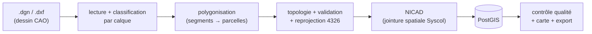

# 📚 Documentation — GeoAINO / module Cadastre (VeriCAD)

Page d'accueil de la documentation. Le projet transforme des **dessins CAO**
(DGN/DXF) de lotissements en **parcelles cadastrales** typées, contrôlées
topologiquement et identifiées par un **NICAD**, stockées en **PostGIS**.

> Un fichier CAO est un *dessin* ; une base SIG est une *base de données*.
> Tout le pipeline consiste à passer de l'un à l'autre.

---

## 🗂️ Documents disponibles

| Document | Pour qui | Contenu |
|---|---|---|
| **[Support de cours — Géomatique, topologie & SIG](./SUPPORT-COURS-GEOMATIQUE.md)** | ingénieur·e de données, nouvel arrivant | cours complet ancré sur le code : projections, formats, polygonisation, topologie, NICAD, PostGIS, basculement 2013→2026, **+ glossaire** et **diagrammes Mermaid** |
| **[Concepts de traitement — récupération & qualité des parcelles DXF](./CONCEPTS-TRAITEMENT-DXF.md)** | intervenant·e sur l'import DXF | retours de terrain sur les gros DXF cadastraux : diagnostic de fuite de parcelles, lecture des `3DFACE`, réparation `buffer(0)`, noding robuste (snap-rounding), dédoublonnage **coïncidence vs contenance** (enveloppes/îlots), nettoyage **MTEXT**, suppression manuelle |

*(Cette page sera enrichie au fil de l'ajout de nouveaux documents. **Tout concept
de traitement géométrique/géospatial/topologique vu doit être ajouté au document
« Concepts de traitement »** — cf. `CLAUDE.md`.)*

---

## 🚀 Par où commencer ? (parcours de lecture)

### Je suis ingénieur·e de données / back-end et je découvre le projet
1. [§2 — Vue d'ensemble : le pipeline comme un ETL géospatial](./SUPPORT-COURS-GEOMATIQUE.md#2-vue-densemble--le-pipeline-comme-un-etl-géospatial) *(diagramme Mermaid de bout en bout)*
2. [§4 — Référentiels & projections](./SUPPORT-COURS-GEOMATIQUE.md#4-référentiels--projections-crs--epsg) — la règle d'or « mesurer en mètres, stocker en degrés »
3. [§14 — Glossaire orienté data engineer](./SUPPORT-COURS-GEOMATIQUE.md#14-glossaire-orienté-ingénieur-de-données) — à garder ouvert en second écran

### Je dois intervenir sur l'import DXF (le gros morceau)
1. [§5 — Formats & ingestion](./SUPPORT-COURS-GEOMATIQUE.md#5-formats--ingestion-dgn-dxf-geojson-shapefile)
2. [§6 — Polygonisation & tuilage](./SUPPORT-COURS-GEOMATIQUE.md#6-polygonisation--de-segments-épars-à-des-parcelles)
3. [§8 — Indexation spatiale & performance](./SUPPORT-COURS-GEOMATIQUE.md#8-indexation-spatiale--performance)
4. [§15 — Variables d'environnement & repères de perf](./SUPPORT-COURS-GEOMATIQUE.md#15-annexe--fichiers-clés--variables-denvironnement)
5. **[Concepts de traitement DXF](./CONCEPTS-TRAITEMENT-DXF.md)** — diagnostic de fuite de parcelles, `3DFACE`, réparation, noding robuste, dédoublonnage/enveloppes, MTEXT (retours de terrain sur les gros DXF)

### Je travaille sur le NICAD / la base de données
1. [§9 — Le modèle cadastral & le NICAD](./SUPPORT-COURS-GEOMATIQUE.md#9-le-modèle-cadastral--le-nicad) *(provenance de chaque composant)*
2. [§10 — PostGIS + Prisma & diagrammes ER](./SUPPORT-COURS-GEOMATIQUE.md#10-base-de-données-spatiale-postgis--prisma)
3. [§12 — Basculement 2013 → 2026](./SUPPORT-COURS-GEOMATIQUE.md#12-basculement-administratif-2013--2026)

### Je m'occupe de la qualité des données
1. [§7 — Topologie : géométrie correcte vs cohérente](./SUPPORT-COURS-GEOMATIQUE.md#7-topologie--géométrie-correcte-vs-cohérente)
2. [§11 — Contrôle qualité & score de conformité](./SUPPORT-COURS-GEOMATIQUE.md#11-contrôle-qualité--score-de-conformité)
3. [§13 — Outils d'ingénierie de données pour les géomaticiens](./SUPPORT-COURS-GEOMATIQUE.md#13-applications-dingénierie-de-données-pour-simplifier-le-travail-des-géomaticiens)

---

## 🧭 Le pipeline en une image

*(Version détaillée et commentée : [§2 du support](./SUPPORT-COURS-GEOMATIQUE.md#2-vue-densemble--le-pipeline-comme-un-etl-géospatial).)*

---

## 🔑 Concepts à connaître en 30 secondes

- **CRS / EPSG** — le système de coordonnées d'une géométrie. Ici : **4326**
  (degrés, stockage/carte) et **32628** (mètres UTM 28N, mesures). *Confondre
  mètres et degrés = erreur n°1.*
- **Topologie** — la cohérence des relations entre objets (chevauchements,
  trous, slivers), distincte de la **géométrie** (forme d'un objet isolé).
- **Polygonisation** — reconstruire des surfaces fermées à partir de milliers de
  segments épars (le DXF ne contient quasi pas de polygones).
- **NICAD** — identifiant cadastral de 16 chiffres = `Syscol(8) + Section(3) +
  Parcelle(5)`. Le Syscol est résolu par **jointure spatiale** PostGIS.
- **Jointure spatiale** — un `JOIN` dont la condition est géométrique
  (`ST_Contains`), accéléré par un index spatial.

---

## 🛠️ Repères de code (où vit quoi)

| Sujet | Fichier |
|---|---|
| Lecture DXF native (blocs INSERT) | `src/lib/dxf-native.ts` |
| Classification par calque | `src/lib/cadastral-filter.ts` |
| Ingestion parcelles + topologie | `src/lib/parcelle-ingestion.ts` |
| Polygonisation (noding + tuilage) | `src/lib/polygonize.ts` |
| Contrôle qualité / score / rapport | `src/lib/geo-engine.ts` |
| Logique NICAD & basculement | `src/lib/nicad.ts`, `src/lib/cadastre/nicad-logic.ts` |
| Jointures spatiales PostGIS | `src/lib/cadastre/data.ts`, `src/lib/cadastre/assign-nicad-2026.ts` |
| Schéma de données | `prisma/schema.prisma` |

*(Cartographie complète et variables d'environnement : [§15 du support](./SUPPORT-COURS-GEOMATIQUE.md#15-annexe--fichiers-clés--variables-denvironnement).)*

---

## 💡 Conseils de lecture

- Les diagrammes **Mermaid** se rendent nativement sur GitHub et dans VS Code
  (extension *Markdown Preview Mermaid Support*).
- Chaque grande notion du support porte un encart **🛠️ Côté data engineer** qui
  traduit le jargon SIG en analogies de génie logiciel/données.
- En cas de divergence entre la doc et le code, **le code (`src/lib/**`) fait foi** ;
  pensez à mettre à jour le support en conséquence.
