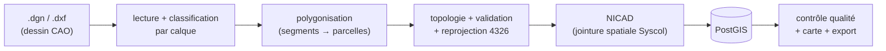

# 📚 Documentation — GeoAINO / module Cadastre (VeriCAD)

Page d'accueil de la documentation. Le projet transforme des **dessins CAO**
(DGN/DXF) de lotissements en **parcelles cadastrales** typées, contrôlées
topologiquement et identifiées par un **NICAD**, stockées en **PostGIS**.

> Un fichier CAO est un *dessin* ; une base SIG est une *base de données*.
> Tout le pipeline consiste à passer de l'un à l'autre.

---

## 🗂️ Documents disponibles

| Document | Pour qui | Contenu |
|---|---|---|
| **[Support de cours — Géomatique, topologie & SIG](./SUPPORT-COURS-GEOMATIQUE.md)** | ingénieur·e de données, nouvel arrivant | cours complet ancré sur le code : projections, formats, polygonisation, topologie, NICAD, PostGIS, basculement 2013→2026, **+ glossaire** et **diagrammes Mermaid** |
<<<<<<< HEAD
<<<<<<< HEAD
<<<<<<< HEAD
<<<<<<< HEAD
<<<<<<< HEAD
<<<<<<< HEAD
<<<<<<< HEAD
<<<<<<< HEAD
<<<<<<< HEAD
<<<<<<< HEAD
<<<<<<< HEAD
<<<<<<< HEAD
<<<<<<< HEAD
<<<<<<< HEAD
| **[Concepts de traitement — récupération & qualité des parcelles DXF](./CONCEPTS-TRAITEMENT-DXF.md)** | intervenant·e sur l'import DXF | retours de terrain sur les gros DXF cadastraux : diagnostic de fuite de parcelles, lecture des `3DFACE`, réparation `buffer(0)`, noding robuste (snap-rounding), dédoublonnage **coïncidence vs contenance** (enveloppes/îlots), nettoyage **MTEXT**, suppression manuelle, **table `limite_section`** (extraction sections + contrôle des chevauchements), **historique & restauration** des actions destructrices (upsert vs `DO NOTHING`, transaction par item pour un lot), **mappage des champs shapefile & import asynchrone avec progression** (mapping cible↔source inversé du DXF, réutilisation du job DXF), **import shapefile asynchrone depuis la page d'accueil** (bascule `.shp` vers le même job `ImportJob` que le DXF, sans mappage de champs — cible `Analysis`), **NICAD du shapefile page d'accueil par jointure section** (comble les NICAD manquants/invalides via une jointure spatiale sur `limite_section`, sans jamais écraser un NICAD valide ni incrémenter de numéro de parcelle), **mappage NICAD/numéro de parcelle sur le shapefile page d'accueil** (`FieldMappingModal` réutilisée pour la cible `parcelles-home`, remplace le devinage par alias fragile de `assignSectionNicad`), **cohérence de section déclarée vs géolocalisée** (mappage étendu à 9 champs, comparaison `codeSection`/`sectionGeolocalisee` par `codeSectionsMatch`, nouvelle erreur d'analyse `section_mismatch` — NICAD non construit tant que l'incohérence n'est pas résolue), **chevauchements croisés entre lots** (`refreshOverlaps` compare désormais le lot chargé à TOUS les lots déjà stockés, pas seulement à lui-même — `sourceFichierB`, `LEAST`/`GREATEST`+`DISTINCT ON` pour éviter les doublons), **suppression groupée entre deux lots** (action `delete_lot` ciblée par nom de lot explicite, pas par A/B arbitraire — `applyOverlapCorrection`, autorisée en batch contrairement à `delete_a`/`delete_b`) |
=======
| **[Concepts de traitement — récupération & qualité des parcelles DXF](./CONCEPTS-TRAITEMENT-DXF.md)** | intervenant·e sur l'import DXF | retours de terrain sur les gros DXF cadastraux : diagnostic de fuite de parcelles, lecture des `3DFACE`, réparation `buffer(0)`, noding robuste (snap-rounding), dédoublonnage **coïncidence vs contenance** (enveloppes/îlots), nettoyage **MTEXT**, suppression manuelle, **table `limite_section`** (extraction sections + contrôle des chevauchements), **historique & restauration** des actions destructrices (upsert vs `DO NOTHING`, transaction par item pour un lot), **mappage des champs shapefile & import asynchrone avec progression** (mapping cible↔source inversé du DXF, réutilisation du job DXF), **import shapefile asynchrone depuis la page d'accueil** (bascule `.shp` vers le même job `ImportJob` que le DXF, sans mappage de champs — cible `Analysis`), **NICAD du shapefile page d'accueil par jointure section** (comble les NICAD manquants/invalides via une jointure spatiale sur `limite_section`, sans jamais écraser un NICAD valide ni incrémenter de numéro de parcelle), **mappage NICAD/numéro de parcelle sur le shapefile page d'accueil** (`FieldMappingModal` réutilisée pour la cible `parcelles-home`, remplace le devinage par alias fragile de `assignSectionNicad`), **cohérence de section déclarée vs géolocalisée** (mappage étendu à 9 champs, comparaison `codeSection`/`sectionGeolocalisee` par `codeSectionsMatch`, nouvelle erreur d'analyse `section_mismatch` — NICAD non construit tant que l'incohérence n'est pas résolue), **chevauchements croisés entre lots** (`refreshOverlaps` compare désormais le lot chargé à TOUS les lots déjà stockés, pas seulement à lui-même — `sourceFichierB`, `LEAST`/`GREATEST`+`DISTINCT ON` pour éviter les doublons), **NICAD du pipeline DXF : section exclusivement depuis `limite_section`** (`assign-nicad-2026.ts` résout Syscol + section via la table QA de /cadastre/sections, la couche DXF `limites_sections`/`numero_section` n'étant plus jamais utilisée pour numéroter une parcelle — repli `cad_communes_2026` pour le Syscol seul, jamais de section « 000 » silencieuse) |
>>>>>>> worktree-shapefile-parcelles-section-coherence
=======
| **[Concepts de traitement — récupération & qualité des parcelles DXF](./CONCEPTS-TRAITEMENT-DXF.md)** | intervenant·e sur l'import DXF | retours de terrain sur les gros DXF cadastraux : diagnostic de fuite de parcelles, lecture des `3DFACE`, réparation `buffer(0)`, noding robuste (snap-rounding), dédoublonnage **coïncidence vs contenance** (enveloppes/îlots), nettoyage **MTEXT**, suppression manuelle, **table `limite_section`** (extraction sections + contrôle des chevauchements), **historique & restauration** des actions destructrices (upsert vs `DO NOTHING`, transaction par item pour un lot), **mappage des champs shapefile & import asynchrone avec progression** (mapping cible↔source inversé du DXF, réutilisation du job DXF), **import shapefile asynchrone depuis la page d'accueil** (bascule `.shp` vers le même job `ImportJob` que le DXF, sans mappage de champs — cible `Analysis`), **NICAD du shapefile page d'accueil par jointure section** (comble les NICAD manquants/invalides via une jointure spatiale sur `limite_section`, sans jamais écraser un NICAD valide ni incrémenter de numéro de parcelle), **mappage NICAD/numéro de parcelle sur le shapefile page d'accueil** (`FieldMappingModal` réutilisée pour la cible `parcelles-home`, remplace le devinage par alias fragile de `assignSectionNicad`), **cohérence de section déclarée vs géolocalisée** (mappage étendu à 9 champs, comparaison `codeSection`/`sectionGeolocalisee` par `codeSectionsMatch`, nouvelle erreur d'analyse `section_mismatch` — NICAD non construit tant que l'incohérence n'est pas résolue), **chevauchements croisés entre lots** (`refreshOverlaps` compare désormais le lot chargé à TOUS les lots déjà stockés, pas seulement à lui-même — `sourceFichierB`, `LEAST`/`GREATEST`+`DISTINCT ON` pour éviter les doublons), **NICAD du pipeline DXF : section exclusivement depuis `limite_section`** (`assign-nicad-2026.ts` résout Syscol + section via la table QA de /cadastre/sections, la couche DXF `limites_sections`/`numero_section` n'étant plus jamais utilisée pour numéroter une parcelle — repli `cad_communes_2026` pour le Syscol seul, jamais de section « 000 » silencieuse), **reclassification carte après correction d'erreur** (`nonConformeNicads`/`errors` de `MapAnalysisClient.tsx` excluent désormais les erreurs `corrected`, une parcelle repasse au vert dès sa dernière erreur active corrigée) |
>>>>>>> worktree-shapefile-parcelles-section-coherence
=======
| **[Concepts de traitement — récupération & qualité des parcelles DXF](./CONCEPTS-TRAITEMENT-DXF.md)** | intervenant·e sur l'import DXF | retours de terrain sur les gros DXF cadastraux : diagnostic de fuite de parcelles, lecture des `3DFACE`, réparation `buffer(0)`, noding robuste (snap-rounding), dédoublonnage **coïncidence vs contenance** (enveloppes/îlots), nettoyage **MTEXT**, suppression manuelle, **table `limite_section`** (extraction sections + contrôle des chevauchements), **historique & restauration** des actions destructrices (upsert vs `DO NOTHING`, transaction par item pour un lot), **mappage des champs shapefile & import asynchrone avec progression** (mapping cible↔source inversé du DXF, réutilisation du job DXF), **import shapefile asynchrone depuis la page d'accueil** (bascule `.shp` vers le même job `ImportJob` que le DXF, sans mappage de champs — cible `Analysis`), **NICAD du shapefile page d'accueil par jointure section** (comble les NICAD manquants/invalides via une jointure spatiale sur `limite_section`, sans jamais écraser un NICAD valide ni incrémenter de numéro de parcelle), **mappage NICAD/numéro de parcelle sur le shapefile page d'accueil** (`FieldMappingModal` réutilisée pour la cible `parcelles-home`, remplace le devinage par alias fragile de `assignSectionNicad`), **cohérence de section déclarée vs géolocalisée** (mappage étendu à 9 champs, comparaison `codeSection`/`sectionGeolocalisee` par `codeSectionsMatch`, nouvelle erreur d'analyse `section_mismatch` — NICAD non construit tant que l'incohérence n'est pas résolue), **chevauchements croisés entre lots** (`refreshOverlaps` compare désormais le lot chargé à TOUS les lots déjà stockés, pas seulement à lui-même — `sourceFichierB`, `LEAST`/`GREATEST`+`DISTINCT ON` pour éviter les doublons), **NICAD du pipeline DXF : section exclusivement depuis `limite_section`** (`assign-nicad-2026.ts` résout Syscol + section via la table QA de /cadastre/sections, la couche DXF `limites_sections`/`numero_section` n'étant plus jamais utilisée pour numéroter une parcelle — repli `cad_communes_2026` pour le Syscol seul, jamais de section « 000 » silencieuse), **reclassification carte après correction d'erreur** (`nonConformeNicads`/`errors` de `MapAnalysisClient.tsx` excluent désormais les erreurs `corrected`, une parcelle repasse au vert dès sa dernière erreur active corrigée ; `correct/route.ts` patche aussi `errorCount`/`conformityScore` en base à chaque correction, formule reprise de `nicad-fill-missing.ts`), **récupération du numéro de parcelle en cas de débordement du texte hors parcelle** (repli tolérance planaire ≤ 3 m — `DXF_NUMERO_LABEL_TOLERANCE_M` — sur les jointures numéro, distance calculée à la main plutôt qu'avec turf qui suppose des degrés géodésiques) |
>>>>>>> worktree-shapefile-parcelles-section-coherence
=======
| **[Concepts de traitement — récupération & qualité des parcelles DXF](./CONCEPTS-TRAITEMENT-DXF.md)** | intervenant·e sur l'import DXF | retours de terrain sur les gros DXF cadastraux : diagnostic de fuite de parcelles, lecture des `3DFACE`, réparation `buffer(0)`, noding robuste (snap-rounding), dédoublonnage **coïncidence vs contenance** (enveloppes/îlots), nettoyage **MTEXT**, suppression manuelle, **table `limite_section`** (extraction sections + contrôle des chevauchements), **historique & restauration** des actions destructrices (upsert vs `DO NOTHING`, transaction par item pour un lot), **mappage des champs shapefile & import asynchrone avec progression** (mapping cible↔source inversé du DXF, réutilisation du job DXF), **import shapefile asynchrone depuis la page d'accueil** (bascule `.shp` vers le même job `ImportJob` que le DXF, sans mappage de champs — cible `Analysis`), **NICAD du shapefile page d'accueil par jointure section** (comble les NICAD manquants/invalides via une jointure spatiale sur `limite_section`, sans jamais écraser un NICAD valide ni incrémenter de numéro de parcelle), **mappage NICAD/numéro de parcelle sur le shapefile page d'accueil** (`FieldMappingModal` réutilisée pour la cible `parcelles-home`, remplace le devinage par alias fragile de `assignSectionNicad`), **cohérence de section déclarée vs géolocalisée** (mappage étendu à 9 champs, comparaison `codeSection`/`sectionGeolocalisee` par `codeSectionsMatch`, nouvelle erreur d'analyse `section_mismatch` — NICAD non construit tant que l'incohérence n'est pas résolue), **chevauchements croisés entre lots** (`refreshOverlaps` compare désormais le lot chargé à TOUS les lots déjà stockés, pas seulement à lui-même — `sourceFichierB`, `LEAST`/`GREATEST`+`DISTINCT ON` pour éviter les doublons), **NICAD du pipeline DXF : section exclusivement depuis `limite_section`** (`assign-nicad-2026.ts` résout Syscol + section via la table QA de /cadastre/sections, la couche DXF `limites_sections`/`numero_section` n'étant plus jamais utilisée pour numéroter une parcelle — repli `cad_communes_2026` pour le Syscol seul, jamais de section « 000 » silencieuse), **reclassification carte après correction d'erreur** (`nonConformeNicads`/`errors` de `MapAnalysisClient.tsx` excluent désormais les erreurs `corrected`, une parcelle repasse au vert dès sa dernière erreur active corrigée ; `correct/route.ts` patche aussi `errorCount`/`conformityScore` en base à chaque correction, formule reprise de `nicad-fill-missing.ts`), **récupération du numéro de parcelle en cas de débordement du texte hors parcelle** (repli tolérance planaire ≤ 3 m — `DXF_NUMERO_LABEL_TOLERANCE_M` — sur les jointures numéro, distance calculée à la main plutôt qu'avec turf qui suppose des degrés géodésiques), **détection d'encodage DXF** (`$ACADVER`/`$DWGCODEPAGE` du header plutôt qu'UTF-8 figé — un DXF pré-R2007 en ANSI_125x décodé en UTF-8 mutile ses calques accentués, ex. « Numéro Parcelle » → 0 numéro extrait sur tout le fichier) |
>>>>>>> worktree-shapefile-parcelles-section-coherence
=======
| **[Concepts de traitement — récupération & qualité des parcelles DXF](./CONCEPTS-TRAITEMENT-DXF.md)** | intervenant·e sur l'import DXF | retours de terrain sur les gros DXF cadastraux : diagnostic de fuite de parcelles, lecture des `3DFACE`, réparation `buffer(0)`, noding robuste (snap-rounding), dédoublonnage **coïncidence vs contenance** (enveloppes/îlots), nettoyage **MTEXT**, suppression manuelle, **table `limite_section`** (extraction sections + contrôle des chevauchements), **historique & restauration** des actions destructrices (upsert vs `DO NOTHING`, transaction par item pour un lot), **mappage des champs shapefile & import asynchrone avec progression** (mapping cible↔source inversé du DXF, réutilisation du job DXF), **import shapefile asynchrone depuis la page d'accueil** (bascule `.shp` vers le même job `ImportJob` que le DXF, sans mappage de champs — cible `Analysis`), **NICAD du shapefile page d'accueil par jointure section** (comble les NICAD manquants/invalides via une jointure spatiale sur `limite_section`, sans jamais écraser un NICAD valide ni incrémenter de numéro de parcelle), **mappage NICAD/numéro de parcelle sur le shapefile page d'accueil** (`FieldMappingModal` réutilisée pour la cible `parcelles-home`, remplace le devinage par alias fragile de `assignSectionNicad`), **cohérence de section déclarée vs géolocalisée** (mappage étendu à 9 champs, comparaison `codeSection`/`sectionGeolocalisee` par `codeSectionsMatch`, nouvelle erreur d'analyse `section_mismatch` — NICAD non construit tant que l'incohérence n'est pas résolue), **chevauchements croisés entre lots** (`refreshOverlaps` compare désormais le lot chargé à TOUS les lots déjà stockés, pas seulement à lui-même — `sourceFichierB`, `LEAST`/`GREATEST`+`DISTINCT ON` pour éviter les doublons), **NICAD du pipeline DXF : section exclusivement depuis `limite_section`** (`assign-nicad-2026.ts` résout Syscol + section via la table QA de /cadastre/sections, la couche DXF `limites_sections`/`numero_section` n'étant plus jamais utilisée pour numéroter une parcelle — repli `cad_communes_2026` pour le Syscol seul, jamais de section « 000 » silencieuse), **reclassification carte après correction d'erreur** (`nonConformeNicads`/`errors` de `MapAnalysisClient.tsx` excluent désormais les erreurs `corrected`, une parcelle repasse au vert dès sa dernière erreur active corrigée ; `correct/route.ts` patche aussi `errorCount`/`conformityScore` en base à chaque correction, formule reprise de `nicad-fill-missing.ts`), **récupération du numéro de parcelle en cas de débordement du texte hors parcelle** (repli tolérance planaire ≤ 3 m — `DXF_NUMERO_LABEL_TOLERANCE_M` — sur les jointures numéro, distance calculée à la main plutôt qu'avec turf qui suppose des degrés géodésiques), **détection d'encodage DXF** (`$ACADVER`/`$DWGCODEPAGE` du header plutôt qu'UTF-8 figé — un DXF pré-R2007 en ANSI_125x décodé en UTF-8 mutile ses calques accentués, ex. « Numéro Parcelle » → 0 numéro extrait sur tout le fichier), **erreur `MULTI_NUMERO` : limite de parcelle avec plusieurs numéros** (nouvelle valeur d'enum `ErrorType` + action `choose_numero`, l'utilisateur choisit lequel des numéros trouvés sur une même limite conserver — migration Prisma à appliquer) |
>>>>>>> worktree-shapefile-parcelles-section-coherence
=======
| **[Concepts de traitement — récupération & qualité des parcelles DXF](./CONCEPTS-TRAITEMENT-DXF.md)** | intervenant·e sur l'import DXF | retours de terrain sur les gros DXF cadastraux : diagnostic de fuite de parcelles, lecture des `3DFACE`, réparation `buffer(0)`, noding robuste (snap-rounding), dédoublonnage **coïncidence vs contenance** (enveloppes/îlots), nettoyage **MTEXT**, suppression manuelle, **table `limite_section`** (extraction sections + contrôle des chevauchements), **historique & restauration** des actions destructrices (upsert vs `DO NOTHING`, transaction par item pour un lot), **mappage des champs shapefile & import asynchrone avec progression** (mapping cible↔source inversé du DXF, réutilisation du job DXF), **import shapefile asynchrone depuis la page d'accueil** (bascule `.shp` vers le même job `ImportJob` que le DXF, sans mappage de champs — cible `Analysis`), **NICAD du shapefile page d'accueil par jointure section** (comble les NICAD manquants/invalides via une jointure spatiale sur `limite_section`, sans jamais écraser un NICAD valide ni incrémenter de numéro de parcelle), **mappage NICAD/numéro de parcelle sur le shapefile page d'accueil** (`FieldMappingModal` réutilisée pour la cible `parcelles-home`, remplace le devinage par alias fragile de `assignSectionNicad`), **cohérence de section déclarée vs géolocalisée** (mappage étendu à 9 champs, comparaison `codeSection`/`sectionGeolocalisee` par `codeSectionsMatch`, nouvelle erreur d'analyse `section_mismatch` — NICAD non construit tant que l'incohérence n'est pas résolue), **chevauchements croisés entre lots** (`refreshOverlaps` compare désormais le lot chargé à TOUS les lots déjà stockés, pas seulement à lui-même — `sourceFichierB`, `LEAST`/`GREATEST`+`DISTINCT ON` pour éviter les doublons), **NICAD du pipeline DXF : section exclusivement depuis `limite_section`** (`assign-nicad-2026.ts` résout Syscol + section via la table QA de /cadastre/sections, la couche DXF `limites_sections`/`numero_section` n'étant plus jamais utilisée pour numéroter une parcelle — repli `cad_communes_2026` pour le Syscol seul, jamais de section « 000 » silencieuse), **reclassification carte après correction d'erreur** (`nonConformeNicads`/`errors` de `MapAnalysisClient.tsx` excluent désormais les erreurs `corrected`, une parcelle repasse au vert dès sa dernière erreur active corrigée ; `correct/route.ts` patche aussi `errorCount`/`conformityScore` en base à chaque correction, formule reprise de `nicad-fill-missing.ts`), **récupération du numéro de parcelle en cas de débordement du texte hors parcelle** (repli tolérance planaire ≤ 3 m — `DXF_NUMERO_LABEL_TOLERANCE_M` — sur les jointures numéro, distance calculée à la main plutôt qu'avec turf qui suppose des degrés géodésiques), **détection d'encodage DXF** (`$ACADVER`/`$DWGCODEPAGE` du header plutôt qu'UTF-8 figé — un DXF pré-R2007 en ANSI_125x décodé en UTF-8 mutile ses calques accentués, ex. « Numéro Parcelle » → 0 numéro extrait sur tout le fichier), **erreur `MULTI_NUMERO` : limite de parcelle avec plusieurs numéros** (nouvelle valeur d'enum `ErrorType` + action `choose_numero`, l'utilisateur choisit lequel des numéros trouvés sur une même limite conserver — migration Prisma à appliquer), **rattachement d'un numéro de parcelle par emprise de texte** (hauteur DXF capturée + largeur estimée, la parcelle recouverte par le PLUS de texte gagne — pas seulement le point d'insertion — remplace le simple repli tolérance du § 23) |
>>>>>>> worktree-shapefile-parcelles-section-coherence
=======
| **[Concepts de traitement — récupération & qualité des parcelles DXF](./CONCEPTS-TRAITEMENT-DXF.md)** | intervenant·e sur l'import DXF | retours de terrain sur les gros DXF cadastraux : diagnostic de fuite de parcelles, lecture des `3DFACE`, réparation `buffer(0)`, noding robuste (snap-rounding), dédoublonnage **coïncidence vs contenance** (enveloppes/îlots), nettoyage **MTEXT**, suppression manuelle, **table `limite_section`** (extraction sections + contrôle des chevauchements), **historique & restauration** des actions destructrices (upsert vs `DO NOTHING`, transaction par item pour un lot), **mappage des champs shapefile & import asynchrone avec progression** (mapping cible↔source inversé du DXF, réutilisation du job DXF), **import shapefile asynchrone depuis la page d'accueil** (bascule `.shp` vers le même job `ImportJob` que le DXF, sans mappage de champs — cible `Analysis`), **NICAD du shapefile page d'accueil par jointure section** (comble les NICAD manquants/invalides via une jointure spatiale sur `limite_section`, sans jamais écraser un NICAD valide ni incrémenter de numéro de parcelle), **mappage NICAD/numéro de parcelle sur le shapefile page d'accueil** (`FieldMappingModal` réutilisée pour la cible `parcelles-home`, remplace le devinage par alias fragile de `assignSectionNicad`), **cohérence de section déclarée vs géolocalisée** (mappage étendu à 9 champs, comparaison `codeSection`/`sectionGeolocalisee` par `codeSectionsMatch`, nouvelle erreur d'analyse `section_mismatch` — NICAD non construit tant que l'incohérence n'est pas résolue), **chevauchements croisés entre lots** (`refreshOverlaps` compare désormais le lot chargé à TOUS les lots déjà stockés, pas seulement à lui-même — `sourceFichierB`, `LEAST`/`GREATEST`+`DISTINCT ON` pour éviter les doublons), **NICAD du pipeline DXF : section exclusivement depuis `limite_section`** (`assign-nicad-2026.ts` résout Syscol + section via la table QA de /cadastre/sections, la couche DXF `limites_sections`/`numero_section` n'étant plus jamais utilisée pour numéroter une parcelle — repli `cad_communes_2026` pour le Syscol seul, jamais de section « 000 » silencieuse), **reclassification carte après correction d'erreur** (`nonConformeNicads`/`errors` de `MapAnalysisClient.tsx` excluent désormais les erreurs `corrected`, une parcelle repasse au vert dès sa dernière erreur active corrigée ; `correct/route.ts` patche aussi `errorCount`/`conformityScore` en base à chaque correction, formule reprise de `nicad-fill-missing.ts`), **récupération du numéro de parcelle en cas de débordement du texte hors parcelle** (repli tolérance planaire ≤ 3 m — `DXF_NUMERO_LABEL_TOLERANCE_M` — sur les jointures numéro, distance calculée à la main plutôt qu'avec turf qui suppose des degrés géodésiques), **détection d'encodage DXF** (`$ACADVER`/`$DWGCODEPAGE` du header plutôt qu'UTF-8 figé — un DXF pré-R2007 en ANSI_125x décodé en UTF-8 mutile ses calques accentués, ex. « Numéro Parcelle » → 0 numéro extrait sur tout le fichier), **erreur `MULTI_NUMERO` : limite de parcelle avec plusieurs numéros** (nouvelle valeur d'enum `ErrorType` + action `choose_numero`, l'utilisateur choisit lequel des numéros trouvés sur une même limite conserver — migration Prisma à appliquer), **rattachement d'un numéro de parcelle par emprise de texte** (hauteur DXF capturée + largeur estimée, la parcelle contenant le PLUS de caractères du texte gagne — pas seulement le point d'insertion — remplace le simple repli tolérance du § 23) |
>>>>>>> worktree-shapefile-parcelles-section-coherence
=======
| **[Concepts de traitement — récupération & qualité des parcelles DXF](./CONCEPTS-TRAITEMENT-DXF.md)** | intervenant·e sur l'import DXF | retours de terrain sur les gros DXF cadastraux : diagnostic de fuite de parcelles, lecture des `3DFACE`, réparation `buffer(0)`, noding robuste (snap-rounding), dédoublonnage **coïncidence vs contenance** (enveloppes/îlots), nettoyage **MTEXT**, suppression manuelle, **table `limite_section`** (extraction sections + contrôle des chevauchements), **historique & restauration** des actions destructrices (upsert vs `DO NOTHING`, transaction par item pour un lot), **mappage des champs shapefile & import asynchrone avec progression** (mapping cible↔source inversé du DXF, réutilisation du job DXF), **import shapefile asynchrone depuis la page d'accueil** (bascule `.shp` vers le même job `ImportJob` que le DXF, sans mappage de champs — cible `Analysis`), **NICAD du shapefile page d'accueil par jointure section** (comble les NICAD manquants/invalides via une jointure spatiale sur `limite_section`, sans jamais écraser un NICAD valide ni incrémenter de numéro de parcelle), **mappage NICAD/numéro de parcelle sur le shapefile page d'accueil** (`FieldMappingModal` réutilisée pour la cible `parcelles-home`, remplace le devinage par alias fragile de `assignSectionNicad`), **cohérence de section déclarée vs géolocalisée** (mappage étendu à 9 champs, comparaison `codeSection`/`sectionGeolocalisee` par `codeSectionsMatch`, nouvelle erreur d'analyse `section_mismatch` — NICAD non construit tant que l'incohérence n'est pas résolue), **chevauchements croisés entre lots** (`refreshOverlaps` compare désormais le lot chargé à TOUS les lots déjà stockés, pas seulement à lui-même — `sourceFichierB`, `LEAST`/`GREATEST`+`DISTINCT ON` pour éviter les doublons), **NICAD du pipeline DXF : section exclusivement depuis `limite_section`** (`assign-nicad-2026.ts` résout Syscol + section via la table QA de /cadastre/sections, la couche DXF `limites_sections`/`numero_section` n'étant plus jamais utilisée pour numéroter une parcelle — repli `cad_communes_2026` pour le Syscol seul, jamais de section « 000 » silencieuse), **reclassification carte après correction d'erreur** (`nonConformeNicads`/`errors` de `MapAnalysisClient.tsx` excluent désormais les erreurs `corrected`, une parcelle repasse au vert dès sa dernière erreur active corrigée ; `correct/route.ts` patche aussi `errorCount`/`conformityScore` en base à chaque correction, formule reprise de `nicad-fill-missing.ts`), **récupération du numéro de parcelle en cas de débordement du texte hors parcelle** (repli tolérance planaire ≤ 3 m — `DXF_NUMERO_LABEL_TOLERANCE_M` — sur les jointures numéro, distance calculée à la main plutôt qu'avec turf qui suppose des degrés géodésiques), **détection d'encodage DXF** (`$ACADVER`/`$DWGCODEPAGE` du header plutôt qu'UTF-8 figé — un DXF pré-R2007 en ANSI_125x décodé en UTF-8 mutile ses calques accentués, ex. « Numéro Parcelle » → 0 numéro extrait sur tout le fichier), **erreur `MULTI_NUMERO` : limite de parcelle avec plusieurs numéros** (nouvelle valeur d'enum `ErrorType` + action `choose_numero`, l'utilisateur choisit lequel des numéros trouvés sur une même limite conserver — migration Prisma à appliquer), **rattachement d'un numéro de parcelle par emprise de texte** (hauteur DXF capturée + largeur estimée, la parcelle contenant le PLUS de caractères du texte gagne — pas seulement le point d'insertion — remplace le simple repli tolérance du § 23 ; justification DXF, code 72, prise en compte pour ne plus sur-compter la voisine sur un texte Left-justifié dont seul le premier caractère déborde) |
>>>>>>> worktree-shapefile-parcelles-section-coherence
=======
| **[Concepts de traitement — récupération & qualité des parcelles DXF](./CONCEPTS-TRAITEMENT-DXF.md)** | intervenant·e sur l'import DXF | retours de terrain sur les gros DXF cadastraux : diagnostic de fuite de parcelles, lecture des `3DFACE`, réparation `buffer(0)`, noding robuste (snap-rounding), dédoublonnage **coïncidence vs contenance** (enveloppes/îlots), nettoyage **MTEXT**, suppression manuelle, **table `limite_section`** (extraction sections + contrôle des chevauchements), **historique & restauration** des actions destructrices (upsert vs `DO NOTHING`, transaction par item pour un lot), **mappage des champs shapefile & import asynchrone avec progression** (mapping cible↔source inversé du DXF, réutilisation du job DXF), **import shapefile asynchrone depuis la page d'accueil** (bascule `.shp` vers le même job `ImportJob` que le DXF, sans mappage de champs — cible `Analysis`), **NICAD du shapefile page d'accueil par jointure section** (comble les NICAD manquants/invalides via une jointure spatiale sur `limite_section`, sans jamais écraser un NICAD valide ni incrémenter de numéro de parcelle), **mappage NICAD/numéro de parcelle sur le shapefile page d'accueil** (`FieldMappingModal` réutilisée pour la cible `parcelles-home`, remplace le devinage par alias fragile de `assignSectionNicad`), **cohérence de section déclarée vs géolocalisée** (mappage étendu à 9 champs, comparaison `codeSection`/`sectionGeolocalisee` par `codeSectionsMatch`, nouvelle erreur d'analyse `section_mismatch` — NICAD non construit tant que l'incohérence n'est pas résolue), **chevauchements croisés entre lots** (`refreshOverlaps` compare désormais le lot chargé à TOUS les lots déjà stockés, pas seulement à lui-même — `sourceFichierB`, `LEAST`/`GREATEST`+`DISTINCT ON` pour éviter les doublons), **NICAD du pipeline DXF : section exclusivement depuis `limite_section`** (`assign-nicad-2026.ts` résout Syscol + section via la table QA de /cadastre/sections, la couche DXF `limites_sections`/`numero_section` n'étant plus jamais utilisée pour numéroter une parcelle — repli `cad_communes_2026` pour le Syscol seul, jamais de section « 000 » silencieuse), **reclassification carte après correction d'erreur** (`nonConformeNicads`/`errors` de `MapAnalysisClient.tsx` excluent désormais les erreurs `corrected`, une parcelle repasse au vert dès sa dernière erreur active corrigée ; `correct/route.ts` patche aussi `errorCount`/`conformityScore` en base à chaque correction, formule reprise de `nicad-fill-missing.ts`), **récupération du numéro de parcelle en cas de débordement du texte hors parcelle** (repli tolérance planaire ≤ 3 m — `DXF_NUMERO_LABEL_TOLERANCE_M` — sur les jointures numéro, distance calculée à la main plutôt qu'avec turf qui suppose des degrés géodésiques), **détection d'encodage DXF** (`$ACADVER`/`$DWGCODEPAGE` du header plutôt qu'UTF-8 figé — un DXF pré-R2007 en ANSI_125x décodé en UTF-8 mutile ses calques accentués, ex. « Numéro Parcelle » → 0 numéro extrait sur tout le fichier), **erreur `MULTI_NUMERO` : limite de parcelle avec plusieurs numéros** (nouvelle valeur d'enum `ErrorType` + action `choose_numero`, l'utilisateur choisit lequel des numéros trouvés sur une même limite conserver — migration Prisma à appliquer), **rattachement d'un numéro de parcelle par emprise de texte** (hauteur DXF capturée + largeur estimée, la parcelle contenant le PLUS de caractères du texte gagne — pas seulement le point d'insertion — remplace le simple repli tolérance du § 23 ; justification DXF, codes 72/73, prise en compte pour ne plus sur-compter la voisine ; pour un texte Center/Middle-justifié — le cas dominant du DXF Pikine réel — le second point d'alignement, codes 11/21, fait foi comme centre au lieu du point 10/20, décalé de plusieurs mètres) |
>>>>>>> worktree-shapefile-parcelles-section-coherence
=======
| **[Concepts de traitement — récupération & qualité des parcelles DXF](./CONCEPTS-TRAITEMENT-DXF.md)** | intervenant·e sur l'import DXF | retours de terrain sur les gros DXF cadastraux : diagnostic de fuite de parcelles, lecture des `3DFACE`, réparation `buffer(0)`, noding robuste (snap-rounding), dédoublonnage **coïncidence vs contenance** (enveloppes/îlots), nettoyage **MTEXT**, suppression manuelle, **table `limite_section`** (extraction sections + contrôle des chevauchements), **historique & restauration** des actions destructrices (upsert vs `DO NOTHING`, transaction par item pour un lot), **mappage des champs shapefile & import asynchrone avec progression** (mapping cible↔source inversé du DXF, réutilisation du job DXF), **import shapefile asynchrone depuis la page d'accueil** (bascule `.shp` vers le même job `ImportJob` que le DXF, sans mappage de champs — cible `Analysis`), **NICAD du shapefile page d'accueil par jointure section** (comble les NICAD manquants/invalides via une jointure spatiale sur `limite_section`, sans jamais écraser un NICAD valide ni incrémenter de numéro de parcelle), **mappage NICAD/numéro de parcelle sur le shapefile page d'accueil** (`FieldMappingModal` réutilisée pour la cible `parcelles-home`, remplace le devinage par alias fragile de `assignSectionNicad`), **cohérence de section déclarée vs géolocalisée** (mappage étendu à 9 champs, comparaison `codeSection`/`sectionGeolocalisee` par `codeSectionsMatch`, nouvelle erreur d'analyse `section_mismatch` — NICAD non construit tant que l'incohérence n'est pas résolue), **chevauchements croisés entre lots** (`refreshOverlaps` compare désormais le lot chargé à TOUS les lots déjà stockés, pas seulement à lui-même — `sourceFichierB`, `LEAST`/`GREATEST`+`DISTINCT ON` pour éviter les doublons), **NICAD du pipeline DXF : section exclusivement depuis `limite_section`** (`assign-nicad-2026.ts` résout Syscol + section via la table QA de /cadastre/sections, la couche DXF `limites_sections`/`numero_section` n'étant plus jamais utilisée pour numéroter une parcelle — repli `cad_communes_2026` pour le Syscol seul, jamais de section « 000 » silencieuse), **reclassification carte après correction d'erreur** (`nonConformeNicads`/`errors` de `MapAnalysisClient.tsx` excluent désormais les erreurs `corrected`, une parcelle repasse au vert dès sa dernière erreur active corrigée ; `correct/route.ts` patche aussi `errorCount`/`conformityScore` en base à chaque correction, formule reprise de `nicad-fill-missing.ts`), **récupération du numéro de parcelle en cas de débordement du texte hors parcelle** (repli tolérance planaire ≤ 3 m — `DXF_NUMERO_LABEL_TOLERANCE_M` — sur les jointures numéro, distance calculée à la main plutôt qu'avec turf qui suppose des degrés géodésiques), **détection d'encodage DXF** (`$ACADVER`/`$DWGCODEPAGE` du header plutôt qu'UTF-8 figé — un DXF pré-R2007 en ANSI_125x décodé en UTF-8 mutile ses calques accentués, ex. « Numéro Parcelle » → 0 numéro extrait sur tout le fichier), **erreur `MULTI_NUMERO` : limite de parcelle avec plusieurs numéros** (nouvelle valeur d'enum `ErrorType` + action `choose_numero`, l'utilisateur choisit lequel des numéros trouvés sur une même limite conserver — migration Prisma à appliquer), **rattachement d'un numéro de parcelle par emprise de texte** (hauteur DXF capturée + largeur estimée, la parcelle contenant le PLUS de caractères du texte gagne — pas seulement le point d'insertion — remplace le simple repli tolérance du § 23 ; justification DXF, codes 72/73, prise en compte pour ne plus sur-compter la voisine ; pour un texte Center/Middle-justifié — le cas dominant du DXF Pikine réel — le second point d'alignement, codes 11/21, fait foi comme centre au lieu du point 10/20, décalé de plusieurs mètres), **zone entière sans aucun numéro récupéré (commune dense)** (`nbZonesPolygonisationEchouee` + avertissement bbox/segments — une tuile de polygonisation abandonnée après subdivision maximale n'était signalée qu'en `console.warn` serveur, jamais dans les `warnings` visibles de l'utilisateur ; à distinguer des défauts de rattachement numéro↔parcelle § 23/§ 26/§ 27 qui, eux, supposent que la parcelle existe) |
>>>>>>> worktree-shapefile-parcelles-section-coherence
=======
| **[Concepts de traitement — récupération & qualité des parcelles DXF](./CONCEPTS-TRAITEMENT-DXF.md)** | intervenant·e sur l'import DXF | retours de terrain sur les gros DXF cadastraux : diagnostic de fuite de parcelles, lecture des `3DFACE`, réparation `buffer(0)`, noding robuste (snap-rounding), dédoublonnage **coïncidence vs contenance** (enveloppes/îlots), nettoyage **MTEXT**, suppression manuelle, **table `limite_section`** (extraction sections + contrôle des chevauchements), **historique & restauration** des actions destructrices (upsert vs `DO NOTHING`, transaction par item pour un lot), **mappage des champs shapefile & import asynchrone avec progression** (mapping cible↔source inversé du DXF, réutilisation du job DXF), **import shapefile asynchrone depuis la page d'accueil** (bascule `.shp` vers le même job `ImportJob` que le DXF, sans mappage de champs — cible `Analysis`), **NICAD du shapefile page d'accueil par jointure section** (comble les NICAD manquants/invalides via une jointure spatiale sur `limite_section`, sans jamais écraser un NICAD valide ni incrémenter de numéro de parcelle), **mappage NICAD/numéro de parcelle sur le shapefile page d'accueil** (`FieldMappingModal` réutilisée pour la cible `parcelles-home`, remplace le devinage par alias fragile de `assignSectionNicad`), **cohérence de section déclarée vs géolocalisée** (mappage étendu à 9 champs, comparaison `codeSection`/`sectionGeolocalisee` par `codeSectionsMatch`, nouvelle erreur d'analyse `section_mismatch` — NICAD non construit tant que l'incohérence n'est pas résolue), **chevauchements croisés entre lots** (`refreshOverlaps` compare désormais le lot chargé à TOUS les lots déjà stockés, pas seulement à lui-même — `sourceFichierB`, `LEAST`/`GREATEST`+`DISTINCT ON` pour éviter les doublons), **NICAD du pipeline DXF : section exclusivement depuis `limite_section`** (`assign-nicad-2026.ts` résout Syscol + section via la table QA de /cadastre/sections, la couche DXF `limites_sections`/`numero_section` n'étant plus jamais utilisée pour numéroter une parcelle — repli `cad_communes_2026` pour le Syscol seul, jamais de section « 000 » silencieuse), **reclassification carte après correction d'erreur** (`nonConformeNicads`/`errors` de `MapAnalysisClient.tsx` excluent désormais les erreurs `corrected`, une parcelle repasse au vert dès sa dernière erreur active corrigée ; `correct/route.ts` patche aussi `errorCount`/`conformityScore` en base à chaque correction, formule reprise de `nicad-fill-missing.ts`), **récupération du numéro de parcelle en cas de débordement du texte hors parcelle** (repli tolérance planaire ≤ 3 m — `DXF_NUMERO_LABEL_TOLERANCE_M` — sur les jointures numéro, distance calculée à la main plutôt qu'avec turf qui suppose des degrés géodésiques), **détection d'encodage DXF** (`$ACADVER`/`$DWGCODEPAGE` du header plutôt qu'UTF-8 figé — un DXF pré-R2007 en ANSI_125x décodé en UTF-8 mutile ses calques accentués, ex. « Numéro Parcelle » → 0 numéro extrait sur tout le fichier), **erreur `MULTI_NUMERO` : limite de parcelle avec plusieurs numéros** (nouvelle valeur d'enum `ErrorType` + action `choose_numero`, l'utilisateur choisit lequel des numéros trouvés sur une même limite conserver — migration Prisma à appliquer), **rattachement d'un numéro de parcelle par emprise de texte** (hauteur DXF capturée + largeur estimée, la parcelle contenant le PLUS de caractères du texte gagne — pas seulement le point d'insertion — remplace le simple repli tolérance du § 23 ; justification DXF, codes 72/73, prise en compte pour ne plus sur-compter la voisine ; pour un texte Center/Middle-justifié — le cas dominant du DXF Pikine réel — le second point d'alignement, codes 11/21, fait foi comme centre au lieu du point 10/20, décalé de plusieurs mètres), **zone entière sans aucun numéro récupéré (commune dense)** (`nbZonesPolygonisationEchouee` + avertissement bbox/segments — une tuile de polygonisation abandonnée après subdivision maximale n'était signalée qu'en `console.warn` serveur, jamais dans les `warnings` visibles de l'utilisateur ; à distinguer des défauts de rattachement numéro↔parcelle § 23/§ 26/§ 27 qui, eux, supposent que la parcelle existe), **MTEXT téléporté près de (0,0)** (`dxf-native.ts` confondait, pour MTEXT, les codes de groupe 11/21 avec un second point d'alignement — en réalité un vecteur unitaire de direction du texte — et les codes 72/73 avec une justification — en réalité sens d'écriture/interlignage ; TEXT et MTEXT partagent les mêmes numéros de code DXF mais pas la même sémantique, MTEXT n'utilise plus ces champs et retombe sur son point d'insertion réel) |
>>>>>>> worktree-shapefile-parcelles-section-coherence
=======
| **[Concepts de traitement — récupération & qualité des parcelles DXF](./CONCEPTS-TRAITEMENT-DXF.md)** | intervenant·e sur l'import DXF | retours de terrain sur les gros DXF cadastraux : diagnostic de fuite de parcelles, lecture des `3DFACE`, réparation `buffer(0)`, noding robuste (snap-rounding), dédoublonnage **coïncidence vs contenance** (enveloppes/îlots), nettoyage **MTEXT**, suppression manuelle, **table `limite_section`** (extraction sections + contrôle des chevauchements), **historique & restauration** des actions destructrices (upsert vs `DO NOTHING`, transaction par item pour un lot), **mappage des champs shapefile & import asynchrone avec progression** (mapping cible↔source inversé du DXF, réutilisation du job DXF), **import shapefile asynchrone depuis la page d'accueil** (bascule `.shp` vers le même job `ImportJob` que le DXF, sans mappage de champs — cible `Analysis`), **NICAD du shapefile page d'accueil par jointure section** (comble les NICAD manquants/invalides via une jointure spatiale sur `limite_section`, sans jamais écraser un NICAD valide ni incrémenter de numéro de parcelle), **mappage NICAD/numéro de parcelle sur le shapefile page d'accueil** (`FieldMappingModal` réutilisée pour la cible `parcelles-home`, remplace le devinage par alias fragile de `assignSectionNicad`), **cohérence de section déclarée vs géolocalisée** (mappage étendu à 9 champs, comparaison `codeSection`/`sectionGeolocalisee` par `codeSectionsMatch`, nouvelle erreur d'analyse `section_mismatch` — NICAD non construit tant que l'incohérence n'est pas résolue), **chevauchements croisés entre lots** (`refreshOverlaps` compare désormais le lot chargé à TOUS les lots déjà stockés, pas seulement à lui-même — `sourceFichierB`, `LEAST`/`GREATEST`+`DISTINCT ON` pour éviter les doublons), **NICAD du pipeline DXF : section exclusivement depuis `limite_section`** (`assign-nicad-2026.ts` résout Syscol + section via la table QA de /cadastre/sections, la couche DXF `limites_sections`/`numero_section` n'étant plus jamais utilisée pour numéroter une parcelle — repli `cad_communes_2026` pour le Syscol seul, jamais de section « 000 » silencieuse), **reclassification carte après correction d'erreur** (`nonConformeNicads`/`errors` de `MapAnalysisClient.tsx` excluent désormais les erreurs `corrected`, une parcelle repasse au vert dès sa dernière erreur active corrigée ; `correct/route.ts` patche aussi `errorCount`/`conformityScore` en base à chaque correction, formule reprise de `nicad-fill-missing.ts`), **récupération du numéro de parcelle en cas de débordement du texte hors parcelle** (repli tolérance planaire ≤ 3 m — `DXF_NUMERO_LABEL_TOLERANCE_M` — sur les jointures numéro, distance calculée à la main plutôt qu'avec turf qui suppose des degrés géodésiques), **détection d'encodage DXF** (`$ACADVER`/`$DWGCODEPAGE` du header plutôt qu'UTF-8 figé — un DXF pré-R2007 en ANSI_125x décodé en UTF-8 mutile ses calques accentués, ex. « Numéro Parcelle » → 0 numéro extrait sur tout le fichier), **erreur `MULTI_NUMERO` : limite de parcelle avec plusieurs numéros** (nouvelle valeur d'enum `ErrorType` + action `choose_numero`, l'utilisateur choisit lequel des numéros trouvés sur une même limite conserver — migration Prisma à appliquer), **rattachement d'un numéro de parcelle par emprise de texte** (hauteur DXF capturée + largeur estimée, la parcelle contenant le PLUS de caractères du texte gagne — pas seulement le point d'insertion — remplace le simple repli tolérance du § 23 ; justification DXF, codes 72/73, prise en compte pour ne plus sur-compter la voisine ; pour un texte Center/Middle-justifié — le cas dominant du DXF Pikine réel — le second point d'alignement, codes 11/21, fait foi comme centre au lieu du point 10/20, décalé de plusieurs mètres), **zone entière sans aucun numéro récupéré (commune dense)** (`nbZonesPolygonisationEchouee` + avertissement bbox/segments — une tuile de polygonisation abandonnée après subdivision maximale n'était signalée qu'en `console.warn` serveur, jamais dans les `warnings` visibles de l'utilisateur ; à distinguer des défauts de rattachement numéro↔parcelle § 23/§ 26/§ 27 qui, eux, supposent que la parcelle existe), **MTEXT téléporté près de (0,0)** (`dxf-native.ts` confondait, pour MTEXT, les codes de groupe 11/21 avec un second point d'alignement — en réalité un vecteur unitaire de direction du texte — et les codes 72/73 avec une justification — en réalité sens d'écriture/interlignage ; TEXT et MTEXT partagent les mêmes numéros de code DXF mais pas la même sémantique, MTEXT n'utilise plus ces champs et retombe sur son point d'insertion réel), **clic carte sur une parcelle `MISSING_NICAD`** (le pont clic→erreur comparait des NICAD, or `MISSING_NICAD` n'en a par définition aucun — repli point-en-polygone client sur la géométrie de l'erreur, puis repli serveur `ST_Contains` (`/errors/at-point`) quand l'erreur dépasse le plafond d'embarquement de la page, fréquent sur les DXF 100k+ parcelles) |
>>>>>>> worktree-shapefile-parcelles-section-coherence
=======
| **[Concepts de traitement — récupération & qualité des parcelles DXF](./CONCEPTS-TRAITEMENT-DXF.md)** | intervenant·e sur l'import DXF | retours de terrain sur les gros DXF cadastraux : diagnostic de fuite de parcelles, lecture des `3DFACE`, réparation `buffer(0)`, noding robuste (snap-rounding), dédoublonnage **coïncidence vs contenance** (enveloppes/îlots), nettoyage **MTEXT**, suppression manuelle, **table `limite_section`** (extraction sections + contrôle des chevauchements), **historique & restauration** des actions destructrices (upsert vs `DO NOTHING`, transaction par item pour un lot), **mappage des champs shapefile & import asynchrone avec progression** (mapping cible↔source inversé du DXF, réutilisation du job DXF), **import shapefile asynchrone depuis la page d'accueil** (bascule `.shp` vers le même job `ImportJob` que le DXF, sans mappage de champs — cible `Analysis`), **NICAD du shapefile page d'accueil par jointure section** (comble les NICAD manquants/invalides via une jointure spatiale sur `limite_section`, sans jamais écraser un NICAD valide ni incrémenter de numéro de parcelle), **mappage NICAD/numéro de parcelle sur le shapefile page d'accueil** (`FieldMappingModal` réutilisée pour la cible `parcelles-home`, remplace le devinage par alias fragile de `assignSectionNicad`), **cohérence de section déclarée vs géolocalisée** (mappage étendu à 9 champs, comparaison `codeSection`/`sectionGeolocalisee` par `codeSectionsMatch`, nouvelle erreur d'analyse `section_mismatch` — NICAD non construit tant que l'incohérence n'est pas résolue), **chevauchements croisés entre lots** (`refreshOverlaps` compare désormais le lot chargé à TOUS les lots déjà stockés, pas seulement à lui-même — `sourceFichierB`, `LEAST`/`GREATEST`+`DISTINCT ON` pour éviter les doublons), **NICAD du pipeline DXF : section exclusivement depuis `limite_section`** (`assign-nicad-2026.ts` résout Syscol + section via la table QA de /cadastre/sections, la couche DXF `limites_sections`/`numero_section` n'étant plus jamais utilisée pour numéroter une parcelle — repli `cad_communes_2026` pour le Syscol seul, jamais de section « 000 » silencieuse), **reclassification carte après correction d'erreur** (`nonConformeNicads`/`errors` de `MapAnalysisClient.tsx` excluent désormais les erreurs `corrected`, une parcelle repasse au vert dès sa dernière erreur active corrigée ; `correct/route.ts` patche aussi `errorCount`/`conformityScore` en base à chaque correction, formule reprise de `nicad-fill-missing.ts`), **récupération du numéro de parcelle en cas de débordement du texte hors parcelle** (repli tolérance planaire ≤ 3 m — `DXF_NUMERO_LABEL_TOLERANCE_M` — sur les jointures numéro, distance calculée à la main plutôt qu'avec turf qui suppose des degrés géodésiques), **détection d'encodage DXF** (`$ACADVER`/`$DWGCODEPAGE` du header plutôt qu'UTF-8 figé — un DXF pré-R2007 en ANSI_125x décodé en UTF-8 mutile ses calques accentués, ex. « Numéro Parcelle » → 0 numéro extrait sur tout le fichier), **erreur `MULTI_NUMERO` : limite de parcelle avec plusieurs numéros** (nouvelle valeur d'enum `ErrorType` + action `choose_numero`, l'utilisateur choisit lequel des numéros trouvés sur une même limite conserver — migration Prisma à appliquer), **rattachement d'un numéro de parcelle par emprise de texte** (hauteur DXF capturée + largeur estimée, la parcelle contenant le PLUS de caractères du texte gagne — pas seulement le point d'insertion — remplace le simple repli tolérance du § 23 ; justification DXF, codes 72/73, prise en compte pour ne plus sur-compter la voisine ; pour un texte Center/Middle-justifié — le cas dominant du DXF Pikine réel — le second point d'alignement, codes 11/21, fait foi comme centre au lieu du point 10/20, décalé de plusieurs mètres), **zone entière sans aucun numéro récupéré (commune dense)** (`nbZonesPolygonisationEchouee` + avertissement bbox/segments — une tuile de polygonisation abandonnée après subdivision maximale n'était signalée qu'en `console.warn` serveur, jamais dans les `warnings` visibles de l'utilisateur ; à distinguer des défauts de rattachement numéro↔parcelle § 23/§ 26/§ 27 qui, eux, supposent que la parcelle existe), **MTEXT téléporté près de (0,0)** (`dxf-native.ts` confondait, pour MTEXT, les codes de groupe 11/21 avec un second point d'alignement — en réalité un vecteur unitaire de direction du texte — et les codes 72/73 avec une justification — en réalité sens d'écriture/interlignage ; TEXT et MTEXT partagent les mêmes numéros de code DXF mais pas la même sémantique, MTEXT n'utilise plus ces champs et retombe sur son point d'insertion réel), **clic carte sur une parcelle `MISSING_NICAD`** (le pont clic→erreur comparait des NICAD, or `MISSING_NICAD` n'en a par définition aucun — repli point-en-polygone client sur la géométrie de l'erreur, puis repli serveur `ST_Contains` (`/errors/at-point`) quand l'erreur dépasse le plafond d'embarquement de la page, fréquent sur les DXF 100k+ parcelles), **mappage des calques pour un DXF/DGN de sections** (`SectionsClient.tsx` passe désormais par l'inventaire de calques + `LayerMappingModal`, comme le pipeline parcelles ; la route `/api/import-jobs` ignorait silencieusement `kind` pour la branche DXF/DGN — un job avec mappage construisait des parcelles au lieu de sections) |
>>>>>>> worktree-shapefile-parcelles-section-coherence
=======
| **[Concepts de traitement — récupération & qualité des parcelles DXF](./CONCEPTS-TRAITEMENT-DXF.md)** | intervenant·e sur l'import DXF | retours de terrain sur les gros DXF cadastraux : diagnostic de fuite de parcelles, lecture des `3DFACE`, réparation `buffer(0)`, noding robuste (snap-rounding), dédoublonnage **coïncidence vs contenance** (enveloppes/îlots), nettoyage **MTEXT**, suppression manuelle, **table `limite_section`** (extraction sections + contrôle des chevauchements), **historique & restauration** des actions destructrices (upsert vs `DO NOTHING`, transaction par item pour un lot), **mappage des champs shapefile & import asynchrone avec progression** (mapping cible↔source inversé du DXF, réutilisation du job DXF), **import shapefile asynchrone depuis la page d'accueil** (bascule `.shp` vers le même job `ImportJob` que le DXF, sans mappage de champs — cible `Analysis`), **NICAD du shapefile page d'accueil par jointure section** (comble les NICAD manquants/invalides via une jointure spatiale sur `limite_section`, sans jamais écraser un NICAD valide ni incrémenter de numéro de parcelle), **mappage NICAD/numéro de parcelle sur le shapefile page d'accueil** (`FieldMappingModal` réutilisée pour la cible `parcelles-home`, remplace le devinage par alias fragile de `assignSectionNicad`), **cohérence de section déclarée vs géolocalisée** (mappage étendu à 9 champs, comparaison `codeSection`/`sectionGeolocalisee` par `codeSectionsMatch`, nouvelle erreur d'analyse `section_mismatch` — NICAD non construit tant que l'incohérence n'est pas résolue), **chevauchements croisés entre lots** (`refreshOverlaps` compare désormais le lot chargé à TOUS les lots déjà stockés, pas seulement à lui-même — `sourceFichierB`, `LEAST`/`GREATEST`+`DISTINCT ON` pour éviter les doublons), **NICAD du pipeline DXF : section exclusivement depuis `limite_section`** (`assign-nicad-2026.ts` résout Syscol + section via la table QA de /cadastre/sections, la couche DXF `limites_sections`/`numero_section` n'étant plus jamais utilisée pour numéroter une parcelle — repli `cad_communes_2026` pour le Syscol seul, jamais de section « 000 » silencieuse), **reclassification carte après correction d'erreur** (`nonConformeNicads`/`errors` de `MapAnalysisClient.tsx` excluent désormais les erreurs `corrected`, une parcelle repasse au vert dès sa dernière erreur active corrigée ; `correct/route.ts` patche aussi `errorCount`/`conformityScore` en base à chaque correction, formule reprise de `nicad-fill-missing.ts`), **récupération du numéro de parcelle en cas de débordement du texte hors parcelle** (repli tolérance planaire ≤ 3 m — `DXF_NUMERO_LABEL_TOLERANCE_M` — sur les jointures numéro, distance calculée à la main plutôt qu'avec turf qui suppose des degrés géodésiques), **détection d'encodage DXF** (`$ACADVER`/`$DWGCODEPAGE` du header plutôt qu'UTF-8 figé — un DXF pré-R2007 en ANSI_125x décodé en UTF-8 mutile ses calques accentués, ex. « Numéro Parcelle » → 0 numéro extrait sur tout le fichier), **erreur `MULTI_NUMERO` : limite de parcelle avec plusieurs numéros** (nouvelle valeur d'enum `ErrorType` + action `choose_numero`, l'utilisateur choisit lequel des numéros trouvés sur une même limite conserver — migration Prisma à appliquer), **rattachement d'un numéro de parcelle par emprise de texte** (hauteur DXF capturée + largeur estimée, la parcelle contenant le PLUS de caractères du texte gagne — pas seulement le point d'insertion — remplace le simple repli tolérance du § 23 ; justification DXF, codes 72/73, prise en compte pour ne plus sur-compter la voisine ; pour un texte Center/Middle-justifié — le cas dominant du DXF Pikine réel — le second point d'alignement, codes 11/21, fait foi comme centre au lieu du point 10/20, décalé de plusieurs mètres), **zone entière sans aucun numéro récupéré (commune dense)** (`nbZonesPolygonisationEchouee` + avertissement bbox/segments — une tuile de polygonisation abandonnée après subdivision maximale n'était signalée qu'en `console.warn` serveur, jamais dans les `warnings` visibles de l'utilisateur ; à distinguer des défauts de rattachement numéro↔parcelle § 23/§ 26/§ 27 qui, eux, supposent que la parcelle existe), **MTEXT téléporté près de (0,0)** (`dxf-native.ts` confondait, pour MTEXT, les codes de groupe 11/21 avec un second point d'alignement — en réalité un vecteur unitaire de direction du texte — et les codes 72/73 avec une justification — en réalité sens d'écriture/interlignage ; TEXT et MTEXT partagent les mêmes numéros de code DXF mais pas la même sémantique, MTEXT n'utilise plus ces champs et retombe sur son point d'insertion réel), **clic carte sur une parcelle `MISSING_NICAD`** (le pont clic→erreur comparait des NICAD, or `MISSING_NICAD` n'en a par définition aucun — repli point-en-polygone client sur la géométrie de l'erreur, puis repli serveur `ST_Contains` (`/errors/at-point`) quand l'erreur dépasse le plafond d'embarquement de la page, fréquent sur les DXF 100k+ parcelles), **mappage des calques pour un DXF/DGN de sections** (`SectionsClient.tsx` passe désormais par l'inventaire de calques + `LayerMappingModal`, comme le pipeline parcelles ; la route `/api/import-jobs` ignorait silencieusement `kind` pour la branche DXF/DGN — un job avec mappage construisait des parcelles au lieu de sections ; `LayerMappingModal` accepte un filtre `allowedClasses` — pour les sections, seules « Limites de section »/« N° de section » sont proposées) |
>>>>>>> worktree-shapefile-parcelles-section-coherence

*(Cette page sera enrichie au fil de l'ajout de nouveaux documents. **Tout concept
de traitement géométrique/géospatial/topologique vu doit être ajouté au document
« Concepts de traitement »** — cf. `CLAUDE.md`.)*

---

## 🚀 Par où commencer ? (parcours de lecture)

### Je suis ingénieur·e de données / back-end et je découvre le projet
1. [§2 — Vue d'ensemble : le pipeline comme un ETL géospatial](./SUPPORT-COURS-GEOMATIQUE.md#2-vue-densemble--le-pipeline-comme-un-etl-géospatial) *(diagramme Mermaid de bout en bout)*
2. [§4 — Référentiels & projections](./SUPPORT-COURS-GEOMATIQUE.md#4-référentiels--projections-crs--epsg) — la règle d'or « mesurer en mètres, stocker en degrés »
3. [§14 — Glossaire orienté data engineer](./SUPPORT-COURS-GEOMATIQUE.md#14-glossaire-orienté-ingénieur-de-données) — à garder ouvert en second écran

### Je dois intervenir sur l'import DXF (le gros morceau)
1. [§5 — Formats & ingestion](./SUPPORT-COURS-GEOMATIQUE.md#5-formats--ingestion-dgn-dxf-geojson-shapefile)
2. [§6 — Polygonisation & tuilage](./SUPPORT-COURS-GEOMATIQUE.md#6-polygonisation--de-segments-épars-à-des-parcelles)
3. [§8 — Indexation spatiale & performance](./SUPPORT-COURS-GEOMATIQUE.md#8-indexation-spatiale--performance)
4. [§15 — Variables d'environnement & repères de perf](./SUPPORT-COURS-GEOMATIQUE.md#15-annexe--fichiers-clés--variables-denvironnement)
5. **[Concepts de traitement DXF](./CONCEPTS-TRAITEMENT-DXF.md)** — diagnostic de fuite de parcelles, `3DFACE`, réparation, noding robuste, dédoublonnage/enveloppes, MTEXT (retours de terrain sur les gros DXF)

### Je travaille sur le NICAD / la base de données
1. [§9 — Le modèle cadastral & le NICAD](./SUPPORT-COURS-GEOMATIQUE.md#9-le-modèle-cadastral--le-nicad) *(provenance de chaque composant)*
2. [§10 — PostGIS + Prisma & diagrammes ER](./SUPPORT-COURS-GEOMATIQUE.md#10-base-de-données-spatiale-postgis--prisma)
3. [§12 — Basculement 2013 → 2026](./SUPPORT-COURS-GEOMATIQUE.md#12-basculement-administratif-2013--2026)

### Je m'occupe de la qualité des données
1. [§7 — Topologie : géométrie correcte vs cohérente](./SUPPORT-COURS-GEOMATIQUE.md#7-topologie--géométrie-correcte-vs-cohérente)
2. [§11 — Contrôle qualité & score de conformité](./SUPPORT-COURS-GEOMATIQUE.md#11-contrôle-qualité--score-de-conformité)
3. [§13 — Outils d'ingénierie de données pour les géomaticiens](./SUPPORT-COURS-GEOMATIQUE.md#13-applications-dingénierie-de-données-pour-simplifier-le-travail-des-géomaticiens)

---

## 🧭 Le pipeline en une image

*(Version détaillée et commentée : [§2 du support](./SUPPORT-COURS-GEOMATIQUE.md#2-vue-densemble--le-pipeline-comme-un-etl-géospatial).)*

---

## 🔑 Concepts à connaître en 30 secondes

- **CRS / EPSG** — le système de coordonnées d'une géométrie. Ici : **4326**
  (degrés, stockage/carte) et **32628** (mètres UTM 28N, mesures). *Confondre
  mètres et degrés = erreur n°1.*
- **Topologie** — la cohérence des relations entre objets (chevauchements,
  trous, slivers), distincte de la **géométrie** (forme d'un objet isolé).
- **Polygonisation** — reconstruire des surfaces fermées à partir de milliers de
  segments épars (le DXF ne contient quasi pas de polygones).
- **NICAD** — identifiant cadastral de 16 chiffres = `Syscol(8) + Section(3) +
  Parcelle(5)`. Le Syscol est résolu par **jointure spatiale** PostGIS.
- **Jointure spatiale** — un `JOIN` dont la condition est géométrique
  (`ST_Contains`), accéléré par un index spatial.

---

## 🛠️ Repères de code (où vit quoi)

| Sujet | Fichier |
|---|---|
| Lecture DXF native (blocs INSERT) | `src/lib/dxf-native.ts` |
| Classification par calque | `src/lib/cadastral-filter.ts` |
| Ingestion parcelles + topologie | `src/lib/parcelle-ingestion.ts` |
| Polygonisation (noding + tuilage) | `src/lib/polygonize.ts` |
| Contrôle qualité / score / rapport | `src/lib/geo-engine.ts` |
| Logique NICAD & basculement | `src/lib/nicad.ts`, `src/lib/cadastre/nicad-logic.ts` |
| Jointures spatiales PostGIS | `src/lib/cadastre/data.ts`, `src/lib/cadastre/assign-nicad-2026.ts` |
| Schéma de données | `prisma/schema.prisma` |

*(Cartographie complète et variables d'environnement : [§15 du support](./SUPPORT-COURS-GEOMATIQUE.md#15-annexe--fichiers-clés--variables-denvironnement).)*

---

## 💡 Conseils de lecture

- Les diagrammes **Mermaid** se rendent nativement sur GitHub et dans VS Code
  (extension *Markdown Preview Mermaid Support*).
- Chaque grande notion du support porte un encart **🛠️ Côté data engineer** qui
  traduit le jargon SIG en analogies de génie logiciel/données.
- En cas de divergence entre la doc et le code, **le code (`src/lib/**`) fait foi** ;
  pensez à mettre à jour le support en conséquence.
