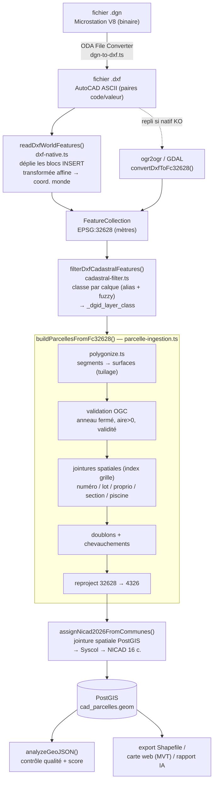
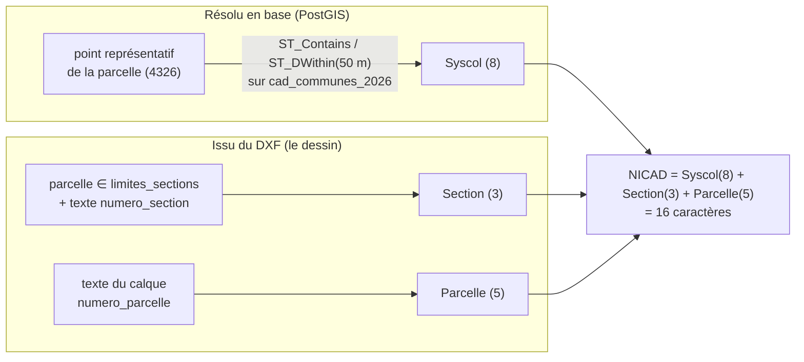
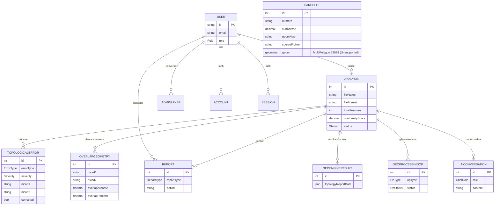
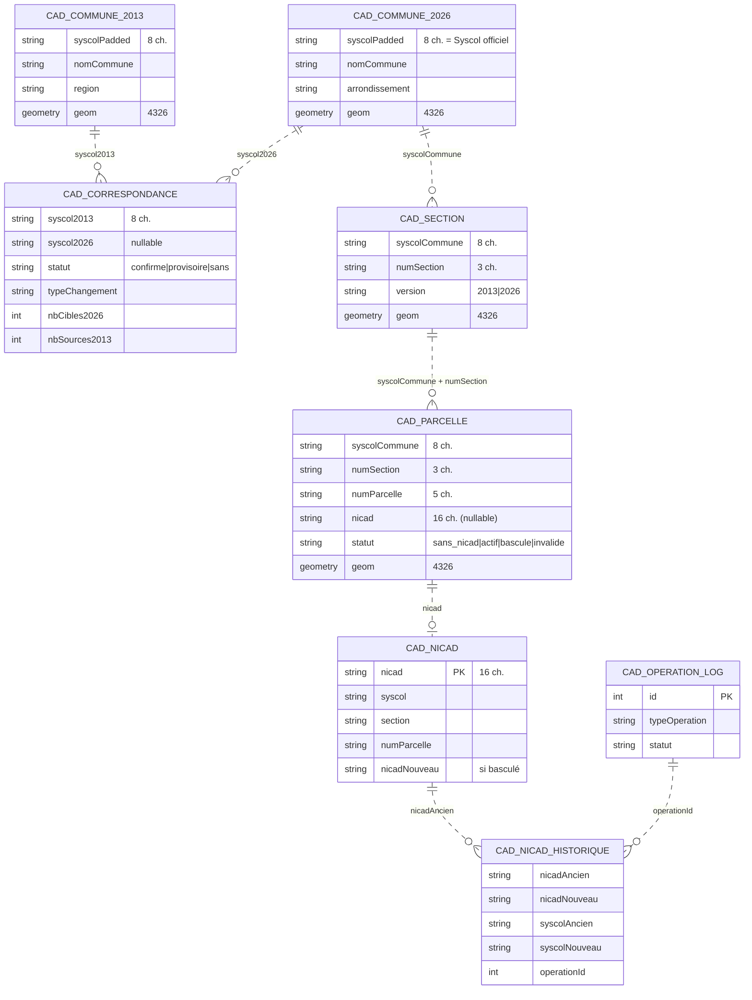

# Support de cours — Géomatique, topologie & SIG appliqués

> **Public visé : ingénieur·e de données** (back-end / data / plateforme) qui doit
> comprendre, maintenir ou étendre la chaîne géospatiale de ce projet
> (GeoAINO / module Cadastre « VeriCAD »), sans formation géomatique préalable.
>
> Chaque concept est **ancré sur le code réel** du dépôt (`fichier:fonction`)
> pour que la théorie soit immédiatement vérifiable. Les sections « 🛠️ Côté data
> engineer » traduisent le vocabulaire SIG vers des analogies de génie logiciel /
> données que vous connaissez déjà.

## Table des matières

1. [Comment lire ce support](#1-comment-lire-ce-support)
2. [Vue d'ensemble : le pipeline comme un ETL géospatial](#2-vue-densemble--le-pipeline-comme-un-etl-géospatial)
3. [Fondamentaux de géomatique](#3-fondamentaux-de-géomatique)
4. [Référentiels & projections (CRS / EPSG)](#4-référentiels--projections-crs--epsg)
5. [Formats & ingestion (DGN, DXF, GeoJSON, Shapefile)](#5-formats--ingestion-dgn-dxf-geojson-shapefile)
6. [Polygonisation : de segments épars à des parcelles](#6-polygonisation--de-segments-épars-à-des-parcelles)
7. [Topologie : géométrie correcte vs cohérente](#7-topologie--géométrie-correcte-vs-cohérente)
8. [Indexation spatiale & performance](#8-indexation-spatiale--performance)
9. [Le modèle cadastral & le NICAD](#9-le-modèle-cadastral--le-nicad)
10. [Base de données spatiale (PostGIS + Prisma)](#10-base-de-données-spatiale-postgis--prisma)
11. [Contrôle qualité & score de conformité](#11-contrôle-qualité--score-de-conformité)
12. [Basculement administratif 2013 → 2026](#12-basculement-administratif-2013--2026)
13. [Applications d'ingénierie de données pour simplifier le travail des géomaticiens](#13-applications-dingénierie-de-données-pour-simplifier-le-travail-des-géomaticiens)
14. [Glossaire orienté ingénieur de données](#14-glossaire-orienté-ingénieur-de-données)
15. [Annexe — fichiers clés & variables d'environnement](#15-annexe--fichiers-clés--variables-denvironnement)

---

## 1. Comment lire ce support

La géomatique = **« des données avec une position »**. Tout ce que vous savez sur
les pipelines de données (typage, validation, jointures, index, idempotence,
volumétrie) s'applique — il faut juste ajouter **deux dimensions** : la
**géométrie** (la forme et la position de l'objet) et la **topologie** (la
cohérence des relations entre objets voisins).

Mantra du projet :

> Un fichier CAO (DGN/DXF) est un **dessin** ; une base SIG est une **base de
> données**. Tout le pipeline consiste à transformer un dessin (des traits que
> l'œil humain interprète) en objets de données **typés, mesurables et
> interrogeables** (des parcelles avec un identifiant, une surface, un voisinage).

---

## 2. Vue d'ensemble : le pipeline comme un ETL géospatial

```
 ┌─ FICHIER CAO (dessin) ──────────────────────────────────────────────┐
 │  .dgn (Microstation)  ──ODA File Converter──►  .dxf (AutoCAD ASCII)  │
 └──────────────────────────────────────────────────────────────────────┘
                                  │  EXTRACT
                                  ▼
   readDxfWorldFeatures()  (dxf-native.ts)   ── ou repli ──►  ogr2ogr (GDAL)
   • lit les paires (code,valeur) DXF
   • déplie les BLOCS INSERT (transformée affine)            convertDxfToFc32628()
   • émet une FeatureCollection en EPSG:32628
                                  │  TRANSFORM (classification)
                                  ▼
   filterDxfCadastralFeatures()  (cadastral-filter.ts)
   • range chaque entité dans une CLASSE cadastrale par nom de calque
     (alias exact + matching flou Levenshtein)
   • _dgid_layer_class = limites_parcelles | numero_parcelle | ...
                                  │  TRANSFORM (géométrie + topologie)
                                  ▼
   buildParcellesFromFc32628()  (parcelle-ingestion.ts)
   • polygonise les segments épars en surfaces   (polygonize.ts, tuilage)
   • valide (anneau fermé, aire>0, validité OGC)
   • jointures spatiales point-dans-polygone (index grille) : numéro, lot,
     propriétaire, section, piscine → parcelle
   • détecte doublons & chevauchements
   • reprojette EPSG:32628 → EPSG:4326
                                  │  ENRICH (identité)
                                  ▼
   assignNicad2026FromCommunes()  (cadastre/assign-nicad-2026.ts)
   • jointure spatiale PostGIS : commune 2026 contenant la parcelle → Syscol
   • NICAD = Syscol(8) + Section(3) + Parcelle(5)
                                  │  LOAD
                                  ▼
   PostGIS (cad_parcelles.geom)  +  contrôle qualité analyzeGeoJSON()
   +  export Shapefile / carte web / rapport IA
```

Le même flux, en diagramme Mermaid :



🛠️ **Côté data engineer** : c'est un ETL classique **Extract → Transform → Load**,
avec deux particularités : (a) la phase *Transform* contient des opérations
**géométriques** (polygonisation, reprojection) et **topologiques** (chevauchement,
sliver) ; (b) la clé métier (le NICAD) est en partie **dérivée par jointure
spatiale**, pas présente dans la source.

---

## 3. Fondamentaux de géomatique

### 3.1 Vecteur vs raster

- **Vecteur** : objets discrets décrits par des coordonnées — **points**, **lignes**
  (polylignes), **polygones**. C'est tout ce que manipule ce projet (parcelles =
  polygones, numéros = points-textes, limites = lignes).
- **Raster** : une grille de pixels (image satellite, MNT). Hors périmètre ici.

### 3.2 Les types géométriques (modèle OGC « Simple Features »)

Le standard que tout SIG partage (PostGIS, Turf, GDAL, GeoJSON) :

| Type | Définition | Dans le projet |
|---|---|---|
| `Point` / `MultiPoint` | une position (x,y) | annotations : numéro de parcelle, de lot, propriétaire |
| `LineString` / `MultiLineString` | une suite de segments | limites dessinées en traits |
| `Polygon` | un **anneau extérieur fermé** + trous éventuels | une parcelle, une section, une commune |
| `MultiPolygon` | plusieurs polygones disjoints | parcelle en plusieurs morceaux |
| `GeometryCollection` | mélange | sorties DXF hétérogènes |

L'ensemble est listé dans `cadastral-filter.ts:SUPPORTED_VECTOR_TYPES`.

**Anneau (ring)** : une liste de sommets où **le premier point = le dernier**
(fermeture). Un polygone valide a au minimum **4 points** (3 distincts + la
fermeture). Voir `parcelle-ingestion.ts:isClosedRing` et `geo-engine.ts:isValidGeometry`
(`coords[0].length < 4` ⇒ invalide).

🛠️ **Côté data engineer** : voyez les Simple Features comme un **schéma de
sérialisation polymorphe** (comme un union/oneof). GeoJSON en est la
représentation JSON ; WKT/WKB en sont les représentations texte/binaire.

### 3.3 Coordonnées : que veut dire « x, y » ?

Un nombre comme `334120.5` n'a aucun sens **sans son référentiel** (CRS). Selon
le CRS, c'est soit des **mètres** (coordonnée projetée), soit des **degrés**
(longitude/latitude). Confondre les deux est **la** source d'erreur n°1 en SIG.

Astuce de détection utilisée partout dans le code :
`Math.abs(x) > 180` ⇒ ce ne peut pas être une longitude ⇒ ce sont des **mètres
(UTM)**. Exemples : `geo-engine.ts:detectSliver` (`isUtm = ...`),
`sliver-correction.ts:buildContext`.

---

## 4. Référentiels & projections (CRS / EPSG)

### 4.1 Le problème

La Terre est (presque) une sphère ; un écran et un calcul d'aire sont **plans**.
Une **projection cartographique** transforme (longitude, latitude) en (x, y)
plans, au prix de déformations. Chaque système porte un code **EPSG**.

Les deux seuls CRS de ce projet :

| EPSG | Nom | Unité | Usage |
|---|---|---|---|
| **4326** | WGS84 géographique | degrés (lon, lat) | stockage « universel », cartes web, mesures Turf |
| **32628** | UTM zone 28N (WGS84) | **mètres** | Sénégal ; calculs d'aire/longueur **planaires** exacts |

Définitions proj4 répétées dans le code :
```
EPSG:32628 = "+proj=utm +zone=28 +datum=WGS84 +units=m +no_defs"
EPSG:4326  = "+proj=longlat +datum=WGS84 +no_defs"
```
(`parcelle-ingestion.ts`, `geo-engine.ts`, `sliver-correction.ts`, `geo-parser.ts`.)

### 4.2 Règle d'or appliquée dans le projet

> **On mesure en mètres (UTM 28N), on stocke/affiche en degrés (WGS84).**

- Le DXF est **déjà en mètres UTM28N** ⇒ on lui **assigne** EPSG:32628 **sans
  transformer** les coordonnées (`convertDxfToFc32628`, option `-a_srs EPSG:32628` ;
  `readDxfWorldFeatures` émet directement en 32628).
- Les **aires** et **longueurs** se calculent en 32628 (planaire, donc la formule
  du lacet `ringArea` donne des m² justes) — voir `parcelle-ingestion.ts:geometryAreaM2`.
- En base / sur la carte, tout est **reprojeté en 4326** (`reprojectTo4326`).
- Quand on doit mesurer avec **Turf** (qui attend du 4326), on **reprojette à la
  volée** (`geo-engine.ts:toWgs84Feature`, `sliver-correction.ts:toWgs84`).

⚠️ **Piège classique** : calculer une aire directement sur des degrés donne un
nombre en « degrés² » sans signification métrique. D'où la reprojection
systématique avant toute mesure.

`-a_srs` (**assign** SRS) ≠ `-t_srs` (**transform** to SRS) : le premier
**étiquette** sans toucher aux nombres, le second **recalcule** les coordonnées.
Ici on **étiquette** car le dessin est déjà dans le bon système.

🛠️ **Côté data engineer** : un CRS, c'est l'**unité + le système de coordonnées**
d'une colonne numérique. Reprojeter = une **conversion d'unité** (comme
`USD→EUR`). « Assigner » un CRS = corriger une **métadonnée de colonne** mal
renseignée sans toucher aux valeurs.

---

## 5. Formats & ingestion (DGN, DXF, GeoJSON, Shapefile)

### 5.1 La chaîne des formats

| Format | Nature | Outil de lecture ici |
|---|---|---|
| **DGN** (Microstation V8) | CAO binaire propriétaire | converti en DXF via **ODA File Converter** puis GDAL (`dgn-to-dxf.ts`, `dgn-parser.ts`) |
| **DXF** (AutoCAD, ASCII) | CAO texte (paires code/valeur) | **lecteur natif** `dxf-native.ts` ou repli **ogr2ogr** |
| **GeoJSON** | SIG, JSON standard (RFC 7946) | format pivot interne |
| **Shapefile** (`.shp/.dbf/.prj` zippés) | SIG vectoriel historique | lecture `geo-parser.ts` (lib `shapefile`), export `cadastre/export-shapefile.ts` |

### 5.2 Pourquoi un lecteur DXF « maison » ?

Les DXF issus d'une conversion DGN encapsulent la géométrie dans des **BLOCS**
(entités `INSERT`) : des « instances » d'un dessin-modèle, placées avec une
**translation + échelle + rotation**. Le driver DXF de GDAL ne déplie pas
correctement ces blocs imbriqués → les parcelles n'arrivent jamais.

`dxf-native.ts` résout cela :
1. **Tokenisation** : le DXF est une suite de paires `(code, valeur)` sur deux
   lignes (`tokenize`).
2. **Indexation des blocs** : `parseBlocks` lit chaque définition `BLOCK`
   (point de base + entités locales).
3. **Dépliage récursif** : chaque `INSERT` applique une **transformée affine**
   (`insertTransform` : rotation `cos/sin` + échelle + translation) pour passer
   des coordonnées **locales** du bloc aux coordonnées **monde** (`emitGeometryFeatures`,
   profondeur max `MAX_BLOCK_DEPTH`).
4. **Héritage de calque** : une sous-entité sur le calque `"0"` hérite du calque
   de l'`INSERT` parent (`effectiveLayer`) — règle DXF standard.

> **Transformée affine** : `[x', y'] = R·s·([x,y] − base) + insert`, soit une
> rotation `R`, une mise à l'échelle `s` et une translation. C'est l'algèbre
> linéaire de base du placement d'objets en CAO.

### 5.3 La notion de « calque » (layer) = colonne catégorielle

En CAO, chaque entité porte un **calque** (ex. `LIMITES_PARCELLES`,
`NUMERO_LOT`). C'est l'équivalent d'une **colonne de catégorie** qui dit *quel
type d'objet métier* est ce trait. Tout le filtrage cadastral repose là-dessus
(`cadastral-filter.ts`) :

- **Normalisation** du nom (`normalizeText` : minuscules, sans accents, espaces).
- **Alias exacts** (substring) : `CADASTRAL_ALLOWED_LAYERS` mappe des dizaines de
  variantes/fautes de frappe vers une **classe** canonique.
- **Matching flou** (`fuzzyLayerCandidates`) : si aucun alias, on tente un
  rapprochement tolérant aux fautes via **distance de Levenshtein** (sur le nom
  de calque uniquement, jamais sur le texte libre, pour ne pas classer un nom de
  propriétaire comme un calque). Seuil `DXF_FUZZY_LAYER_THRESHOLD` (0.84).
- **Compatibilité géométrie/classe** : un numéro doit être un point/texte, une
  limite un polygone/ligne (`isGeometryCompatibleWithClass`).
- **Exclusions** : `historique_*`, `hachure`, `voirie`, `habillage`… (bruit de dessin).
- **Repli permissif** : si aucun calque lisible, on garde quand même les
  géométries (classe `fallback_geometrie`) plutôt que d'échouer.

🛠️ **Côté data engineer** : c'est de la **classification d'enregistrements par
règles** + **fuzzy matching** (comme dédupliquer des libellés clients sales).
Levenshtein = *edit distance*. L'`audit` JSON loggé en fin de filtrage est votre
**observabilité** : comptes par classe, calques détectés, calques rapprochés en flou.

---

## 6. Polygonisation : de segments épars à des parcelles

### 6.1 Le problème métier

Dans ces DXF cadastraux, **les parcelles ne sont pas des polygones** : ce sont
des **milliers de segments de droite séparés** (chaque côté d'une parcelle est un
trait indépendant). Exemple mesuré : `KEUR_MASSAR.dxf` → **112** polygones fermés
mais **360 549** segments ouverts.

Il faut **reconstruire les surfaces** à partir du réseau de lignes :
c'est la **polygonisation** (`polygonize.ts`, lib **JSTS**).

### 6.2 Les deux étapes JSTS

1. **Noding** (`UnaryUnionOp.union`) : casse toutes les lignes à leurs
   **intersections** pour obtenir un graphe planaire propre (deux traits qui se
   croisent partagent désormais un nœud). **Pré-requis indispensable.**
2. **Polygonisation** (`Polygonizer`) : assemble les **anneaux fermés minimaux**
   du graphe en polygones.
3. **Filtrage d'aire** : on jette les *slivers* (`minAreaM2`) et l'**anneau
   enveloppe global** (`maxAreaM2`, ≈ tout le lotissement).

### 6.3 Pourquoi le tuilage (et pourquoi c'était LE point de blocage)

Un `UnaryUnionOp.union` **global** sur 360 k segments **ne revient jamais**
(coût et mémoire du noding explosent). La solution implémentée
(`polygonize.ts:polygonizeTiled`) :

- partitionner l'espace en **tuiles** dimensionnées pour ~`tileTargetSegments`
  segments chacune ;
- chaque tuile collecte ses segments **+ une marge** (`tileMarginM` ≥ diamètre
  d'une parcelle) : ainsi **toute** parcelle dont le centroïde tombe dans la
  tuile a **tous** ses segments présents et se referme correctement ;
- chaque polygone n'est conservé que par **la** tuile qui contient son
  **centroïde** (`ownsPolygon`) ⇒ **aucun doublon** sur les coutures.

En dessous de `tileThreshold` (20 000) segments, on garde l'**union globale**
(chemin direct, déterministe). Résultat : `KEUR_MASSAR` passe de **∞ (bloqué)**
à **~84 s** pour **113 832 parcelles**.

🛠️ **Côté data engineer** : le tuilage est un **partitionnement spatial**
(comme partitionner par clé pour éviter un shuffle géant). La règle
« centroïde dans la tuile » est une **clé de dédup déterministe** sur les bords
de partition. Le seuil + repli direct est un **fast-path** pour petits volumes.

---

## 7. Topologie : géométrie correcte vs cohérente

### 7.1 Géométrie ≠ topologie

- **Géométrie** : la forme d'un objet **pris isolément** (ses coordonnées).
- **Topologie** : les **relations** entre objets — adjacence, contenance,
  chevauchement, trous. Une couche peut être pleine de géométries valides et
  **topologiquement fausse** (parcelles qui se superposent, micro-trous…).

C'est l'objet du contrôle qualité cadastral (`geo-engine.ts:analyzeGeoJSON`).

### 7.2 Validité OGC d'un polygone

Un polygone est **valide** (OGC) si : anneau fermé, ≥ 4 points, pas
d'auto-intersection, trous à l'intérieur, orientation cohérente. Vérifié par
`turf.booleanValid` (`parcelle-ingestion.ts:validatePolygons`) et, côté base,
par `ST_MakeValid` (PostGIS, `data.ts`).

### 7.3 Les erreurs topologiques détectées

| Erreur | Définition | Détection (code) |
|---|---|---|
| **Sliver** (résidu) | mince polygone parasite (aire ridicule ou ratio d'aspect démesuré) | `detectSliver` : `aire < 1 m²` (UTM) **ou** ratio largeur/hauteur > 50 |
| **Chevauchement** (overlap) | deux parcelles dont les **intérieurs** se recoupent | `analyzeGeoJSON` étape 3 : `turf.intersect` + aire de l'intersection ; sévérité = % de la plus petite parcelle |
| **Trou** (gap) | vide entre parcelles censées être jointives | étape 3b : `convexHull − union(parcelles)` via `turf.difference` |
| **Doublon** | même identité (même NICAD ou même empreinte géométrique) | `nicadMap` (par NICAD) ; `hashGeometry` (SHA-256 des coords arrondies au mm) |
| **Géométrie invalide** | anneau < 4 points, géométrie nulle | `isValidGeometry` |
| **Hors limite admin** | parcelle qui déborde de la commune | étape 4 : comparaison de bbox à `adminBoundary` |

### 7.4 Le « pourquoi » des prédicats spatiaux

Les bibliothèques topologiques (JSTS, PostGIS, Turf) implémentent le modèle
**DE-9IM** : une matrice 3×3 qui décrit comment se rencontrent
**intérieur / frontière / extérieur** de deux géométries. Les prédicats nommés
en sont des raccourcis :

- `intersects` : se touchent d'une manière ou d'une autre.
- `contains` / `within` : l'un est entièrement dans l'autre (`ST_Contains` pour
  trouver la commune d'un point).
- `overlap` : se recoupent **avec la même dimension** (deux surfaces qui se
  superposent) **sans** que l'un contienne l'autre — d'où « chevauchement réel ».
- `touches` : ne partagent qu'une frontière (parcelles **adjacentes** normales :
  ce n'est **pas** une erreur).

### 7.5 Correction automatique des slivers

`sliver-correction.ts` reproduit l'outil QGIS « Éliminer les polygones
résiduels » : un sliver est **fusionné dans le voisin avec lequel il partage la
plus longue frontière commune** (`selectBestNeighbor` :
`turf.lineOverlap` → longueur partagée ; repli sur la plus grande surface qui le
touche). La fusion se fait par `turf.union`. L'analyse se fait en WGS84
(mesures justes) mais l'union finale **conserve le CRS d'origine** du fichier.

🛠️ **Côté data engineer** : la topologie, ce sont des **contraintes
d'intégrité référentielle géométriques** (« pas de chevauchement » ≈ une
contrainte d'unicité spatiale ; « pas de trou » ≈ une contrainte de couverture).
Le contrôle qualité = exécuter ces *checks* et produire un **rapport
d'anomalies** avec sévérité.

---

## 8. Indexation spatiale & performance

Comparer chaque objet à tous les autres est en **O(n²)** — impensable à
100 k+ parcelles. On filtre d'abord par **bounding box** (le rectangle englobant,
test ultra-rapide), puis on ne fait le test géométrique coûteux que sur les
candidats restants.

Deux mécanismes dans le projet :

1. **Index en grille** (`parcelle-ingestion.ts:BBoxGridIndex`) : équivalent léger
   d'un **STRtree**. On range chaque bbox dans des cellules ; une requête ne teste
   que les objets de la même cellule. **Point clé** : la grille est **adaptative**
   — le nombre de cellules par axe ∝ `√n` (viser ~2 bbox/cellule). Une grille
   **fixe** (l'ancien `32×32`) entasse des milliers de polygones par cellule sur
   un grand plan ⇒ retombe en O(n²). C'est pourquoi `validate`, `overlap` et les
   jointures restent rapides même à 113 k parcelles.
2. **Index GiST PostGIS** (`&&`) : en base, l'opérateur `&&` (« les bbox
   s'intersectent ») s'appuie sur un index **GiST** sur la colonne `geom` avant
   le test exact `ST_Contains`/`ST_Intersects` (`data.ts:getSyscols2026ForPoints`,
   `recalculerCorrespondancesSpatiales`).

Autres garde-fous de volumétrie :
- bornes d'analyse en mémoire : `MAX_OVERLAP_CHECK`, `MAX_OVERLAP_ERRORS`
  (`geo-engine.ts`) ;
- plafonds de payload : `MAX_DXF_FEATURES_RETURNED`, `MAX_DXF_TEXT_FEATURES`
  (`cadastral-filter.ts`), désactivés (`maxFeatures: null`) dans le pipeline
  parcelle où l'on veut **tout** garder avant l'assemblage.

🛠️ **Côté data engineer** : la bbox est une **clé de bucket** ; l'index spatial
est un **index secondaire** qui transforme un *cross join* en *bucketed join*.
Choisir la granularité de grille = choisir le **nombre de partitions** pour
équilibrer la charge.

---

## 9. Le modèle cadastral & le NICAD

### 9.1 Hiérarchie cadastrale

```
Région → Département → Arrondissement → Commune → Section → Parcelle
```
Une **parcelle** est l'unité foncière de base (un terrain). Une **section** la
regroupe ; une **commune** regroupe les sections. Le **Syscol** est le code de la
collectivité (commune).

### 9.2 Anatomie du NICAD (16 caractères)

```
   01430121      001       00001
 └─ Syscol(8) ┘ └Sect(3)┘ └Parc(5)┘
   = région(2)+dépt(1)+arrond(3)+commune(2)
```
Implémenté en deux endroits cohérents :
- `nicad.ts` (construction côté ingestion DXF) ;
- `cadastre/nicad-logic.ts` (logique métier pure : validation, génération,
  basculement) — règles : Syscol ≠ `00000000`, Section ≠ `000`,
  `validateNicadFormat`.

Normalisations clés :
- `normalizeNumeroParcelle` : extrait les chiffres, **pad à gauche** à 5 (`padded`)
  ou **tronque** aux 5 derniers (`truncated`) — chaque ajustement est tracé via un
  `status`.
- `normalizeSection` : 3 chiffres ; `normalizeNicadPrefix` : 8 chiffres.

### 9.3 D'où vient chaque morceau ? (le point subtil)

Le DXF **ne contient pas** le préfixe territorial (Syscol). Donc :

| Composant | Source |
|---|---|
| Parcelle (5) | **texte** du calque `numero_parcelle` joint à la géométrie |
| Section (3) | **jointure spatiale** parcelle ∈ polygone `limites_sections` + texte `numero_section` |
| **Syscol (8)** | **jointure spatiale PostGIS** : commune 2026 contenant la parcelle (`getSyscols2026ForPoints` → `assignNicad2026FromCommunes`) |

C'est pour ça que le NICAD est `null` à la sortie de l'ingestion géométrique et
n'est complété qu'à l'étape base de données. (Mémoire projet : *« building NICAD
from .dxf must use the syscol from cad_communes_2026 »*.)

Provenance de chaque composant du NICAD :



🛠️ **Côté data engineer** : le NICAD est une **clé composite** construite par
**enrichissement** ; le Syscol est une **clé étrangère résolue par lookup
spatial** (un *spatial join* remplace le *equi-join* habituel).

---

## 10. Base de données spatiale (PostGIS + Prisma)

### 10.1 PostGIS = PostgreSQL qui sait stocker et indexer de la géométrie

Colonnes spéciales :
- `geometry(MultiPolygon, 32628)` ou `geometry(MultiPolygon, 4326)` : géométrie +
  **SRID** (le code EPSG embarqué). Voir `schema.prisma` (`Parcelle.geom`,
  `cad_communes_2026.geom`, …).
- `geography` : variante qui calcule en **mètres sur l'ellipsoïde** (utilisée pour
  `ST_DWithin(..., 50)` = « dans 50 m réels »).

Prisma ne gère pas nativement le type géométrie : il est déclaré
`Unsupported("geometry(...)")` et lu/écrit via **SQL brut** (`$queryRaw`).
C'est une contrainte structurante du projet.

### 10.2 Fonctions PostGIS employées (toutes dans `cadastre/data.ts`)

| Fonction | Rôle |
|---|---|
| `ST_MakePoint` + `ST_SetSRID` | construire un point 4326 à partir de lon/lat |
| `&&` | test bbox (utilise l'index **GiST**) — filtre rapide |
| `ST_Contains` | la commune contient-elle exactement le point ? |
| `ST_DWithin(::geography, 50)` | repli : commune la plus proche dans 50 m (décalage de bord) |
| `<->` | opérateur de **distance** (tri du plus proche) |
| `ST_Intersection` / `ST_Area` / `ST_Transform` | recouvrement de surface 2013↔2026 (en 32628) pour qualifier les correspondances |
| `ST_MakeValid` | réparer une géométrie invalide avant calcul |
| `LATERAL JOIN` | exécuter un sous-`SELECT` corrélé par ligne (le « contenant », puis le « plus proche ») |

Exemple — résolution du Syscol par point (simplifié) :
```sql
LEFT JOIN LATERAL (
  SELECT c."syscolPadded", c."nomCommune"
  FROM "cad_communes_2026" c
  WHERE c.geom && pts.geom AND ST_Contains(c.geom, pts.geom)   -- index GiST puis test exact
  LIMIT 1
) hit ON true
```

🛠️ **Côté data engineer** : PostGIS = un SGBD relationnel avec un **type colonne
géométrie**, des **fonctions d'agrégat/jointure géométriques** et un **index
GiST** (analogue d'un B-tree, mais pour des rectangles englobants). Un *spatial
join* = un `JOIN ... ON ST_Contains(...)` accéléré par `&&`.

### 10.3 Modèle de données — cœur analyse / qualité (`prisma/schema.prisma`)

Une **analyse** (un fichier importé et contrôlé) est l'entité pivot ; toutes les
sorties du moteur qualité y sont rattachées (relations 1‑à‑N **réelles**, en
cascade). Le `model Parcelle` (import DXF brut) est **autonome** : sa géométrie
est en EPSG:32628 et il ne dépend pas d'`Analysis`.



### 10.4 Modèle de données — module Cadastre / NICAD (`cad_*`)

⚠️ **Important** : dans le module Cadastre, **aucune clé étrangère n'est déclarée**.
Les tables sont reliées par des **clés de jointure logiques** (`syscolPadded`,
`numSection`, `nicad`…), pas par des FK contraintes par la base — d'où les
relations en **pointillés** ci‑dessous. Toutes les colonnes `geom` sont
`Unsupported` (lecture/écriture en **SQL brut**, cf. `cadastre/data.ts`).



> `CAD_FICHIER_IMPORTE` (journal des fichiers reçus) et `CAD_OPERATION_LOG`
> (journal d'audit des opérations) sont des tables de **traçabilité** : reliées
> aux autres seulement par convention (`operationId`), pas par FK.

🛠️ **Côté data engineer** : le cœur QA est un schéma **normalisé classique avec
FK** (cascade depuis `Analysis`). Le module cadastre est délibérément **dénormalisé
par clés métier** (`syscolPadded`) : un choix porté depuis l'app d'origine, qui
privilégie les **jointures spatiales** et les **clés naturelles** à l'intégrité
référentielle stricte — la cohérence est donc à garantir côté application.

---

## 11. Contrôle qualité & score de conformité

`geo-engine.ts:analyzeGeoJSON` produit un **rapport d'anomalies** + des
statistiques + un **score de conformité** :

```
penalty   = 10·(#critiques) + 5·(#élevées) + 2·(#moyennes)
conformité = clamp(0..100, 100 − (penalty / nbParcelles) · 10)
```
Les statistiques incluent un bloc `qgisControl` (parcelles avec/sans NICAD, NICAD
court < 8, longueur ≠ 16, NICAD valide 16) qui **reproduit un contrôle QGIS**
familier des techniciens, plus les comptes de chevauchements, slivers, doublons,
géométries invalides.

`generateAIReport` envoie **uniquement ces données factuelles** à un LLM
(`llm.ts`) pour rédiger un rapport d'expertise structuré, avec un **repli
Markdown déterministe** si le LLM échoue (anti-hallucination : aucune donnée
inventée).

🛠️ **Côté data engineer** : c'est un **framework de data quality** (à la *Great
Expectations*) : des *expectations* géométriques, un *severity scoring*, et un
*reporting*. Le LLM n'est qu'une couche de **présentation** au-dessus de chiffres
vérifiés.

---

## 12. Basculement administratif 2013 → 2026

Le Sénégal a redécoupé ses communes ⇒ les Syscol changent ⇒ les NICAD doivent
**basculer** de l'ancien référentiel vers le nouveau (`cadastre/nicad-logic.ts`,
`cadastre/data.ts`).

Deux cas (`basculerNicadSimple` / `basculerNicadComplexe`) :

- **Simple** : la section n'a pas changé de commune → seul le Syscol change,
  section + parcelle conservées.
- **Complexe** : la section a changé de commune (découpage) → **nouveau numéro de
  parcelle** attribué **séquentiellement** dans la section cible
  (`getNextNumParcelleFromList`, `getLastNumParcelleGlobal` garantit l'unicité en
  tenant compte des deux tables).

**Qualification automatique du changement** (`recalculerCorrespondancesSpatiales`)
par **overlay PostGIS** : pour chaque paire (commune 2013, commune 2026) qui se
chevauchent, on calcule le **taux de recouvrement de surface** (en 32628) et on
analyse la **cardinalité** :

| Type | Règle |
|---|---|
| `inchange` | 1↔1, même nom |
| `renomme` | 1↔1, nom différent |
| `fusion` | plusieurs 2013 → une seule 2026 |
| `decoupe` | une 2013 → plusieurs 2026 (≥ 2 fragments au-dessus de `SEUIL_DECOUPE`) |
| `rattachement_departement` | changement de département |
| `disparue` | recouvrement sous `SEUIL_PROVISOIRE` |

Statuts `confirme` / `provisoire` / `sans_correspondance` selon les seuils de
recouvrement (`SEUIL_CONFIRME = 0.5`, `SEUIL_PROVISOIRE = 0.1`).

🛠️ **Côté data engineer** : c'est une **résolution de slowly-changing-dimension
géographique** + une **réconciliation N:N par overlap de surface** (au lieu d'un
*fuzzy name match* seul). Les seuils transforment un continuum (% recouvrement)
en **labels métier** ; l'historique des bascules (`CadNicadHistorique`) est un
**journal d'audit** immuable.

---

## 13. Applications d'ingénierie de données pour simplifier le travail des géomaticiens

Objectif : **outiller** les techniciens géomatique / utilisateurs SIG pour
industrialiser ce que ce projet fait à la main, et au-delà. Classé par besoin.

### 13.1 Conversion & manipulation de formats (le « pandas du géospatial »)

| Outil | À quoi ça sert | Pourquoi ici |
|---|---|---|
| **GDAL/OGR** (`ogr2ogr`, `ogrinfo`) | couteau suisse de conversion (200+ formats), reprojection, filtres SQL | déjà utilisé (`dgn-parser.ts`) ; automatiser DGN/DXF→GeoJSON/GeoParquet en batch |
| **GeoPandas** (Python) | DataFrame géospatial (pandas + Shapely + pyproj) | scripter contrôles qualité, jointures spatiales, exports sans coder le bas niveau |
| **Shapely** | opérations géométriques (buffer, union, validité) | prototyper la polygonisation / correction de slivers hors Node |
| **Fiona / pyogrio** | I/O vectoriel rapide adossé à GDAL | lire/écrire de gros lots de fichiers |

> **Gain technicien** : remplacer des manipulations QGIS clic-à-clic par des
> **scripts reproductibles** (mêmes 50 fichiers traités à l'identique, traçables
> en Git).

### 13.2 Stockage & formats analytiques modernes

| Outil/format | Apport |
|---|---|
| **PostGIS** | base spatiale de référence (déjà au cœur du projet) : index GiST, `ST_*`, contraintes topologiques |
| **GeoParquet** | colonne géométrie dans Parquet : compression, lecture partielle, idéal data lake |
| **FlatGeobuf** | format vectoriel streamable, indexé spatialement, très rapide à lire par bbox |
| **DuckDB + extension `spatial`** | requêtes SQL spatiales **en local**, sur fichiers (GeoParquet/Shapefile) sans serveur — parfait pour l'EDA d'un technicien |

> **Gain technicien** : « ouvrir un fichier de 2 Go et compter les parcelles par
> section » devient une requête SQL d'une ligne dans DuckDB, sans charger QGIS.

### 13.3 Traitement à grande échelle (quand un fichier ne tient plus en mémoire)

| Outil | Apport |
|---|---|
| **Apache Sedona** (sur Spark) | jointures spatiales et partitionnement spatial **distribués** (équivalent industriel du tuilage de `polygonize.ts`) |
| **Dask-GeoPandas** | parallélisation du traitement vectoriel en Python |
| **PostGIS + partitionnement de table** | gérer des dizaines de millions de parcelles |

> **Gain technicien** : passer d'« une commune par run » à « toute une région en
> une nuit », sans réécrire la logique.

### 13.4 Orchestration & automatisation ETL

| Outil | Apport |
|---|---|
| **Apache Airflow / Dagster / Prefect** | planifier et superviser le pipeline DGN→DXF→parcelles→NICAD, relances, alertes |
| **dbt** | modéliser les transformations SQL (correspondances, basculements) en **modèles versionnés et testés** |
| **Makefile / CLI maison** | encapsuler `ogr2ogr` + scripts (`scripts/*.ts`) en commandes simples pour non-développeurs |

> **Gain technicien** : un import n'est plus une suite d'étapes manuelles
> faillibles mais un **bouton/commande** idempotent, avec journal d'exécution
> (cf. `CadOperationLog` déjà présent).

### 13.5 Qualité de données spatiale (industrialiser le contrôle)

| Outil | Apport |
|---|---|
| **Great Expectations / Soda** | écrire des *checks* déclaratifs (NICAD 16 car., Syscol ≠ 0, % chevauchements < seuil) et bloquer un import non conforme |
| **PostGIS `ST_IsValid` / `ST_MakeValid` + topology** | validation/réparation systématique avant chargement |
| **JTS/JSTS `IsValidOp`, `OverlayNG`** | moteur de robustesse géométrique (déjà via JSTS dans `polygonize.ts`) |

> **Gain technicien** : le contrôle qualité (`analyzeGeoJSON`) devient une
> **porte de qualité** automatique dans le pipeline, pas une vérification a
> posteriori.

### 13.6 Visualisation & diffusion (rendre la donnée exploitable)

| Outil | Apport |
|---|---|
| **QGIS** | poste de travail SIG de référence du technicien (édition, contrôle visuel) |
| **Tippecanoe → tuiles vectorielles (MVT) + MapLibre/Leaflet** | servir des millions de parcelles fluidement sur le web (la carte du projet) |
| **pg_tileserv / Martin** | générer des tuiles vectorielles **directement depuis PostGIS** |
| **kepler.gl / deck.gl** | exploration visuelle rapide de gros jeux de points/polygones |

> **Gain technicien** : partager une **carte web interactive** au lieu d'un fichier
> à ouvrir dans un logiciel lourd ; charger dynamiquement par bbox
> (cf. `getParcellesByBbox`).

### 13.7 Géocodage & référentiels

| Outil | Apport |
|---|---|
| **pyproj / proj** | reprojections fiables et transformations de datum |
| **référentiels administratifs** (communes 2013/2026) | la « table de vérité » des jointures spatiales (déjà `cad_communes_*`) |

### 13.8 Feuille de route pragmatique pour ce projet

1. **Court terme** : exposer les scripts (`scripts/*.ts`, `ogr2ogr`) derrière une
   **CLI/commande unique** + journaliser dans `CadOperationLog`.
2. **Moyen terme** : ajouter une **porte de qualité** (Great Expectations-like)
   sur le rapport `analyzeGeoJSON` avant chargement en base.
3. **Montée en charge** : sortir les jeux volumineux en **GeoParquet**, explorer
   en **DuckDB spatial** ; si la volumétrie nationale l'exige, **Apache Sedona**
   pour la polygonisation/jointures distribuées.
4. **Diffusion** : tuiles vectorielles via **pg_tileserv/Martin** depuis PostGIS.

---

## 14. Glossaire orienté ingénieur de données

> Format : **Terme** — définition SIG → *analogie data engineering*.

- **Affine (transformée)** — rotation+échelle+translation appliquée à des
  coordonnées (`dxf-native.ts:insertTransform`). → *un `map()` linéaire sur des points*.
- **Anneau (ring)** — liste de sommets fermée (1er = dernier) délimitant un
  polygone. → *une boucle fermée ; ≥ 4 éléments*.
- **bbox (bounding box)** — rectangle englobant `[minX,minY,maxX,maxY]`. → *clé de
  bucket / pré-filtre avant le test coûteux*.
- **Basculement** — re-codification d'un NICAD d'un référentiel à un autre. →
  *migration de clé lors d'un changement de dimension*.
- **Calque (layer)** — attribut CAO disant le type d'objet d'un trait. → *colonne
  catégorielle*.
- **Centroïde** — « centre de masse » d'une géométrie. → *valeur agrégée
  représentative*. (`representativePoint` garantit un point **à l'intérieur**.)
- **Chevauchement (overlap)** — intérieurs de deux surfaces qui se recoupent. →
  *violation d'unicité spatiale*.
- **CRS (Coordinate Reference System)** — système de coordonnées + unité,
  identifié par un code **EPSG**. → *unité+schéma d'une colonne numérique*.
- **DE-9IM** — matrice 3×3 intérieur/frontière/extérieur décrivant une relation
  spatiale. → *table de vérité des prédicats de jointure spatiale*.
- **DGN / DXF** — formats de dessin CAO (Microstation / AutoCAD). → *fichiers
  sources « sales », pré-relationnels*.
- **EPSG:4326 / 32628** — WGS84 (degrés) / UTM 28N (mètres). → *deux « unités » ;
  4326 pour stocker, 32628 pour mesurer*.
- **Feature / FeatureCollection** — objet géo (géométrie + propriétés) / sa
  collection. → *enregistrement / table*.
- **GDAL/OGR** — bibliothèque/outils de conversion géospatiale (`ogr2ogr`). →
  *le « pandas/ETL » des formats géo*.
- **Gap (trou)** — vide indésirable entre polygones jointifs. → *trou de couverture*.
- **Géométrie vs topologie** — forme d'un objet vs relations entre objets. →
  *valeur d'une ligne vs contraintes d'intégrité entre lignes*.
- **GeoJSON** — encodage JSON des features (RFC 7946, toujours en 4326). → *format
  d'échange standard*.
- **geography (PostGIS)** — type qui mesure en mètres sur l'ellipsoïde. → *colonne
  géométrie avec distances métriques natives*.
- **GiST (index)** — index PostGIS pour requêtes spatiales (`&&`). → *index
  secondaire pour bbox*.
- **Indexation spatiale / STRtree / grille** — structure qui évite le O(n²). →
  *bucketing/partitionnement pour transformer un cross-join en bucketed-join*
  (`BBoxGridIndex`, **adaptatif** ∝√n).
- **Levenshtein** — distance d'édition entre deux chaînes. → *score de fuzzy
  matching* (classification de calques).
- **MultiPolygon** — plusieurs polygones disjoints en un objet. → *valeur
  « liste de » dans une seule cellule*.
- **NICAD** — identifiant cadastral 16 car. = Syscol(8)+Section(3)+Parcelle(5). →
  *clé composite métier*.
- **Noding** — découpe des lignes à leurs intersections avant polygonisation
  (`UnaryUnionOp`). → *normalisation du graphe avant agrégation*.
- **OGC Simple Features** — modèle standard des types géométriques. → *schéma de
  types partagé entre tous les outils*.
- **Overlay** — superposition de deux couches pour intersecter/différencier
  (recouvrement 2013↔2026). → *jointure géométrique avec calcul d'aire*.
- **Polygonisation** — reconstruire des surfaces fermées depuis un réseau de
  lignes (`polygonize.ts`). → *agréger des arêtes en faces d'un graphe planaire*.
- **Projection** — passage sphère → plan ; déforme, d'où le choix d'UTM local
  pour mesurer. → *conversion d'unité avec perte contrôlée*.
- **Reprojection** — convertir des coordonnées d'un CRS à un autre (`proj4`,
  `ST_Transform`). → *cast/convert d'unité*.
- **Sliver (résidu)** — micro-polygone parasite (aire infime / très allongé). →
  *enregistrement aberrant à nettoyer*.
- **Spatial join** — jointure dont la condition est géométrique (`ST_Contains`).
  → *`JOIN ... ON` géométrique accéléré par index*.
- **SRID** — code EPSG stocké **dans** la colonne géométrie PostGIS. → *métadonnée
  d'unité attachée à la donnée*.
- **Syscol** — code (8 chiffres) de la collectivité/commune. → *clé étrangère
  territoriale*.
- **Tuilage (tiling)** — découpe spatiale d'un traitement pour borner le coût
  (`polygonizeTiled`). → *partitionnement spatial pour éviter un shuffle géant*.
- **Turf.js / JSTS** — bibliothèques géométriques JS (mesures / robustesse). →
  *libs de calcul, l'une « haut niveau » l'autre « moteur topologique »*.
- **UTM (zone 28N)** — projection métrique par fuseau ; le Sénégal est en 28N. →
  *« l'unité mètre » locale du projet*.
- **Validité (OGC)** — polygone sans auto-intersection, anneaux corrects
  (`ST_IsValid`, `booleanValid`). → *contrainte de format sur la valeur géométrique*.
- **WKT / WKB** — Well-Known Text/Binary, représentations texte/binaire d'une
  géométrie (`geometryToWkt32628`). → *sérialisations canoniques*.

---

## 15. Annexe — fichiers clés & variables d'environnement

### 15.1 Carte des fichiers (où vit quoi)

| Concept | Fichier(s) |
|---|---|
| Lecture DXF native (blocs) | `src/lib/dxf-native.ts` |
| Conversion DGN→DXF / GDAL | `src/lib/dgn-to-dxf.ts`, `src/lib/dgn-parser.ts` |
| Classification par calque | `src/lib/cadastral-filter.ts` |
| Ingestion parcelles + jointures + topologie | `src/lib/parcelle-ingestion.ts` |
| Polygonisation (noding + tuilage) | `src/lib/polygonize.ts` |
| Contrôle qualité / score / rapport IA | `src/lib/geo-engine.ts` |
| Correction des slivers | `src/lib/sliver-correction.ts` |
| Bornes du Sénégal (filtre carte) | `src/lib/senegal-bounds.ts` |
| Logique NICAD (ingestion) | `src/lib/nicad.ts` |
| Logique NICAD métier (validation/basculement) | `src/lib/cadastre/nicad-logic.ts` |
| Résolution Syscol (jointure spatiale PostGIS) | `src/lib/cadastre/data.ts`, `src/lib/cadastre/assign-nicad-2026.ts` |
| Export Shapefile | `src/lib/cadastre/export-shapefile.ts` |
| Schéma de données (PostGIS via Prisma) | `prisma/schema.prisma` |

### 15.2 Variables d'environnement de réglage

| Variable | Défaut | Effet |
|---|---|---|
| `MAX_DXF_FEATURES_RETURNED` | 180000 | plafond d'entités du **payload HTTP** |
| `MAX_DXF_TEXT_FEATURES` | 60000 | plafond d'annotations renvoyées |
| `DXF_FUZZY_LAYER_THRESHOLD` | 0.84 | seuil du matching flou de calque |
| `DXF_CLOSE_SNAP_TOLERANCE_M` | 0.05 | tolérance (m) pour fermer une polyligne quasi fermée |
| `DXF_POLYGONIZE_MIN_AREA_M2` | 5 | aire mini d'un polygone reconstruit (anti-sliver) |
| `DXF_POLYGONIZE_MAX_AREA_M2` | 50000 | aire maxi (rejette l'anneau enveloppe) |
| `DXF_POLYGONIZE_TILE_THRESHOLD` | 20000 | nb de segments au-delà duquel on **tuile** |
| `DXF_POLYGONIZE_TILE_TARGET` | 4000 | segments visés par tuile |
| `DXF_POLYGONIZE_TILE_MARGIN_M` | 400 | marge (m) de collecte par tuile (≥ diamètre parcelle) |
| `DXF_PROFILE` | (off) | active le **profilage par phase** de l'ingestion |
| `OGR2OGR_PATH` / `OGRINFO_PATH` | auto | chemins des binaires GDAL |

### 15.3 Repères de performance (mesurés)

| Fichier | Volume | Résultat |
|---|---|---|
| Rufisque | 19 Mo, ~11 k limites | ~3–4 s, 1 255 parcelles |
| KEUR_MASSAR | 181 Mo, 360 k segments | ~84 s, 113 832 parcelles (après tuilage) |

> **Note** : sans tuilage, KEUR_MASSAR **ne terminait jamais** (union JSTS globale).
> Avec une grille spatiale **fixe**, l'étape `overlap` serait redevenue O(n²) :
> les deux corrections (tuilage + grille adaptative) sont complémentaires.

---

*Document de formation interne — à compléter au fil de l'évolution du code. En cas
de divergence, le code (`src/lib/**`) fait foi.*
