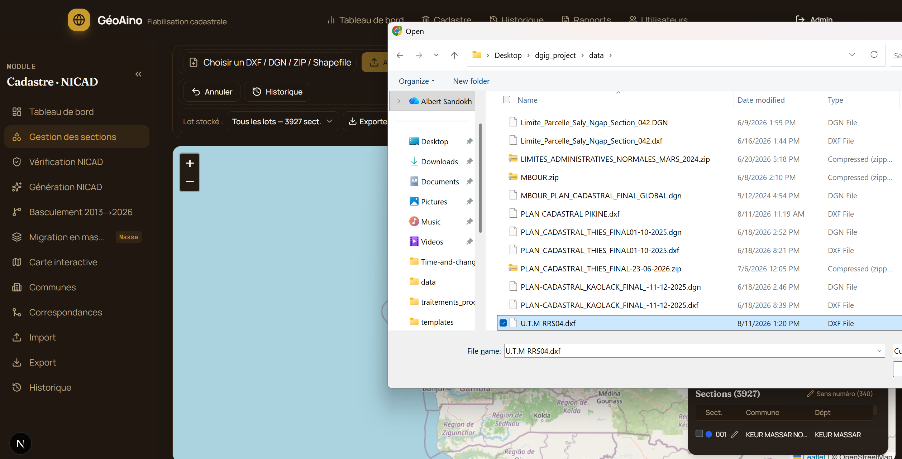
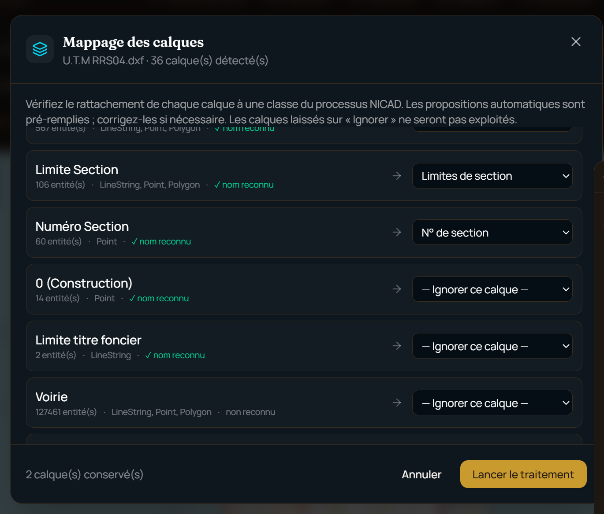
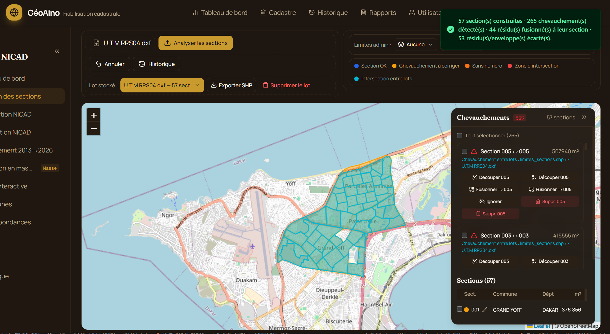
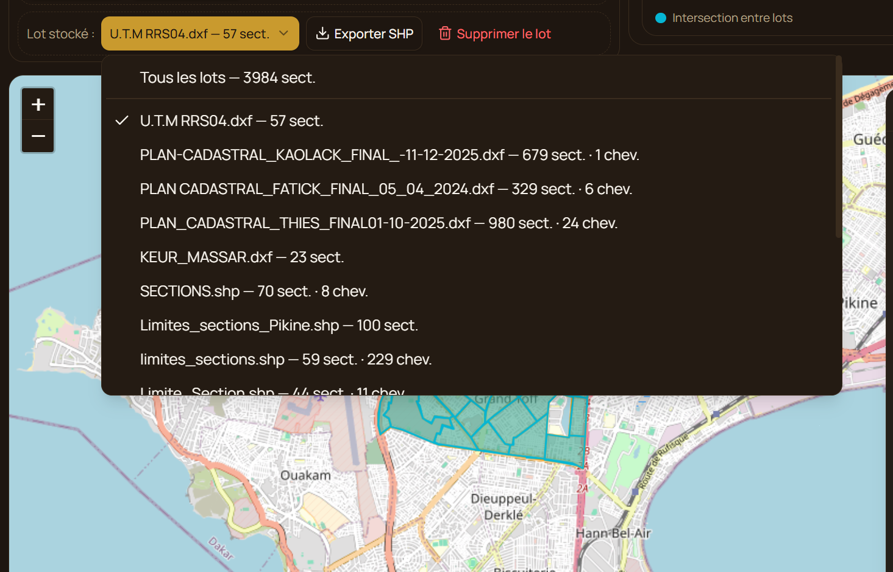
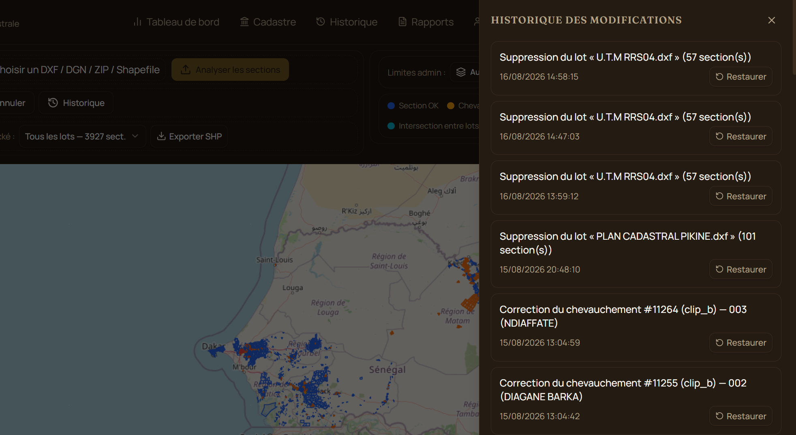
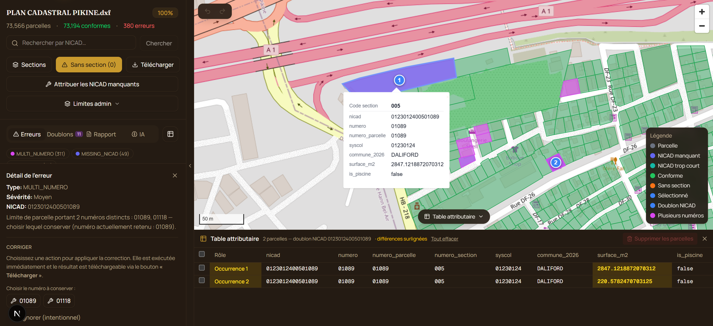
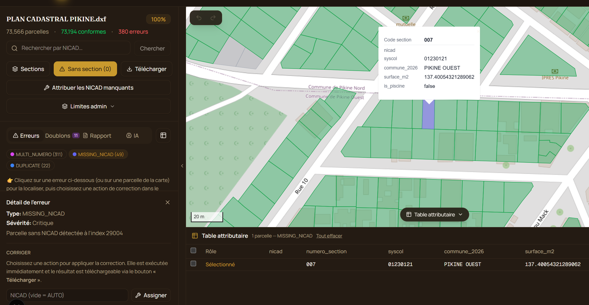
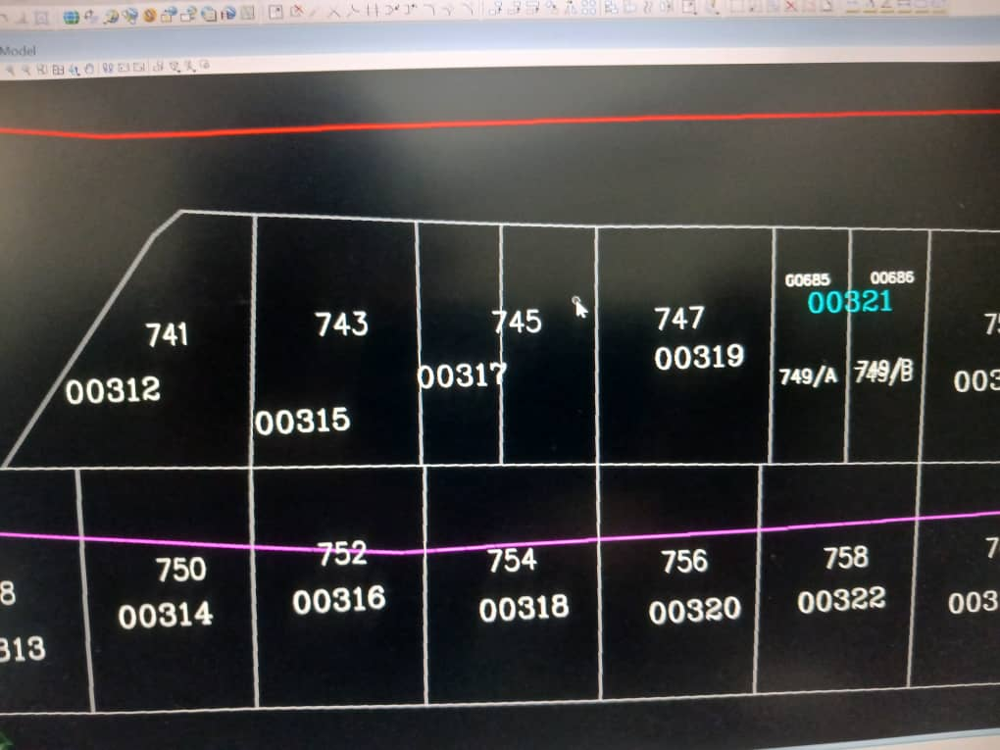
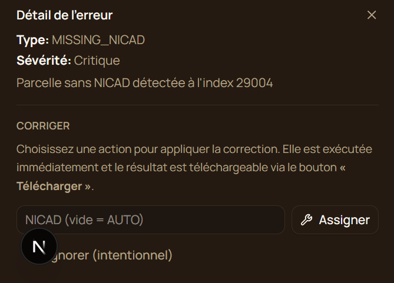

# I - Gestion des sections

La gestion des sections est promordiales pour la gestion des parcelles car elle permet de geolocaliser les parcelles et de construire les nicad à partir du syscol, numéro section et numéro parcelle.
On peut les contruire en chargeant des fichiers de type shapefile ou dxf.

## Traitement des sections (shapefile et dxf)

### 1. Sélection du fichier de sections

Le fichier peut être un shapefile (`.shp` + `.dbf`, `.shx`/`.prj` optionnels), un DXF, un DGN ou un ZIP.

<!-- screenshot à ajouter : sélecteur de fichier sections -->

- **DXF / DGN / ZIP** : le traitement démarre automatiquement, sans mappage — les numéros de section sont lus directement depuis les calques `limites_sections` / `numero_section`.
- **Shapefile** : un mappage est demandé avant le traitement (voir étape 2).

### 2. Mappage des champs (shapefile uniquement)

Un seul champ est à mapper : le **numéro de section** (colonne du `.dbf` correspondant, ex. `num_section`, `num_sect_n`, `section`…). Contrairement aux parcelles, aucun autre champ n'est demandé ici — la commune, la région, le département et le syscol sont résolus automatiquement à l'étape suivante.

<!-- screenshot à ajouter : mappage du champ numéro de section -->

### 3. Traitement automatique

Après validation du mappage (ou directement pour un DXF/DGN), l'application :

1. rattache chaque section à sa commune 2026 (jointure spatiale) et en déduit région, département et syscol ;
2. fusionne les fragments d'une même section identifiés par le couple **(commune, numéro de section)** — un « 001 » d'une commune ne fusionne jamais avec un « 001 » d'une autre commune ;
3. absorbe dans la section hôte les petits polygones sans numéro (< 1 ha) plutôt que d'en faire de fausses sections ;
4. détecte les chevauchements entre sections (nouvelles et déjà en base).

Un message récapitule le nombre de sections construites, de chevauchements détectés et de résidus fusionnés.

<!-- screenshot à ajouter : toast récapitulatif -->

### 4. Affichage sur la carte

<!-- screenshot à ajouter : carte des sections -->

Les sections sont coloriées selon leur état :

- **Bleu** : section saine.
- **Orange** : section sans numéro.
- **Ambre** : section impliquée dans un chevauchement en attente.
- **Rouge** : zone d'intersection du chevauchement (affichée par-dessus).
- **Violet** : sections sélectionnées pour une fusion manuelle.

### 5. Lots stockés

La liste déroulante « Lot stocké » permet de sélectionner un ou plusieurs fichiers déjà importés (avec leur nombre de sections et de chevauchements en attente) pour n'afficher/travailler que sur ceux-ci — utile pour éviter de charger toute la base à chaque fois, ou pour cibler la suppression/l'export d'un lot précis.

<!-- screenshot à ajouter : liste déroulante des lots stockés -->

### 6. Les types d'erreurs

#### 6.1 - Section sans numéro

Le fragment n'a reçu aucun numéro de section lors de la lecture du fichier (texte absent ou non reconnu). Affichée en orange sur la carte.

#### 6.2 - Chevauchement entre sections

Deux sections se recouvrent (import redondant, tracés qui se croisent, lots différents). Affiché en ambre (sections concernées) et en rouge (zone de recouvrement), avec la liste des chevauchements en attente dans le panneau latéral.

#### 6.3 - Section fusionnée à tort

Une limite mitoyenne absente du fichier source peut faire ressortir deux sections comme une seule, anormalement grande. Ce cas n'a pas de badge dédié dans l'interface — repérez une section trop grande et utilisez la fusion/scission manuelle (étape 7) pour la corriger.

### 7. Corriger les erreurs

- **Section sans numéro** : modifiable directement (icône crayon dans le tableau, ou champ dans le popup carte) — réattribue aussi automatiquement le NICAD des parcelles concernées.
- **Chevauchement** : depuis la liste, par chevauchement (découper une des deux sections, fusionner, supprimer l'une des deux, ou ignorer si intentionnel) ou en lot (sélection multiple + action groupée, y compris « auto » qui conserve la plus petite section).
- **Section fusionnée à tort** : sélectionner 2 sections ou plus (popup carte ou tableau) puis fusionner/scinder manuellement — la première section sélectionnée conserve son numéro et sa commune.
- **NICAD manquants dans une section** : action dédiée « Attribuer les NICAD manquants », avec aperçu avant application.

Toute action destructrice demande confirmation et reste annulable depuis le panneau Historique.

<!-- screenshot à ajouter : panneau de correction des chevauchements -->

### 8. Export

Le bouton « Exporter SHP » télécharge un shapefile (`.shp/.shx/.dbf/.prj`) reflétant l'état corrigé des sections, pour tous les lots ou seulement ceux sélectionnés.

# II - Gestion des parcelles

## Traitement des shapefiles et dxf

### 1. Selection des parcelles en shapefile

<!--  -->

Après selection, le processus démarre automaitquement et la table attributaire se trouvant dans le fichier .dbf sera récupérer pour éffectuer le mappage.

### 2. Mappage des champs

<!--  -->

Après mappage, vous pouvez lancer le traitement

<!--  -->

### 3. Présentation des résultats

<!--  -->

### 4. Afficher des parcelles dans le map

<!--  -->

En nous avons les parcelles dont le numero_section ne corresponds pas au numero_section de la table section

## 5. Les types d'erreurs

### 5.1 - Parcelle avec plus d'un numéro

Sur l'image ci-après, la parcelle contient deux numeros parcelles (00525-00526).

<!--  -->
Cette erreur est dû au fait que le calques "numéro parcelle" a été utilisé pour créer la délimitation des deux parcelles visibles sur l'images ci-dessous.
<!--  -->

#### Vérifiction sur microstation nécessaire

Il est necessaire de fait une vérification depuis les plans de microstation pour appliquer des modifications.
Exemple: la parcelle ci après contient 2 numero (00447-00702) et on peut voir la mention "NICD MERE" sur l'une.

<!--  -->

### 5.2 - Duplication de numéro parcelle

Dans cette parcelle, la première parcelle contient un numéro qui est dupliqué dans la deuxieme. Ce dernier contient deux numéro.

<!--  -->

### 5.3 - Numéro de parcelle manquant

Une parcelle peut se retrouver sans aucun numéro : le calque "numéro parcelle" ne contient pas d'étiquette à l'intérieur de son contour (texte absent, mal positionné, ou récupéré par erreur sur une parcelle voisine — cf. 5.1 et 5.2). Sans numéro, aucun NICAD ne peut être construit pour cette parcelle : elle reste rouge sur la carte tant qu'elle n'est pas corrigée.

<!--  -->

Sur microStation, nous avons:

<!--  -->

<!-- screenshot à ajouter : parcelle sans numéro, en rouge sur la carte -->

**Remarque:** Les erreurs duplications, plusieurs numero et numéro manquant d'une parcelle sont souvant liées entre eux. Un même défaut de saisie sur le calque source (texte mal positionné, dupliqué, ou absent) produit selon les cas l'une ou l'autre de ces trois erreurs.

## 6. Corriger les erreurs

Chaque erreur peut être corrigée de deux façons équivalentes :

- en cliquant directement sur la parcelle en erreur dans la carte (le panneau de correction s'ouvre automatiquement en bas), ou
- en sélectionnant l'erreur dans la liste des erreurs du panneau latéral.

<!-- screenshot à ajouter : panneau de correction ouvert -->

<!--  -->

Les actions disponibles dépendent du type d'erreur :

- **Plusieurs numéros (5.1)** : choisir, parmi les numéros trouvés sur la limite, celui à conserver.
- **Duplication (5.2)** : supprimer l'occurrence en trop.
- **Numéro manquant (5.3)** : assigner un NICAD à la parcelle — en cliquant sur elle sur la carte, un champ permet de saisir le NICAD (ou de le laisser vide pour une attribution automatique).

Une fois l'erreur corrigée, la parcelle repasse au vert et le score de conformité de l'analyse est recalculé.
