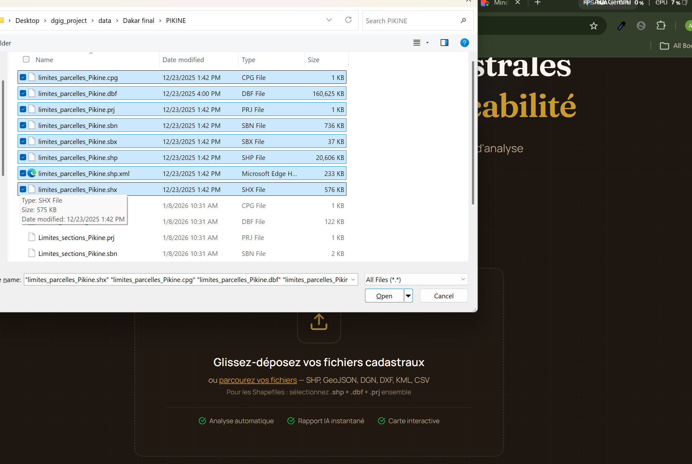
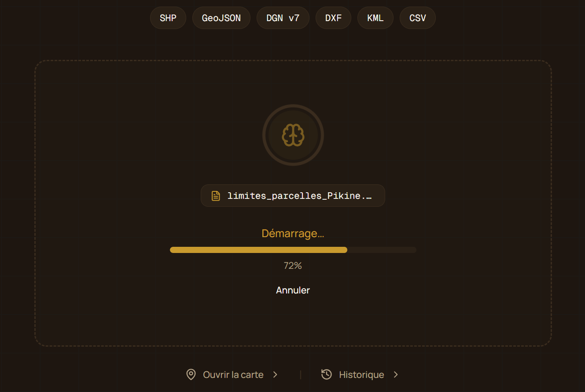
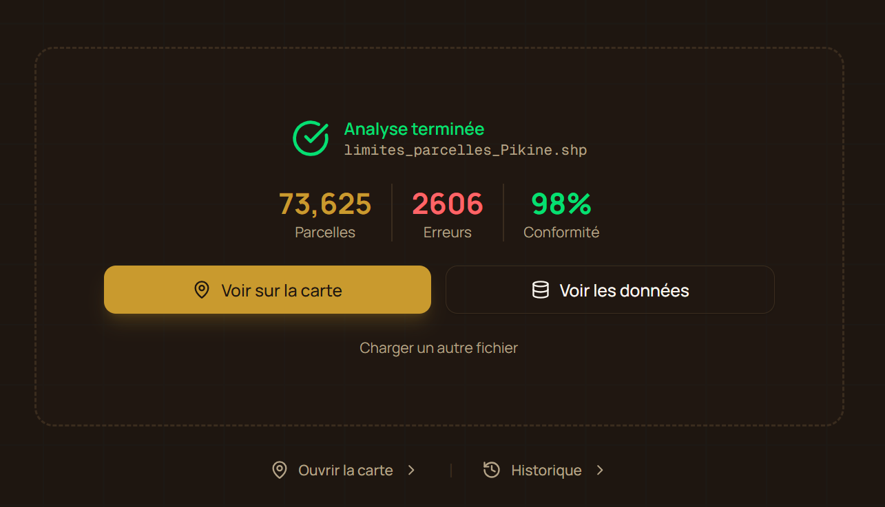
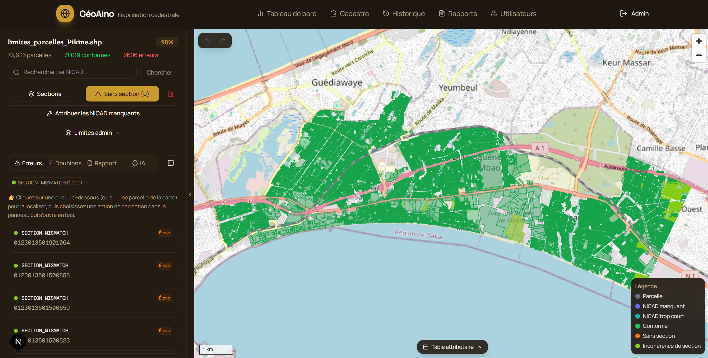
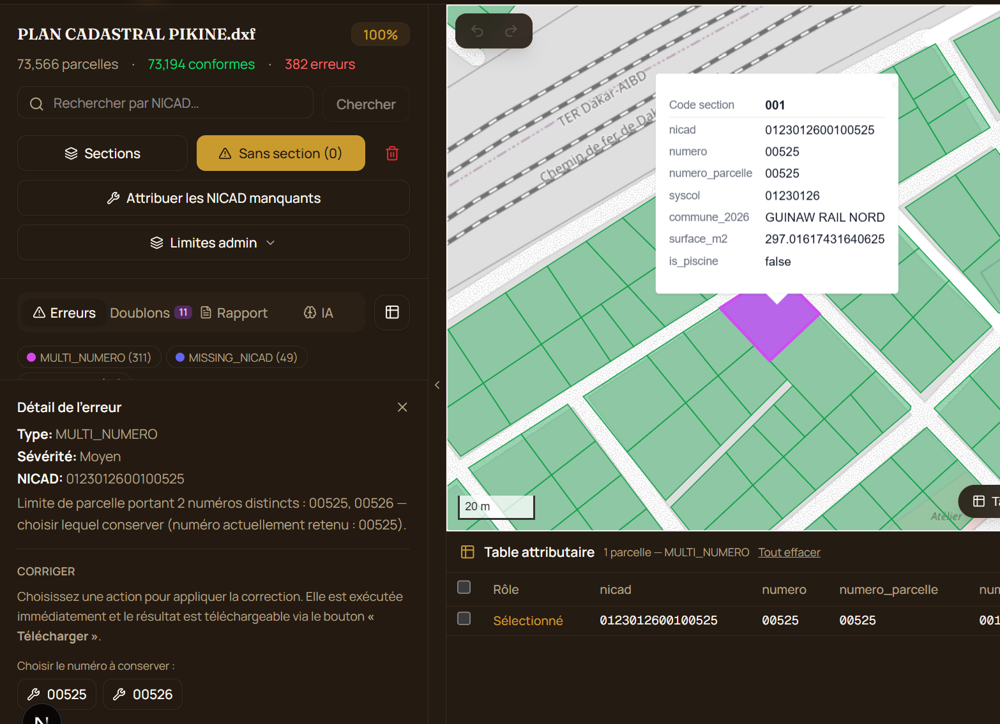
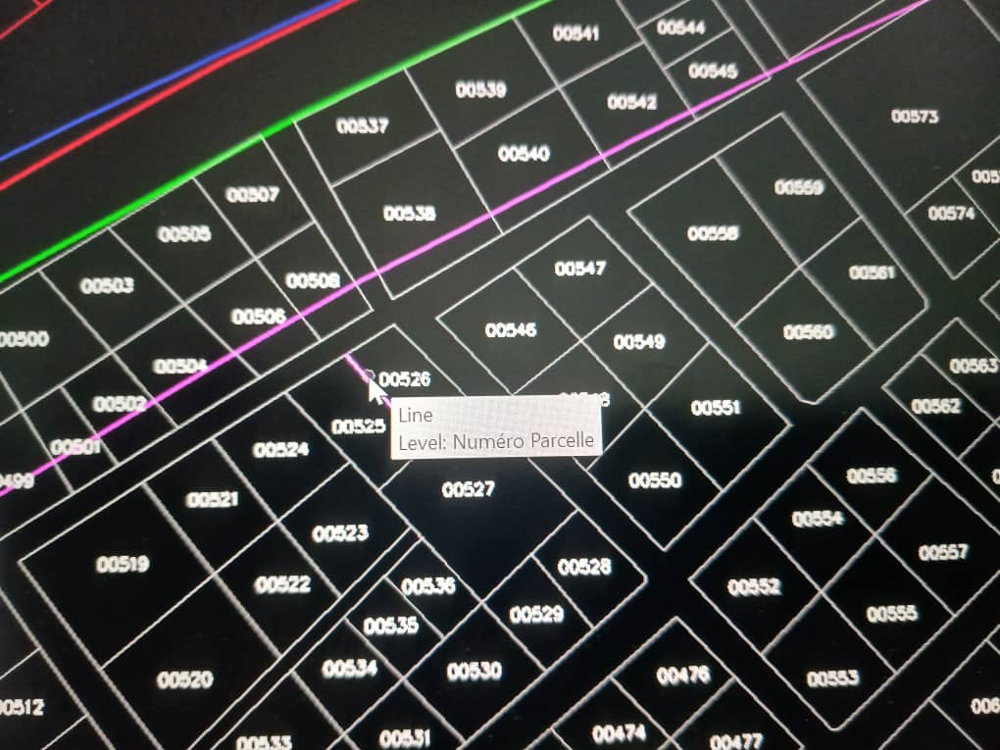
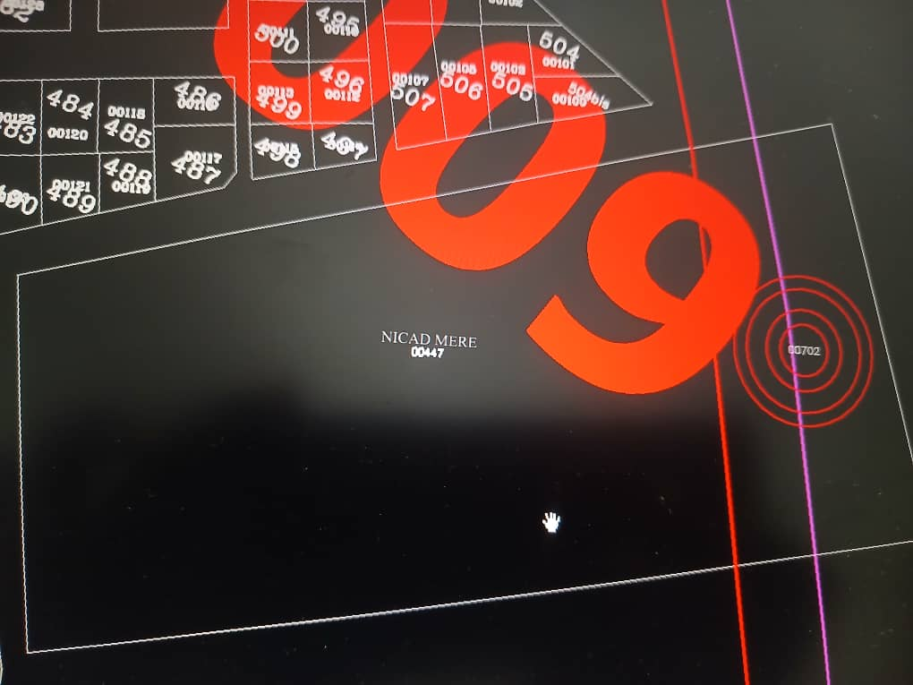

## Traitement des shapefiles

### 1. Selection des parcelles en shapefile

Après selection, le processus démarre automaitquement et la table attributaire se trouvant dans le fichier .dbf sera récupérer pour éffectuer le mappage.

### 2. Mappage des champs

Après mappage, vous pouvez lancer le traitement

### 3. Présentation des résultats

### 4. Afficher des parcelles dans le map

En nous avons les parcelles dont le numero_section ne corresponds pas au numero_section de la table section

## 5. Les types d'erreurs

### 5.1 - Parcelle avec plus d'un numéro

Sur l'image ci-après, la parcelle contient deux numeros parcelles (00525-00526).

Cette erreur est dû au fait que le calques "numéro parcelle" a été utilisé pour créer la délimitation des deux parcelles visibles sur l'images ci-dessous.

#### Vérifiction sur microstation nécessaire

Il est necessaire de fait une vérification depuis les plans de microstation pour appliquer des modifications.
Exemple: la parcelle ci après contient 2 numero (00447-00702) et on peut voir la mention "NICD MERE" sur l'une.

